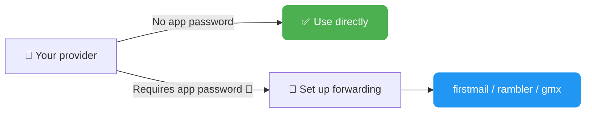
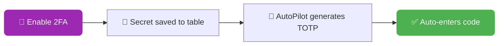
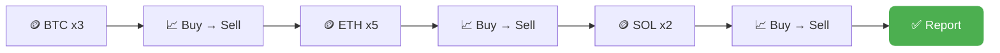
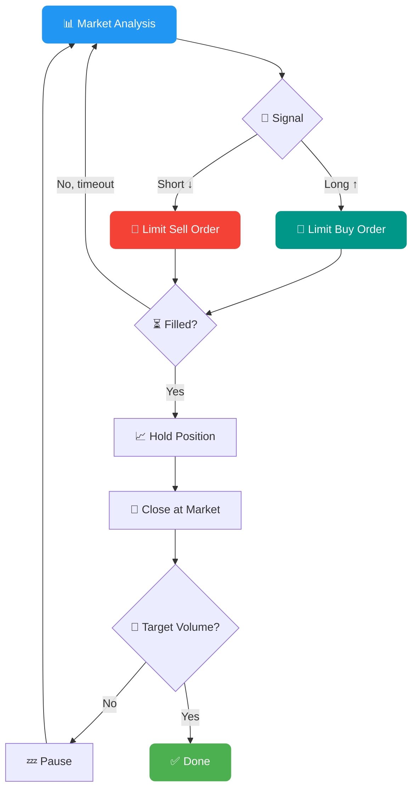
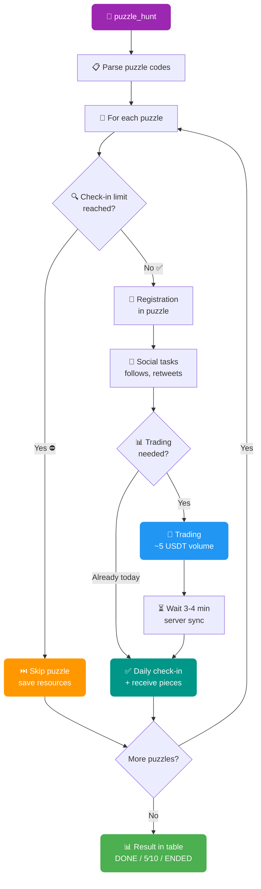
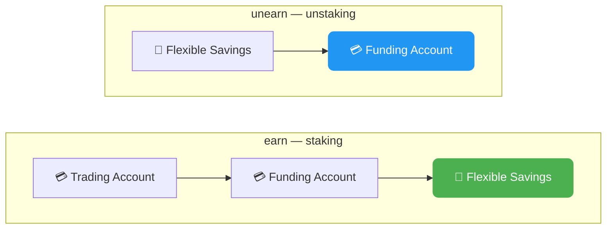
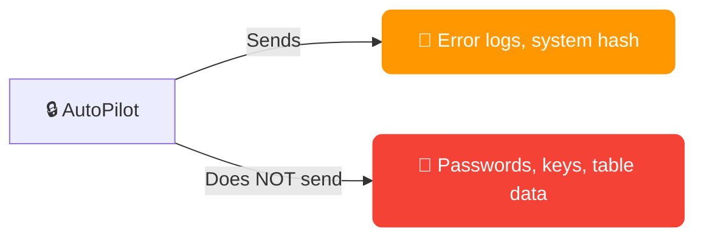

# 📋 FAQ — AutoPilot

**Contents:**

1. [📧 Mail Providers](#1--mail-providers)
2. [🔐 2FA: How It Works](#2--2fa-how-it-works)
3. [🏎️ Speed Modes (speed_mode)](#3-️-speed-modes-speed_mode)
4. [🧩 Proxy and Captcha](#4--proxy-and-captcha)
5. [📊 AutoPilot_table.xlsx](#5--autopilot_tablexlsx)
6. [📈 Trading: Details](#6--trading-details)
   - [6.1 🤖 Smart Futures Trading (futures_smart)](#61--smart-futures-trading-futures_smart)
   - [6.2 🧩 Puzzle Hunt (puzzle_hunt)](#62--puzzle-hunt-puzzle_hunt)
   - [6.3 💰 Bybit Earn — USDT Staking (earn / unearn)](#63--bybit-earn--usdt-staking-earn--unearn)
7. [💸 Withdrawal (withdraw)](#7--withdrawal-withdraw)
8. [🌐 AdsPower / Dolphin / Vision](#8--adspower--dolphin--vision)
9. [🖥️ Screen Size](#9-️-screen-size)
10. [⚙️ Configuration: Key Parameters](#10-️-configuration-key-parameters)
11. [🔒 Security and Privacy](#11--security-and-privacy)
12. [🔄 Updates](#12--updates)
13. [⏰ License Duration](#13--license-duration)
14. [🚨 Common Errors and Solutions](#14--common-errors-and-solutions)
15. [💬 Contact Developer](#15--contact-developer)

---

### 1. 📧 Mail Providers

**Available providers** (column `[EMAIL] mail_provider` / `[EMAIL] forwarding_mail_provider`):

| Provider | IMAP App Password | Notes |
|----------|:-:|-------|
| notletters | — | Recommended ✅ |
| firstmail | — | Recommended ✅ (also for forwarding) |
| rambler | — | Recommended ✅ (also for forwarding) |
| gazeta | — | |
| onet | — | |
| gmx.com / gmx.net | — | |
| nic.ru | — | |
| yahoo | Required 🔑 | App Password in security settings |
| gmail | Required 🔑 | App Password (requires 2FA on Google account) |
| outlook | Required 🔑 | App Password in Microsoft settings |
| mailru | Required 🔑 | App password in security settings |
| yandex | Required 🔑 | App password in settings |
| icloud | Required 🔑 | App-Specific Password at appleid.apple.com |
| inbox.eu | Required 🔑 | |
| proton | Required 🔑 | Proton Mail Bridge (paid subscription) |



**🔀 Forwarding** — if your provider requires an app password, set up email forwarding to firstmail/rambler/gmx and fill in the columns:
- `[EMAIL] mail_forwarding_provider` — forwarding provider
- `[EMAIL] forwarding_mail` — forwarding email address
- `[EMAIL] forwarding_mail_password` — forwarding email password

> ⚠️ **Important:** after setting up forwarding, send a test email to make sure messages arrive. Some providers activate forwarding with a delay of up to 24 hours.

> 🛡️ **Antivirus:** if you have issues connecting to mail — check if your antivirus is blocking IMAP ports (993, 143).

> 💬 **Your provider not listed?** Contact the developer — it will be added.

---

### 2. 🔐 2FA: How It Works



- When enabling 2FA, the software saves the secret key to the `[2FA] totp_secret_code` column
- This key can be imported into any authenticator app: Google Authenticator, Authy, 1Password, etc.
- AutoPilot automatically generates and enters TOTP codes when needed
- To manually generate a code from the secret key: [totp.danhersam.com](https://totp.danhersam.com/)

> 💾 **Backup:** `totp_secret_code` is additionally saved to profile logs (`/logs` folder) — even if you accidentally clear the table, the secret key can always be found in the logs.

> ⚡ **Auto-setup:** actions `whitelist` and `withdraw` will automatically enable 2FA if it's not set up yet. No need to run `2fa` separately.

---

### 3. 🏎️ Speed Modes (speed_mode)

| Mode | Cursor | Text Input | When to Use |
|------|--------|------------|-------------|
| **⚡ FAST** | Instant movement | Fast input without errors | Bulk operations where speed matters |
| **🚗 MEDIUM** | Smooth movements, medium speed | Human-like input with minimal errors | Balance between speed and naturalness |
| **🐢 SLOW** | Slow movements with random trajectory | Input with typos and corrections | Maximum human imitation |

**🖱️ Smart Cursor** (MEDIUM/SLOW): simulates human mouse movements with random trajectory, accelerations and decelerations.

**⌨️ Human Typing** (MEDIUM/SLOW): random delays between characters, random typos with auto-correction — like a real person.

> 💡 **Recommendation:** FAST is sufficient for registration and login. For trading and actions on pages with anti-bot protection — use MEDIUM.

---

### 4. 🧩 Proxy and Captcha

**Column `[PROXY] proxy`** — profile proxy in format `ip:port:user:password`

Purpose: the captcha solving service (CapGuru/CapSolver) uses the proxy to solve the captcha from the profile's IP. The exchange sees the captcha was solved from the profile's IP.

> ⚠️ **If not filled:** the captcha will be solved from the solver's proxy pool IP — this may raise suspicion on some exchanges.

> 💰 **Captcha balance:** top up your CapGuru/CapSolver balance before running. Cost is ~$1 per 1000 solves. Check balance on the service's website.

> 🔧 **Captcha errors:** if captcha keeps failing — verify the `captcha_key` in config and the solver account balance.

---

### 5. 📊 AutoPilot_table.xlsx


**Basic rules:**
- 🚫 Do not rename column headers from the template
- ↔️ Column order can be changed
- ➕ You can add your own columns (AutoPilot ignores them)
- ⏳ Do not delete rows while the software is running — wait for completion

**🚀 Minimum set to start (registration):**
1. `[PROFILE] profile_id` — Profile ID from AdsPower/Dolphin
2. `[EMAIL] mail_provider` — mail service
3. `[PROFILE] mail` — email address
4. `[EMAIL] mail_password` — email password

> 💡 **Tip:** only fill the `ACTION` column for profiles you want to automate. Empty ACTION = profile will be skipped.

> 🔑 **Passwords:** if `password` is not filled — AutoPilot will generate a strong password automatically (8-30 chars, uppercase + lowercase + digits + special characters) and write it to the table.

> 📁 **Excel closed?** The table must be closed while AutoPilot is running. If the table is open — the software will warn and wait for it to close.

---

### 6. 📈 Trading: Details



**🪙 Multi-coin:** specify coins, amounts and cycles separated by commas:
- `[TRADING] trading_coin` = `BTC,ETH,SOL`
- `[TRADING] trading_amount` = `10,20,5`
- `[TRADING] trading_cycles` = `3,5,2`
- Result: 3 cycles of BTC at $10, then 5 cycles of ETH at $20, then 2 cycles of SOL at $5

**🧮 Volume formula:** `cycles x amount x 2` (buy + sell)

**📐 Dynamic order size:** if balance is less than `trading_amount` — the software automatically reduces order size to available balance.

**⏱️ Delay between cycles:** configured in settings `market_trading_delay=5,15` (random delay from 5 to 15 seconds).

> 💵 **Minimum order:** make sure there's enough USDT for the minimum order on the exchange (usually ~5 USDT).

---

### 6.1 🤖 Smart Futures Trading (futures_smart)

ACTION: `futures_smart` — automated futures trading with market analysis, post-only limit orders and position management.



**💰 Fees:** post-only limit orders = 0.02% (maker), market close = 0.055% (taker). Total ~0.075% per cycle — **32% cheaper** than market orders (0.11%).

**📊 Table columns:**

| Column | Description | Example |
|--------|-------------|---------|
| `[TRADING] trading_coin` | Futures coin | `BTC` |
| `[TRADING] trading_amount` | Position size per iteration (with leverage) in USDT | `1000` |
| `[TRADING] trading_cycles` | Number of trading cycles | `15` |

> 🔑 **Important:** `trading_amount` is the position size **including leverage**, not the actual balance used. Real balance per trade = `trading_amount / leverage`.

**📐 Formula:**
- **Real balance per trade** = `trading_amount ÷ leverage`
- **Volume per cycle** = `trading_amount × 2` (open + close)
- **Target volume** = `trading_amount × cycles × 2`

**Example:** `trading_amount=1000`, `leverage=10`, `cycles=15`
- Real balance per trade: 1000 ÷ 10 = **100 USDT**
- Volume per cycle: 1000 × 2 = **2,000 USDT**
- Target volume: 1000 × 15 × 2 = **30,000 USDT**

**⚙️ Config parameters:**

| Parameter | Description | Default |
|-----------|-------------|:-------:|
| `leverage` | 📊 Leverage | `10` |
| `limit_futures_position_hold_interval` | ⏳ Position hold time, sec (min,max) | `50,240` |
| `limit_futures_iteration_wait_interval` | 💤 Pause between cycles, sec (min,max) | `60,180` |
| `limit_futures_order_timeout` | ⏱️ Max wait for limit order fill, sec | `30` |
| `limit_futures_order_check_interval` | 🔍 Order execution check interval, sec | `5` |
| `limit_futures_price_offset_ticks` | 📐 Offset in ticks from best bid/ask | `2` |
| `limit_futures_direction_algorithm` | 🧠 Direction detection algorithm | `inverse_simple` |
| `limit_futures_order_deviation` | 🎲 Random position size deviation, % (0 = off) | `0` |

**🧠 Direction algorithms:**
- `simple` — follows the trend: analysis of last 5 candles + price vs MA5 (rising → Long, falling → Short)
- `inverse_simple` — counter-trend: inverts the simple signal (rising → Short, falling → Long)
- `advanced` — complex analysis: EMA 8/21 crossover + RSI 14 + Volume Spike (1.7x above average) + Funding Rate

> ⚠️ **Risks:** leveraged futures trading carries liquidation risk. Use moderate leverage and small amounts for volume generation.

> 💡 **Tip:** if an order isn't filled within `limit_futures_order_timeout` — the signal is recalculated. Increase `limit_futures_price_offset_ticks` for faster fills (but at a less favorable price).

---

### 6.2 🧩 Puzzle Hunt (puzzle_hunt)

ACTION: `puzzle_hunt` — automatic registration, task completion and management of Bybit puzzles.



**✨ Features:**
- 📱 Automatic puzzle registration and management
- 📱 Instant execution and claiming of social tasks via direct requests
- 📱 Automatic daily trading tasks and check-ins
- 📱 Specify multiple puzzles at once — the system handles everything
- 📱 Won't waste trading attempts if daily check-in is already closed
- 📱 Tracks key data: days completed / total, plus puzzle completion status

**📊 Table column:**

| Column | Description | Example |
|--------|-------------|---------|
| `[PUZZLE] event_code` | Puzzle code (or multiple, comma-separated) | `0768558741987` |

> 📌 **Column type:** make the `[PUZZLE] event_code` column **text** (not numeric), otherwise Excel may truncate long codes.

**🔗 Where to get the puzzle code:**

The code is in the puzzle link — the `activityCode` parameter:
```
https://www.bybit.com/en/trade/spot/puzzle-hunt/detail?activityCode=0768558741987
                                                                      ^^^^^^^^^^^^^ — this is the code
```

**📋 Managing multiple puzzles:**

To complete multiple puzzles at once — enter codes separated by commas:
```
8675373977840,0768558741987,1234567890123
```
The system processes each puzzle sequentially: social tasks → trading (batched) → check-ins.

**⚙️ How it works internally:**

1. **Limit check** — before any work, checks if the daily check-in is available. If limit is reached — the entire puzzle is skipped (trading isn't wasted)
2. **Registration** — automatic participant registration in the puzzle
3. **Social tasks** — completes all social tasks (follows, retweets) via direct API requests + claims rewards (puzzle pieces)
4. **Trading** — if not traded today: buy + sell a coin from the puzzle list (~5 USDT volume). If already traded — skips
5. **Wait** — 3-4 minute pause for Bybit's server to register the trading volume
6. **Check-in** — daily mark + receive puzzle pieces

**📈 Table statuses:**

| Status | Meaning |
|--------|---------|
| `DONE` | ✅ Puzzle fully completed (all days passed) |
| `5/10` | 🔄 Progress: 5 of 10 days completed |
| `ENDED` | ⏰ Puzzle expired (activity ended on Bybit) |
| `FAIL` | ❌ Error (details in logs) |

With multiple puzzles, status is combined: `[CODE1] DONE, [CODE2] 3/10`

> 💡 **Tip:** run `puzzle_hunt` daily — the software will determine what's already done and only perform the missing steps.

> ⚡ **puzzle_social:** to only complete social tasks without trading — use ACTION `puzzle_social`.

---

### 6.3 💰 Bybit Earn — USDT Staking (earn / unearn)

ACTION: `earn` — send USDT to the Flexible Savings pool (automatic staking).
ACTION: `unearn` (or `unstake`) — withdraw USDT from the pool back to Funding account.



**⚙️ How it works:**

**`earn` (staking):**
1. KYC verification and Bybit authorization
2. Transfer all USDT from Trading to Funding account (`transferAllToFunding`)
3. Get available USDT balance on Funding account
4. Send to Flexible Savings pool: preview → pay-order → confirm-order
5. Table status: `[STAKE] SUCCESS - stake 150.25`

**`unearn` (unstaking):**
1. KYC verification and Bybit authorization
2. Get current Flexible Savings balance
3. Withdraw from pool to Funding account: preview → pay-order → confirm-order
4. Table status: `[STAKE] SUCCESS - unstake 150.25`

**📊 Table columns:**

| Column | Description | Example |
|--------|-------------|---------|
| `[WITHDRAW] withdraw_amount` | Fixed USDT amount (optional) | `100` |

> 💡 **Default:** if `withdraw_amount` is not filled — `earn` will send **all** available USDT to the pool, and `unearn` will withdraw **everything** from the pool.

> 📌 **Fixed amount:** enter a number in `withdraw_amount` to stake/withdraw a specific amount. If the requested amount exceeds available balance — the entire available balance will be used.

> 🏦 **Flexible Savings:** this is flexible staking — funds can be withdrawn at any time, interest accrues daily. Withdrawal is instant.

> ⚡ **Auto-transfer:** with `earn`, funds are automatically transferred from Trading to Funding before staking — no manual action needed.

---

### 7. 💸 Withdrawal (withdraw)


**Full withdrawal** (`full_withdraw=YES` in config):
- 🔄 Sell all assets for USDT at market
- 🧹 Convert dust and small leftovers
- 💳 Withdraw entire balance

**Partial withdrawal:** specify % in `withdraw_amount` column (100 = all, 50 = half)

**🌐 Network name:** enter exactly as shown on the exchange. Examples:
- Bybit: `APTOS`, `Arbitrum One`, `BSC (BEP20)`
- MEXC: `ERC20`, `TRC20`, `Aptos`
- Bitget: `BSC`, `Arbitrum One`

> ✅ **Whitelist + Withdraw:** if the withdrawal address matches the whitelisted address — code verification won't be required (fast withdrawal).

> 🏷️ **Memo/Tag:** if the network requires a memo (e.g., TON, ATOM) — fill in the `withdraw_memo` column. If not required — leave empty.

---

### 8. 🌐 AdsPower / Dolphin / Vision

**AdsPower:**
- 📥 Install the latest SunBrowser: Settings → Local Settings
- 💳 Requires a **paid subscription** (minimum Base)
- 📤 Export profiles: Select → Export → Number, ID, Name
- 🔌 Default API port: `50325` (configurable in settings `adspower_port`)

**Dolphin:**
- Enable Profile ID: Gear icon → Customize columns → Profile ID

**Vision:**
- In config: `vision_config=folder_name,API_key`

**🚨 Common errors:**

| Error | Solution |
|-------|----------|
| AdsPower connection error | Restart AdsPower, check port |
| Proxy is bad | Replace proxy in profile |
| Cache problems | Clear profile cache in AdsPower |
| Browser not opening | Check paid AdsPower subscription |
| Timeout loading page | Check proxy, change fingerprint |

> 🚀 **Optimization:** install Ublock/AdBlock in profiles to block ads — pages will load faster.

---

### 9. 🖥️ Screen Size

The software automatically sets the resolution to **1920x1080** on the page, even if the browser window is smaller (`window_size` setting in config).

This ensures all UI elements display correctly and the software doesn't miss buttons.

> 📐 The `window_size=1200,1000` parameter in config sets the browser window size, but the internal page resolution is always 1920x1080.

---

### 10. ⚙️ Configuration: Key Parameters

| Parameter | Description | Default |
|-----------|-------------|:-------:|
| `activation_key` | 🔑 Activation key | — |
| `captcha_key` | 🧩 CapGuru/CapSolver key | — |
| `speed_mode` | 🏎️ Operation speed | `FAST` |
| `parallel_limit` | 🔢 Parallel accounts limit | `NO` |
| `sleep_between_accounts` | 💤 Pause between accounts | `NO` |
| `delay_between_accounts` | ⏱️ Delay in seconds (min,max) | `60,120` |
| `shuffle_order` | 🔀 Random order | `YES` |
| `close_after` | 🚪 Close browser after | `NO` |
| `close_tabs` | 🗂️ Close all tabs | `YES` |
| `check_mail` | 📧 Check emails before start | `YES` |
| `full_withdraw` | 💸 Full withdrawal of all assets | `YES` |
| `email_delay_check` | ⏳ Email check interval | `30,300` |
| `market_trading_delay` | 📈 Delay between trading cycles | `5,15` |
| `disable_kyc_protection` | 🛡️ Allow 2FA without KYC | `NO` |
| `color_logs` | 🎨 Colored logs in console | `YES` |

> 🕵️ **Anti-detect:** enable `shuffle_order=YES` and `sleep_between_accounts=YES` with `parallel_limit=3-5` for natural behavior.

---

### 11. 🔒 Security and Privacy



**What the software sends:**
- 📝 Error logs (only error descriptions, no personal data) — when error threshold is exceeded, for debugging
- 🔗 System hash during key verification — to track abusers

**What the software does NOT send:**
- 🚫 Passwords, email addresses, 2FA secret keys
- 🚫 Data from AutoPilot_table.xlsx
- 🚫 Email content and verification codes
- 🚫 Proxy data and cookies

**🤝 Guarantees:** 2+ years market reputation, deposits at Taverna OTC and Crypton OTC, 120+ partners.

---

### 12. 🔄 Updates

AutoPilot checks for updates on every launch. If a new version is available:
1. Wait for the message: `"AutoPilot new version downloaded successfully!"`
2. Close the software
3. Extract the `AutoPilot.zip` archive to the current folder with replacement
4. Launch the updated version

> ♾️ **Lifetime:** all updates are free forever.

> ⛔ **Don't interrupt the download:** if you close the software during download — the archive may be corrupted. Wait for completion.

---

### 13. ⏰ License Duration

The countdown starts **from the first launch** of AutoPilot with that key. The expiration date is displayed in the console on every launch.

---

### 14. 🚨 Common Errors and Solutions

| Problem | Cause | Solution |
|---------|-------|----------|
| 📧 Code not arriving by email | IMAP blocked / app password | Check mail_password, set up forwarding |
| 🧩 Captcha not solving | No balance / wrong key | Top up CapGuru balance, check captcha_key |
| 🌐 Profile not opening | AdsPower not running / free plan | Launch AdsPower, check subscription |
| 📊 Table not readable | Excel is open | Close Excel before launching |
| 🔐 2FA code not working | Time desync | Sync your computer time (Settings → Time) |
| ⏱️ Timeout on page | Slow proxy | Replace proxy or increase timeout |
| ⏳ Registration hanging | Different captcha type | Update software — support for new captcha types |

---

### 15. 💬 Contact Developer

**Before contacting:**
1. ✅ Make sure all table fields are filled correctly
2. 🔍 Check the chat — someone may have already solved this problem
3. 📖 Read the logs carefully — they contain the main error information

**When contacting, attach:**
- 📄 Profile log file from the `/logs` folder
- 📸 Screenshot or video of the issue (if possible)
