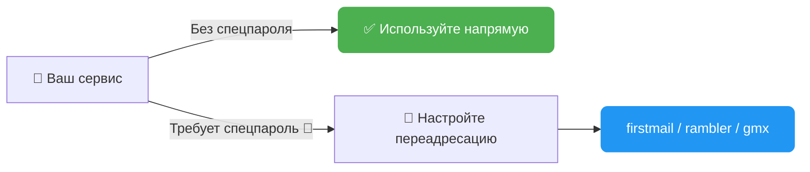
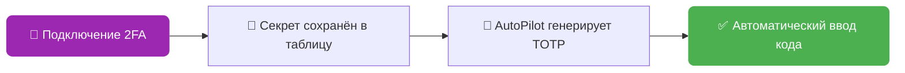
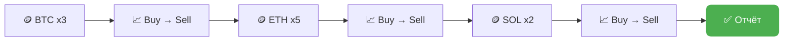
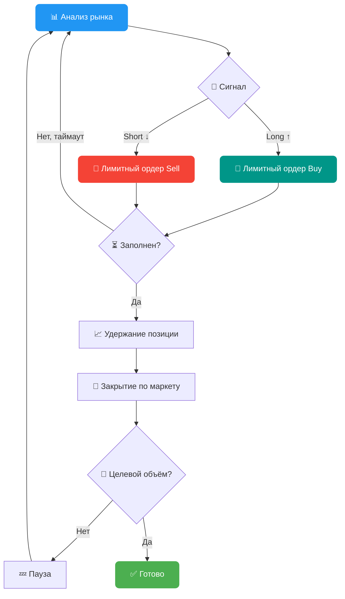
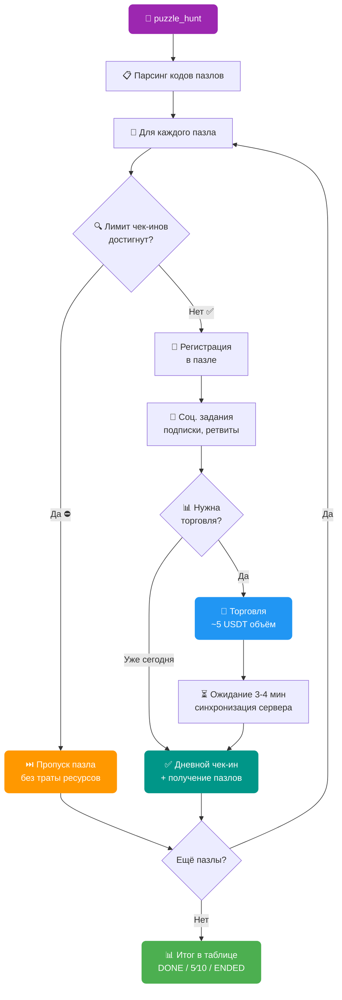
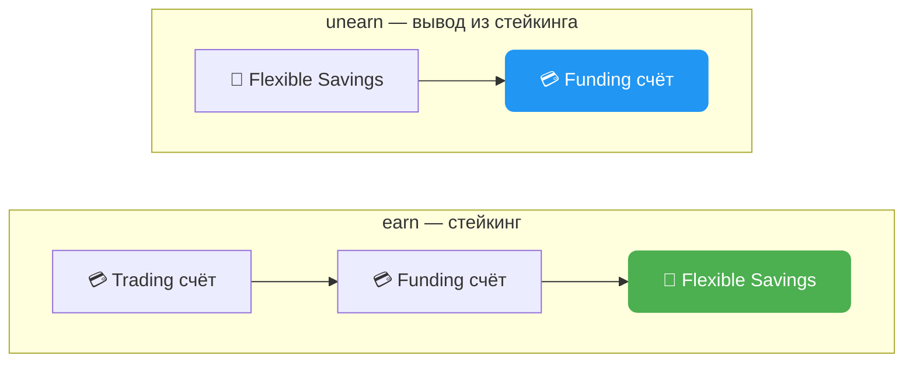
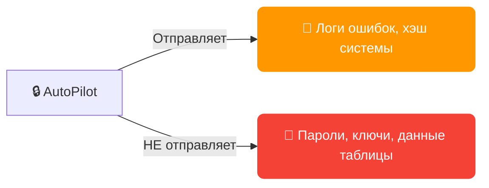

# 📋 FAQ — AutoPilot

---

### 1. 📧 Почтовые сервисы

**Доступные провайдеры** (столбец `[EMAIL] mail_provider` / `[EMAIL] forwarding_mail_provider`):

| Провайдер | Спецпароль IMAP | Примечание |
|-----------|:-:|------------|
| notletters | — | Рекомендуется ✅ |
| firstmail | — | Рекомендуется ✅ (также для переадресации) |
| rambler | — | Рекомендуется ✅ (также для переадресации) |
| gazeta | — | |
| onet | — | |
| gmx.com / gmx.net | — | |
| nic.ru | — | |
| yahoo | Требуется 🔑 | App Password в настройках безопасности |
| gmail | Требуется 🔑 | App Password (нужна 2FA на Google аккаунте) |
| outlook | Требуется 🔑 | App Password в настройках Microsoft |
| mailru | Требуется 🔑 | Пароль приложения в настройках безопасности |
| yandex | Требуется 🔑 | Пароль приложения в настройках |
| icloud | Требуется 🔑 | App-Specific Password на appleid.apple.com |
| inbox.eu | Требуется 🔑 | |
| proton | Требуется 🔑 | Proton Mail Bridge (платная подписка) |



**🔀 Переадресация (forwarding)** — если ваш сервис требует спецпароль, настройте пересылку писем на firstmail/rambler/gmx и заполните столбцы:
- `[EMAIL] mail_forwarding_provider` — провайдер переадресации
- `[EMAIL] forwarding_mail` — адрес почты переадресации
- `[EMAIL] forwarding_mail_password` — пароль от почты переадресации

> ⚠️ **Важно:** после настройки переадресации отправьте тестовое письмо, чтобы убедиться, что письма доходят. Некоторые сервисы активируют переадресацию с задержкой до 24 часов.

> 🛡️ **Антивирус:** если возникают проблемы с подключением к почте — проверьте, не блокирует ли антивирус IMAP-порты (993, 143).

> 💬 **Нет вашего сервиса?** Напишите разработчику — он будет добавлен.

---

### 2. 🔐 2FA: как это устроено



- При подключении 2FA софт сохраняет секретный ключ в столбец `[2FA] totp_secret_code`
- Этот ключ можно импортировать в любое приложение: Google Authenticator, Authy, 1Password и др.
- AutoPilot автоматически генерирует и вводит TOTP-коды при необходимости
- Для ручной генерации кода из секретного ключа: [totp.danhersam.com](https://totp.danhersam.com/)

> 💾 **Бэкап:** `totp_secret_code` дополнительно сохраняется в логи профиля (папка `/logs`) — даже если случайно очистите таблицу, секретный ключ всегда можно найти в логах.

> ⚡ **Автоподключение:** действия `whitelist` и `withdraw` автоматически подключат 2FA, если он ещё не установлен. Отдельно запускать `2fa` не нужно.

---

### 3. 🏎️ Режимы скорости (speed_mode)

| Режим | Курсор | Ввод текста | Когда использовать |
|-------|--------|-------------|-------------------|
| **⚡ FAST** | Мгновенные перемещения | Быстрый ввод без ошибок | Массовые операции, когда скорость важнее |
| **🚗 MEDIUM** | Плавные движения, средняя скорость | Человеческий ввод с минимальными ошибками | Баланс между скоростью и естественностью |
| **🐢 SLOW** | Медленные движения с рандомной траекторией | Ввод с ошибками и исправлениями | Максимальная имитация человека |

**🖱️ Smart Cursor** (MEDIUM/SLOW): имитирует человеческие движения мыши с рандомной траекторией, ускорениями и замедлениями.

**⌨️ Human Typing** (MEDIUM/SLOW): случайные задержки между символами, случайные опечатки с автоисправлением — как настоящий человек.

> 💡 **Рекомендация:** для регистрации и логина достаточно FAST. Для трейдинга и действий на страницах с антибот-защитой — MEDIUM.

---

### 4. 🧩 Прокси и капча

**Столбец `[PROXY] proxy`** — прокси профиля в формате `ip:port:user:password`

Зачем: сервис решения капчи (CapGuru/CapSolver) использует прокси для решения капчи с IP профиля. Биржа видит, что капча решена именно с IP профиля.

> ⚠️ **Если не заполнить:** капча будет решена с IP из пула прокси решателя — это может вызвать подозрения на некоторых биржах.

> 💰 **Баланс капчи:** пополните баланс CapGuru/CapSolver перед запуском. Стоимость ~1$ за 1000 решений. Проверить баланс можно на сайте сервиса.

> 🔧 **Ошибки капчи:** если капча постоянно не решается — проверьте валидность ключа `captcha_key` в конфиге и баланс аккаунта решателя.

---

### 5. 📊 Таблица AutoPilot_table.xlsx


**Основные правила:**
- 🚫 Не переименовывайте заголовки столбцов из шаблона
- ↔️ Порядок столбцов можно менять
- ➕ Можно добавлять свои столбцы (AutoPilot их игнорирует)
- ⏳ Не удаляйте строки во время работы софта — дождитесь завершения

**🚀 Минимальный набор для старта (регистрация):**
1. `[PROFILE] profile_id` — ID профиля из AdsPower/Dolphin
2. `[EMAIL] mail_provider` — почтовый сервис
3. `[PROFILE] mail` — адрес почты
4. `[EMAIL] mail_password` — пароль почты

> 💡 **Совет:** столбец `ACTION` заполняйте только для тех профилей, которые хотите автоматизировать. Пустой ACTION = профиль будет пропущен.

> 🔑 **Пароли:** если `password` не заполнен — AutoPilot сгенерирует надёжный пароль автоматически (8-30 символов, заглавные + строчные + цифры + спецсимволы) и запишет в таблицу.

> 📁 **Excel закрыт?** Таблица должна быть закрыта во время работы AutoPilot. Если таблица открыта — софт предупредит и подождёт закрытия.

---

### 6. 📈 Трейдинг: тонкости



**🪙 Мульти-монеты:** укажите монеты, суммы и циклы через запятую:
- `[TRADING] trading_coin` = `BTC,ETH,SOL`
- `[TRADING] trading_amount` = `10,20,5`
- `[TRADING] trading_cycles` = `3,5,2`
- Результат: 3 цикла BTC по 10$, затем 5 циклов ETH по 20$, затем 2 цикла SOL по 5$

**🧮 Формула объёма:** `циклы x сумма x 2` (покупка + продажа)

**📐 Динамический размер ордера:** если баланс меньше `trading_amount` — софт автоматически уменьшит размер ордера до доступного баланса.

**⏱️ Задержка между циклами:** настраивается в конфиге `market_trading_delay=5,15` (случайная задержка от 5 до 15 секунд).

> 💵 **Минимальный ордер:** убедитесь, что на балансе достаточно USDT для минимального ордера на бирже (обычно ~5 USDT).

---

### 6.1 🤖 Умная фьючерсная торговля (futures_smart)

ACTION: `futures_smart` — автоматическая торговля фьючерсами с анализом рынка, лимитными post-only ордерами и управлением позициями.



**💰 Комиссии:** post-only лимитные ордера = 0.02% (maker), закрытие по маркету = 0.055% (taker). Итого ~0.075% за цикл — **на 32% дешевле** чем маркет ордера (0.11%).

**📊 Столбцы таблицы:**

| Столбец | Описание | Пример |
|---------|----------|--------|
| `[TRADING] trading_coin` | Монета для фьючерсов | `BTC` |
| `[TRADING] trading_amount` | Размер позиции за одну итерацию (с учётом плеча) в USDT | `1000` |
| `[TRADING] trading_cycles` | Количество торговых циклов | `15` |

> 🔑 **Важно:** `trading_amount` — это размер позиции **с учётом плеча**, а не сумма реально используемого баланса. Реальный баланс на одну сделку = `trading_amount / leverage`.

**📐 Формула:**
- **Реальный баланс за сделку** = `trading_amount ÷ плечо`
- **Объём за цикл** = `trading_amount × 2` (открытие + закрытие)
- **Целевой объём** = `trading_amount × cycles × 2`

**Пример:** `trading_amount=1000`, `leverage=10`, `cycles=15`
- Реальный баланс за сделку: 1000 ÷ 10 = **100 USDT**
- Объём за один цикл: 1000 × 2 = **2000 USDT**
- Целевой объём: 1000 × 15 × 2 = **30 000 USDT**

**⚙️ Параметры конфига:**

| Параметр | Описание | По умолчанию |
|----------|----------|:------------:|
| `leverage` | 📊 Кредитное плечо | `10` |
| `limit_futures_position_hold_interval` | ⏳ Время удержания позиции, сек (мин,макс) | `50,240` |
| `limit_futures_iteration_wait_interval` | 💤 Пауза между циклами, сек (мин,макс) | `60,180` |
| `limit_futures_order_timeout` | ⏱️ Макс. ожидание заполнения лимитного ордера, сек | `30` |
| `limit_futures_order_check_interval` | 🔍 Интервал проверки исполнения ордера, сек | `5` |
| `limit_futures_price_offset_ticks` | 📐 Отступ в тиках от лучшей bid/ask цены | `2` |
| `limit_futures_direction_algorithm` | 🧠 Алгоритм определения направления | `inverse_simple` |
| `limit_futures_order_deviation` | 🎲 Случайное отклонение размера позиции, % (0 = выкл) | `0` |

**🧠 Алгоритмы определения направления:**
- `simple` — следует за трендом: анализ последних 5 свечей + цена vs MA5 (рост → Long, падение → Short)
- `inverse_simple` — контр-тренд: инвертирует сигнал simple (рост → Short, падение → Long)
- `advanced` — комплексный анализ: EMA 8/21 кроссовер + RSI 14 + Volume Spike (1.7x от среднего) + Funding Rate

> ⚠️ **Риски:** фьючерсная торговля с плечом сопряжена с риском ликвидации. Используйте умеренное плечо и небольшие суммы для набива объёма.

> 💡 **Совет:** если ордер не заполняется в течение `limit_futures_order_timeout` — сигнал пересчитывается заново. Увеличьте `limit_futures_price_offset_ticks` для более быстрого заполнения (но с менее выгодной ценой).

---

### 6.2 🧩 Пазл-хант (puzzle_hunt)

ACTION: `puzzle_hunt` — автоматическая регистрация, выполнение всех задач и менеджмент пазлов Bybit.



**✨ Возможности:**
- 📱 Автоматическая регистрация в пазле и его менеджмент
- 📱 Мгновенное выполнение и клейм соцзаданий напрямую через запросы
- 📱 Автоматический прогон ежедневных трейдинг-задач и чек-инов
- 📱 Можно указать несколько пазлов сразу — система сама всё сделает
- 📱 Не будет тратить попытки на торговлю, если дневной чек-ин уже закрыт
- 📱 Ведётся таблица с ключевыми данными: сколько дней завершено / всего, плюс отметка об успешном прохождении пазла целиком

**📊 Столбец таблицы:**

| Столбец | Описание | Пример |
|---------|----------|--------|
| `[PUZZLE] event_code` | Код пазла (или несколько через запятую) | `0768558741987` |

> 📌 **Тип столбца:** сделайте столбец `[PUZZLE] event_code` **текстовым** (не числовым), иначе Excel может обрезать длинные коды.

**🔗 Где взять код пазла:**

Код находится в ссылке пазла — параметр `activityCode`:
```
https://www.bybit.com/en/trade/spot/puzzle-hunt/detail?activityCode=0768558741987
                                                                      ^^^^^^^^^^^^^ — это код
```

**📋 Менеджмент нескольких пазлов:**

Чтобы выполнить сразу несколько пазлов за раз — укажите коды через запятую:
```
8675373977840,0768558741987,1234567890123
```
Система обработает каждый пазл последовательно: соцзадания → торговля (батчом) → чек-ины.

**⚙️ Как работает внутри:**

1. **Проверка лимита** — перед любой работой проверяется, доступен ли дневной чек-ин. Если лимит исчерпан — пазл пропускается целиком (торговля не тратится впустую)
2. **Регистрация** — автоматическая регистрация участника в пазле
3. **Соцзадания** — выполнение всех социальных задач (подписки, ретвиты) через прямые API-запросы + клейм наград (фрагменты пазла)
4. **Торговля** — если сегодня ещё не торговали: покупка + продажа монеты из списка пазла (~5 USDT объём). Если уже торговали — пропускает
5. **Ожидание** — пауза 3-4 минуты, чтобы сервер Bybit зафиксировал объём торговли
6. **Чек-ин** — дневная отметка + получение фрагментов пазла

**📈 Статусы в таблице:**

| Статус | Значение |
|--------|----------|
| `DONE` | ✅ Пазл полностью завершён (все дни пройдены) |
| `5/10` | 🔄 Прогресс: 5 дней из 10 завершено |
| `ENDED` | ⏰ Пазл истёк (активность завершена на Bybit) |
| `FAIL` | ❌ Ошибка (подробности в логах) |

При нескольких пазлах статус комбинируется: `[CODE1] DONE, [CODE2] 3/10`

> 💡 **Совет:** запускайте `puzzle_hunt` ежедневно — софт сам определит, что уже сделано, и выполнит только недостающие шаги.

> ⚡ **puzzle_social:** если нужно выполнить только соцзадания без торговли — используйте ACTION `puzzle_social`.

---

### 6.3 💰 Bybit Earn — стейкинг USDT (earn / unearn)

ACTION: `earn` — отправить USDT в Flexible Savings пул (автоматический стейкинг).
ACTION: `unearn` (или `unstake`) — забрать USDT из пула обратно на Funding-счёт.



**⚙️ Как работает:**

**`earn` (стейкинг):**
1. Проверка KYC и авторизация на Bybit
2. Перевод всех USDT с Trading-счёта на Funding-счёт (`transferAllToFunding`)
3. Получение баланса доступных USDT на Funding-счёте
4. Отправка в пул Flexible Savings: preview → pay-order → confirm-order
5. Статус в таблице: `[STAKE] SUCCESS - stake 150.25`

**`unearn` (вывод из стейкинга):**
1. Проверка KYC и авторизация на Bybit
2. Получение текущего баланса в Flexible Savings
3. Вывод из пула на Funding-счёт: preview → pay-order → confirm-order
4. Статус в таблице: `[STAKE] SUCCESS - unstake 150.25`

**📊 Столбцы таблицы:**

| Столбец | Описание | Пример |
|---------|----------|--------|
| `[WITHDRAW] withdraw_amount` | Фиксированная сумма USDT (необязательно) | `100` |

> 💡 **По умолчанию:** если `withdraw_amount` не заполнен — `earn` отправит **весь** доступный баланс USDT в пул, а `unearn` заберёт **всё** из пула.

> 📌 **Фиксированная сумма:** укажите число в `withdraw_amount` для стейкинга/вывода конкретной суммы. Если запрошенная сумма превышает доступный баланс — будет использован весь доступный баланс.

> 🏦 **Flexible Savings:** это гибкий стейкинг — средства можно забрать в любой момент, проценты начисляются ежедневно. Вывод мгновенный.

> ⚡ **Автоматический трансфер:** при `earn` средства автоматически переводятся с Trading-счёта на Funding перед стейкингом — не нужно делать это вручную.

---

### 7. 💸 Вывод средств (withdraw)


**Полный вывод** (`full_withdraw=YES` в конфиге):
- 🔄 Продажа всех активов за USDT по маркету
- 🧹 Конвертация пыли и мелких остатков
- 💳 Вывод всего баланса

**Частичный вывод:** укажите % в столбце `withdraw_amount` (100 = всё, 50 = половина)

**🌐 Название сети:** вводите точно как на бирже. Примеры:
- Bybit: `APTOS`, `Arbitrum One`, `BSC (BEP20)`
- MEXC: `ERC20`, `TRC20`, `Aptos`
- Bitget: `BSC`, `Arbitrum One`

> ✅ **Whitelist + Withdraw:** если адрес вывода совпадает с адресом в whitelist — верификация кодами не потребуется (быстрый вывод).

> 🏷️ **Memo/Tag:** если сеть требует memo (например, TON, ATOM) — заполните столбец `withdraw_memo`. Если не требует — оставьте пустым.

---

### 8. 🌐 AdsPower / Dolphin / Vision

**AdsPower:**
- 📥 Установите свежую версию SunBrowser: Настройки → Локальные настройки
- 💳 Требуется **платная подписка** (минимум Base)
- 📤 Экспорт профилей: Выделите → Экспортировать → Номер, ID, Имя
- 🔌 Порт API по умолчанию: `50325` (настраивается в конфиге `adspower_port`)

**Dolphin:**
- Включите Profile ID: Шестерёнка → Customize columns → Profile ID

**Vision:**
- В конфиге: `vision_config=имя_папки,API_ключ`

**🚨 Частые ошибки:**

| Ошибка | Решение |
|--------|---------|
| AdsPower connection error | Перезапустите AdsPower, проверьте порт |
| Proxy is bad | Замените прокси в профиле |
| Cache problems | Почистите кеш профиля в AdsPower |
| Browser not opening | Проверьте платную подписку AdsPower |
| Timeout loading page | Проверьте прокси, смените отпечаток |

> 🚀 **Оптимизация:** установите Ublock/AdBlock в профили для блокировки рекламы — страницы будут грузиться быстрее.

---

### 9. 🖥️ Размер экрана

Софт автоматически фиксирует разрешение **1920x1080** на странице, даже если окно браузера меньше (настройка `window_size` в конфиге).

Это гарантирует, что все элементы интерфейса отображаются корректно и софт не промахивается мимо кнопок.

> 📐 Параметр `window_size=1200,1000` в конфиге задаёт размер окна браузера, но внутреннее разрешение страницы всегда 1920x1080.

---

### 10. ⚙️ Конфигурация: ключевые параметры

| Параметр | Описание | По умолчанию |
|----------|----------|:------------:|
| `activation_key` | 🔑 Ключ активации | — |
| `captcha_key` | 🧩 Ключ CapGuru/CapSolver | — |
| `speed_mode` | 🏎️ Скорость работы | `FAST` |
| `parallel_limit` | 🔢 Лимит параллельных аккаунтов | `NO` |
| `sleep_between_accounts` | 💤 Пауза между аккаунтами | `NO` |
| `delay_between_accounts` | ⏱️ Задержка в секундах (мин,макс) | `60,120` |
| `shuffle_order` | 🔀 Случайный порядок | `YES` |
| `close_after` | 🚪 Закрыть браузер после | `NO` |
| `close_tabs` | 🗂️ Закрыть все вкладки | `YES` |
| `check_mail` | 📧 Проверить почты перед стартом | `YES` |
| `full_withdraw` | 💸 Полный вывод всех активов | `YES` |
| `email_delay_check` | ⏳ Интервал проверки почты | `30,300` |
| `market_trading_delay` | 📈 Задержка между торговыми циклами | `5,15` |
| `disable_kyc_protection` | 🛡️ Разрешить 2FA без KYC | `NO` |
| `color_logs` | 🎨 Цветные логи в консоли | `YES` |

> 🕵️ **Антидетект:** включите `shuffle_order=YES` и `sleep_between_accounts=YES` с `parallel_limit=3-5` для естественного поведения.

---

### 11. 🔒 Безопасность и конфиденциальность



**Что софт отправляет:**
- 📝 Логи ошибок (только описание ошибок, без персональных данных) — при превышении количества неудачных попыток, в целях отладки
- 🔗 Хэш системы при проверке ключа — для отслеживания абузеров

**Что софт НЕ отправляет:**
- 🚫 Пароли, email-адреса, секретные ключи 2FA
- 🚫 Данные из таблицы AutoPilot_table.xlsx
- 🚫 Содержимое писем и коды верификации
- 🚫 Данные прокси и cookies

**🤝 Гарантии:** репутация на рынке 2+ года, депозиты в Taverna OTC и Crypton OTC, 120+ партнёров.

---

### 12. 🔄 Обновления

AutoPilot проверяет обновления при каждом запуске. Если доступна новая версия:
1. Дождитесь сообщения: `"AutoPilot new version downloaded successfully!"`
2. Закройте софт
3. Распакуйте архив `AutoPilot.zip` в текущую папку с заменой
4. Запустите обновлённую версию

> ♾️ **Лайфтайм:** все обновления бесплатны навсегда.

> ⛔ **Не прерывайте загрузку:** если закрыть софт во время скачивания — архив может быть повреждён. Дождитесь завершения.

---

### 13. ⏰ Время жизни ключа

Отсчёт начинается **с момента первого запуска** AutoPilot с этим ключом. Дата истечения отображается в консоли при каждом запуске.

---

### 14. 🚨 Частые ошибки и решения

| Проблема | Причина | Решение |
|----------|---------|---------|
| 📧 Код не приходит на почту | IMAP блокируется / спецпароль | Проверьте mail_password, настройте переадресацию |
| 🧩 Капча не решается | Нет баланса / неверный ключ | Пополните баланс CapGuru, проверьте captcha_key |
| 🌐 Профиль не открывается | AdsPower не запущен / бесплатный план | Запустите AdsPower, проверьте подписку |
| 📊 Таблица не читается | Excel открыт | Закройте Excel перед запуском |
| 🔐 2FA код не подходит | Рассинхронизация времени | Синхронизируйте время на компьютере (Settings → Time) |
| ⏱️ Timeout на странице | Медленный прокси | Замените прокси или увеличьте таймаут |
| ⏳ Регистрация зависает | Капча другого типа | Обновите софт — поддержка новых типов капч |

---

### 15. 💬 Связь с разработчиком

**Перед обращением:**
1. ✅ Убедитесь, что все поля таблицы заполнены корректно
2. 🔍 Проверьте чат — возможно, кто-то уже решил эту проблему
3. 📖 Внимательно прочитайте логи — в них основная информация об ошибках

**При обращении приложите:**
- 📄 Лог-файл профиля из папки `/logs`
- 📸 Скриншот или видео работы (если возможно)
- 🏷️ Версию AutoPilot (отображается при запуске)
- 💻 Операционную систему и антидетект-браузер
