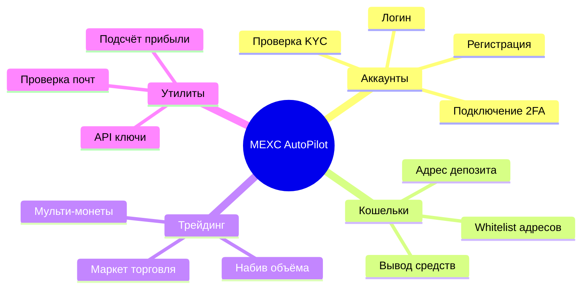
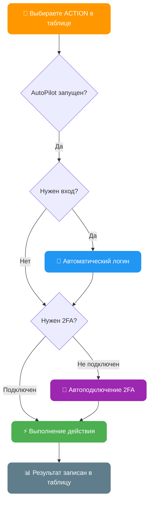
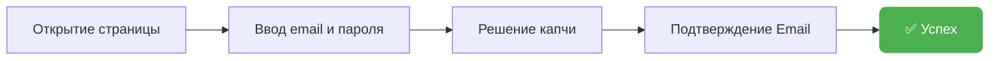
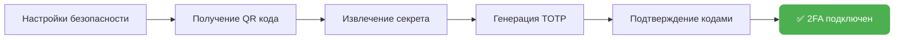
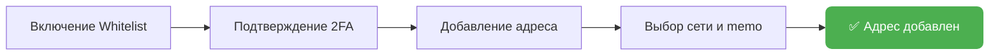
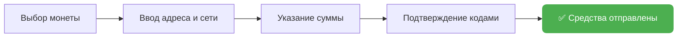
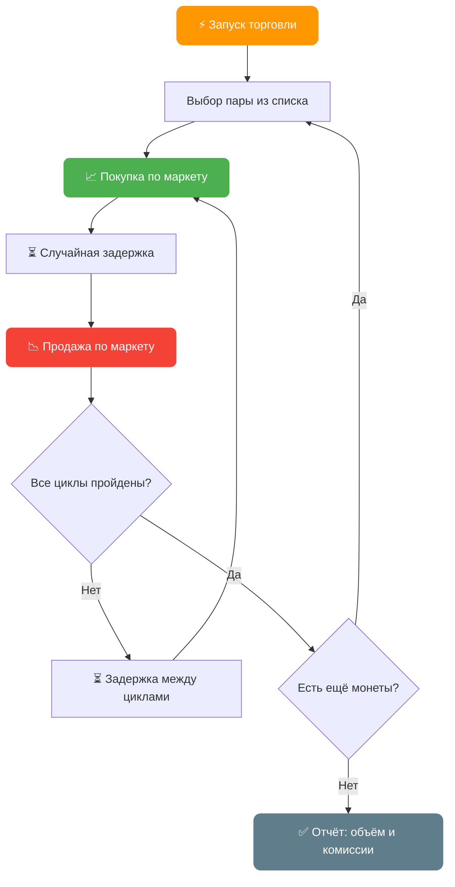
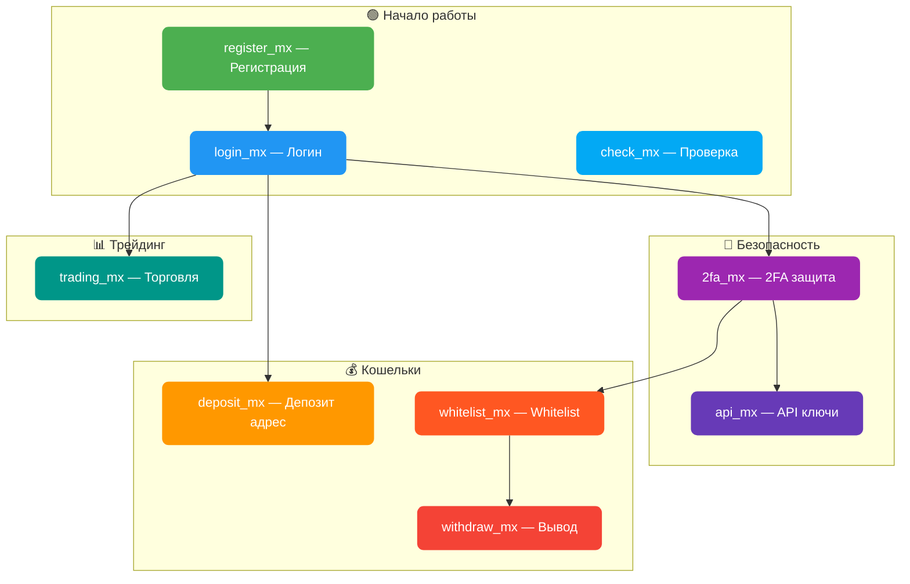
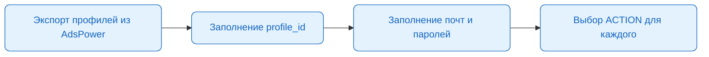

# AutoPilot Software — Максимальная Автоматизация на MEXC

**Поддержка AdsPower & Dolphin & Vision**
**Windows / MacOS / Linux**

---

## Забудьте о ручной работе: решение найдено

Ручное управление аккаунтами требует много времени, усилий и сопряжено с риском ошибок. Для масштабирования своих операций вам необходимо:
- Регулярно выполнять однотипные действия
- Оптимизировать время

AutoPilot Software решает эти проблемы, превращая рутину в автоматический процесс. Интеграция с AdsPower & Dolphin обеспечивает защиту цифровых отпечатков и безопасную работу с множеством аккаунтов.

---

## Как работает AutoPilot


---

## Основные преимущества

**Экономия времени:**
Автоматизация позволяет одновременно управлять сотнями аккаунтов

**Удобство в использовании:**
Занимайтесь своими делами пока AutoPilot автоматизирует действия в фоновом режиме. Вы можете использовать свои приложения пока AutoPilot работает в окнах браузера на заднем фоне

**Интеграция с AdsPower / Dolphin / Vision:**
Безопасное и анонимное использование аккаунтов. AutoPilot автоматически запускает и интегрируется в созданную антидетект сессию браузера с уникальными отпечатками. AutoPilot не важно открыты ли профили уже или они закрыты — он начнет автоматизировать процесс в любом случае

**Параллельная автоматизация:**
Автоматизируйте множество аккаунтов одновременно

**Удобная таблица учета аккаунтов:**
Ведите учет всех аккаунтов в одной Excel таблице. Можно добавлять новые столбцы, менять порядок столбцов для себя по желанию, главное не менять название столбцов из шаблона

**Настройка режима автоматизации — уникальные режимы скорости:**
- **FAST** — максимально быстрая работа с минимальными задержками
- **MEDIUM** — средняя скорость, имитация человеческого поведения, Smart Cursor, Human Typing
- **SLOW** — медленная скорость, полная имитация человеческого поведения

**Мультифункциональность:**
Настройте любые действия для каждого аккаунта. Например, AutoPilot будет получать адрес депозита для одних аккаунтов, а на других будет выводить средства

**Автоматические цепочки действий:**
Выбирайте любое действие — AutoPilot автоматически зайдет в аккаунт, если требуется вход. Также сам включит 2FA защиту, если она еще не подключена

---

## Функционал MEXC AutoPilot



AutoPilot поддерживает множество автоматизированных действий для MEXC:

- **Регистрация** аккаунтов на MEXC: обычным методом, по реферальной ссылке
- **Логин**: вход в аккаунт, проверка верификации и баланса
- **Проверка KYC**: проверка уровня верификации
- **Управление 2FA**: подключение двухфакторной аутентификации и ввод кодов
- **Получение адреса депозита** для каждого аккаунта
- **Вывод средств** с аккаунта
- **Добавление адресов в whitelist** с поддержкой различных сетей
- **Получение API-ключей** для торговли с настройкой разрешений
- **Автоматический трейдинг**: торговля и набив объёма в указанных парах
- **Последовательная торговля**: поддержка нескольких монет через запятую
- Автоматическое решение капчи, получение кодов верификации и многое другое

---

## Полный список действий (ACTION)

### Общая схема работы действий



> Все действия кроме регистрации автоматически зайдут в аккаунт, если требуется. Действия whitelist и withdraw автоматически подключат 2FA, если не установлен.

---

### `register_mx` — Регистрация аккаунта на MEXC

Регистрация аккаунта с автоматическим решением капчи и подтверждением email



| Параметр | Столбец | Описание |
|----------|---------|----------|
| **Требует** | `[EMAIL] mail_provider` | Почтовый сервис (yahoo, rambler, icloud, outlook, gmail...) |
| **Требует** | `[PROFILE] mail` | Адрес почтового ящика |
| **Требует** | `[EMAIL] mail_password` | Пароль почты / IMAP пароль |
| Опционально | `[PROFILE] mexc_password` | Пароль от аккаунта (AutoPilot генерирует, если пустой) |
| Опционально | `[REG] referral_code` | Реферальный код |
| **Обновляет** | `[REG] is_registered` | Статус регистрации (1 — зарегистрирован) |
| **Обновляет** | `[RESULT] status` | `[REGISTER_MX] SUCCESS` или описание ошибки |

---

### `login_mx` — Логин в аккаунт

Вход в аккаунт, проверка верификации и баланса

| Параметр | Столбец | Описание |
|----------|---------|----------|
| **Требует** | `[REG] is_registered` | 1 (зарегистрирован) |
| **Требует** | `[PROFILE] mail` | Адрес почты |
| **Требует** | `[PROFILE] mexc_password` | Пароль от аккаунта |
| Опционально | `[2FA] totp_secret_code` | Секретный код 2FA |
| **Обновляет** | `[KYC] kyc_status` | Уровень верификации |
| **Обновляет** | `[BALANCE] account_balance` | Баланс аккаунта в USDT |
| **Обновляет** | `[RESULT] status` | `[LOGIN_MX] SUCCESS` |

---

### `check_mx` — Проверка верификации

Проверка уровня KYC и баланса аккаунта без выполнения дополнительных действий

| Параметр | Столбец | Описание |
|----------|---------|----------|
| **Обновляет** | `[KYC] kyc_status` | Уровень верификации |
| **Обновляет** | `[BALANCE] account_balance` | Баланс в USDT |
| **Обновляет** | `[RESULT] status` | `[CHECK_MX] SUCCESS` |

---

### `2fa_mx` — Подключение 2FA

Автоматическая установка Google Authenticator на аккаунте



| Параметр | Столбец | Описание |
|----------|---------|----------|
| **Обновляет** | `[2FA] totp_secret_code` | Секретный код 2FA (сохраняется автоматически) |
| **Обновляет** | `[RESULT] status` | `[2FA_MX] SUCCESS` |

---

### `whitelist_mx` — Добавление адреса в Whitelist

Включение whitelist режима и добавление адреса для вывода



| Параметр | Столбец | Описание |
|----------|---------|----------|
| **Требует** | `[WHITELIST_MEXC] whitelist_address` | Адрес кошелька |
| **Требует** | `[WHITELIST_MEXC] whitelist_chain` | Сеть (как на MEXC, например: `ERC20`, `TRC20`, `Aptos`) |
| Опционально | `[WHITELIST_MEXC] whitelist_memo` | Memo/Tag (если требуется сетью) |
| **Обновляет** | `[WHITELIST_MEXC] whitelist_status` | 1 — успешно добавлен |
| **Обновляет** | `[RESULT] status` | `[WHITELIST_MX] SUCCESS` |

> Если 2FA не подключен — AutoPilot автоматически подключит его перед добавлением в whitelist

---

### `withdraw_mx` — Вывод средств

Полный вывод средств с аккаунта с автоматическим подтверждением



| Параметр | Столбец | Описание |
|----------|---------|----------|
| **Требует** | `[WITHDRAW_MEXC] withdraw_coin` | Монета для вывода (например: `USDT`) |
| **Требует** | `[WITHDRAW_MEXC] withdraw_chain` | Сеть вывода (как на MEXC, например: `TRC20`) |
| **Требует** | `[WITHDRAW_MEXC] withdraw_address` | Адрес кошелька получателя |
| Опционально | `[WITHDRAW_MEXC] withdraw_memo` | Memo/Tag |
| Опционально | `[WITHDRAW_MEXC] withdraw_amount` | Сумма в % (100 = всё, 50 = половина) |
| **Обновляет** | `[RESULT] status` | `[WITHDRAW_MEXC] SUCCESS` |

> Если 2FA не подключен — AutoPilot автоматически подключит его перед выводом

---

### `api_mx` — Получение API ключей

Создание API ключа с полными правами для SPOT и Futures торговли

| Параметр | Столбец | Описание |
|----------|---------|----------|
| Опционально | `[API] api_whitelist_ip` | IP для whitelist (опционально) |
| **Обновляет** | `[API] api_key` | Полученный API ключ |
| **Обновляет** | `[API] api_secret` | Секретный ключ API |
| **Обновляет** | `[RESULT] status` | `[API_MX] SUCCESS` |

---

### `trading_mx` — Автоматический трейдинг

Торговля и набив объёма маркет ордерами с поддержкой нескольких монет



| Параметр | Столбец | Описание |
|----------|---------|----------|
| **Требует** | `[TRADING] trading_coin` | Актив для торговли (например: `BTC` или `BTC,ETH,SOL`) |
| **Требует** | `[TRADING] trading_amount` | Размер ордера в USDT (например: `10` или `10,20,5`) |
| **Требует** | `[TRADING] trading_cycles` | Кол-во циклов покупки-продажи (например: `3` или `3,5,2`) |
| **Обновляет** | `[RESULT] status` | `[TRADING_MX] VOLUME: объём, FEES: комиссии` |

> **Мульти-монеты**: укажите через запятую несколько монет, размеров и циклов — AutoPilot будет торговать ими последовательно.
> Пример: `BTC,ETH` + `10,20` + `3,5` = 3 цикла BTC по 10 USDT, затем 5 циклов ETH по 20 USDT

> **Формула объёма**: циклы × размер ордера × 2 (покупка + продажа)
> Пример: 3 цикла по 10 USDT = 3 × 10 × 2 = **60 USDT** объёма

---

### `deposit_mx` — Получение адреса депозита

Получить адрес депозита для пополнения аккаунта

| Параметр | Столбец | Описание |
|----------|---------|----------|
| **Требует** | `[DEPOSIT] deposit_coin` | Монета для депозита (например: `USDT`) |
| **Требует** | `[DEPOSIT] deposit_chain` | Сеть (как на MEXC, например: `TRC20`) |
| **Обновляет** | `[DEPOSIT] deposit_address` | Адрес депозита (формат: `адрес:memo`) |

---

## Сводная таблица действий



| Действие | Описание | Авто-логин | Авто-2FA |
|----------|----------|:----------:|:--------:|
| `register_mx` | Регистрация аккаунта | — | — |
| `login_mx` | Вход в аккаунт | — | — |
| `check_mx` | Проверка KYC и баланса | ✅ | — |
| `2fa_mx` | Подключение 2FA | ✅ | — |
| `deposit_mx` | Адрес для депозита | ✅ | — |
| `whitelist_mx` | Добавление в whitelist | ✅ | ✅ |
| `withdraw_mx` | Вывод средств | ✅ | ✅ |
| `api_mx` | Создание API ключей | ✅ | — |
| `trading_mx` | Маркет торговля | ✅ | — |

---

## Как начать работу

### Шаг 1: Подготовьте таблицу AutoPilot_table.xlsx



Для начала достаточно заполнить **4 столбца**:

| # | Столбец | Описание | Пример |
|---|---------|----------|--------|
| 1 | `[PROFILE] profile_id` | ID профиля AdsPower / Dolphin | `k18kvlux` |
| 2 | `[EMAIL] mail_provider` | Почтовый сервис | `yahoo` |
| 3 | `[PROFILE] mail` | Адрес почты | `user@yahoo.com` |
| 4 | `[EMAIL] mail_password` | Пароль почты / IMAP пароль | `abcd1234` |

Полный список столбцов:

| # | Столбец | Описание |
|---|---------|----------|
| 1 | `[PROFILE] profile_id` | ID профиля AdsPower/Dolphin/Vision |
| 2 | `ACTION` | Действие для автоматизации |
| 3 | `[PROFILE] profile_name` | Имя профиля браузера |
| 4 | `[EMAIL] mail_provider` | Почтовый сервис |
| 5 | `[PROFILE] mail` | Адрес почты |
| 6 | `[EMAIL] mail_password` | Пароль почты / IMAP пароль |
| 7 | `[PROFILE] mexc_password` | Пароль от аккаунта MEXC |
| 8 | `[REG] referral_code` | Реферальный код |
| 9 | `[REG] is_registered` | Статус регистрации (0/1) |
| 10 | `[KYC] kyc_status` | Статус верификации |
| 11 | `[BALANCE] account_balance` | Баланс аккаунта в USD |
| 12 | `[BALANCE] total_profit` | Общая прибыль аккаунта |
| 13 | `[2FA] totp_secret_code` | Секретный код 2FA |
| 14 | `[WHITELIST_MEXC] whitelist_address` | Адрес для whitelist |
| 15 | `[WHITELIST_MEXC] whitelist_memo` | Memo для whitelist |
| 16 | `[WHITELIST_MEXC] whitelist_chain` | Сеть для whitelist |
| 17 | `[WHITELIST_MEXC] whitelist_status` | Статус whitelist (0/1) |
| 18 | `[DEPOSIT] deposit_coin` | Монета для депозита |
| 19 | `[DEPOSIT] deposit_chain` | Сеть для депозита |
| 20 | `[DEPOSIT] deposit_address` | Адрес депозита (заполняется автоматически) |
| 21 | `[WITHDRAW_MEXC] withdraw_coin` | Монета для вывода |
| 22 | `[WITHDRAW_MEXC] withdraw_chain` | Сеть для вывода |
| 23 | `[WITHDRAW_MEXC] withdraw_address` | Адрес для вывода |
| 24 | `[WITHDRAW_MEXC] withdraw_memo` | Memo для вывода |
| 25 | `[WITHDRAW_MEXC] withdraw_amount` | Сумма вывода в % |
| 26 | `[TRADING] trading_coin` | Актив для торговли |
| 27 | `[TRADING] trading_amount` | Размер ордера в USDT |
| 28 | `[TRADING] trading_cycles` | Кол-во циклов |
| 29 | `[API] api_key` | API ключ (заполняется автоматически) |
| 30 | `[API] api_secret` | API секрет (заполняется автоматически) |
| 31 | `[API] api_whitelist_ip` | IP для whitelist API |
| 32 | `[EMAIL] mail_forwarding_provider` | Почтовый сервис переадресации |
| 33 | `[EMAIL] forwarding_mail` | Адрес почты переадресации |
| 34 | `[EMAIL] forwarding_mail_password` | Пароль почты переадресации |
| 35 | `[RESULT] status` | Результат работы AutoPilot |

> Порядок столбцов можно менять. Можно добавлять свои столбцы. Главное — не менять название столбцов из шаблона.

---

### Шаг 2: Настройте конфигурацию AutoPilot.config

```
# Ключ активации
activation_key=abc1234567890

# Ключ сервиса решения капчи (Capguru)
captcha_key=abc1234567890

# Язык (EN, RU)
language=EN

# =========================== #
#     РЕЖИМ АВТОМАТИЗАЦИИ     #
# =========================== #

# Скорость работы (FAST, MEDIUM, SLOW)
speed_mode=FAST

# Максимум параллельных автоматизаций (NO - без ограничений)
parallel_limit=NO

# Ожидание между аккаунтами (YES/NO)
sleep_between_accounts=NO

# Задержка между аккаунтами в секундах (мин,макс)
delay_between_accounts=60,120

# Случайный порядок запуска (YES/NO)
shuffle_order=YES

# =========================== #
#     НАСТРОЙКИ БРАУЗЕРА      #
# =========================== #

# Размер окна браузера
window_size=1200,1000

# Закрывать все вкладки в браузере
close_tabs=YES

# Закрывать браузер после автоматизации (YES/NO)
close_after=NO

# AdsPower API порт
adspower_port=50325

# =========================== #
#       ПРОВЕРКА ПОЧТЫ        #
# =========================== #

# Интервал проверки почты (интервал, общее время)
email_delay_check=30,300

# Проверка почт перед запуском (YES/NO)
check_mail=YES

# =========================== #
#       НАСТРОЙКИ MEXC        #
# =========================== #

# Цветные логи в консоли
color_logs=YES

# Задержка между циклами торговли в секундах (мин,макс)
market_trading_delay=5,15

# Полный вывод — продажа всех активов
full_withdraw=YES
```

| Параметр | Описание | Значение по умолчанию |
|----------|----------|----------------------|
| `activation_key` | Ключ активации MEXC AutoPilot | — |
| `captcha_key` | Ключ Capguru для решения капчи | — |
| `speed_mode` | Скорость работы | `FAST` |
| `parallel_limit` | Лимит параллельных аккаунтов | `NO` |
| `shuffle_order` | Случайный порядок | `YES` |
| `close_after` | Закрывать браузер после работы | `NO` |
| `email_delay_check` | Интервал проверки почты | `30,300` |
| `market_trading_delay` | Задержка между циклами торговли | `5,15` |
| `full_withdraw` | Полный вывод всех активов | `YES` |

---

### Шаг 3: Выберите ACTION и запустите

Впишите нужное действие в столбец `ACTION` для каждого аккаунта и запустите AutoPilot.

---

## Важно

- **Капча**: для решения капч пополните баланс [Capguru](https://capguru.online). Стоимость 1000 капч — около 1$
- **Почта**: AutoPilot использует протокол IMAP. Большинство почтовых сервисов требуют специальный пароль (gmail, outlook, yahoo, icloud). Проверьте настройки IMAP у вашего провайдера
- **Переадресация**: если сервис требует специальный пароль, настройте переадресацию писем на почту без этого требования (firstmail, rambler, gmx.com)
- **Производительность**: для ускорения работы рекомендуется установить расширение блокировки рекламы (Ublock, AdBlock) в профили браузера

---

## Подготовка AdsPower / Dolphin / Vision

**AdsPower:**
- Установите свежую версию SunBrowser: AdsPower → Настройки → Локальные настройки
- Экспорт профилей: Выделите профили → Экспортировать выбранное → Номер, ID, Имя профиля
- Скопируйте столбцы ID и Name в таблицу AutoPilot_table.xlsx

**Dolphin:**
- Включите отображение ID: Шестерёнка → Customize columns → Profile ID

**Vision:**
- Настройте в конфиге: `vision_config=имя_папки,API_ключ`

---

## Покупка

Сразу после покупки вы получаете готовую сборку для работы.

Купить ключ активации для MEXC AutoPilot: [https://t.me/buykyc_bot](https://t.me/buykyc_bot)

Вместе с ключом вы получаете доступ к тематическому чату AutoPilot, где можно задавать вопросы, общаться и получать советы.

Время жизни ключа отсчитывается от первого запуска.
