# AutoPilot Software — Максимальная Автоматизация на Bybit

**Поддержка AdsPower & Dolphin & Vision**
**Windows / MacOS / Linux**

---

## Забудьте о ручной работе: решение найдено

Bybit — одна из ведущих криптовалютных бирж мира с возможностями для заработка через Airdrop, TokenSplash события и специальные ивенты.

Ручное управление аккаунтами требует много времени, усилий и сопряжено с риском ошибок. AutoPilot Software превращает рутину в автоматический процесс. Интеграция с AdsPower, Dolphin и Vision обеспечивает защиту цифровых отпечатков и безопасную работу с множеством аккаунтов.

---

## Как работает AutoPilot

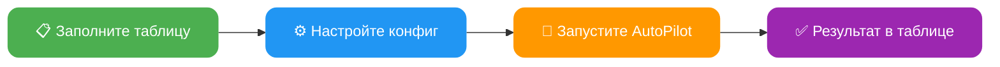

---

## Основные преимущества

**Экономия времени:**
Автоматизация позволяет одновременно управлять сотнями аккаунтов

**Удобство в использовании:**
Занимайтесь своими делами пока AutoPilot автоматизирует действия в фоновом режиме

**Интеграция с AdsPower / Dolphin / Vision:**
Безопасное и анонимное использование аккаунтов. AutoPilot автоматически запускает и интегрируется в созданную антидетект сессию браузера с уникальными отпечатками

**Параллельная автоматизация:**
Автоматизируйте множество аккаунтов одновременно

**Удобная таблица учета аккаунтов:**
Ведите учет всех аккаунтов в одной Excel таблице. Можно добавлять новые столбцы, менять порядок для себя — главное не менять название столбцов из шаблона

**Режимы скорости:**
- **FAST** — максимально быстрая работа с минимальными задержками
- **MEDIUM** — средняя скорость, имитация человеческого поведения, Smart Cursor, Human Typing
- **SLOW** — медленная скорость, полная имитация человеческого поведения

**Мультифункциональность:**
Настройте любые действия для каждого аккаунта. Например, AutoPilot будет получать адрес депозита для одних аккаунтов, а на других — выводить средства

**Автоматические цепочки действий:**
Выбирайте любое действие — AutoPilot автоматически зайдет в аккаунт, если требуется вход. Также сам включит 2FA защиту, если она еще не подключена

**Автогенерация паролей:**
При регистрации AutoPilot сгенерирует надёжный пароль, если он не указан

**Полная продажа активов:**
Полный вывод с автоматической конвертацией всех активов в USDT

**Логирование:**
Полное логирование результатов в `logs/` и автоматические бэкапы таблицы в `backup/`

---

## Функционал Bybit AutoPilot

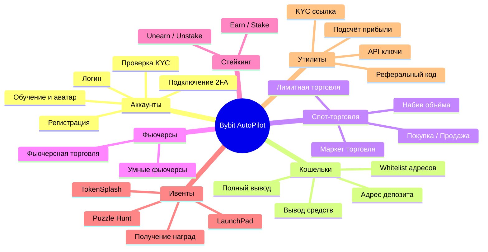

AutoPilot поддерживает широкий набор автоматических действий для Bybit:

- **Регистрация** аккаунтов на Bybit: обычным методом, по реферальной ссылке
- **Логин**: вход в аккаунт, проверка верификации и баланса
- **Проверка KYC**: проверка уровня верификации с отображением страны, имени, документа
- **Управление 2FA**: подключение двухфакторной аутентификации
- **Обучение и аватар**: прохождение обучающих модулей и установка аватара профиля
- **Получение адреса депозита** для каждого аккаунта
- **Добавление адресов в whitelist** с поддержкой различных сетей
- **Вывод средств** с аккаунта, включая полный вывод с конвертацией всех активов
- **Получение API-ключей** для торговли
- **Автоматический трейдинг**: маркет и лимитная торговля, набив объёма в указанных парах
- **Покупка / Продажа**: покупка активов и продажа всех монет в USDT
- **Фьючерсная торговля**: стандартные и умные фьючерсы с post-only ордерами (экономия 32% на комиссиях)
- **Стейкинг**: USDT Flexible Savings (earn / unearn)
- **TokenSplash**: автоматическое участие в ивентах с выполнением задач на депозит
- **LaunchPad**: автоматическая регистрация в активных LaunchPad ивентах
- **Puzzle Hunt**: автоматическое прохождение puzzle-задач
- **Получение наград**: купоны, пакетное получение, награды за активность
- **Реферальные коды**: автоматическое извлечение реферальных кодов аккаунтов
- **KYC ссылка**: получение ссылки SUMSUB верификации
- **Подсчёт прибыли**: автоматический анализ WITHDRAW - DEPOSIT
- Автоматическое решение капчи, получение кодов верификации и многое другое

---

## Полный список действий (ACTION)

### Общая схема работы действий

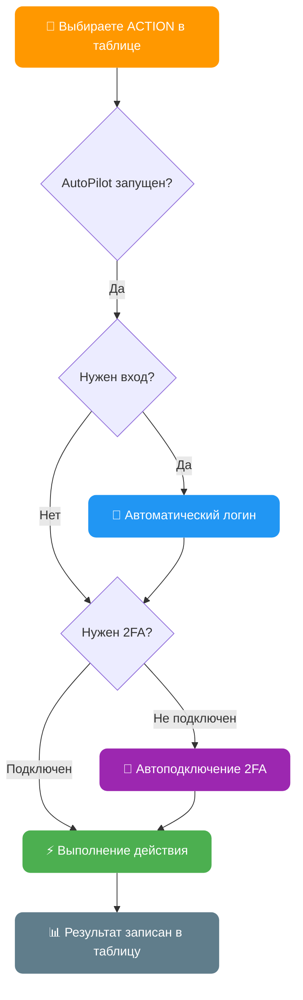

> Все действия кроме регистрации автоматически зайдут в аккаунт, если требуется. Действия whitelist и withdraw автоматически подключат 2FA, если не установлен.

---

### `register` — Регистрация аккаунта на Bybit

Регистрация аккаунта с автоматическим решением капчи и подтверждением email

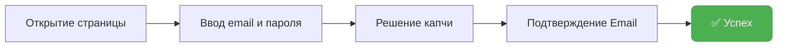

| Параметр | Столбец | Описание |
|----------|---------|----------|
| **Требует** | `[EMAIL] mail_provider` | Почтовый сервис (yahoo, rambler, icloud, outlook, gmail...) |
| **Требует** | `[PROFILE] mail` | Адрес почтового ящика |
| **Требует** | `[EMAIL] mail_password` | Пароль почты / IMAP пароль |
| Опционально | `[PROFILE] bybit_password` | Пароль от аккаунта (AutoPilot генерирует, если пустой) |
| Опционально | `[REG] referral_code` | Реферальный код |
| **Обновляет** | `[REG] is_registered` | Статус регистрации (1 — зарегистрирован) |
| **Обновляет** | `[RESULT] status` | `[REGISTER] SUCCESS` или описание ошибки |

> Для старта регистрации достаточно заполнить 4 столбца: profile_id, mail_provider, mail, mail_password

---

### `login` — Логин в аккаунт

Вход в аккаунт, проверка верификации и баланса

| Параметр | Столбец | Описание |
|----------|---------|----------|
| **Требует** | `[REG] is_registered` | 1 (зарегистрирован) |
| **Требует** | `[PROFILE] mail` | Адрес почты |
| **Требует** | `[PROFILE] bybit_password` | Пароль от аккаунта |
| Опционально | `[2FA] totp_secret_code` | Секретный код 2FA |
| **Обновляет** | `[KYC] kyc_status` | Уровень верификации |
| **Обновляет** | `[BALANCE] account_balance` | Баланс аккаунта в USDT |
| **Обновляет** | `[RESULT] status` | `[LOGIN] SUCCESS` |

---

### `2fa` — Подключение 2FA

Автоматическая установка Google Authenticator на аккаунте

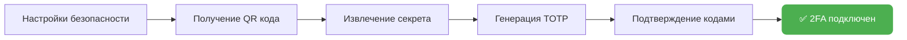

| Параметр | Столбец | Описание |
|----------|---------|----------|
| **Обновляет** | `[2FA] totp_secret_code` | Секретный код 2FA (сохраняется автоматически) |
| **Обновляет** | `[RESULT] status` | `[2FA] SUCCESS` |

---

### `deposit` — Получение адреса депозита

Получить адрес депозита для пополнения аккаунта

| Параметр | Столбец | Описание |
|----------|---------|----------|
| **Требует** | `[DEPOSIT] deposit_coin` | Монета для депозита (например: `USDT`) |
| **Требует** | `[DEPOSIT] deposit_chain` | Сеть (например: `TRC20`, `Aptos`, `Mantle`) |
| **Обновляет** | `[DEPOSIT] deposit_address` | Адрес депозита |
| **Обновляет** | `[RESULT] status` | `[DEPOSIT] SUCCESS` |

---

### `whitelist` — Добавление адреса в Whitelist

Включение whitelist режима и добавление адреса для вывода

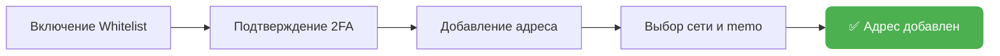

| Параметр | Столбец | Описание |
|----------|---------|----------|
| **Требует** | `[WHITELIST] whitelist_address` | Адрес кошелька |
| **Требует** | `[WHITELIST] whitelist_chain` | Сеть (например: `TRC20`, `Aptos`, `Mantle`) |
| Опционально | `[WHITELIST] whitelist_memo` | Memo/Tag (если требуется сетью) |
| **Обновляет** | `[WHITELIST] whitelist_status` | 1 — успешно добавлен |
| **Обновляет** | `[RESULT] status` | `[WHITELIST] SUCCESS` |

> Если 2FA не подключен — AutoPilot автоматически подключит его перед добавлением в whitelist

---

### `withdraw` — Вывод средств

Вывод средств с аккаунта с автоматическим подтверждением

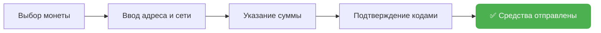

| Параметр | Столбец | Описание |
|----------|---------|----------|
| **Требует** | `[WITHDRAW] withdraw_coin` | Монета для вывода (например: `USDT`) |
| **Требует** | `[WITHDRAW] withdraw_chain` | Сеть вывода (например: `TRC20`, `Aptos`) |
| **Требует** | `[WITHDRAW] withdraw_address` | Адрес кошелька получателя |
| Опционально | `[WITHDRAW] withdraw_memo` | Memo/Tag |
| Опционально | `[WITHDRAW] withdraw_amount` | Сумма в % (100 = всё, 50 = половина) |
| **Обновляет** | `[RESULT] status` | `[WITHDRAW] SUCCESS` |

> Если 2FA не подключен — AutoPilot автоматически подключит его перед выводом

---

### Алгоритм полного вывода (`full_withdraw=YES`)

Если в конфиге включен `full_withdraw=YES`, AutoPilot выполнит полную продажу всех активов перед выводом:

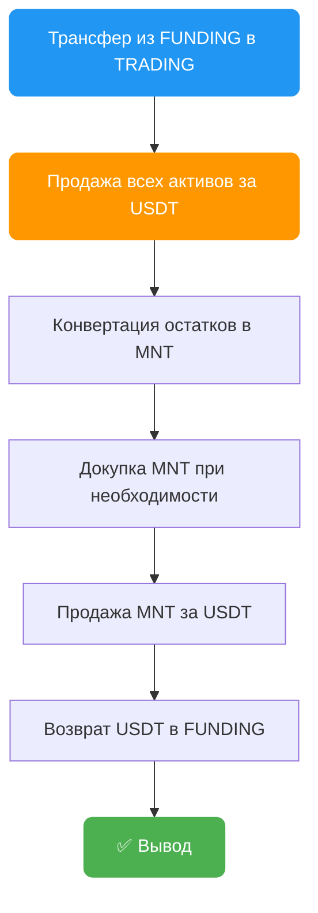

---

### Мастер-кошелёк — Авто-whitelist, $0 комиссий, неотслеживаемый вывод

Выводите с сотен аккаунтов **не вводя ни одного адреса вручную**. AutoPilot создаёт уникальный кошелёк для каждого аккаунта, сам добавляет его в whitelist, выводит с **нулевой комиссией** и собирает всё на ваш мастер-кошелёк. Каждый аккаунт выводит на **свой адрес** — связать их между собой невозможно.

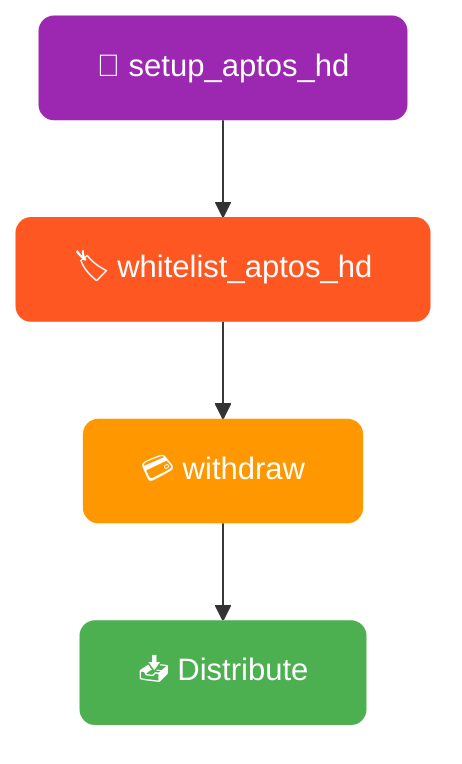

#### `setup_aptos_hd` — Создание мастер-кошелька

Запускается один раз. Создаёт ваш мастер-кошелёк и показывает секретную фразу (12 слов). Сохраните её — она контролирует все ваши адреса.

| Параметр | Столбец | Описание |
|----------|---------|----------|
| **Требуется** | Конфиг: `activation_key` | Пароль шифрования |
| **Результат** | Файл: `aptos_master_seed.enc` | Зашифрованная секретная фраза |
| **Результат** | Файл: `aptos_hd_wallet_data.csv` | Все адреса и приватные ключи |

> ⚠️ **Сохраните секретную фразу!** Показывается один раз. Потеряли фразу = потеряли доступ ко всем адресам и средствам.

#### `whitelist_aptos_hd` — Автоматический whitelist

Запускается на всех профилях. Для каждого аккаунта AutoPilot:
1. Создаёт уникальный Aptos-адрес (разный для каждого аккаунта)
2. Заходит на Bybit, добавляет его в whitelist
3. Подтверждает email/2FA — полностью автоматически
4. Сохраняет всё в таблицу

Никакой ручной работы. Не нужно создавать кошельки, копировать адреса или заполнять таблицу.

| Параметр | Столбец | Описание |
|----------|---------|----------|
| Автосоздание | `[WHITELIST] whitelist_address` | Уникальный Aptos-адрес |
| Автоустановка | `[WHITELIST] whitelist_network` | `APTOS` |
| **Обновляет** | `[RESULT] status` | `[WHITELIST_HD] SUCCESS` |

> 🔁 **Можно перезапускать:** уже есть адрес? AutoPilot использует его — дубликатов не будет.

#### Сбор средств: вкладка Distribute

После вывода USDT лежат на индивидуальных адресах. Откройте вкладку **Distribute** в десктоп-приложении:
- Выбрать профили → Просмотреть → Один клик → Всё собрано на мастер-кошелёк
- Газ: ~0.002 APT на профиль (доли цента)
- Работает в обе стороны: сбор с аккаунтов или раздача на них

**Почему Aptos?**

| Сеть | Комиссия Bybit | Скорость |
|------|---------------|----------|
| **Aptos** | **$0** | ~1 сек |
| Arbitrum | $0.1 | ~1 сек |
| TRC20 | $1 | ~3 мин |
| ERC20 | $1-5 | ~5 мин |

> 💰 **Чем больше аккаунтов — тем больше экономите. Каждый вывод через TRC20/ERC20 стоит $1-5. Через Aptos = $0.**

> 🕵️ **Приватность:** каждый аккаунт → свой адрес → общих адресов нет → связать аккаунты между собой невозможно.

---

### `sell` — Продажа всех активов

Конвертация всех монет на аккаунте в USDT маркет-ордерами

| Параметр | Столбец | Описание |
|----------|---------|----------|
| **Обновляет** | `[BALANCE] account_balance` | Баланс после продажи |
| **Обновляет** | `[RESULT] status` | `[SELL] SUCCESS` |

---

### `api` — Получение API ключей

Создание API ключа с правами для SPOT и Futures торговли

| Параметр | Столбец | Описание |
|----------|---------|----------|
| Опционально | `[API] api_whitelist_ip` | IP для whitelist (опционально) |
| **Обновляет** | `[API] api_key` | Полученный API ключ |
| **Обновляет** | `[API] api_secret` | Секретный ключ API |
| **Обновляет** | `[RESULT] status` | `[API] SUCCESS` |

---

### `trading` — Автоматический трейдинг

Торговля и набив объёма маркет ордерами с поддержкой нескольких монет

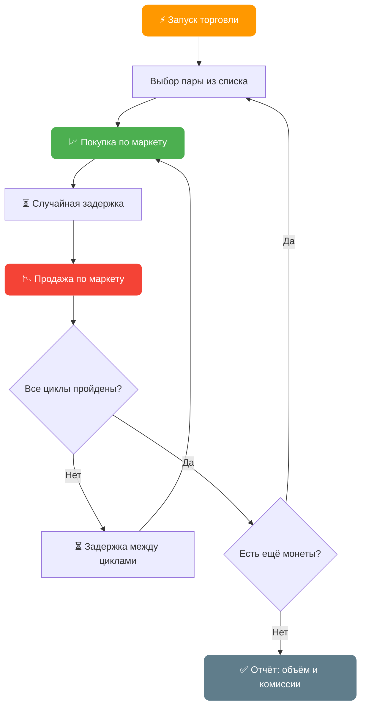

| Параметр | Столбец | Описание |
|----------|---------|----------|
| **Требует** | `[TRADING] trading_coin` | Актив для торговли (например: `BTC` или `BTC,ETH,SOL`) |
| **Требует** | `[TRADING] trading_amount` | Размер ордера в USDT (например: `10` или `10,20,5`) |
| **Требует** | `[TRADING] trading_cycles` | Кол-во циклов покупки-продажи (например: `3` или `3,5,2`) |
| **Обновляет** | `[RESULT] status` | `[TRADING] VOLUME: объём, FEES: комиссии` |

> **Мульти-монеты**: укажите через запятую несколько монет, размеров и циклов — AutoPilot будет торговать ими последовательно.
> Пример: `BTC,ETH` + `10,20` + `3,5` = 3 цикла BTC по 10 USDT, затем 5 циклов ETH по 20 USDT

> **Формула объёма**: циклы × размер ордера × 2 (покупка + продажа)
> Пример: 3 цикла по 10 USDT = 3 × 10 × 2 = **60 USDT** объёма

---

### `ts` — TokenSplash

Автоматическое участие в TokenSplash ивентах на Bybit

| Параметр | Столбец | Описание |
|----------|---------|----------|
| **Требует** | `[TS] code` | Код ивента TokenSplash |
| **Обновляет** | `[RESULT] status` | `[TS] SUCCESS` |

> Если баланс аккаунта > 100 USDT — AutoPilot автоматически выполнит задачу на депозит

---

### `puzzle_hunt` — Пазл-хант

Автоматическое прохождение задач Puzzle Hunt на Bybit: регистрация, социальные задания, торговля, ежедневные чекины

| Параметр | Столбец | Описание |
|----------|---------|----------|
| **Требует** | `[PUZZLE] event_code` | Код пазла (через запятую для нескольких) |
| **Обновляет** | `[RESULT] status` | `DONE`, `5/10` (прогресс), `ENDED` или `FAIL` |

> Указывайте несколько пазлов сразу: `code1,code2,code3`. Сделайте столбец типа **текст**, чтобы Excel не обрезал длинные коды.

> Подробнее: [FAQ → Puzzle Hunt](/docs/faq/#62--puzzle-hunt-puzzle_hunt) — полная схема, статусы и советы.

---

### `link` — Получить ссылку KYC верификации

Извлечение ссылки SUMSUB верификации для аккаунта

| Параметр | Столбец | Описание |
|----------|---------|----------|
| **Обновляет** | `[RESULT] status` | `[LINK] SUCCESS` с URL верификации |

---

### `learn` — Прохождение обучения и установка аватара

Автоматическое прохождение обучающих модулей Bybit и установка аватара профиля

| Параметр | Столбец | Описание |
|----------|---------|----------|
| **Обновляет** | `[RESULT] status` | `[LEARN] SUCCESS` |

---

### `profit` — Расчёт прибыли

Расчёт прибыли по аккаунту: сумма выводов - сумма депозитов + текущий баланс

| Параметр | Столбец | Описание |
|----------|---------|----------|
| **Обновляет** | `[RESULT] status` | `[PROFIT] значение_прибыли` |

---

### `buy` — Покупка актива

Покупка конкретного актива за USDT

| Параметр | Столбец | Описание |
|----------|---------|----------|
| **Требует** | `[TRADING] trading_coin` | Актив для покупки (например: `BTC`) |
| **Требует** | `[TRADING] trading_amount` | Сумма в USDT |
| **Обновляет** | `[RESULT] status` | `[BUY] SUCCESS` |

---

### `limit_buy` — Покупка лимитным ордером

Размещение лимитного ордера на покупку актива

| Параметр | Столбец | Описание |
|----------|---------|----------|
| **Требует** | `[TRADING] trading_coin` | Актив для покупки (например: `ETH`) |
| **Требует** | `[TRADING] trading_amount` | Сумма в USDT |
| **Обновляет** | `[RESULT] status` | `[LIMIT_BUY] SUCCESS` |

---

### `limit` — Случайная лимитная торговля

Автоматическая лимитная торговля с рандомизированными ордерами для естественного набива объёма

| Параметр | Столбец | Описание |
|----------|---------|----------|
| **Требует** | `[TRADING] trading_coin` | Актив для торговли (например: `BTC`) |
| Опционально | `[TRADING] trading_amount` | Размер ордера в USDT |
| Опционально | `[TRADING] trading_cycles` | Количество циклов |
| **Обновляет** | `[RESULT] status` | Отчёт по объёму и комиссиям |

---

### `trading_limit` — Торговый объём лимитными ордерами

Набив объёма лимитными ордерами вместо маркет-ордеров

| Параметр | Столбец | Описание |
|----------|---------|----------|
| **Требует** | `[TRADING] trading_coin` | Актив для торговли (например: `BTC` или `BTC,ETH`) |
| **Требует** | `[TRADING] trading_amount` | Размер ордера в USDT (например: `10` или `10,20`) |
| Опционально | `[TRADING] trading_cycles` | Количество циклов (например: `3` или `3,5`) |
| **Обновляет** | `[RESULT] status` | `[TRADING] VOLUME: объём, FEES: комиссии` |

> Тот же мульти-монетный синтаксис, что и `trading`, но используются лимитные ордера для лучших цен исполнения.

---

### `limit_sell` — Продажа лимитным ордером на Funding

Продажа активов на Funding аккаунте за USDT лимитными ордерами

| Параметр | Столбец | Описание |
|----------|---------|----------|
| **Требует** | `[TRADING] trading_coin` | Актив для продажи (например: `ETH`) |
| **Обновляет** | `[RESULT] status` | `[LIMIT_SELL] SUCCESS` |

---

### `futures` — Фьючерсная торговля

Торговля фьючерсами с кредитным плечом маркет-ордерами

| Параметр | Столбец | Описание |
|----------|---------|----------|
| **Требует** | `[TRADING] trading_coin` | Монета для фьючерсов (например: `BTC`) |
| **Требует** | `[TRADING] trading_amount` | Размер позиции с плечом в USDT |
| **Требует** | `[TRADING] trading_cycles` | Количество торговых циклов |
| **Обновляет** | `[RESULT] status` | Отчёт по объёму и комиссиям |

> Настройте плечо параметром `leverage` в конфиге (по умолчанию: `10`).

---

### `futures_smart` — Умная фьючерсная торговля

Автоматическая фьючерсная торговля с анализом рынка, post-only лимитными ордерами и управлением позициями. **На 32% дешевле** маркет-ордеров.

| Параметр | Столбец | Описание |
|----------|---------|----------|
| **Требует** | `[TRADING] trading_coin` | Монета для фьючерсов (например: `BTC`) |
| **Требует** | `[TRADING] trading_amount` | Размер позиции с плечом в USDT |
| **Требует** | `[TRADING] trading_cycles` | Количество торговых циклов |
| **Обновляет** | `[RESULT] status` | Отчёт по объёму и комиссиям |

> `trading_amount` — это размер позиции **с учётом плеча**. Реальный баланс на сделку = `trading_amount / leverage`.

> Подробнее: [FAQ → Smart Futures](/docs/faq/#61--smart-futures-trading-futures_smart) — алгоритмы, формулы и параметры конфига.

---

### `stake` / `earn` — Стейкинг USDT (Flexible Savings)

Отправка USDT в пул Flexible Savings на Bybit. `stake` и `earn` — это алиасы одного действия.

| Параметр | Столбец | Описание |
|----------|---------|----------|
| Опционально | `[WITHDRAW] withdraw_amount` | Фиксированная сумма USDT (по умолчанию: весь доступный баланс) |
| **Обновляет** | `[RESULT] status` | `[STAKE] SUCCESS - stake 150.25` |

> Автоматически переводит USDT из Trading → Funding перед стейкингом.

---

### `unstake` / `unearn` — Вывод из стейкинга

Вывод USDT из пула Flexible Savings обратно в Funding. `unstake` и `unearn` — это алиасы.

| Параметр | Столбец | Описание |
|----------|---------|----------|
| **Обновляет** | `[RESULT] status` | `[STAKE] SUCCESS - unstake 150.25` |

> Подробнее: [FAQ → Bybit Earn](/docs/faq/#63--bybit-earn--usdt-staking-earn--unearn) — детальная схема.

---

### `lp` — Регистрация в LaunchPad ивенте

Автоматическая регистрация в текущем активном LaunchPad ивенте на Bybit. Полностью автоматически — столбцы не нужны.

| Параметр | Столбец | Описание |
|----------|---------|----------|
| **Обновляет** | `[RESULT] status` | `[LP] SUCCESS` |

---

### `claim` — Получить купоны

Автоматическое получение доступных купонов на аккаунте

| Параметр | Столбец | Описание |
|----------|---------|----------|
| **Обновляет** | `[RESULT] status` | `[CLAIM] SUCCESS` |

---

### `claim_batch` — Получить купоны пакетно

Пакетное получение всех доступных купонов

| Параметр | Столбец | Описание |
|----------|---------|----------|
| **Обновляет** | `[RESULT] status` | `[CLAIM] SUCCESS` |

---

### `claim_activity` — Забрать награды за активность

Получение наград за активность с обходом проверки лица

| Параметр | Столбец | Описание |
|----------|---------|----------|
| **Обновляет** | `[RESULT] status` | `[CLAIM_ACTIVITY] SUCCESS` |

---

### `ref_code` — Извлечь реферальный код

Автоматическое извлечение реферального кода аккаунта

| Параметр | Столбец | Описание |
|----------|---------|----------|
| **Обновляет** | `[RESULT] status` | `[REF_CODE] значение_кода` |

---

## Сводная таблица действий

```mermaid
flowchart TD
    subgraph REG ["🟢 Начало работы"]
        R["register — Регистрация"]
        L["login — Логин"]
    end

    subgraph SEC ["🔐 Безопасность"]
        FA["2fa — 2FA защита"]
        API["api — API ключи"]
    end

    subgraph WALLET ["💰 Кошельки"]
        D["deposit — Депозит адрес"]
        W["whitelist — Whitelist"]
        HD["whitelist_aptos_hd — Мастер-кошелёк"]
        WD["withdraw — Вывод"]
        S["sell — Продажа активов"]
    end

    subgraph TRADE ["📊 Трейдинг"]
        T["trading — Маркет торговля"]
        TL["trading_limit — Лимитная торговля"]
        B["buy — Покупка актива"]
        FU["futures_smart — Умные фьючерсы"]
    end

    subgraph EVENTS ["🎯 Ивенты и награды"]
        TS["ts — TokenSplash"]
        LP["lp — LaunchPad"]
        PZ["puzzle_hunt — Puzzle Hunt"]
        CL["claim — Получение наград"]
    end

    subgraph STAKE ["🏦 Стейкинг"]
        ST["stake — Earn"]
        UST["unstake — Unearn"]
    end

    R --> L
    L --> FA
    FA --> W
    FA --> HD
    FA --> API
    W --> WD
    HD --> WD
    S --> WD
    L --> D
    L --> T
    L --> TL
    L --> B
    L --> FU
    L --> TS
    L --> LP
    L --> PZ
    L --> CL
    L --> ST
    ST --> UST

    style R fill:#4CAF50,color:#fff,stroke:none,rx:8
    style L fill:#2196F3,color:#fff,stroke:none,rx:8
    style FA fill:#9C27B0,color:#fff,stroke:none,rx:8
    style API fill:#673AB7,color:#fff,stroke:none,rx:8
    style D fill:#FF9800,color:#fff,stroke:none,rx:8
    style W fill:#FF5722,color:#fff,stroke:none,rx:8
    style HD fill:#E040FB,color:#fff,stroke:none,rx:8
    style WD fill:#f44336,color:#fff,stroke:none,rx:8
    style S fill:#E91E63,color:#fff,stroke:none,rx:8
    style T fill:#009688,color:#fff,stroke:none,rx:8
    style TL fill:#00897B,color:#fff,stroke:none,rx:8
    style B fill:#43A047,color:#fff,stroke:none,rx:8
    style FU fill:#E65100,color:#fff,stroke:none,rx:8
    style TS fill:#00BCD4,color:#fff,stroke:none,rx:8
    style LP fill:#0097A7,color:#fff,stroke:none,rx:8
    style PZ fill:#795548,color:#fff,stroke:none,rx:8
    style CL fill:#AB47BC,color:#fff,stroke:none,rx:8
    style ST fill:#66BB6A,color:#fff,stroke:none,rx:8
    style UST fill:#81C784,color:#fff,stroke:none,rx:8
```

| Действие | Описание | Авто-логин | Авто-2FA |
|----------|----------|:----------:|:--------:|
| `register` | Регистрация аккаунта | — | — |
| `login` | Вход в аккаунт | — | — |
| `2fa` | Подключение 2FA | ✅ | — |
| `link` | Получить ссылку KYC верификации | ✅ | — |
| `learn` | Обучение и установка аватара | ✅ | — |
| `deposit` | Адрес для депозита | ✅ | — |
| `whitelist` | Добавление в whitelist | ✅ | ✅ |
| `withdraw` | Вывод средств | ✅ | ✅ |
| `sell` | Продажа всех активов | ✅ | — |
| `api` | Создание API ключей | ✅ | — |
| `trading` | Маркет торговля | ✅ | — |
| `trading_limit` | Лимитная торговля | ✅ | — |
| `buy` | Покупка актива | ✅ | — |
| `limit_buy` | Покупка лимитным ордером | ✅ | — |
| `limit` | Случайная лимитная торговля | ✅ | — |
| `limit_sell` | Продажа лимитным ордером на Funding | ✅ | — |
| `futures` | Фьючерсная торговля | ✅ | — |
| `futures_smart` | Умные фьючерсы (на 32% дешевле) | ✅ | — |
| `stake` / `earn` | Стейкинг USDT | ✅ | — |
| `unstake` / `unearn` | Вывод из стейкинга | ✅ | — |
| `ts` | TokenSplash ивенты | ✅ | — |
| `lp` | LaunchPad ивенты | ✅ | — |
| `puzzle_hunt` | Puzzle Hunt | ✅ | — |
| `claim` | Получить купоны | ✅ | — |
| `claim_batch` | Получить купоны пакетно | ✅ | — |
| `claim_activity` | Забрать награды за активность | ✅ | — |
| `profit` | Расчёт прибыли | ✅ | — |
| `ref_code` | Извлечь реферальный код | ✅ | — |

---

## Настройка конфигурации

Файл `AutoPilot.config` содержит основные параметры:

| Параметр | Описание | Пример |
|----------|----------|--------|
| `activation_key` | Ключ активации | `XXXX-XXXX-XXXX` |
| `speed_mode` | Режим скорости | `FAST`, `MEDIUM`, `SLOW` |
| `captcha_key` | API ключ сервиса капчи | `abc123...` |
| `captcha_provider` | Провайдер капчи (⭐ `capsolver`, `capmonster`, `2captcha`, `capguru`) | `capsolver` |
| `parallel_limit` | Лимит параллельных аккаунтов | `3` |
| `shuffle_order` | Перемешать порядок аккаунтов | `YES` / `NO` |
| `window_size` | Размер окна браузера | `1280x720` |
| `close_tabs` | Закрывать вкладки после работы | `YES` / `NO` |
| `close_after` | Закрывать профиль после работы | `YES` / `NO` |
| `email_delay_check` | Задержка проверки почты (сек) | `5` |
| `language` | Язык интерфейса | `EN`, `RU` |
| `full_withdraw` | Полная продажа перед выводом | `YES` / `NO` |
| `show_credentials` | Показывать KYC данные | `YES` / `NO` |
| `bot_mode` | Интеграция с Telegram ботом | `YES` / `NO` |

---

## KYC статусы

При логине AutoPilot проверяет статус верификации:

| Статус | Описание |
|--------|----------|
| `UNSUBMITTED` | Верификация не подана |
| `REJECT` | Отклонено (причина указывается) |
| `1 [СТРАНА]` | Верифицирован (например: `1 RU`) |

Если `show_credentials=YES`, также записываются: имя, фамилия, тип документа, номер документа.

---

## Настройка почты (IMAP)

AutoPilot использует протокол IMAP для получения кодов верификации с почты.

**Поддерживаемые провайдеры:** Yahoo, Rambler, iCloud, Outlook, Gmail, Mail.ru, First Mail и другие

> Для Gmail, Outlook, Yahoo, iCloud требуется создание **пароля приложения** (App Password) — обычный пароль не подойдёт для IMAP. Либо настройте переадресацию писем на почту с прямым IMAP доступом.

---

## Быстрый старт после покупки

1. **Скачайте** `AutoPilot.zip` из закреплённого сообщения в чате [@buykyc_bot](https://t.me/buykyc_bot)
2. **Распакуйте** архив в новую папку
3. **Настройте** `AutoPilot.config`:
   - Укажите `activation_key` (получен при покупке)
   - Укажите `captcha_provider` и `captcha_key` — поддерживаются 4 провайдера: ⭐ [CapSolver](https://www.capsolver.com/) (рекомендуется), [CapMonster](https://capmonster.cloud/), [2Captcha](https://2captcha.com/), [CapGuru](https://cap.guru/). Подробнее — [FAQ → секция 4](/docs/faq/#4--прокси-и-капча)
4. **Заполните** `AutoPilot_table.xlsx` данными аккаунтов
5. **Запустите** приложение

> Управление также доступно через бот [@AutoPilotManager_bot](https://t.me/AutoPilotManager_bot) (требуется `bot_mode=YES` в конфиге)

---

## Покупка

Сразу после покупки вы получаете готовую сборку для работы.

Купить ключ активации для Bybit AutoPilot: [https://t.me/buykyc_bot](https://t.me/buykyc_bot)

Вместе с ключом вы получаете доступ к тематическому чату AutoPilot, где можно задавать вопросы, общаться и получать советы.

Время жизни ключа отсчитывается от первого запуска.

---

**Менеджер:** [@OxViktor](https://t.me/OxViktor)
**Разработчик:** [@axelenvy](https://t.me/axelenvy)
