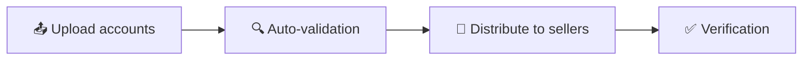
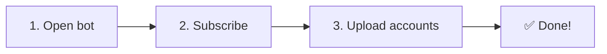

# AutoPilot KYC Subscription

A bot for automated KYC on **Bybit** and **MEXC** — upload accounts → automatic validation → distribution to sellers → verification.

---

## Two Operating Models

| | Global Network | Custom Team |
|-|---------------|-------------|
| Sellers | 40+ countries, auto-assignment | Your workers, your pricing |
| Pricing | Competition between local sellers | You set the price |
| Payouts | Automatic on-chain | Automatic on-chain |
| Control | Ratings, deadlines, auto-reassignment | Full team control |

---

## Platform Features

### Security
- 🔁 **Auto-refund** on country mismatch
- 🔄 **Resubmit** on proxy failure (reKYC)
- 🔀 **Port rotation** for blocked proxies
- ⏰ **Deadlines** — auto-reassignment on timeout

### Additional
- 💳 Payment system with **USDT** balance
- ⭐ Seller ratings with tiers (Gold / Silver / Bronze)
- 📊 Analytics: expenses, activity graphs, success rate
- 🔍 Filters by country, exchange, bulk orders
- 🌍 Localization — EN / RU / UA
- 💬 Built-in anonymous chat with sellers

---

## Mini-App: Web Interface in Telegram

Full-featured dashboard right inside Telegram — manage orders, track tasks, and communicate with sellers.

| Tab | Description |
|-----|-------------|
| 📦 **Orders** | Order management — country, status, progress |
| 📋 **Tasks** | Tasks by seller, country, exchange |
| 📜 **History** | Full operation history with filters |
| 📊 **Analytics** | Balance, expenses, activity graphs, success rate |
| 👥 **Sellers** | Worker and global seller management |
| 🌍 **Globe** | Interactive map with regional pricing |
| 💬 **Chat** | Built-in messaging with sellers |

---

## Plans

### 🆓 Free Version

| | |
|-|-|
| Orders | Via @buykyc_bot only |
| Pricing | Higher tier |
| Team | No custom workers |
| Mini-App | Limited |
| Settings | Basic |

### 💎 Premium — $30/mo

| | |
|-|-|
| Orders | Direct in bot, unlimited |
| Pricing | **Wholesale** — local seller competition |
| Team | **Custom team** of workers with your pricing |
| Mini-App | **Full access** — all tabs and features |
| Settings | **Advanced** — deadlines, rotations, filters |
| Balance | **Unified balance** with automatic payouts |

> 💡 **Already subscribed to MEXC AutoPilot or Bybit AutoPilot?** KYC bot access is included for free!

---

## Video Demo

- 🎬 [Full access — demo](https://www.youtube.com/watch?v=YaL-BWzIxtM)
- 🎬 [Free version — demo](https://youtu.be/6zhf3ytgfkE)

---

## Getting Started

1. Open [@AutoPilotKYC_bot](https://t.me/AutoPilotKYC_bot)
2. Subscribe via [@buykyc_bot](https://t.me/buykyc_bot?start=autopilot_global)
3. Upload accounts → confirm → done!

> 📖 [Full Pilot Guide](/docs/en/pilot-faq/) | 📖 [Upload FAQ](/docs/en/nvs-faq/) | 📜 [Terms of Service](/docs/en/autopilot-kyc-tos/)
