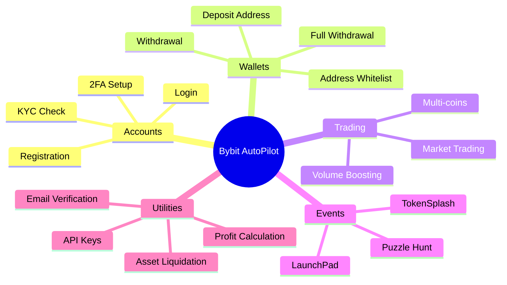
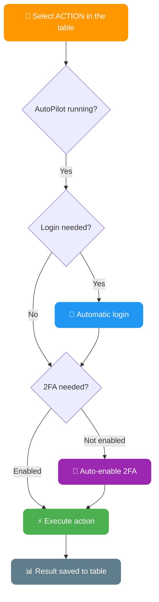
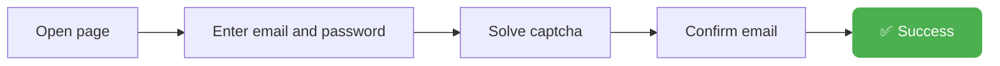
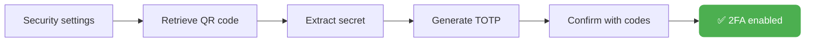
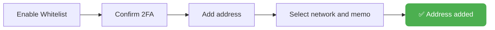
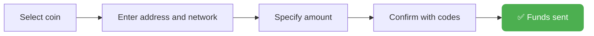
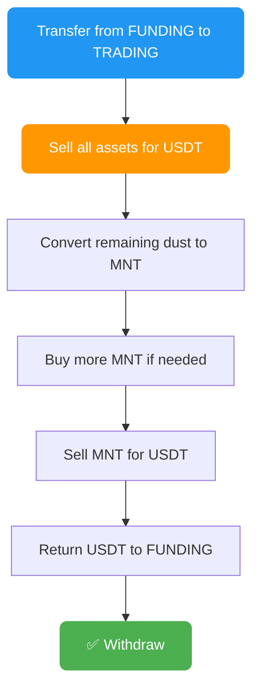
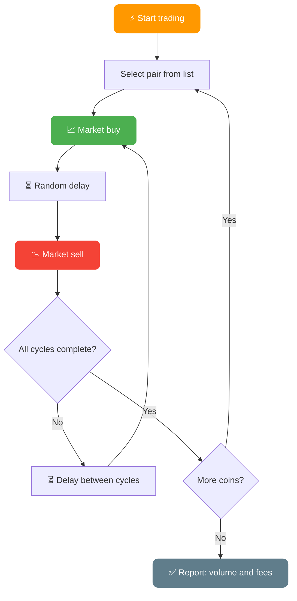
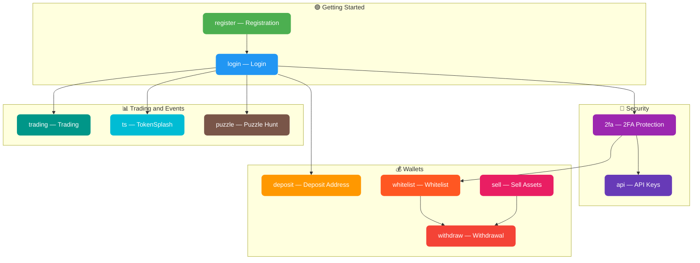

# AutoPilot Software — Maximum Automation on Bybit

**Supports AdsPower & Dolphin & Vision**
**Windows / MacOS / Linux**

---

## Forget about manual work: the solution is here

Bybit is one of the world's leading cryptocurrency exchanges with earning opportunities through Airdrops, TokenSplash events, and special promotions.

Managing accounts manually requires a lot of time, effort, and carries the risk of errors. AutoPilot Software turns routine tasks into an automated process. Integration with AdsPower, Dolphin, and Vision ensures digital fingerprint protection and secure multi-account management.

---

## How AutoPilot Works

---

## Key Advantages

**Time savings:**
Automation allows you to manage hundreds of accounts simultaneously

**Ease of use:**
Go about your day while AutoPilot automates actions in the background

**Integration with AdsPower / Dolphin / Vision:**
Safe and anonymous account usage. AutoPilot automatically launches and integrates into the anti-detect browser session with unique fingerprints

**Parallel automation:**
Automate many accounts at the same time

**Convenient account tracking table:**
Keep track of all accounts in a single Excel table. You can add new columns, rearrange the order — just don't rename the columns from the template

**Speed modes:**
- **FAST** — maximum speed with minimal delays
- **MEDIUM** — moderate speed, human behavior simulation, Smart Cursor, Human Typing
- **SLOW** — slow speed, full human behavior simulation

**Multi-functionality:**
Configure any actions for each account. For example, AutoPilot can retrieve deposit addresses for some accounts while withdrawing funds from others

**Automatic action chains:**
Choose any action — AutoPilot will automatically log in if a login is required. It will also enable 2FA protection automatically if it hasn't been set up yet

**Auto-generated passwords:**
During registration, AutoPilot will generate a strong password if none is provided

**Full asset liquidation:**
Complete withdrawal with automatic conversion of all assets to USDT

**Logging:**
Full result logging in `logs/` and automatic table backups in `backup/`

---

## Bybit AutoPilot Features

AutoPilot supports a wide range of automated actions for Bybit:

- **Registration** of accounts on Bybit: standard method, via referral link
- **Login**: signing into an account, checking verification and balance
- **KYC Check**: verification level check displaying country, name, and document
- **2FA Management**: setting up two-factor authentication
- **Retrieving deposit addresses** for each account
- **Adding addresses to the whitelist** with support for various networks
- **Withdrawing funds** from an account, including full withdrawal with conversion of all assets
- **Obtaining API keys** for trading
- **Automated trading**: trading and volume boosting on specified pairs
- **Selling all assets**: converting all coins to USDT with market orders
- **TokenSplash**: automatic participation in events with deposit task completion
- **Puzzle Hunt**: automatic completion of puzzle tasks
- Automatic captcha solving, email verification code retrieval, and more

---

## Full List of Actions (ACTION)

### General Action Workflow

> All actions except registration will automatically log in if needed. The whitelist and withdraw actions will automatically enable 2FA if it is not set up.

---

### `register` — Account Registration on Bybit

Account registration with automatic captcha solving and email confirmation

| Parameter | Column | Description |
|-----------|--------|-------------|
| **Required** | `[EMAIL] mail_provider` | Email service (yahoo, rambler, icloud, outlook, gmail...) |
| **Required** | `[PROFILE] mail` | Email address |
| **Required** | `[EMAIL] mail_password` | Email password / IMAP password |
| Optional | `[PROFILE] bybit_password` | Account password (AutoPilot generates one if empty) |
| Optional | `[REG] referral_code` | Referral code |
| **Updates** | `[REG] is_registered` | Registration status (1 — registered) |
| **Updates** | `[RESULT] status` | `[REGISTER] SUCCESS` or error description |

> To start registration, you only need to fill in 4 columns: profile_id, mail_provider, mail, mail_password

---

### `login` — Account Login

Sign into an account, check verification and balance

| Parameter | Column | Description |
|-----------|--------|-------------|
| **Required** | `[REG] is_registered` | 1 (registered) |
| **Required** | `[PROFILE] mail` | Email address |
| **Required** | `[PROFILE] bybit_password` | Account password |
| Optional | `[2FA] totp_secret_code` | 2FA secret code |
| **Updates** | `[KYC] kyc_status` | Verification level |
| **Updates** | `[BALANCE] account_balance` | Account balance in USDT |
| **Updates** | `[RESULT] status` | `[LOGIN] SUCCESS` |

---

### `2fa` — Enable 2FA

Automatic setup of Google Authenticator on the account

| Parameter | Column | Description |
|-----------|--------|-------------|
| **Updates** | `[2FA] totp_secret_code` | 2FA secret code (saved automatically) |
| **Updates** | `[RESULT] status` | `[2FA] SUCCESS` |

---

### `deposit` — Get Deposit Address

Retrieve the deposit address for funding the account

| Parameter | Column | Description |
|-----------|--------|-------------|
| **Required** | `[DEPOSIT] deposit_coin` | Coin for deposit (e.g.: `USDT`) |
| **Required** | `[DEPOSIT] deposit_chain` | Network (e.g.: `TRC20`, `Aptos`, `Mantle`) |
| **Updates** | `[DEPOSIT] deposit_address` | Deposit address |
| **Updates** | `[RESULT] status` | `[DEPOSIT] SUCCESS` |

---

### `whitelist` — Add Address to Whitelist

Enable whitelist mode and add a withdrawal address

| Parameter | Column | Description |
|-----------|--------|-------------|
| **Required** | `[WHITELIST] whitelist_address` | Wallet address |
| **Required** | `[WHITELIST] whitelist_chain` | Network (e.g.: `TRC20`, `Aptos`, `Mantle`) |
| Optional | `[WHITELIST] whitelist_memo` | Memo/Tag (if required by the network) |
| **Updates** | `[WHITELIST] whitelist_status` | 1 — successfully added |
| **Updates** | `[RESULT] status` | `[WHITELIST] SUCCESS` |

> If 2FA is not enabled — AutoPilot will automatically set it up before adding to the whitelist

---

### `withdraw` — Withdraw Funds

Withdraw funds from the account with automatic confirmation

| Parameter | Column | Description |
|-----------|--------|-------------|
| **Required** | `[WITHDRAW] withdraw_coin` | Coin to withdraw (e.g.: `USDT`) |
| **Required** | `[WITHDRAW] withdraw_chain` | Withdrawal network (e.g.: `TRC20`, `Aptos`) |
| **Required** | `[WITHDRAW] withdraw_address` | Recipient wallet address |
| Optional | `[WITHDRAW] withdraw_memo` | Memo/Tag |
| Optional | `[WITHDRAW] withdraw_amount` | Amount in % (100 = all, 50 = half) |
| **Updates** | `[RESULT] status` | `[WITHDRAW] SUCCESS` |

> If 2FA is not enabled — AutoPilot will automatically set it up before withdrawal

---

### Full Withdrawal Algorithm (`full_withdraw=YES`)

If `full_withdraw=YES` is enabled in the config, AutoPilot will perform a complete sale of all assets before withdrawal:

---

### `sell` — Sell All Assets

Convert all coins on the account to USDT with market orders

| Parameter | Column | Description |
|-----------|--------|-------------|
| **Updates** | `[BALANCE] account_balance` | Balance after selling |
| **Updates** | `[RESULT] status` | `[SELL] SUCCESS` |

---

### `api` — Get API Keys

Create an API key with permissions for SPOT and Futures trading

| Parameter | Column | Description |
|-----------|--------|-------------|
| Optional | `[API] api_whitelist_ip` | IP for whitelist (optional) |
| **Updates** | `[API] api_key` | Obtained API key |
| **Updates** | `[API] api_secret` | API secret key |
| **Updates** | `[RESULT] status` | `[API] SUCCESS` |

---

### `trading` — Automated Trading

Trading and volume boosting with market orders, supporting multiple coins

| Parameter | Column | Description |
|-----------|--------|-------------|
| **Required** | `[TRADING] trading_coin` | Asset to trade (e.g.: `BTC` or `BTC,ETH,SOL`) |
| **Required** | `[TRADING] trading_amount` | Order size in USDT (e.g.: `10` or `10,20,5`) |
| **Required** | `[TRADING] trading_cycles` | Number of buy-sell cycles (e.g.: `3` or `3,5,2`) |
| **Updates** | `[RESULT] status` | `[TRADING] VOLUME: volume, FEES: fees` |

> **Multi-coins**: specify multiple coins, sizes, and cycles separated by commas — AutoPilot will trade them sequentially.
> Example: `BTC,ETH` + `10,20` + `3,5` = 3 cycles of BTC at 10 USDT, then 5 cycles of ETH at 20 USDT

> **Volume formula**: cycles x order size x 2 (buy + sell)
> Example: 3 cycles at 10 USDT = 3 x 10 x 2 = **60 USDT** volume

---

### `ts` — TokenSplash

Automatic participation in TokenSplash events on Bybit

| Parameter | Column | Description |
|-----------|--------|-------------|
| **Required** | `[TS] code` | TokenSplash event code |
| **Updates** | `[RESULT] status` | `[TS] SUCCESS` |

> If the account balance is > 100 USDT — AutoPilot will automatically complete the deposit task

---

### `puzzle` — Puzzle Hunt

Automatic completion of Puzzle Hunt tasks on Bybit

| Parameter | Column | Description |
|-----------|--------|-------------|
| **Updates** | `[RESULT] status` | `[PUZZLE] SUCCESS` |

---

## Action Summary Table

| Action | Description | Auto-login | Auto-2FA |
|--------|-------------|:----------:|:--------:|
| `register` | Account registration | — | — |
| `login` | Sign into account | — | — |
| `2fa` | Enable 2FA | ✅ | — |
| `deposit` | Deposit address | ✅ | — |
| `whitelist` | Add to whitelist | ✅ | ✅ |
| `withdraw` | Withdraw funds | ✅ | ✅ |
| `sell` | Sell all assets | ✅ | — |
| `api` | Create API keys | ✅ | — |
| `trading` | Market trading | ✅ | — |
| `ts` | TokenSplash events | ✅ | — |
| `puzzle` | Puzzle Hunt | ✅ | — |

---

## Configuration Setup

The `BybitAutoPilot.config` file contains the main settings:

| Parameter | Description | Example |
|-----------|-------------|---------|
| `activation_key` | Activation key | `XXXX-XXXX-XXXX` |
| `speed_mode` | Speed mode | `FAST`, `MEDIUM`, `SLOW` |
| `captcha_key` | Captcha service API key | `abc123...` |
| `captcha_provider` | Captcha provider | `2captcha`, `capmonster` |
| `parallel_limit` | Parallel account limit | `3` |
| `shuffle_order` | Shuffle account order | `YES` / `NO` |
| `window_size` | Browser window size | `1280x720` |
| `close_tabs` | Close tabs after completion | `YES` / `NO` |
| `close_after` | Close profile after completion | `YES` / `NO` |
| `email_delay_check` | Email check delay (sec) | `5` |
| `language` | Interface language | `EN`, `RU` |
| `full_withdraw` | Full asset sale before withdrawal | `YES` / `NO` |
| `show_credentials` | Show KYC data | `YES` / `NO` |
| `bot_mode` | Telegram bot integration | `YES` / `NO` |

---

## KYC Statuses

During login, AutoPilot checks the verification status:

| Status | Description |
|--------|-------------|
| `UNSUBMITTED` | Verification not submitted |
| `REJECT` | Rejected (reason is specified) |
| `1 [COUNTRY]` | Verified (e.g.: `1 RU`) |

If `show_credentials=YES`, the following are also recorded: first name, last name, document type, document number.

---

## Email Setup (IMAP)

AutoPilot uses the IMAP protocol to retrieve verification codes from email.

**Supported providers:** Yahoo, Rambler, iCloud, Outlook, Gmail, Mail.ru, First Mail, and others

> For Gmail, Outlook, Yahoo, and iCloud, you need to create an **App Password** — a regular password won't work for IMAP. Alternatively, set up email forwarding to a mailbox with direct IMAP access.

---

## Quick Start After Purchase

1. **Download** `AutoPilot.zip` from the pinned message in the [@buykyc_bot](https://t.me/buykyc_bot) chat
2. **Extract** the archive into a new folder
3. **Configure** `BybitAutoPilot.config`:
   - Set the `activation_key` (received upon purchase)
   - Set the `captcha_key` (from [2captcha](https://2captcha.com/auth/register), [ruCaptcha](https://rucaptcha.com/auth/register), or [Capmonster](https://capmonster.cloud/Account/Signup))
4. **Fill in** `AutoPilot_table.xlsx` with account data
5. **Launch** the application

> Management is also available via the [@AutoPilotManager_bot](https://t.me/AutoPilotManager_bot) bot (requires `bot_mode=YES` in the config)

---

## Purchase

Immediately after purchase, you receive a ready-to-use build.

Buy an activation key for Bybit AutoPilot: [https://t.me/buykyc_bot](https://t.me/buykyc_bot)

Along with the key, you get access to the AutoPilot community chat where you can ask questions, discuss, and get tips.

The key lifetime starts counting from the first launch.

---

**Manager:** [@OxViktor](https://t.me/OxViktor)
**Developer:** [@axelenvy](https://t.me/axelenvy)
