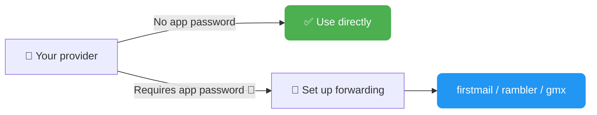
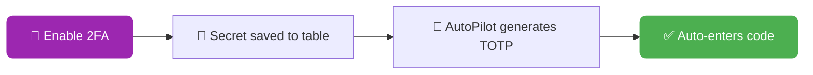
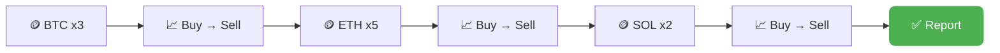
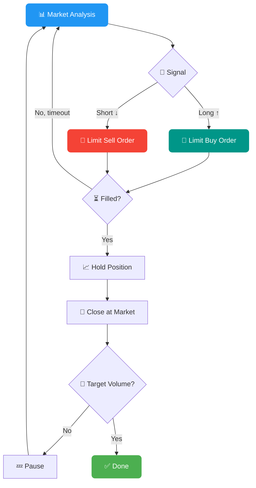
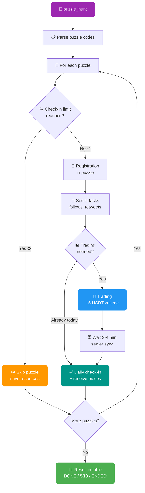
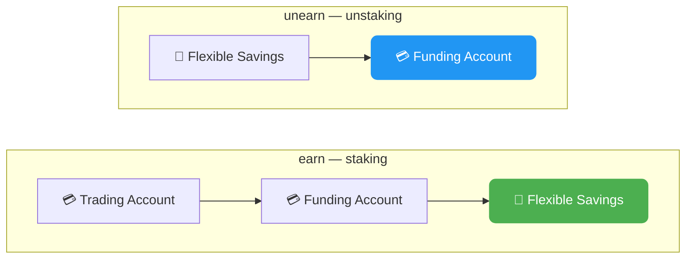
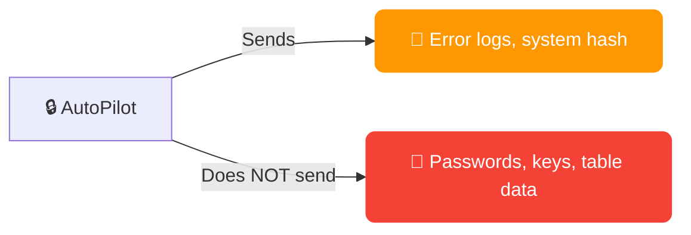

# 📋 FAQ — AutoPilot

**Contents:**

1. [📧 Mail Providers](#1--mail-providers)
2. [🔐 2FA: How It Works](#2--2fa-how-it-works)
3. [🏎️ Speed Modes (speed_mode)](#3-️-speed-modes-speed_mode)
4. [🧩 Proxy and Captcha](#4--proxy-and-captcha)
5. [📊 AutoPilot_table.xlsx](#5--autopilot_tablexlsx)
6. [📈 Trading: Details](#6--trading-details)
   - [6.1 🤖 Smart Futures Trading (futures_smart)](#61--smart-futures-trading-futures_smart)
   - [6.2 🧩 Puzzle Hunt (puzzle_hunt)](#62--puzzle-hunt-puzzle_hunt)
   - [6.3 💰 Bybit Earn — USDT Staking (earn / unearn)](#63--bybit-earn--usdt-staking-earn--unearn)
   - [6.4 🛒 Trading Variants (buy, limit, futures)](#64--trading-variants-buy-limit-futures)
   - [6.5 🎁 Rewards & Events (claim, lp, learn, ref_code)](#65--rewards--events-claim-lp-learn-ref_code-link-profit)
7. [💸 Withdrawal (withdraw)](#7--withdrawal-withdraw)
8. [🌐 AdsPower / Dolphin / Vision / Afina](#8--adspower--dolphin--vision--afina)
9. [🖥️ Screen Size](#9-️-screen-size)
10. [⚙️ Configuration: Key Parameters](#10-️-configuration-key-parameters)
11. [🔒 Security and Privacy](#11--security-and-privacy)
12. [🔄 Updates](#12--updates)
13. [⏰ License Duration](#13--license-duration)
14. [🚨 Common Errors and Solutions](#14--common-errors-and-solutions)
15. [💬 Contact Developer](#15--contact-developer)
16. [🍎 Launching on macOS](#16--launching-on-macos)

---

### 1. 📧 Mail Providers

**Available providers** (column `[EMAIL] mail_provider` / `[EMAIL] forwarding_mail_provider`):

| Provider | IMAP App Password | Notes |
|----------|:-:|-------|
| notletters | — | Recommended ✅ |
| firstmail | — | Recommended ✅ (also for forwarding) |
| rambler | — | Recommended ✅ (also for forwarding) |
| gazeta | — | |
| onet | — | |
| gmx.com / gmx.net | — | |
| nic.ru | — | |
| yahoo | Required 🔑 | App Password in security settings |
| gmail | Required 🔑 | App Password (requires 2FA on Google account) |
| outlook | Required 🔑 | App Password in Microsoft settings |
| mailru | Required 🔑 | App password in security settings |
| yandex | Required 🔑 | App password in settings |
| icloud | Required 🔑 | App-Specific Password at appleid.apple.com |
| inbox.eu | Required 🔑 | |
| proton | Required 🔑 | Proton Mail Bridge (paid subscription) |



**🔀 Forwarding** — if your provider requires an app password, set up email forwarding to firstmail/rambler/gmx and fill in the columns:
- `[EMAIL] mail_forwarding_provider` — forwarding provider
- `[EMAIL] forwarding_mail` — forwarding email address
- `[EMAIL] forwarding_mail_password` — forwarding email password

> ⚠️ **Important:** after setting up forwarding, send a test email to make sure messages arrive. Some providers activate forwarding with a delay of up to 24 hours.

> 🛡️ **Antivirus:** if you have issues connecting to mail — check if your antivirus is blocking IMAP ports (993, 143).

> 💬 **Your provider not listed?** Contact the developer — it will be added.

---

### 2. 🔐 2FA: How It Works



- When enabling 2FA, the software saves the secret key to the `[2FA] totp_secret_code` column
- This key can be imported into any authenticator app: Google Authenticator, Authy, 1Password, etc.
- AutoPilot automatically generates and enters TOTP codes when needed
- To manually generate a code from the secret key: [totp.danhersam.com](https://totp.danhersam.com/)

> 💾 **Backup:** `totp_secret_code` is additionally saved to profile logs (`/logs` folder) — even if you accidentally clear the table, the secret key can always be found in the logs.

> ⚡ **Auto-setup:** actions `whitelist` and `withdraw` will automatically enable 2FA if it's not set up yet. No need to run `2fa` separately.

> ⏰ **2FA codes not working?** TOTP codes depend on your computer's exact time. If the exchange rejects a code — sync your clock: **Windows:** Settings → Time & Language → Date & time → Sync now. **macOS:** System Settings → General → Date & Time → Set time and date automatically.

> 🌐 **Bybit: 2FA issues?** If the email code doesn't arrive when setting up Google Authenticator — set `bybitglobal` in the `[BYBIT] domain` column of your table. In some regions, `bybitglobal.com` is more reliable. See [Bybit AutoPilot → Bybit Global Domains](/docs/en/bybit-autopilot/#-bybit-global-domains) for details.

---

### 3. 🏎️ Speed Modes (speed_mode)

| Mode | Cursor | Text Input | When to Use |
|------|--------|------------|-------------|
| **⚡ FAST** | Instant movement | Fast input without errors | Bulk operations where speed matters |
| **🚗 MEDIUM** | Smooth movements, medium speed | Human-like input with minimal errors | Balance between speed and naturalness |
| **🐢 SLOW** | Slow movements with random trajectory | Input with typos and corrections | Maximum human imitation |

**🖱️ Smart Cursor** (MEDIUM/SLOW): simulates human mouse movements with random trajectory, accelerations and decelerations.

**⌨️ Human Typing** (MEDIUM/SLOW): random delays between characters, random typos with auto-correction — like a real person.

> 💡 **Recommendation:** FAST is sufficient for registration and login. For trading and actions on pages with anti-bot protection — use MEDIUM.

---

### 4. 🧩 Proxy and Captcha

**Column `[PROXY] proxy`** — profile proxy in format `ip:port:user:password`

> ✅ **No need to fill in** — AutoPilot automatically takes the proxy from your AdsPower / Dolphin / Vision / Afina profile on the fly. The proxy is passed to the captcha solving service so the captcha is solved from the profile's IP. Everything happens automatically.

#### 🧩 Supported Captcha Providers

AutoPilot supports **4 captcha-solving providers**. Set via `captcha_provider` in the config:

| Provider | `captcha_provider` | Type | Website |
|----------|:---:|------|---------|
| **CapSolver** ⭐ | `capsolver` | Token (GeeTest v4) | [capsolver.com](https://www.capsolver.com/) |
| **CapMonster** | `capmonster` | Token (GeeTest v4) | [capmonster.cloud](https://capmonster.cloud/) |
| **2Captcha** | `2captcha` | Token (GeeTest v4) | [2captcha.com](https://2captcha.com/) |
| **CapGuru** | `capguru` | Visual (slider drag) | [cap.guru](https://cap.guru/) |

> ⭐ **Recommended: CapSolver** — the most stable and fastest across all exchanges (Bybit, MEXC, Bitget). Token-based GeeTest v4 solving, API-first approach, new captcha types supported immediately after release.

> 🖼️ **CapGuru** — only works with **visual captcha** (slider dragging). Does not support token-based GeeTest v4. Used as a fallback where token-based solving doesn't work.

**Example configuration:**

```
captcha_key=CAP-YOUR_KEY_HERE
```

> 💡 **Auto-detection:** AutoPilot automatically detects the captcha provider from the key format. A key starting with `CAP-` means CapSolver. You don't need to set `captcha_provider` — just paste the key into `captcha_key`, and AutoPilot will figure out which service it is.

#### 🔑 How to Set Up CapSolver (Step by Step)

1. Register at [capsolver.com](https://www.capsolver.com/)
2. Go to **Billing → Top Up** and add at least **$10** via crypto
3. Copy your **API Key** from the dashboard (Overview → API Key)
4. Paste the key into `AutoPilot.config`:
   ```
   captcha_key=CAP-your_key
   ```
5. Done — AutoPilot will automatically detect that it's CapSolver

> ⚠️ **Do NOT buy packages on the Market page!** Those are subscriptions for specific captcha types (reCAPTCHA v2 50K for $36, reCAPTCHA v3, etc.) — **AutoPilot doesn't use them**. AutoPilot works with GeeTest v4 (token-based), which only requires **account balance**, not a package subscription. Top up $10 via Billing → Top Up — and everything will work.

> 💰 **Cost:** ~$1 per 1000 GeeTest solves. A $10 top-up lasts a long time.

> 🔧 **Captcha errors:** if captcha keeps failing — verify the `captcha_key` in config and the account balance on the provider's website. If the issue is specific to one exchange — try switching the solving type — from token-based to visual (e.g., `capsolver` → `capguru`).

---

### 5. 📊 AutoPilot_table.xlsx


**Basic rules:**
- 🚫 Do not rename column headers from the template
- ↔️ Column order can be changed
- ➕ You can add your own columns (AutoPilot ignores them)
- ⏳ Do not delete rows while the software is running — wait for completion

**🚀 Minimum set to start (registration):**
1. `[PROFILE] profile_id` — Profile ID from AdsPower/Dolphin
2. `[EMAIL] mail_provider` — mail service
3. `[PROFILE] mail` — email address
4. `[EMAIL] mail_password` — email password

> 💡 **Tip:** only fill the `ACTION` column for profiles you want to automate. Empty ACTION = profile will be skipped.

> 🔑 **Passwords:** if `password` is not filled — AutoPilot will generate a strong password automatically (8-30 chars, uppercase + lowercase + digits + special characters) and write it to the table.

> 📁 **Is Excel fully closed?** The table must be completely closed while AutoPilot is running:
> - Clicking ✕ in Excel is **often not enough** — Windows keeps `EXCEL.EXE` running in the background (due to OneDrive sync, AutoSave, multiple windows). Check Task Manager (`Ctrl+Shift+Esc` → Processes tab → find `EXCEL.EXE` → End task)
> - Quick alternative — via command line: `taskkill /IM EXCEL.EXE /F`
> - If `EXCEL.EXE` is lingering in the background, AutoPilot reads stale data or can't open the file at all. Classic symptom: "table data doesn't refresh in console, only a PC reboot helps"

> ☁️ **AutoPilot must be in a local folder**, not OneDrive / Dropbox / iCloud Drive / Google Drive / any other cloud sync. Cloud-sync keeps `AutoPilot_table.xlsx` open in the background for syncing and blocks AutoPilot from reading/writing.
>
> **Where to put it:**
> - `C:\AutoPilot\` or `D:\AutoPilot\` — any local drive
> - Or most conveniently — on the desktop: `\Desktop\AutoPilot\` (on Windows 11, make sure Desktop isn't synced by OneDrive — OneDrive tray icon → Settings → Backup → disable Desktop)

---

### 6. 📈 Trading: Details



**🪙 Multi-coin:** specify coins, amounts and cycles separated by commas:
- `[TRADING] trading_coin` = `BTC,ETH,SOL`
- `[TRADING] trading_amount` = `10,20,5`
- `[TRADING] trading_cycles` = `3,5,2`
- Result: 3 cycles of BTC at $10, then 5 cycles of ETH at $20, then 2 cycles of SOL at $5

**🧮 Volume formula:** `cycles x amount x 2` (buy + sell)

**📐 Dynamic order size:** if balance is less than `trading_amount` — the software automatically reduces order size to available balance.

**⏱️ Delay between cycles:** configured in settings `market_trading_delay=5,15` (random delay from 5 to 15 seconds).

> 💵 **Minimum order:** make sure there's enough USDT for the minimum order on the exchange (usually ~5 USDT).

---

### 6.1 🤖 Smart Futures Trading (futures_smart)

ACTION: `futures_smart` — automated futures trading with market analysis, post-only limit orders and position management.



**💰 Fees:** post-only limit orders = 0.02% (maker), market close = 0.055% (taker). Total ~0.075% per cycle — **32% cheaper** than market orders (0.11%).

**📊 Table columns:**

| Column | Description | Example |
|--------|-------------|---------|
| `[TRADING] trading_coin` | Futures coin | `BTC` |
| `[TRADING] trading_amount` | Position size per iteration (with leverage) in USDT | `1000` |
| `[TRADING] trading_cycles` | Number of trading cycles | `15` |

> 🔑 **Important:** `trading_amount` is the position size **including leverage**, not the actual balance used. Real balance per trade = `trading_amount / leverage`.

**📐 Formula:**
- **Real balance per trade** = `trading_amount ÷ leverage`
- **Volume per cycle** = `trading_amount × 2` (open + close)
- **Target volume** = `trading_amount × cycles × 2`

**Example:** `trading_amount=1000`, `leverage=10`, `cycles=15`
- Real balance per trade: 1000 ÷ 10 = **100 USDT**
- Volume per cycle: 1000 × 2 = **2,000 USDT**
- Target volume: 1000 × 15 × 2 = **30,000 USDT**

**⚙️ Config parameters:**

| Parameter | Description | Default |
|-----------|-------------|:-------:|
| `leverage` | 📊 Leverage | `10` |
| `limit_futures_position_hold_interval` | ⏳ Position hold time, sec (min,max) | `50,240` |
| `limit_futures_iteration_wait_interval` | 💤 Pause between cycles, sec (min,max) | `60,180` |
| `limit_futures_order_timeout` | ⏱️ Max wait for limit order fill, sec | `30` |
| `limit_futures_order_check_interval` | 🔍 Order execution check interval, sec | `5` |
| `limit_futures_price_offset_ticks` | 📐 Offset in ticks from best bid/ask | `2` |
| `limit_futures_direction_algorithm` | 🧠 Direction detection algorithm | `inverse_simple` |
| `limit_futures_order_deviation` | 🎲 Random position size deviation, % (0 = off) | `0` |

**🧠 Direction algorithms:**
- `simple` — follows the trend: analysis of last 5 candles + price vs MA5 (rising → Long, falling → Short)
- `inverse_simple` — counter-trend: inverts the simple signal (rising → Short, falling → Long)
- `advanced` — complex analysis: EMA 8/21 crossover + RSI 14 + Volume Spike (1.7x above average) + Funding Rate

> ⚠️ **Risks:** leveraged futures trading carries liquidation risk. Use moderate leverage and small amounts for volume generation.

> 💡 **Tip:** if an order isn't filled within `limit_futures_order_timeout` — the signal is recalculated. Increase `limit_futures_price_offset_ticks` for faster fills (but at a less favorable price).

---

### 6.2 🧩 Puzzle Hunt (puzzle_hunt)

ACTION: `puzzle_hunt` — automatic registration, task completion and management of Bybit puzzles.



**✨ Features:**
- 📱 Automatic puzzle registration and management
- 📱 Instant execution and claiming of social tasks via direct requests
- 📱 Automatic daily trading tasks and check-ins
- 📱 Specify multiple puzzles at once — the system handles everything
- 📱 Won't waste trading attempts if daily check-in is already closed
- 📱 Tracks key data: days completed / total, plus puzzle completion status

**📊 Table column:**

| Column | Description | Example |
|--------|-------------|---------|
| `[PUZZLE] event_code` | Puzzle code (or multiple, comma-separated) | `0768558741987` |

> 📌 **Column type:** make the `[PUZZLE] event_code` column **text** (not numeric), otherwise Excel may truncate long codes.

**🔗 Where to get the puzzle code:**

The code is in the puzzle link — the `activityCode` parameter:
```
https://www.bybit.com/en/trade/spot/puzzle-hunt/detail?activityCode=0768558741987
                                                                      ^^^^^^^^^^^^^ — this is the code
```

**📋 Managing multiple puzzles:**

To complete multiple puzzles at once — enter codes separated by commas:
```
8675373977840,0768558741987,1234567890123
```
The system processes each puzzle sequentially: social tasks → trading (batched) → check-ins.

**⚙️ How it works internally:**

1. **Limit check** — before any work, checks if the daily check-in is available. If limit is reached — the entire puzzle is skipped (trading isn't wasted)
2. **Registration** — automatic participant registration in the puzzle
3. **Social tasks** — completes all social tasks (follows, retweets) via direct API requests + claims rewards (puzzle pieces)
4. **Trading** — if not traded today: buy + sell a coin from the puzzle list (~5 USDT volume). If already traded — skips
5. **Wait** — 3-4 minute pause for Bybit's server to register the trading volume
6. **Check-in** — daily mark + receive puzzle pieces

**📈 Table statuses:**

| Status | Meaning |
|--------|---------|
| `DONE` | ✅ Puzzle fully completed (all days passed) |
| `5/10` | 🔄 Progress: 5 of 10 days completed |
| `ENDED` | ⏰ Puzzle expired (activity ended on Bybit) |
| `FAIL` | ❌ Error (details in logs) |

With multiple puzzles, status is combined: `[CODE1] DONE, [CODE2] 3/10`

> 💡 **Tip:** run `puzzle_hunt` daily — the software will determine what's already done and only perform the missing steps.

> ⚡ **puzzle_social:** to only complete social tasks without trading — use ACTION `puzzle_social`.

---

### 6.3 💰 Bybit Earn — USDT Staking (earn / unearn)

ACTION: `earn` — send USDT to the Flexible Savings pool (automatic staking).
ACTION: `unearn` (or `unstake`) — withdraw USDT from the pool back to Funding account.



**⚙️ How it works:**

**`earn` (staking):**
1. KYC verification and Bybit authorization
2. Transfer all USDT from Trading to Funding account (`transferAllToFunding`)
3. Get available USDT balance on Funding account
4. Send to Flexible Savings pool: preview → pay-order → confirm-order
5. Table status: `[STAKE] SUCCESS - stake 150.25`

**`unearn` (unstaking):**
1. KYC verification and Bybit authorization
2. Get current Flexible Savings balance
3. Withdraw from pool to Funding account: preview → pay-order → confirm-order
4. Table status: `[STAKE] SUCCESS - unstake 150.25`

**📊 Table columns:**

| Column | Description | Example |
|--------|-------------|---------|
| `[WITHDRAW] withdraw_amount` | Fixed USDT amount (optional) | `100` |

> 💡 **Default:** if `withdraw_amount` is not filled — `earn` will send **all** available USDT to the pool, and `unearn` will withdraw **everything** from the pool.

> 📌 **Fixed amount:** enter a number in `withdraw_amount` to stake/withdraw a specific amount. If the requested amount exceeds available balance — the entire available balance will be used.

> 🏦 **Flexible Savings:** this is flexible staking — funds can be withdrawn at any time, interest accrues daily. Withdrawal is instant.

> ⚡ **Auto-transfer:** with `earn`, funds are automatically transferred from Trading to Funding before staking — no manual action needed.

> 🔄 **Aliases:** `stake` = `earn`, `unstake` = `unearn` — identical actions, use whichever you prefer.

---

### 6.4 🛒 Trading Variants (buy, limit, futures)

AutoPilot offers several trading actions for different scenarios:

| Action | Type | Description |
|--------|------|-------------|
| `trading` | Market | Buy-sell cycles with market orders. Volume = `cycles × amount × 2` |
| `trading_limit` | Limit | Same as `trading`, but uses limit orders for better prices |
| `buy` | Market | One-time buy of a specific asset |
| `limit_buy` | Limit | One-time limit buy order |
| `limit` | Limit | Random limit trading for natural volume |
| `sell` | Market | Sell all assets for USDT |
| `limit_sell` | Limit | Sell on Funding account with limit orders |
| `futures` | Market | Leveraged futures with market orders |
| `futures_smart` | Limit | Smart futures with post-only orders (32% cheaper) |

> 💡 **When to use which:** `trading` for quick volume, `trading_limit` for better prices, `futures_smart` for cheapest fees. `buy` / `limit_buy` for one-off purchases.

> 📊 **Columns:** all trading actions use `[TRADING] trading_coin`, `[TRADING] trading_amount`. Cycle-based actions also use `[TRADING] trading_cycles`.

---

### 6.5 🎁 Rewards & Events (claim, lp, learn, ref_code, link, profit)

Quick-reference for actions that require **no extra columns** — just set the ACTION and run:

| Action | Description |
|--------|-------------|
| `lp` | Automatic registration in the current LaunchPad event |
| `claim` | Claim available coupons |
| `claim_batch` | Claim all coupons in batch |
| `claim_activity` | Claim activity rewards (bypasses face verification) |
| `learn` | Complete learning modules and set profile avatar |
| `ref_code` | Extract account referral code |
| `link` | Get SUMSUB KYC verification link |
| `profit` | Calculate profit: total withdrawals − total deposits + balance |

> 💡 **All automatic:** these actions need only `profile_id` and login credentials. No extra columns to fill.

> 🚀 **LaunchPad (`lp`):** fully automatic — finds the current active event and registers. Run periodically when new events appear.

---

### 7. 💸 Withdrawal (withdraw)


**Full withdrawal** (`full_withdraw=YES` in config):
- 🔄 Sell all assets for USDT at market
- 🧹 Convert dust and small leftovers
- 💳 Withdraw entire balance

**Partial withdrawal:** specify % in `withdraw_amount` column (100 = all, 50 = half)

**🌐 Network name:** enter exactly as shown on the exchange. Examples:
- Bybit: `APTOS`, `Arbitrum One`, `BSC (BEP20)`
- MEXC: `ERC20`, `TRC20`, `Aptos`
- Bitget: `BSC`, `Arbitrum One`

> ✅ **Whitelist + Withdraw:** if the withdrawal address matches the whitelisted address — code verification won't be required (fast withdrawal).

> 🏷️ **Memo/Tag:** if the network requires a memo (e.g., TON, ATOM) — fill in the `withdraw_memo` column. If not required — leave empty.

---

### 7.1. 🔑 Master Wallet System — Automatic Whitelists & Untraceable Withdrawals

Withdraw from hundreds of accounts **without manually entering a single address**. AutoPilot creates a unique wallet for each account, whitelists it automatically, and collects all funds to your master wallet — with **$0 fees** and **no traceable links** between accounts.


**What you get:**
- 🏷️ **Automatic whitelists** — no need to create addresses or fill them in the table. AutoPilot generates a unique address for each account and whitelists it on Bybit with full email/2FA confirmation
- 🕵️ **Untraceable withdrawals** — every account withdraws to its own unique address. No shared address = no way to link your accounts together
- 💰 **$0 withdrawal fees** — Bybit doesn't charge for Aptos withdrawals (vs $1-2 per account on ERC20/TRC20)
- 📥 **One-click collection** — after withdrawal, collect all funds from all addresses to your master wallet in seconds
- ⚡ **Instant transfers** — funds arrive in ~1 second

**How it works (3 actions):**

1. **`setup_aptos_hd`** — run once. Creates your master wallet and gives you a secret phrase (12 words). One phrase = unlimited unique addresses.

2. **`whitelist_aptos_hd`** — run on all profiles. AutoPilot will:
   - Create a unique Aptos address for each account
   - Open Bybit, add it to whitelist, confirm email/2FA — all automatically
   - Save everything to the table

3. **`withdraw`** — withdraws all USDT to the whitelisted address on each account. Fee = **$0**.

After withdrawal — open the **Distribute** tab and collect everything to one wallet with one click.

| Config Parameter | Description | Default |
|-----------|-------------|:-------:|
| `aptos_hd_enabled` | Enable Master Wallet system | `NO` |
| `aptos_hd_auto_assign` | Auto-assign address to new profiles | `YES` |
| `aptos_distribution_master_key` | Master wallet private key (hex) | — |
| `aptos_distribution_master_index` | Index of the master wallet | `0` |
| `aptos_distribution_amount` | USDT amount per distribution | `0.5` |

> 💡 **Example:** you have old Bybit accounts with leftover funds. Instead of manually creating addresses, entering them one by one, and collecting from each wallet — run 3 actions and everything lands on your master wallet. Zero manual work, zero fees, zero links between accounts.

> 🔁 **Safe to re-run:** if an account already has an address, `whitelist_aptos_hd` will reuse it — no duplicates.

---

### 8. 🌐 AdsPower / Dolphin / Vision / Afina

**AdsPower:**
- 📥 Install the latest SunBrowser: Settings → Local Settings
- 💳 Requires a **paid subscription** (minimum Base)
- 📤 Export profiles: Select → Export → Number, ID, Name
- 🔌 Default API port: `50325` (configurable in settings `adspower_port`)

**Dolphin:**
- Enable Profile ID: Gear icon → Customize columns → Profile ID

**Vision:**
- In config: `vision_config=folder_name,API_key`

**Afina:**
- In config: `afina_api_key=your_API_key` and `afina_port=50777` (default port)
- The API key is found in Afina settings

**🚨 Common errors:**

| Error | Solution |
|-------|----------|
| AdsPower connection error | Restart AdsPower, check port |
| Proxy is bad | Replace proxy in profile |
| Cache problems | Clear profile cache in AdsPower |
| Browser not opening | Check paid AdsPower subscription |
| Timeout loading page | Check proxy, change fingerprint |

> 🚀 **Optimization:** install Ublock/AdBlock in profiles to block ads — pages will load faster.

---

### 9. 🖥️ Screen Size

The software automatically sets the resolution to **1920x1080** on the page, even if the browser window is smaller (`window_size` setting in config).

This ensures all UI elements display correctly and the software doesn't miss buttons.

> 📐 The `window_size=1200,1000` parameter in config sets the browser window size, but the internal page resolution is always 1920x1080.

---

### 10. ⚙️ Configuration: Key Parameters

| Parameter | Description | Default |
|-----------|-------------|:-------:|
| `activation_key` | 🔑 Activation key | — |
| `captcha_key` | 🧩 Captcha provider key (see [section 4](#4--proxy-and-captcha)) | — |
| `speed_mode` | 🏎️ Operation speed | `FAST` |
| `parallel_limit` | 🔢 Parallel accounts limit | `NO` |
| `sleep_between_accounts` | 💤 Pause between accounts | `NO` |
| `delay_between_accounts` | ⏱️ Delay in seconds (min,max) | `60,120` |
| `shuffle_order` | 🔀 Random order | `YES` |
| `close_after` | 🚪 Close browser after | `NO` |
| `close_tabs` | 🗂️ Close all tabs | `YES` |
| `check_mail` | 📧 Check emails before start | `YES` |
| `full_withdraw` | 💸 Full withdrawal of all assets | `YES` |
| `email_delay_check` | ⏳ Email check interval | `30,300` |
| `market_trading_delay` | 📈 Delay between trading cycles | `5,15` |
| `disable_kyc_protection` | 🛡️ Allow 2FA without KYC | `NO` |
| `color_logs` | 🎨 Colored logs in console | `YES` |

> 🕵️ **Anti-detect:** enable `shuffle_order=YES` and `sleep_between_accounts=YES` with `parallel_limit=3-5` for natural behavior.

---

### 11. 🔒 Security and Privacy



**What the software sends:**
- 📝 Error logs (only error descriptions, no personal data) — when error threshold is exceeded, for debugging
- 🔗 System hash during key verification — to track abusers

**What the software does NOT send:**
- 🚫 Passwords, email addresses, 2FA secret keys
- 🚫 Data from AutoPilot_table.xlsx
- 🚫 Email content and verification codes
- 🚫 Proxy data and cookies

**🤝 Guarantees:** 2+ years market reputation, deposits at Taverna OTC and Crypton OTC, 120+ partners.

---

### 12. 🔄 Updates

**📥 Where to download AutoPilot:**

Current builds are published in **AutoPilot Chat** (Telegram) in separate topics per exchange:

| Chat topic | Exchange | Platforms |
|------------|----------|-----------|
| **Updates Bybit** | Bybit AutoPilot | Windows / macOS / Linux |
| **Updates MEXC** | MEXC AutoPilot | Windows / macOS / Linux |
| **Updates Bitget** | Bitget AutoPilot | Windows / macOS / Linux |

Open the relevant topic → download the latest build for your OS → extract the archive. For macOS, see [section 16: Launching on macOS](#16--launching-on-macos) — it describes the Gatekeeper quarantine removal process.

---

**🔄 In-app auto-update:**

AutoPilot checks for updates on every launch. If a new version is available:
1. Wait for the message: `"AutoPilot new version downloaded successfully!"`
2. Close the software
3. Extract the `AutoPilot.zip` archive to the current folder with replacement
4. Launch the updated version

> ♾️ **Lifetime:** all updates are free forever.

> ⛔ **Don't interrupt the download:** if you close the software during download — the archive may be corrupted. Wait for completion.

---

### 13. ⏰ License Duration

The countdown starts **from the first launch** of AutoPilot with that key. The expiration date is displayed in the console on every launch.

---

### 14. 🚨 Common Errors and Solutions

| Problem | Cause | Solution |
|---------|-------|----------|
| 📧 Code not arriving by email | IMAP blocked / app password | Check mail_password, set up forwarding |
| 🧩 Captcha not solving | No balance / wrong key | Top up captcha provider balance, check `captcha_key` (recommended: [CapSolver](#4--proxy-and-captcha)) |
| 🌐 Profile not opening | AdsPower not running / free plan | Launch AdsPower, check subscription |
| 📊 Table not readable | Excel is open | Close Excel before launching |
| 🔐 2FA code not working | Time desync | Sync your computer time (Settings → Time) |
| ⏱️ Timeout on page | Slow proxy | Replace proxy or increase timeout |
| ⏳ Registration hanging | Different captcha type | Update software — support for new captcha types |
| 🌐 Bybit: 2FA / email / captcha unstable | Regional domain version | Set `bybitglobal` in `[BYBIT] domain` column (see [Bybit → Global Domains](/docs/en/bybit-autopilot/#-bybit-global-domains)) |
| 🍎 Mac: file shown as "document" / `killed: 9` | Gatekeeper quarantine | See [section 16: Launching on macOS](#16--launching-on-macos) |

---

### 15. 💬 Contact Developer

**Before contacting:**
1. ✅ Make sure all table fields are filled correctly
2. 🔍 Check the chat — someone may have already solved this problem
3. 📖 Read the logs carefully — they contain the main error information

**When contacting, attach:**
- 📄 Profile log file from the `/logs` folder
- 📸 Screenshot or video of the issue (if possible)

---

### 16. 🍎 Launching on macOS

> 📥 **First, download the macOS build** from AutoPilot Chat (Telegram) — topic **Updates Bybit / MEXC / Bitget** depending on your exchange. See [section 12: Updates](#12--updates) for details.

On macOS, AutoPilot **won't launch with a double-click** from Finder — the system blocks unsigned binary files. Launch is only via the terminal, and only after removing the Gatekeeper quarantine.

**What you'll see:**
- The `AutoPilot` file appears as a "document" in Finder, not as a program
- Errors: `cannot be opened because the developer cannot be verified`, `killed: 9`, `Operation not permitted`

**Quick cheat sheet** (run in order in the terminal — we recommend [warp.dev](https://www.warp.dev/)):

```bash
cd ~/Downloads/AutoPilot            # your folder path
sudo xattr -r -c ./AutoPilot        # remove macOS quarantine
chmod +x ./AutoPilot                # make executable
./AutoPilot                         # launch
```

> 🍎 **Full guide** (troubleshooting for `killed: 9` / Gatekeeper errors, Apple Silicon vs Intel, what to do after updates, FAQ): **[Launching AutoPilot on macOS →](/docs/en/macos-launch/)**

> 💡 **After the first launch**, the `xattr` and `chmod` steps are no longer needed — subsequent launches only require `cd` into the folder and `./AutoPilot`. Repeat these steps after each update (the new binary comes with quarantine again).
