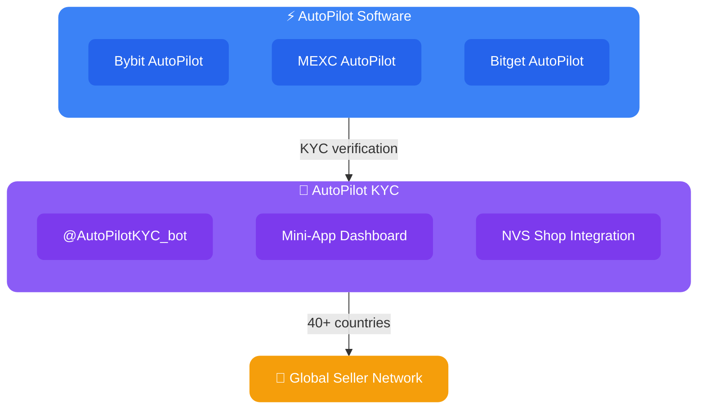

import { LinkCard, CardGrid } from '@astrojs/starlight/components';

# AutoPilot Ecosystem

---

### ⚡ Exchange Automation

> Registration, login, 2FA, trading, withdrawal — all on autopilot

<LinkCard title="📖 FAQ — Full Guide" description="Complete knowledge base — from first launch to advanced configuration" href="./faq" />

<CardGrid>
  <LinkCard title="🟠 Bybit AutoPilot" description="Most complete module: 25+ actions including futures, TokenSplash, LaunchPad" href="./bybit-autopilot" />
  <LinkCard title="🔵 MEXC AutoPilot" description="Full automation cycle: registration, trading, API, withdrawal" href="./mexc-autopilot" />
  <LinkCard title="🟢 Bitget AutoPilot" description="Full automation: registration, trading, CandyBomb, withdrawal" href="./bitget-autopilot" />
</CardGrid>

---

### 🔐 KYC Platform

> Automated KYC verification through a global seller network

<CardGrid>
  <LinkCard title="🎫 AutoPilot KYC Subscription" description="$30/mo — wholesale pricing, custom team, full Mini-App" href="./autopilot-kyc-subscription" />
  <LinkCard title="📤 NVS Upload FAQ" description="How to upload accounts via NVS Shop" href="./nvs-faq" />
  <LinkCard title="📋 NVS Pilot Guide" description="Full guide: upload, validation, dashboard, statuses" href="./pilot-faq" />
  <LinkCard title="📜 Terms of Service" description="Platform ToS" href="./autopilot-kyc-tos" />
</CardGrid>

---

### 👥 For Sellers

<LinkCard title="📚 Seller Guide" description="Guide for KYC platform sellers" href="./sellers-guide" />
