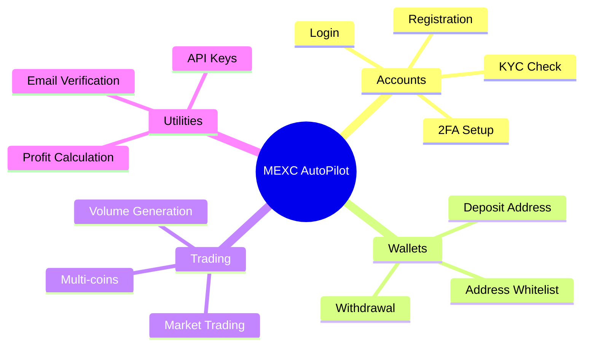
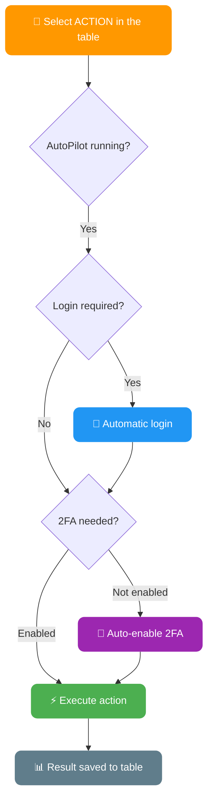
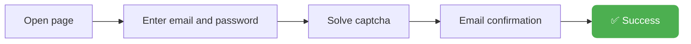
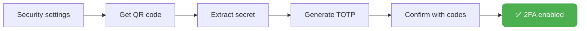
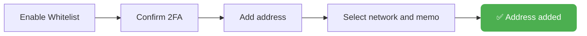
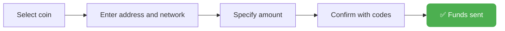
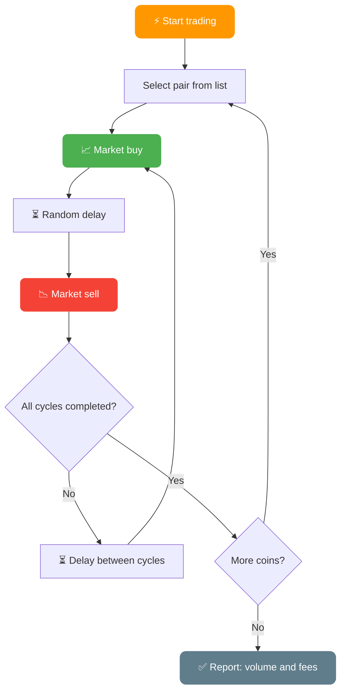
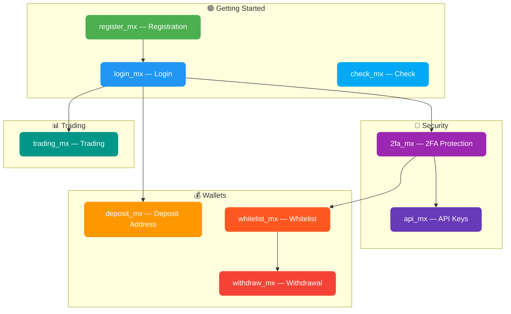

# AutoPilot Software — Maximum Automation on MEXC

**AdsPower & Dolphin & Vision Support**
**Windows / MacOS / Linux**

---

## Forget about manual work: the solution is here

Managing accounts manually requires a lot of time, effort, and is prone to errors. To scale your operations you need to:
- Regularly perform repetitive actions
- Optimize your time

AutoPilot Software solves these problems by turning routine tasks into an automated process. Integration with AdsPower & Dolphin ensures digital fingerprint protection and safe multi-account management.

---

## How AutoPilot Works


---

## Key Advantages

**Time savings:**
Automation allows you to manage hundreds of accounts simultaneously

**Ease of use:**
Go about your business while AutoPilot automates actions in the background. You can use your own applications while AutoPilot runs in browser windows behind the scenes

**Integration with AdsPower / Dolphin / Vision:**
Safe and anonymous account usage. AutoPilot automatically launches and integrates into the created anti-detect browser session with unique fingerprints. AutoPilot doesn't care whether profiles are already open or closed — it will start automating the process either way

**Parallel automation:**
Automate multiple accounts simultaneously

**Convenient account tracking spreadsheet:**
Keep track of all accounts in a single Excel spreadsheet. You can add new columns, rearrange column order as you wish — just don't rename the columns from the template

**Automation mode settings — unique speed modes:**
- **FAST** — maximum speed with minimal delays
- **MEDIUM** — moderate speed, human behavior simulation, Smart Cursor, Human Typing
- **SLOW** — slow speed, full human behavior simulation

**Multi-functionality:**
Configure any actions for each account. For example, AutoPilot will get a deposit address for some accounts while withdrawing funds from others

**Automatic action chains:**
Choose any action — AutoPilot will automatically log in to the account if login is required. It will also enable 2FA protection automatically if it hasn't been set up yet

---

## MEXC AutoPilot Features



AutoPilot supports a wide range of automated actions for MEXC:

- **Registration** of accounts on MEXC: standard method, via referral link
- **Login**: sign in to account, check verification and balance
- **KYC Check**: verification level check
- **2FA Management**: setting up two-factor authentication and entering codes
- **Getting deposit address** for each account
- **Withdrawal** from account
- **Adding addresses to whitelist** with support for various networks
- **Getting API keys** for trading with permission configuration
- **Automated trading**: trading and volume generation with market orders in specified pairs
- **Sequential trading**: support for multiple coins separated by commas
- Automatic captcha solving, verification code retrieval, and much more

---

## 🧩 Captcha Setup

AutoPilot uses captcha-solving providers for registration and login. **4 providers** are supported:

- ⭐ **CapSolver** — [capsolver.com](https://www.capsolver.com/) — **recommended**
- **CapMonster** — [capmonster.cloud](https://capmonster.cloud/)
- **2Captcha** — [2captcha.com](https://2captcha.com/)
- **CapGuru** — [cap.guru](https://cap.guru/) — visual captcha only

Configure in `AutoPilot.config`:

```
captcha_provider=capsolver
captcha_key=CAP-YOUR_KEY_HERE
```

> ⭐ **CapSolver** is recommended — the most stable and fastest on MEXC (token-based GeeTest v4). For detailed provider comparison — see [FAQ → section 4: Proxy and Captcha](/docs/en/faq/#4--proxy-and-captcha).

---

## Full List of Actions (ACTION)

### General Action Workflow



> All actions except registration will automatically log in to the account if needed. The whitelist and withdraw actions will automatically enable 2FA if it is not set up.

---

### `register_mx` — Account Registration on MEXC

Account registration with automatic captcha solving and email confirmation



| Parameter | Column | Description |
|-----------|--------|-------------|
| **Required** | `[EMAIL] mail_provider` | Email service (yahoo, rambler, icloud, outlook, gmail...) |
| **Required** | `[PROFILE] mail` | Email address |
| **Required** | `[EMAIL] mail_password` | Email password / IMAP password |
| Optional | `[PROFILE] mexc_password` | Account password (AutoPilot generates one if empty) |
| Optional | `[REG] referral_code` | Referral code |
| **Updates** | `[REG] is_registered` | Registration status (1 — registered) |
| **Updates** | `[RESULT] status` | `[REGISTER_MX] SUCCESS` or error description |

---

### `login_mx` — Account Login

Sign in to account, check verification and balance

| Parameter | Column | Description |
|-----------|--------|-------------|
| **Required** | `[REG] is_registered` | 1 (registered) |
| **Required** | `[PROFILE] mail` | Email address |
| **Required** | `[PROFILE] mexc_password` | Account password |
| Optional | `[2FA] totp_secret_code` | 2FA secret code |
| **Updates** | `[KYC] kyc_status` | Verification level |
| **Updates** | `[BALANCE] account_balance` | Account balance in USDT |
| **Updates** | `[RESULT] status` | `[LOGIN_MX] SUCCESS` |

---

### `check_mx` — Verification Check

Check KYC level and account balance without performing additional actions

| Parameter | Column | Description |
|-----------|--------|-------------|
| **Updates** | `[KYC] kyc_status` | Verification level |
| **Updates** | `[BALANCE] account_balance` | Balance in USDT |
| **Updates** | `[RESULT] status` | `[CHECK_MX] SUCCESS` |

---

### `2fa_mx` — 2FA Setup

Automatic Google Authenticator setup on the account



| Parameter | Column | Description |
|-----------|--------|-------------|
| **Updates** | `[2FA] totp_secret_code` | 2FA secret code (saved automatically) |
| **Updates** | `[RESULT] status` | `[2FA_MX] SUCCESS` |

---

### `whitelist_mx` — Add Address to Whitelist

Enable whitelist mode and add a withdrawal address



| Parameter | Column | Description |
|-----------|--------|-------------|
| **Required** | `[WHITELIST_MEXC] whitelist_address` | Wallet address |
| **Required** | `[WHITELIST_MEXC] whitelist_chain` | Network (as shown on MEXC, e.g.: `ERC20`, `TRC20`, `Aptos`) |
| Optional | `[WHITELIST_MEXC] whitelist_memo` | Memo/Tag (if required by the network) |
| **Updates** | `[WHITELIST_MEXC] whitelist_status` | 1 — successfully added |
| **Updates** | `[RESULT] status` | `[WHITELIST_MX] SUCCESS` |

> If 2FA is not enabled — AutoPilot will automatically set it up before adding to the whitelist

---

### `withdraw_mx` — Withdrawal

Full withdrawal from the account with automatic confirmation



| Parameter | Column | Description |
|-----------|--------|-------------|
| **Required** | `[WITHDRAW_MEXC] withdraw_coin` | Coin to withdraw (e.g.: `USDT`) |
| **Required** | `[WITHDRAW_MEXC] withdraw_chain` | Withdrawal network (as shown on MEXC, e.g.: `TRC20`) |
| **Required** | `[WITHDRAW_MEXC] withdraw_address` | Recipient wallet address |
| Optional | `[WITHDRAW_MEXC] withdraw_memo` | Memo/Tag |
| Optional | `[WITHDRAW_MEXC] withdraw_amount` | Amount in % (100 = all, 50 = half) |
| **Updates** | `[RESULT] status` | `[WITHDRAW_MEXC] SUCCESS` |

> If 2FA is not enabled — AutoPilot will automatically set it up before withdrawal

---

### `api_mx` — Get API Keys

Create an API key with full permissions for SPOT and Futures trading

| Parameter | Column | Description |
|-----------|--------|-------------|
| Optional | `[API] api_whitelist_ip` | IP for whitelist (optional) |
| **Updates** | `[API] api_key` | Obtained API key |
| **Updates** | `[API] api_secret` | API secret key |
| **Updates** | `[RESULT] status` | `[API_MX] SUCCESS` |

---

### `trading_mx` — Automated Trading

Trading and volume generation with market orders, supporting multiple coins



| Parameter | Column | Description |
|-----------|--------|-------------|
| **Required** | `[TRADING] trading_coin` | Asset to trade (e.g.: `BTC` or `BTC,ETH,SOL`) |
| **Required** | `[TRADING] trading_amount` | Order size in USDT (e.g.: `10` or `10,20,5`) |
| **Required** | `[TRADING] trading_cycles` | Number of buy-sell cycles (e.g.: `3` or `3,5,2`) |
| **Updates** | `[RESULT] status` | `[TRADING_MX] VOLUME: volume, FEES: fees` |

> **Multi-coins**: specify multiple coins, amounts, and cycles separated by commas — AutoPilot will trade them sequentially.
> Example: `BTC,ETH` + `10,20` + `3,5` = 3 cycles of BTC at 10 USDT, then 5 cycles of ETH at 20 USDT

> **Volume formula**: cycles x order size x 2 (buy + sell)
> Example: 3 cycles at 10 USDT = 3 x 10 x 2 = **60 USDT** volume

---

### `deposit_mx` — Get Deposit Address

Get a deposit address to fund the account

| Parameter | Column | Description |
|-----------|--------|-------------|
| **Required** | `[DEPOSIT] deposit_coin` | Coin for deposit (e.g.: `USDT`) |
| **Required** | `[DEPOSIT] deposit_chain` | Network (as shown on MEXC, e.g.: `TRC20`) |
| **Updates** | `[DEPOSIT] deposit_address` | Deposit address (format: `address:memo`) |

---

## Actions Summary Table



| Action | Description | Auto-login | Auto-2FA |
|--------|-------------|:----------:|:--------:|
| `register_mx` | Account registration | — | — |
| `login_mx` | Account login | — | — |
| `check_mx` | KYC and balance check | ✅ | — |
| `2fa_mx` | 2FA setup | ✅ | — |
| `deposit_mx` | Deposit address | ✅ | — |
| `whitelist_mx` | Add to whitelist | ✅ | ✅ |
| `withdraw_mx` | Withdrawal | ✅ | ✅ |
| `api_mx` | API key creation | ✅ | — |
| `trading_mx` | Market trading | ✅ | — |

---

## Purchase

Right after purchase you receive a ready-to-use build.

Buy an activation key for MEXC AutoPilot: [https://t.me/buykyc_bot](https://t.me/buykyc_bot)

Along with the key you get access to the AutoPilot community chat where you can ask questions, communicate, and get tips.

The key lifetime starts counting from the first launch.
