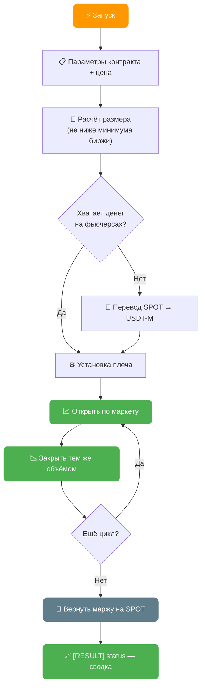

# AutoPilot Software — Максимальная Автоматизация на Bitget

**Поддержка AdsPower & Dolphin & Vision & Afina**
**Windows / MacOS / Linux**

---

## Забудьте о ручной работе: решение найдено

Ручное управление аккаунтами требует много времени, усилий и сопряжено с риском ошибок. Для масштабирования своих операций вам необходимо:
- Регулярно выполнять однотипные действия
- Оптимизировать время

AutoPilot Software решает эти проблемы, превращая рутину в автоматический процесс. Интеграция с AdsPower & Dolphin обеспечивает защиту цифровых отпечатков и безопасную работу с множеством аккаунтов.

---

## Функционал Bitget AutoPilot

AutoPilot поддерживает множество автоматизированных действий:

- **Регистрация** аккаунтов на Bitget: обычным методом, по ссылке партнера, по реферальной ссылке
- **Логин**: вход в аккаунт, проверка верификации и баланса аккаунта
- **Проверка KYC**: проверка уровня верификации, запись статуса при отклоненном KYC
- **Управление 2FA**: подключение двухфакторной аутентификации и ввод кодов
- **Получение адреса депозита**
- **Вывод средств** с аккаунта
- **Добавление адресов в whitelist**
- **Получение API-ключей** для торговли
- **Автоматический трансфер**: перевод средств между счетами
- **Автоматическая чистка кеша**: чистка кеша Bitget, когда это требуется
- **Автоматический трейдинг**: торговля и набив объёма в указанной паре
- **Фьючерсы (USDT-M)**: набив объёма циклами «открыл → сразу закрыл» с плечом, без удержания позиции
- **Участие в CandyBomb** событиях: регистрация в ивенте, проверка меток
- **Экспорт аккаунта для KYC**: упаковка готового аккаунта для прохождения верификации в @AutoPilotKYC_bot
- Проверка почт перед запуском
- Поддержка перенаправления почты и проверка кодов подтверждения в папке Spam
- Подсчет общей прибыли аккаунта
- И многое другое под капотом

---

## 🧩 Настройка капчи

Капчу AutoPilot решает **сам, внутри exe** — бесплатно, без сторонних сервисов и без браузера. Для большинства капч на Bitget платный ключ не нужен: софт стартует и работает без него.

Платный провайдер подключается только как подстраховка на редкие типы капчи. Если решите завести ключ — подходят три сервиса:

- ⭐ **CapSolver** — [capsolver.com](https://www.capsolver.com/) — **рекомендуется**
- **CapMonster** — [capmonster.cloud](https://capmonster.cloud/)
- **2Captcha** — [2captcha.com](https://2captcha.com/)

Настраивается в `AutoPilot.config`:

```
captcha_key=CAP-ВАШ_КЛЮЧ_ЗДЕСЬ
```

> 🏠 **Прокси профиля обязан быть резидентским** — встроенный решатель отправляет проверку капчи с IP профиля, а датацентровые IP не проходят. Подробнее — [FAQ → секция 4: Прокси и капча](/docs/faq/#4--прокси-и-капча).

---

## Полный список действий (ACTION)

> ➕ **Несколько действий за один проход.** В ячейку `ACTION` можно записать цепочку через `+` — например `register+learn+whitelist`. Шаги выполняются по очереди на каждом аккаунте, браузер профиля между ними не перезапускается. Подробнее — [FAQ → Цепочки действий](/docs/faq/#action-chains).


### `REGISTER` — Регистрация аккаунта

| Параметр | Столбец | Описание |
|----------|---------|----------|
| **Требует** | `[EMAIL] mail_provider` | Почтовый сервис |
| **Требует** | `[PROFILE] mail` | Почтовый адрес |
| **Требует** | `[EMAIL] mail_password` | Пароль почты / IMAP пароль |
| Опционально | `[PROFILE] bitget_password` | Пароль от аккаунта (AutoPilot генерирует, если пустой) |
| Опционально | `[REG] referral_code` | Реферальный код или ссылка партнера |
| **Обновляет** | `[REG] is_registered` | Успешная регистрация |

### `LOGIN` — Логин в аккаунт

| Параметр | Столбец | Описание |
|----------|---------|----------|
| **Требует** | `[REG] is_registered` | 1 (зарегистрирован) |
| **Требует** | `[PROFILE] mail` | Адрес почты |
| **Требует** | `[PROFILE] bitget_password` | Пароль от аккаунта |
| Опционально | `[2FA] totp_secret_code` | Секретный код 2FA |
| **Обновляет** | `[KYC] kyc_status` | Уровень и страну верификации |
| **Обновляет** | `[BALANCE] account_balance` | Баланс аккаунта в USDT |

### `DEPOSIT` — Получение адреса депозита

| Параметр | Столбец | Описание |
|----------|---------|----------|
| **Требует** | `[DEPOSIT] deposit_coin` | Валюта депозита |
| **Требует** | `[DEPOSIT] deposit_chain` | Сеть (как на Bitget, например: `BSC`) |
| **Обновляет** | `[DEPOSIT] deposit_address` | Адрес депозита (формат: `адрес:memo`) |

### `2FA` — Подключение 2FA

| Параметр | Столбец | Описание |
|----------|---------|----------|
| **Обновляет** | `[2FA] totp_secret_code` | Секретный код 2FA |

### `WHITELIST` — Добавление в Whitelist

| Параметр | Столбец | Описание |
|----------|---------|----------|
| **Требует** | `[WHITELIST] whitelist_address` | Адрес кошелька |
| **Требует** | `[WHITELIST] whitelist_chain` | Сеть (как на Bitget, например: `BSC`) |
| Опционально | `[WHITELIST] whitelist_memo` | Memo (опционально) |
| **Обновляет** | `[WHITELIST] whitelist_status` | Успешно подключен |

### `WITHDRAW` — Вывод средств

| Параметр | Столбец | Описание |
|----------|---------|----------|
| **Требует** | `[WITHDRAW] withdraw_coin` | Валюта вывода |
| **Требует** | `[WITHDRAW] withdraw_chain` | Сеть (как на Bitget, например: `BSC`) |
| **Требует** | `[WITHDRAW] withdraw_address` | Адрес кошелька |
| Опционально | `[WITHDRAW] withdraw_memo` | Memo (опционально) |
| Опционально | `[WITHDRAW] withdraw_amount` | Сумма в % (100 = всё, 50 = половина) |

### `TRADING` — Торговля

| Параметр | Столбец | Описание |
|----------|---------|----------|
| **Требует** | `[TRADING] trading_coin` | Актив для торговли (например: `BTC`) |
| **Требует** | `[TRADING] trading_amount` | Размер ордера в USDT |
| **Требует** | `[TRADING] trading_cycles` | Кол-во циклов покупки-продажи |

### `futures_bit` — Фьючерсы USDT-M (набив объёма)

Открывает фьючерсную позицию **по рынку** и **сразу закрывает её** тем же объёмом. Позиция не удерживается — цель не прибыль, а **торговый оборот**, на котором завязаны награды биржи (CandyBomb, задачи, купоны). Платится только комиссия.



| Параметр | Где задаётся | Описание |
|----------|--------------|----------|
| Опционально | `futures_symbol` (конфиг) | Контракт. По умолчанию `DOGEUSDT_UMCBL` — самый дешёвый вход |
| Опционально | `futures_leverage` (конфиг) | Плечо, `1`–`75`. По умолчанию `20` |
| Опционально | `futures_notional` (конфиг) | Объём одного ордера в USDT. По умолчанию `6`, **минимум 5** (ограничение биржи) |
| Опционально | `futures_wash_count` (конфиг) | Сколько циклов «открыл → закрыл» за прогон, `1`–`50`. По умолчанию `1` |
| Опционально | `futures_margin` (конфиг) | Сколько USDT разрешено перевести со SPOT на фьючерсы. По умолчанию считается само |
| Опционально | `futures_side` (конфиг) | Направление: `long` (по умолч.) / `short` |
| **Обновляет** | `[RESULT] status` | Сводка прогона — например `[FUTURES_BIT] SUCCESS - 1/1 wash(es), opened 1, closed 1, ~12.08 USDT volume` |

> **Ни одного нового столбца в Excel.** Все параметры живут в общем файле конфигурации — на профиль ничего заполнять не нужно.

> 💰 **Сколько стоит оборот.** На проверке круг «открыл → закрыл» на ~6 USDT нотионала обошёлся в **0.008 USDT**. Наблюдаемая стоимость набива — порядка **0.05–0.08% от оборота**.

> 🏦 **Деньги возвращаются сами.** Если на фьючерсном счёте пусто, действие само переводит нужную маржу со SPOT, а после последнего цикла **сметает остаток обратно на SPOT**. Между запусками деньги не «залипают» на фьючерсах.

> 🔁 **Закрытие с ретраями.** Закрытие повторяется до 3 раз. Если позицию всё же не удалось закрыть — это пишется в лог и в статус как `PARTIAL`, чтобы её было видно, а не потерять молча.

> ⚠️ **Сначала запишись в ивенты, потом торгуй.** Оборот засчитывается только тем воронкам, куда аккаунт вступил **до** сделок. Порядок: сначала регистрация в ивентах и приём заданий, затем `futures_bit`.

> ⚠️ **Минимальный ордер — 5 USDT.** Меньше биржа не примет; действие само поднимает размер до минимума, даже если в конфиге указано меньше.

---

### `CB` — CandyBomb

| Параметр | Столбец | Описание |
|----------|---------|----------|
| **Требует** | `[CB] code` | Код события из ссылки |

### `SELL` — Продажа всех активов

Продажа всех активов на SPOT счете по маркету за USDT.

### `PROFIT` — Подсчет прибыли

Формула: сумма выводов - сумма депозитов + баланс аккаунта.

---

### `link_bit` — Получить ссылку KYC верификации

> ⚠️ **Отдельное действие не нужно.** Получение ссылки KYC для Bitget переехало в нашу экосистему — используйте бота и расширение ниже.

- 🤖 **Telegram-бот + Miniapp [@AutoPilotKYC_bot](https://t.me/AutoPilotKYC_bot)** — автоматические KYC-верификации на платформе AutoPilot KYC. Подробнее: [KYC Платформа](/docs/kyc/autopilot-kyc-subscription/).
- 🧩 **Бесплатное расширение [AutoPilot Link Generator](https://chromewebstore.google.com/detail/autopilot-link-generator/maogfegbjecdgkfnkemoalpbgodknmaa)** — генерирует ссылки верификации для Bybit, MEXC, Bitget и произвольных Sumsub/Onfido токенов прямо в браузере.

---

### `export_bit` — Экспорт аккаунта для KYC

Одно действие — и готовый аккаунт Bitget упакован в один файл **эксклюзивно для автоматического прохождения KYC в нашем боте [@AutoPilotKYC_bot](https://t.me/AutoPilotKYC_bot)**.

- ✅ **Всё, что нужно Bitget для KYC.** Для верификации Bitget запрашивает информацию о профиле, которую обычный экспорт кук и антидетект-браузеры не передают — `export_bit` собирает именно её.
- 📦 **Аккаунт целиком, в один клик.** Ничего не нужно собирать и переносить вручную.
- 🌍 **Гео-привязка сохраняется** — аккаунт остаётся в своей стране.
- ⚡ **Пакетно.** За один проход собирает всю группу аккаунтов в единый файл, готовый к загрузке в бота.

> 🤖 **Только для AutoPilot KYC.** Экспорт создан исключительно для прохождения верификации в [@AutoPilotKYC_bot](https://t.me/AutoPilotKYC_bot). Подробнее — [KYC Платформа](/docs/kyc/autopilot-kyc-subscription/).

---

## Сводная таблица

| Действие | Описание | Авто-логин | Авто-2FA |
|----------|----------|:----------:|:--------:|
| `REGISTER` | Регистрация | — | — |
| `LOGIN` | Логин | — | — |
| `DEPOSIT` | Адрес депозита | ✅ | — |
| `2FA` | Подключение 2FA | ✅ | — |
| `WHITELIST` | Whitelist | ✅ | ✅ |
| `WITHDRAW` | Вывод средств | ✅ | ✅ |
| `TRADING` | Торговля | ✅ | — |
| `futures_bit` | Фьючерсы USDT-M (набив объёма) | ✅ | — |
| `CB` | CandyBomb | ✅ | — |
| `SELL` | Продажа активов | ✅ | — |
| `PROFIT` | Подсчет прибыли | ✅ | — |
| `export_bit` | Экспорт аккаунта для KYC | ✅ | — |

---

## Покупка

Сразу после покупки вы получаете готовую сборку для работы.

Купить ключ активации для Bitget AutoPilot: [https://t.me/buykyc_bot](https://t.me/buykyc_bot)

Вместе с ключом вы получаете доступ к тематическому чату AutoPilot. Время жизни ключа отсчитывается от первого запуска.
