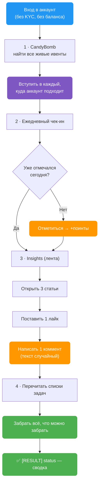
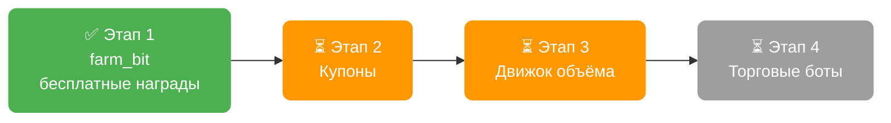

> 🔒 **Секретный функционал.** Никому не показывается. Ссылки на страницу нет ни в меню, ни в поиске — никто её не увидит.
>
> Действие написано, но **ещё ни разу не запускалось на живом аккаунте**.

`farm_bit` забирает **всё, за что Bitget платит новому аккаунту, не открывая ни одной сделки**. Ни одного ордера, ни одной комиссии, ни рубля риска.

---

## 🧭 Как устроены награды Bitget

У Bitget четыре «кассы», из которых новичок может забрать деньги:

| Касса | Что даёт | Нужна торговля? |
|---|---|---|
| **CandyBomb** | доля от призового пула ивента | Да |
| **Rewards Center** | поинты, которые меняются на USDT | Частично |
| **Coupon Center** | ваучеры — торговая маржа биржи | Да |
| **Ежедневные бесплатные задачи** | чек-ин, лайк, коммент, чтение статей | **Нет** |

`farm_bit` берёт **четвёртую кассу целиком** и **вход в первую** — регистрацию в ивентах. Торговый объём — следующий этап, см. [план](#-план-развития).

### Почему регистрация в ивентах решает

Ивентов CandyBomb одновременно идёт три-четыре, и требования у них разные: один хочет объём по крипте, другой по акциям, третий по сырью. Человек вручную обычно вступает в один — и потом торгует то, что подходило бы сразу под несколько.

Комиссии платятся один раз. Награда приходит только с того ивента, куда успел вступить.

> 💡 `farm_bit` перечисляет все живые ивенты и вступает в каждый, куда аккаунт подходит. Тот же объём — выплата с нескольких ивентов вместо одного.

---

## ⚙️ Что делает, по шагам



### 1 · CandyBomb — вступить во все ивенты

Находит активные ивенты и вступает в каждый, где аккаунт ещё не зарегистрирован. Ничего не стоит и ни к чему не обязывает — но без этого шага объём, набитый позже, не засчитается.

### 2 · Ежедневный чек-ин

Отмечается в ежедневной акции. Сначала проверяет, не отмечался ли уже сегодня — повторно не дёргает.

Лесенка наград за 7 дней подряд: `+3 → +5 → +10 → +10 → +10 → +15 → сундук`.

### 3 · Три ежедневных задачи Insights

| Задача | Что нужно | Поинтов |
|---|---|---|
| Community browsing | открыть **3 статьи** | 2 |
| Community likes | **1 лайк** | 1 |
| Community comments | **1 коммент** | 2 |

Итого **5 поинтов в день** за пару секунд работы.

> 🎲 **Комментарии не повторяются.** Текст берётся случайно из встроенного пула — на десятках профилей не будет одинаковых сообщений под одной статьёй.

### 4 · Забрать все поинты

Перечитывает списки задач и забирает награду по каждой выполненной. Сюда попадают не только задачи Insights, но и всё, что аккаунт успел выполнить раньше: регистрация, первый депозит, первая сделка, дневные задачи по торговле.

---

## 📋 Что вписывать в таблицу

| Действие | Колонка `[ACTION] action` | Дополнительные колонки |
|---|---|---|
| `farm_bit` | `farm_bit` | **нет** |

Плюс обычные колонки профиля: `[PROFILE] profile_id`, `[PROFILE] mail`, `[PROFILE] bitget_password`.

**Настраивать нечего** — своих ключей в `AutoPilot.config` у действия нет, всё работает автоматически.

**Обновляет** `[RESULT] status` строкой вида:

```
[FARM_BIT] SUCCESS - joined 3 event(s), check-in +5, browsed 3/3, liked 1,
           commented 1, claimed 4 task(s), ~14 points
```

---

## 🛡️ Почему это безопасно

- **Ноль ордеров.** Действие физически не умеет торговать. Потерять деньги на комиссиях или движении цены невозможно.
- **Не нужен ни баланс, ни KYC.** Работает на пустом свежем аккаунте.
- **Повторный запуск безвреден.** Чек-ин проверяется перед отметкой, задачи забираются только невостребованные.
- **Одна упавшая часть не роняет остальные.** Если лента Insights не ответила — чек-ин и сбор поинтов всё равно отработают.
- **Сессия не рвётся.** Действие спроектировано так, чтобы не провоцировать разлогин при спорных ответах биржи.

---

## 🗺️ План развития

### Этап 1 — `farm_bit` · написан

Осталось прогнать на одном живом профиле. Что смотреть в логах:

- вступил ли в ивенты (или отметил, что уже вступил);
- прошёл ли чек-ин;
- отработали ли все три задачи Insights;
- сколько задач забрал.

### Этап 2 — Coupon Center

Купонные задачи нужно принимать заранее, иначе они не засчитываются — та же логика, что со вступлением в ивенты. Дальше — получение и применение ваучеров.

### Этап 3 — движок объёма

Ключевой этап: всё, что платит крупно, требует торгового оборота — доли в CandyBomb, купоны, дневные и разовые торговые задачи.

Механика дешёвая: открыть небольшую позицию и сразу закрыть. Теряется только комиссия — порядка **0.05–0.08 %** от размера позиции. Один прогон по трём инструментам (крипта, акция, сырьё) закрывает сразу несколько ивентов и купонов.

### Этап 4 — торговые боты

Отдельная группа задач требует создать бота и подержать сутки.

### Итоговая картина



Принципиальных технических препятствий по этапам 2–4 нет — механика разобрана, дело за реализацией и обкаткой.
