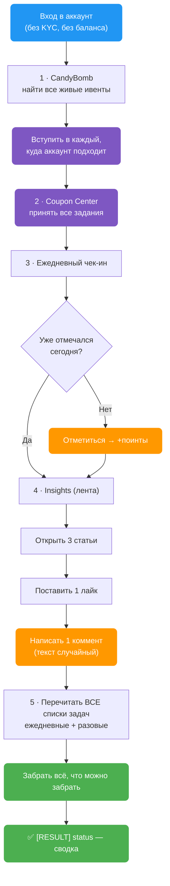
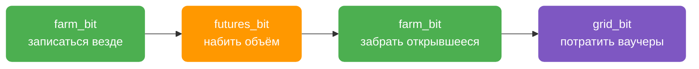
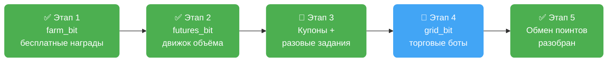

> 🔒 **Секретный функционал.** Никому не показывается. Ссылки на страницу нет ни в меню, ни в поиске — никто её не увидит.

Разбор шести дней ручного фарма (запись работы оператора с реального аккаунта, 18–22.07.2026) показал полную картину: **что именно платит Bitget новичку, в каком порядке это надо брать и где человек вручную теряет деньги**. Под каждый слой сделано действие.

| Действие | Что берёт | Торгует? |
|---|---|---|
| `farm_bit` | бесплатные награды + **вход** во все платящие воронки | Нет |
| `futures_bit` | торговый объём — то, чем открываются крупные выплаты | Да |
| `grid_bit` | ваучерные грид-боты (маржа биржи, не ваша) | Бот торгует сам |
| `farm_state` | снимок: где аккаунт стоит по всем воронкам | Нет, только читает |

---

## 🧭 Как устроены награды Bitget

У Bitget четыре «кассы», из которых новичок может забрать деньги:

| Касса | Что даёт | Нужна торговля? |
|---|---|---|
| **CandyBomb** | доля от призового пула ивента | Да |
| **Rewards Center** | поинты, которые меняются на USDT | Частично |
| **Coupon Center** | ваучеры — торговая маржа биржи | Да |
| **Ежедневные бесплатные задачи** | чек-ин, лайк, коммент, чтение статей | **Нет** |

`farm_bit` берёт **четвёртую кассу целиком** и **вход в первую и третью** — регистрацию в ивентах и приём купонных заданий. Объём под них набивает `futures_bit`.

### 🔑 Главное правило: сначала запишись, потом торгуй

Это самое дорогое место во всей схеме, и именно на нём человек вручную теряет больше всего.

И ивенты CandyBomb, и купонные задания надо **принять заранее**. Не принял — набитый позже объём по ним **не засчитается вообще**. Комиссия за объём платится один раз, а награда приходит только с тех воронок, куда успел записаться до сделок.

В разобранной ручной работе оператор:

- вступил в **1 ивент CandyBomb из 4** живых;
- принял **3 купонных задания из 8** предложенных.

Непринятые пять заданий стоили **670 USDT** ваучерами — включая **два подарка по 120 USDT** за создание торгового бота. Объём, который их бы закрыл, был набит и оплачен. Награда не пришла.

> 💡 `farm_bit` перечисляет все живые ивенты и все купонные карточки и записывается **везде, где аккаунт подходит**, — до того, как будет открыта первая сделка. Тот же объём, тот же расход, выплата с нескольких воронок вместо одной.

---

## 🌾 `farm_bit` — что делает, по шагам



### 1 · CandyBomb — вступить во все ивенты

Находит активные ивенты и вступает в каждый, где аккаунт ещё не зарегистрирован. Ничего не стоит и ни к чему не обязывает — но без этого шага объём, набитый позже, не засчитается.

Заодно вытягивает **условия каждого ивента**: какие именно инструменты в нём засчитываются и сколько объёма нужно до следующей ступени награды. Раньше это было не видно, и объём набивался на глаз — в разобранной ручной работе оператор перелил нужную ступень на 1 445 USDT платного оборота. Теперь цифры пишутся в лог до того, как потрачена первая комиссия.

### 2 · Coupon Center — принять все задания

Забирает список купонных карточек и жмёт «Принять» на каждой непринятой. Это бесплатно и ни к чему не обязывает, но именно этот шаг решает, засчитается ли будущий объём (см. [правило выше](#-главное-правило-сначала-запишись-потом-торгуй)).

### 3 · Ежедневный чек-ин

Отмечается в ежедневной акции. Сначала проверяет, не отмечался ли уже сегодня — повторно не дёргает.

Лесенка наград за 7 дней подряд: `+3 → +5 → +10 → +10 → +10 → +15 → сундук`.

### 4 · Три ежедневных задачи Insights

| Задача | Что нужно | Поинтов |
|---|---|---|
| Community browsing | открыть **3 статьи** | 2 |
| Community likes | **1 лайк** | 1 |
| Community comments | **1 коммент** | 2 |

Итого **5 поинтов в день** за пару секунд работы.

> 🎲 **Комментарии не повторяются.** Текст берётся случайно из встроенного пула — на десятках профилей не будет одинаковых сообщений под одной статьёй.

### 5 · Забрать все поинты — включая разовые задания

Перечитывает списки задач и забирает награду по каждой выполненной. Сюда попадают не только задачи Insights, но и всё, что аккаунт успел выполнить раньше: регистрация, первый депозит, первая сделка, дневные задачи по торговле.

**Отдельно — «разовые» задания (Limited-time).** Bitget показывает их в Rewards Center рядом с ежедневными, но отдаёт их приложению по другому каналу, и в первой версии действия они просто не попадали в обзор. Это самый дорогой слой на аккаунте:

| Слой задач | Награда за штуку | Сколько их |
|---|---|---|
| Ежедневные | 10–50 поинтов | ~11 |
| **Разовые (Limited-time)** | **150–250 поинтов** | **~14** |

На разобранном аккаунте разовые задания в сумме тянули на **2 263 поинта** — больше, чем вся ежедневная сетка за неделю. Теперь они читаются и забираются вместе с остальными.

---

## ⚙️ Параметры `AutoPilot.config`

**Все ключи необязательные.** Не добавили ни одного — действие отработает полный проход. Ключи нужны только чтобы что-то отключить или замедлить.

| Ключ | Описание | По умолчанию |
|------|----------|--------------|
| `farm_candybomb` | Вступать в ивенты CandyBomb. `NO` — пропустить шаг | `YES` |
| `farm_coupons` | Принимать все купонные задания Coupon Center | `YES` |
| `farm_checkin` | Ежедневный чек-ин | `YES` |
| `farm_insights` | Задачи Insights: 3 статьи + лайк + коммент | `YES` |
| `farm_claim` | Забирать поинты по выполненным задачам | `YES` |
| `farm_delay` | Пауза между действиями в секундах, случайная из диапазона | `1,3` |
| `farm_comments` | Свой пул комментариев, варианты через `\|` | встроенный пул |

### Как читаются значения

- **Выключатели** понимают `YES` / `Y` / `1` / `true` как «включено» и `NO` / `N` / `0` / `off` как «выключено». Пустое значение или отсутствие ключа = **включено**.
- **`farm_delay`** — ровно два числа через запятую, первое не больше второго. Одно число, перевёрнутый диапазон или мусор — молча откатывается к `1,3`, действие не падает.
- **`farm_comments`** — если задан, встроенный пул не используется вообще. Один вариант тоже допустим, но тогда все профили напишут одно и то же.

> ⚙️ **Что с чем сочетать.** Хотите только регистрацию в ивентах, без активности в ленте — `farm_insights=NO`. Аккаунт уже отмечался сегодня вручную — `farm_checkin=NO` (хотя действие и само это проверяет). Нужен более «человеческий» темп на больших пачках профилей — поднимите `farm_delay`, например `5,15`.

> 🔎 В начале прогона в лог пишется строка с тем, какие шаги включены и какая задержка выбрана — сразу видно, что конфиг прочитался как ожидалось.

---

## 🛡️ Почему это безопасно

- **Ноль ордеров.** Действие физически не умеет торговать. Потерять деньги на комиссиях или движении цены невозможно.
- **Не нужен ни баланс, ни KYC.** Работает на пустом свежем аккаунте.
- **Повторный запуск безвреден.** Чек-ин проверяется перед отметкой, задачи забираются только невостребованные.
- **Одна упавшая часть не роняет остальные.** Если лента Insights не ответила — чек-ин и сбор поинтов всё равно отработают.
- **Сессия не рвётся.** Действие спроектировано так, чтобы не провоцировать разлогин при спорных ответах биржи. Проверено живьём: после полного прогона аккаунт остался в сессии.

---

## 📋 Полный блок для `AutoPilot.config`

Скопируйте блок в свой `AutoPilot.config`. Каждый параметр с комментарием — в стиле остального конфига.

> ℹ️ **Можно не копировать вообще.** Значения ниже совпадают с дефолтными: без этого блока действие работает точно так же. Блок нужен, если хотите что-то отключить или изменить темп.

```ini
# ============ FARM_BIT — фарм наград Bitget без торговли ============
# Вступать во все активные ивенты CandyBomb, куда подходит аккаунт. NO = пропустить шаг.
farm_candybomb=YES
# Принимать все купонные задания Coupon Center. Непринятое задание не платит,
# даже если объём по нему набит — принимать надо ДО сделок.
farm_coupons=YES
# Ежедневный чек-ин. Действие само проверяет, не отмечался ли аккаунт сегодня.
farm_checkin=YES
# Задачи Insights: открыть 3 статьи, поставить 1 лайк, написать 1 коммент.
farm_insights=YES
# Забирать поинты по всем выполненным и невостребованным задачам.
farm_claim=YES
# Пауза между действиями в секундах, случайная из диапазона. Мусор или один
# число — откатывается к 1,3. Для больших пачек профилей имеет смысл поднять.
farm_delay=1,3
# Свой пул комментариев, варианты разделяются символом "|". Если пусто —
# используется встроенный пул. Не ставьте один вариант на всю пачку профилей.
farm_comments=
```

**Пример «только ивенты, без активности в ленте»** — аккаунт вступает в акции и забирает поинты, но ничего не пишет и не лайкает:

```ini
farm_candybomb=YES
farm_checkin=YES
farm_insights=NO
farm_claim=YES
farm_delay=3,8
```

**Пример со своими комментариями:**

```ini
farm_comments=Спасибо за разбор|Полезно, спасибо|Интересный взгляд|Согласен, наблюдаю за этим
```

---

## 📊 Что вписывать в Excel-таблицу

| Действие | Колонка `[ACTION] action` | Дополнительные колонки |
|----------|---------------------------|------------------------|
| `farm_bit` | `farm_bit` | **нет** |

Плюс базовые колонки профиля, как у любого другого действия Bitget:

| Колонка | Что туда идёт |
|---------|---------------|
| `[PROFILE] profile_id` | ID профиля в антидетект-браузере |
| `[PROFILE] mail` | почта аккаунта Bitget |
| `[PROFILE] bitget_password` | пароль аккаунта |

Больше ничего заполнять не нужно — ни кодов ивентов, ни сумм, ни монет. Действие само находит, во что вступать и что забирать.

**Пример строки:**

| `[PROFILE] profile_id` | `[PROFILE] mail` | `[PROFILE] bitget_password` | `[ACTION] action` |
|---|---|---|---|
| `k1eo727t` | `user@icloud.com` | `••••••••` | `farm_bit` |

### Что появится в результате

По окончании прогона действие пишет сводку в `[RESULT] status`:

```
[FARM_BIT] SUCCESS - joined 3 event(s), accepted 5 coupon task(s) (~670 USDT),
           check-in +5, browsed 3/3, liked 1, commented 1,
           claimed 4 task(s), ~14 points
```

| Часть строки | Что означает |
|---|---|
| `joined 3 event(s)` | вступил в 3 ивента CandyBomb |
| `accepted 5 coupon task(s) (~670 USDT)` | принял 5 купонных заданий, суммарный номинал ваучеров |
| `check-in +5` | чек-ин дал 5 поинтов |
| `browsed 3/3` | открыл 3 статьи из 3 нужных |
| `liked 1` / `commented 1` | лайк и коммент прошли |
| `claimed 4 task(s)` | забрал награду по 4 задачам |
| `~14 points` | суммарно поинтов за прогон |

> ⚠️ Номинал ваучеров в скобках — это **сколько маржи биржа готова дать**, а не деньги на баланс. Ваучер надо ещё отработать по его условиям.

Если у профиля моргнула сеть или прокси, статус будет `PARTIAL` с числом сбоев — так видно, что нули означают «не смогли проверить», а не «нечего было забирать»:

```
[FARM_BIT] PARTIAL - joined 1 event(s), accepted 0 coupon task(s) (~0 USDT),
           check-in +5, browsed 0/3, liked 0, commented 0,
           claimed 2 task(s), ~7 points, 3 network error(s)
```

Упавший шаг не роняет остальные — подробности по каждому пишутся в лог профиля.

---

## 📈 `futures_bit` — движок торгового объёма

Всё, что платит крупно, упирается в одно: **торговый оборот**. Доли в CandyBomb, купонные ваучеры, дневные и разовые торговые задачи — все они меряют объём, а не прибыль. Значит объём можно набивать нейтрально.

Механика простая: открыть небольшую позицию и **закрыть её через секунду**. Цена за это время почти не двигается, поэтому теряется только комиссия — порядка **0.05–0.08 %** от размера позиции. Счётчик объёма при этом двигается на полную.

| Ключ | Описание | По умолчанию |
|------|----------|--------------|
| `futures_symbol` | Инструмент | `DOGEUSDT_UMCBL` |
| `futures_leverage` | Плечо | `20` |
| `futures_notional` | Размер одной позиции в USDT (минимум биржи — 5) | `6` |
| `futures_wash_count` | Сколько кругов открыть-закрыть за прогон | `1` |
| `futures_margin` | Сколько USDT перекинуть на фьючерсный счёт | считается само |
| `futures_side` | `long` или `short` | `long` |

Действие само переводит USDT со спота на фьючерсы, если там пусто, и **возвращает маржу обратно на спот** в конце прогона.

```
[FUTURES_BIT] SUCCESS - 3/3 wash(es), opened 3, closed 3, ~36.42 USDT volume
```

> 🛡️ **Позиция не остаётся висеть.** Закрытие идёт с тремя попытками, и если закрыть не удалось — статус будет честным (`PARTIAL`), а в лог уйдёт прямое предупреждение, что позиция открыта и нужна рука. Молча оставить рынок «на потом» действие не может.

---

## 🤖 `grid_bit` — ваучерные грид-боты

Отдельная группа заданий требует **создать торгового бота и подержать его сутки**. Платят за это подарками по **120 USDT** — и это ровно то, что в ручной работе не забрали ни разу за шесть дней.

Хитрость в том, что бота не обязательно кормить своими деньгами: Coupon Center сам выдаёт ваучеры «на грид-бота», где маржу даёт биржа. `grid_bit` находит такие ваучеры, берёт **рекомендованные самой биржей параметры сетки** и создаёт бота.

> ⚠️ **Почему берём параметры биржи, а не свои.** Если диапазон цен не накрывает текущую цену, бот навсегда остаётся в статусе «ожидает», и отсчёт суток так и не начинается. В разобранной ручной работе оба ваучерных бота так и простояли — и оба подарка по 120 USDT остались неполученными.

| Ключ | Описание | По умолчанию |
|------|----------|--------------|
| `grid_max` | Сколько ботов создать за прогон | все доступные ваучеры |

```
[GRID_BIT] SUCCESS - 1/1 grid bot(s) from vouchers, 100 USDT exchange margin
```

Если подходящих ваучеров нет — действие честно пишет `ALREADY` и ничего не трогает.

---

## 📸 `farm_state` — снимок состояния аккаунта

Фарм — многодневная история, а каждое действие живёт одним прогоном: отработало, написало строку в Excel, забыло. На одном аккаунте это терпимо. На пачке — уже нет: непонятно, какой аккаунт на каком дне, где протухает ваучер, сколько объёма осталось до следующей ступени награды.

`farm_state` читает это обратно с биржи. **Только чтение — ни одного изменяющего запроса**, поэтому его безопасно гонять по любому аккаунту сколько угодно раз.

Что снимает:

| Блок | Что видно |
|---|---|
| Чек-ин | какой день подряд, отмечен ли сегодня, вся лесенка наград |
| Задачи | сколько готово к получению, по каждому из четырёх слоёв |
| Купоны | какие карточки приняты, какие нет, прогресс по каждой, когда сгорают |
| Ваучеры | что на руках, номинал, до какого числа годен |
| CandyBomb | в каких ивентах состоим, сколько объёма до следующей ступени |
| Баланс | спот и фьючерс отдельно |
| Поинты | баланс поинтов + витрина обмена: что и почём, сколько тиров по карману сейчас |
| Обмены | поданные заявки на обмен поинтов и их статус — ждут раздачи или уже выданы |
| История наград | что аккаунт реально начислил по задачам (сумма + задача) |

Работает двумя путями. **Бесплатно** — сам собирается в конце `farm_bit`, `futures_bit` и `grid_bit`, где аккаунт уже открыт, лишнего запуска браузера не нужно. И **отдельным действием** `farm_state`, когда надо обновить картинку точечно.

Снимки складываются в локальную базу рядом с программой, последние 20 на профиль. Запись — «по возможности»: если база недоступна, прогон это не уронит, учёт не имеет права мешать работе.

```
[FARM_STATE] SUCCESS - day 3, 5 claimable, 164 points (12 redeem tier(s) affordable),
             2 redemption(s) pending distribution, 6/7 coupon(s) not accepted,
             2 usable voucher(s), 1/3 event(s) joined, 214.30 USDT
```

> ✅ **Баланс поинтов теперь в снимке (31.07.2026).** Раньше цифру «My points» не удавалось найти в трафике — оказалось, она живёт на **экране обмена**, который открывается отдельно и в старые записи не попадал. Теперь снимок читает и сам баланс поинтов, и витрину обмена (сколько поинтов стоит каждый ваучер и что по карману прямо сейчас), и историю уже поданных обменов вместе с их статусом.

---

## 🔁 В каком порядке запускать

Все три действия пишутся в ту же колонку `[ACTION] action` и **ни одному не нужно дополнительных колонок** — только базовые `profile_id` / `mail` / `bitget_password`.

| Действие | Нужен баланс? |
|----------|---------------|
| `farm_bit` | Нет |
| `futures_bit` | Да, от ~10 USDT |
| `grid_bit` | Нет — маржу даёт ваучер |
| `farm_state` | Нет — только чтение |

Порядок на новом аккаунте:



Первый `farm_bit` записывает аккаунт во все воронки — **до** сделок, иначе объём пропадёт впустую. `futures_bit` набивает оборот. Второй `farm_bit` забирает то, что этим оборотом открылось. `grid_bit` тратит выданные за это ваучеры.

Дальше цикл повторяется по дням: `farm_bit` берёт ежедневные задачи и чек-ин, `futures_bit` — дневной объём. `farm_state` можно вклинить где угодно — он ничего не меняет.

---

## 🗺️ План развития

### Этап 1 — `farm_bit` · проверен на живом аккаунте

Полный прогон 27.07.2026 на реальном профиле, без единого ордера:

| Шаг | Результат |
|---|---|
| CandyBomb | нашёл 3 живых ивента: в один вступил, в одном уже был, в третий аккаунт не подходил по условиям |
| Чек-ин | отметился, +5 поинтов |
| Insights | 3 статьи + лайк + коммент — все три задачи стали доступны к получению |
| Сбор наград | забрал поинты по выполненным задачам |

Аккаунт после прогона в норме, сессия жива.

Заодно нашлись и закрыты две вещи, которые видно только на живом прогоне:

- **Сеть у профилей моргает.** Обычный запрос отвечает за полсекунды, но дважды за пять минут связь пропадала секунд на сорок и восстанавливалась сама. Действие теперь переживает такие провалы, а если не пережило — честно пишет `PARTIAL`, а не бодрый `SUCCESS` с нулями.
- **Считали награду завышенно.** У части задач награда за получение через сайт и через приложение разная. Теперь в отчёт идёт та сумма, которую реально даёт наш путь.

### Этап 2 — движок объёма · `futures_bit` · проверен на живом аккаунте

Полный круг открыть-закрыть отработан на реальном аккаунте 27.07.2026: обе сделки исполнились, маржа вернулась, сессия цела. Проверены **обе стороны** — и в лонг, и в шорт. Круг в шорт на живом аккаунте: открылся, маржа залочилась, закрылся с первой попытки, маржа освободилась. **Стоимость круга — 0.008 USDT**, ровно в расчётный диапазон комиссии.

Попутно закрыт тонкий технический момент: часть торговых запросов Bitget требует криптографической подписи, и когда её не может поставить сам сайт, он рвёт себе сессию. Наш путь подписывает запросы сам и такой самоликвидации не имитирует — именно поэтому спорный ответ биржи у нас не убивает аккаунт.

### Этап 3 — купоны и разовые задания · проверено на живом аккаунте

Приём купонных заданий и сбор разовых задач встроены в `farm_bit`.

Прогон 27.07.2026 на реальном аккаунте:

| Шаг | Результат |
|---|---|
| Купонное задание | принято, карточка «+200 USDT за фьючерсный объём» перешла из «Принять» в «Выполняется» |
| CandyBomb | вступил в 2 ивента, третий корректно пропущен (аккаунт не подходил по условиям) |
| Условия ивентов | прочитаны живьём: 4 000 объёма → 1 свеча, 10 000 → 3, 30 000 → 9, со списком засчитываемых инструментов |
| Чек-ин | отметился, +3 поинта |

Заодно проверено, что **больше скрытых слоёв заданий нет**: перебрали всё пространство типов задач на живом аккаунте — всё, что сервер отдаёт, действие уже читает.

### Этап 4 — торговые боты · `grid_bit` · сделано, ждёт живого прогона

Создание ваучерного грид-бота разобрано по записи реального трафика целиком, включая ответ биржи с номером созданного бота. **Живьём нашим кодом ещё не запускалось** — на тестовом аккаунте не оказалось ни одного грид-ваучера, а покупать его объёмом дороже, чем ждать подходящего профиля. Чтение инвентаря ваучеров при этом на живом аккаунте отработало (вернуло честный ноль).

### Итоговая картина



✅ — проверено на живом аккаунте · 🧪 — написано и разобрано, живой прогон впереди · ⏳ — не начато

### Что осталось

**Обмен поинтов на USDT — снято и разобрано (31.07.2026).** Раньше курс обмена мы не видели ни разу; теперь экран обмена снят на живом аккаунте, и картина полная:

- **Курс.** Поинты меняются не на деньги, а на **ваучеры** — ту же торговую маржу биржи. Ориентир: **400 поинтов → ваучер на 60 USDT** «усиления позиции», 700 → 90, а самый выгодный по номиналу — **200 поинтов → 500 USDT** бонуса на Earn. Номинал ваучера — это маржа, которую надо отработать, а не выводимые деньги.
- **Обмен не мгновенный.** Заявка уходит «на рассмотрение» (статус «To be distributed»), и ваучер попадает в Coupon Center только после проверки биржей — не сразу. Тот же порядок виден и в исходных записях ручной работы («под рассмотрением», «выдаётся в течение N рабочих дней»).
- **Обмен может не пройти — и это зависит от региона.** Биржа проверяет заявку, и если ваучер аккаунту не подходит, обмен отклоняется («Redeeming failed», причина — «несоответствие правилам промо»), а **поинты возвращаются**. Живьём (CIS-аккаунт): ваучер на **стоковые** перпы (Tesla/Nvidia и т.п.) отклонён, 400 поинтов вернулись — американские стоки недоступны в этом регионе. **Крипто**-ваучеры (BTC/ETH/SOL/XRP) и «безсимвольные» (скидка на комиссию, процент, Earn-бонус) таких гео-ограничений не имеют — их и берём. Значит выбор ваучера под регион аккаунта — часть логики, а не «бери любой».
- **Теперь в снимке.** `farm_state` читает баланс поинтов, витрину обмена (что и почём, что по карману прямо сейчас) и историю поданных обменов — оператору видно, сколько поинтов есть и что на них можно взять.

Сам **автоматический обмен** (действие, которое само меняет поинты на лучший доступный ваучер) пока намеренно не включён — это отдельный шаг, решение за оператором.

**Осталось снять два экрана:** применение ваучера-«усилителя» (открыть им усиленную позицию — самая крупная позиция по номиналу) и спотовые грид-боты на своих деньгах. Первый теперь упирается не в пустой аккаунт, а в **асинхронную выдачу**: свежекупленный ваучер лежит «на рассмотрении» и не появляется в списке пригодных, пока биржа его не раздаст. Ждём выдачи — дальше механика разбирается тем же способом, что и уже готовое.

> 🔍 **Живой прогон на «серединном» аккаунте (31.07.2026).** Взяли аккаунт в середине воронки (проверка 30.07 на выработанном аккаунте показала нули по ваучерам, ботам и купонам — снимать было нечем). `farm_bit` поднял поинты **со 159 до 964** — забрал в том числе два разовых задания на 200 и 250 поинтов, которые ранняя версия пропускала. Затем оператор дважды обменял по 400 поинтов на ваучеры «усиления позиции». Так снят и разобран **экран обмена целиком** — курс, витрина, история, асинхронная выдача (см. «Обмен поинтов» выше). Осталось два экрана, и держит их уже не пустой аккаунт, а сама биржа: свежекупленный ваучер ждёт раздачи.

---

## 🧭 Куда это идёт дальше

Панель по всей пачке профилей: один экран, где по каждому аккаунту видно день цикла, что забрано, что принято, что скоро сгорит и сколько объёма осталось до следующей ступени. Данные для неё **уже копятся** — их пишет `farm_state` (см. раздел выше), так что к моменту сборки панели история по профилям будет не пустая.

Решено заранее: панель будет **зеркалом, а не автопилотом**. Она показывает, где аккаунт стоит, а решение о запуске остаётся за оператором. Автоматика, которая сама гоняет пачку по расписанию, звучит удобно ровно до первой неверной догадки — она размножится на все профили без единого взгляда со стороны.
