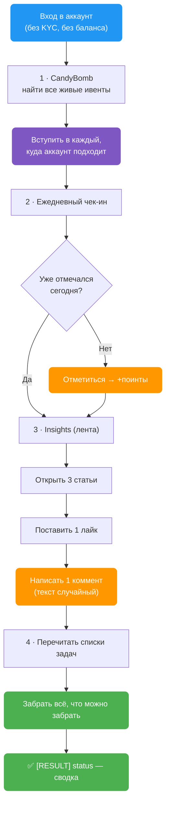
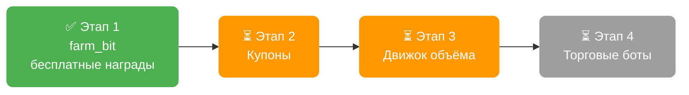

> 🔒 **Секретный функционал.** Никому не показывается. Ссылки на страницу нет ни в меню, ни в поиске — никто её не увидит.
>
> **Проверено на живом аккаунте 27.07.2026** — прошёл весь цикл целиком, аккаунт цел, сессия не порвалась.

`farm_bit` забирает **всё, за что Bitget платит новому аккаунту, не открывая ни одной сделки**. Ни одного ордера, ни одной комиссии, ни рубля риска.

---

## 🧭 Как устроены награды Bitget

У Bitget четыре «кассы», из которых новичок может забрать деньги:

| Касса | Что даёт | Нужна торговля? |
|---|---|---|
| **CandyBomb** | доля от призового пула ивента | Да |
| **Rewards Center** | поинты, которые меняются на USDT | Частично |
| **Coupon Center** | ваучеры — торговая маржа биржи | Да |
| **Ежедневные бесплатные задачи** | чек-ин, лайк, коммент, чтение статей | **Нет** |

`farm_bit` берёт **четвёртую кассу целиком** и **вход в первую** — регистрацию в ивентах. Торговый объём — следующий этап, см. [план](#-план-развития).

### Почему регистрация в ивентах решает

Ивентов CandyBomb одновременно идёт три-четыре, и требования у них разные: один хочет объём по крипте, другой по акциям, третий по сырью. Человек вручную обычно вступает в один — и потом торгует то, что подходило бы сразу под несколько.

Комиссии платятся один раз. Награда приходит только с того ивента, куда успел вступить.

> 💡 `farm_bit` перечисляет все живые ивенты и вступает в каждый, куда аккаунт подходит. Тот же объём — выплата с нескольких ивентов вместо одного.

---

## ⚙️ Что делает, по шагам



### 1 · CandyBomb — вступить во все ивенты

Находит активные ивенты и вступает в каждый, где аккаунт ещё не зарегистрирован. Ничего не стоит и ни к чему не обязывает — но без этого шага объём, набитый позже, не засчитается.

### 2 · Ежедневный чек-ин

Отмечается в ежедневной акции. Сначала проверяет, не отмечался ли уже сегодня — повторно не дёргает.

Лесенка наград за 7 дней подряд: `+3 → +5 → +10 → +10 → +10 → +15 → сундук`.

### 3 · Три ежедневных задачи Insights

| Задача | Что нужно | Поинтов |
|---|---|---|
| Community browsing | открыть **3 статьи** | 2 |
| Community likes | **1 лайк** | 1 |
| Community comments | **1 коммент** | 2 |

Итого **5 поинтов в день** за пару секунд работы.

> 🎲 **Комментарии не повторяются.** Текст берётся случайно из встроенного пула — на десятках профилей не будет одинаковых сообщений под одной статьёй.

### 4 · Забрать все поинты

Перечитывает списки задач и забирает награду по каждой выполненной. Сюда попадают не только задачи Insights, но и всё, что аккаунт успел выполнить раньше: регистрация, первый депозит, первая сделка, дневные задачи по торговле.

---

## ⚙️ Параметры `AutoPilot.config`

**Все ключи необязательные.** Не добавили ни одного — действие отработает полный проход. Ключи нужны только чтобы что-то отключить или замедлить.

| Ключ | Описание | По умолчанию |
|------|----------|--------------|
| `farm_candybomb` | Вступать в ивенты CandyBomb. `NO` — пропустить шаг | `YES` |
| `farm_checkin` | Ежедневный чек-ин | `YES` |
| `farm_insights` | Задачи Insights: 3 статьи + лайк + коммент | `YES` |
| `farm_claim` | Забирать поинты по выполненным задачам | `YES` |
| `farm_delay` | Пауза между действиями в секундах, случайная из диапазона | `1,3` |
| `farm_comments` | Свой пул комментариев, варианты через `\|` | встроенный пул |

### Как читаются значения

- **Выключатели** понимают `YES` / `Y` / `1` / `true` как «включено» и `NO` / `N` / `0` / `off` как «выключено». Пустое значение или отсутствие ключа = **включено**.
- **`farm_delay`** — ровно два числа через запятую, первое не больше второго. Одно число, перевёрнутый диапазон или мусор — молча откатывается к `1,3`, действие не падает.
- **`farm_comments`** — если задан, встроенный пул не используется вообще. Один вариант тоже допустим, но тогда все профили напишут одно и то же.

> ⚙️ **Что с чем сочетать.** Хотите только регистрацию в ивентах, без активности в ленте — `farm_insights=NO`. Аккаунт уже отмечался сегодня вручную — `farm_checkin=NO` (хотя действие и само это проверяет). Нужен более «человеческий» темп на больших пачках профилей — поднимите `farm_delay`, например `5,15`.

> 🔎 В начале прогона в лог пишется строка с тем, какие шаги включены и какая задержка выбрана — сразу видно, что конфиг прочитался как ожидалось.

---

## 🛡️ Почему это безопасно

- **Ноль ордеров.** Действие физически не умеет торговать. Потерять деньги на комиссиях или движении цены невозможно.
- **Не нужен ни баланс, ни KYC.** Работает на пустом свежем аккаунте.
- **Повторный запуск безвреден.** Чек-ин проверяется перед отметкой, задачи забираются только невостребованные.
- **Одна упавшая часть не роняет остальные.** Если лента Insights не ответила — чек-ин и сбор поинтов всё равно отработают.
- **Сессия не рвётся.** Действие спроектировано так, чтобы не провоцировать разлогин при спорных ответах биржи. Проверено живьём: после полного прогона аккаунт остался в сессии.

---

## 📋 Полный блок для `AutoPilot.config`

Скопируйте блок в свой `AutoPilot.config`. Каждый параметр с комментарием — в стиле остального конфига.

> ℹ️ **Можно не копировать вообще.** Значения ниже совпадают с дефолтными: без этого блока действие работает точно так же. Блок нужен, если хотите что-то отключить или изменить темп.

```ini
# ============ FARM_BIT — фарм наград Bitget без торговли ============
# Вступать во все активные ивенты CandyBomb, куда подходит аккаунт. NO = пропустить шаг.
farm_candybomb=YES
# Ежедневный чек-ин. Действие само проверяет, не отмечался ли аккаунт сегодня.
farm_checkin=YES
# Задачи Insights: открыть 3 статьи, поставить 1 лайк, написать 1 коммент.
farm_insights=YES
# Забирать поинты по всем выполненным и невостребованным задачам.
farm_claim=YES
# Пауза между действиями в секундах, случайная из диапазона. Мусор или один
# число — откатывается к 1,3. Для больших пачек профилей имеет смысл поднять.
farm_delay=1,3
# Свой пул комментариев, варианты разделяются символом "|". Если пусто —
# используется встроенный пул. Не ставьте один вариант на всю пачку профилей.
farm_comments=
```

**Пример «только ивенты, без активности в ленте»** — аккаунт вступает в акции и забирает поинты, но ничего не пишет и не лайкает:

```ini
farm_candybomb=YES
farm_checkin=YES
farm_insights=NO
farm_claim=YES
farm_delay=3,8
```

**Пример со своими комментариями:**

```ini
farm_comments=Спасибо за разбор|Полезно, спасибо|Интересный взгляд|Согласен, наблюдаю за этим
```

---

## 📊 Что вписывать в Excel-таблицу

| Действие | Колонка `[ACTION] action` | Дополнительные колонки |
|----------|---------------------------|------------------------|
| `farm_bit` | `farm_bit` | **нет** |

Плюс базовые колонки профиля, как у любого другого действия Bitget:

| Колонка | Что туда идёт |
|---------|---------------|
| `[PROFILE] profile_id` | ID профиля в антидетект-браузере |
| `[PROFILE] mail` | почта аккаунта Bitget |
| `[PROFILE] bitget_password` | пароль аккаунта |

Больше ничего заполнять не нужно — ни кодов ивентов, ни сумм, ни монет. Действие само находит, во что вступать и что забирать.

**Пример строки:**

| `[PROFILE] profile_id` | `[PROFILE] mail` | `[PROFILE] bitget_password` | `[ACTION] action` |
|---|---|---|---|
| `k1eo727t` | `user@icloud.com` | `••••••••` | `farm_bit` |

### Что появится в результате

По окончании прогона действие пишет сводку в `[RESULT] status`:

```
[FARM_BIT] SUCCESS - joined 3 event(s), check-in +5, browsed 3/3, liked 1,
           commented 1, claimed 4 task(s), ~14 points
```

| Часть строки | Что означает |
|---|---|
| `joined 3 event(s)` | вступил в 3 ивента CandyBomb |
| `check-in +5` | чек-ин дал 5 поинтов |
| `browsed 3/3` | открыл 3 статьи из 3 нужных |
| `liked 1` / `commented 1` | лайк и коммент прошли |
| `claimed 4 task(s)` | забрал награду по 4 задачам |
| `~14 points` | суммарно поинтов за прогон |

Если у профиля моргнула сеть или прокси, статус будет `PARTIAL` с числом сбоев — так видно, что нули означают «не смогли проверить», а не «нечего было забирать»:

```
[FARM_BIT] PARTIAL - joined 1 event(s), check-in +5, browsed 0/3, liked 0,
           commented 0, claimed 2 task(s), ~7 points, 3 network error(s)
```

Упавший шаг не роняет остальные — подробности по каждому пишутся в лог профиля.

---

## 🗺️ План развития

### Этап 1 — `farm_bit` · проверен на живом аккаунте

Полный прогон 27.07.2026 на реальном профиле, без единого ордера:

| Шаг | Результат |
|---|---|
| CandyBomb | нашёл 3 живых ивента: в один вступил, в одном уже был, в третий аккаунт не подходил по условиям |
| Чек-ин | отметился, +5 поинтов |
| Insights | 3 статьи + лайк + коммент — все три задачи стали доступны к получению |
| Сбор наград | забрал поинты по выполненным задачам |

Аккаунт после прогона в норме, сессия жива.

Заодно нашлись и закрыты две вещи, которые видно только на живом прогоне:

- **Сеть у профилей моргает.** Обычный запрос отвечает за полсекунды, но дважды за пять минут связь пропадала секунд на сорок и восстанавливалась сама. Действие теперь переживает такие провалы, а если не пережило — честно пишет `PARTIAL`, а не бодрый `SUCCESS` с нулями.
- **Считали награду завышенно.** У части задач награда за получение через сайт и через приложение разная. Теперь в отчёт идёт та сумма, которую реально даёт наш путь.

### Этап 2 — Coupon Center

Купонные задачи нужно принимать заранее, иначе они не засчитываются — та же логика, что со вступлением в ивенты. Дальше — получение и применение ваучеров.

### Этап 3 — движок объёма

Ключевой этап: всё, что платит крупно, требует торгового оборота — доли в CandyBomb, купоны, дневные и разовые торговые задачи.

Механика дешёвая: открыть небольшую позицию и сразу закрыть. Теряется только комиссия — порядка **0.05–0.08 %** от размера позиции. Один прогон по трём инструментам (крипта, акция, сырьё) закрывает сразу несколько ивентов и купонов.

### Этап 4 — торговые боты

Отдельная группа задач требует создать бота и подержать сутки.

### Итоговая картина



Принципиальных технических препятствий по этапам 2–4 нет — механика разобрана, дело за реализацией и обкаткой.
