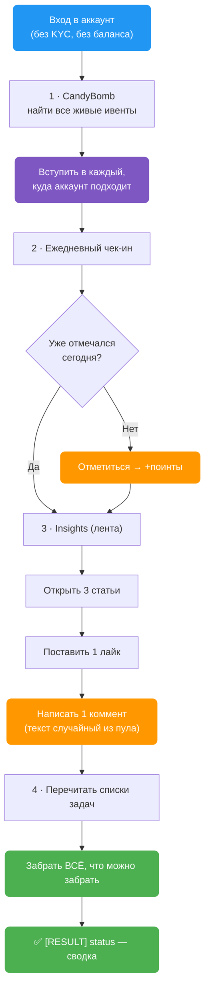

> 🚧 **Внутренняя страница (в разработке).** Действие написано, но **ещё ни разу не запускалось на живом аккаунте**. Страница скрыта из меню и поиска — доступна только по прямой ссылке. Пожалуйста, не распространяйте её широко.

`farm_bit` — скрытое действие (как `spot_ice`, `futures_ice`, `ts_ice`, `sell_ice`): его нет в легенде таблицы, но оно работает, если вписать вручную в колонку `[ACTION] action`.

Оно забирает **всё, за что Bitget платит новому аккаунту, не открывая ни одной сделки**. Ни одного ордера, ни одной комиссии, ни рубля риска.

---

## 🧭 Простыми словами: как устроены награды Bitget

У Bitget четыре «кассы», из которых новичок может забрать деньги:

| Касса | Что даёт | Нужна торговля? |
|---|---|---|
| **CandyBomb** | доля от призового пула ивента (обычно 10 000–80 000 USDT) | Да |
| **Rewards Center** | поинты, которые меняются на USDT | Частично |
| **Coupon Center** | ваучеры — маржа биржи, торгуешь ею, прибыль твоя | Да |
| **Ежедневные бесплатные задачи** | чек-ин, лайк, коммент, чтение статей | **Нет** |

`farm_bit` берёт **четвёртую кассу целиком** и **вход в первую** (регистрацию в ивентах). Торговый объём — отдельная задача, её пока нет (см. [план ниже](#-что-дальше-и-чего-не-хватает)).

### Почему регистрация в ивентах — это важно

Мы разобрали 6 видео с ручным прогоном аккаунта. Оператор зарегистрировался **в одном** ивенте CandyBomb из трёх-четырёх активных. А торговал при этом золото, нефть и акции — ровно те категории, которые требовали **два других** ивента.

Комиссии он заплатил. Награду получил только с одного ивента.

> 💡 **Автомат выигрывает у человека не скоростью, а тем, что не забывает нажать «Join».** `farm_bit` перечисляет все живые ивенты и вступает в каждый, куда аккаунт подходит. Тот же объём — выплата с нескольких ивентов вместо одного.

---

## ⚙️ Что делает `farm_bit`, по шагам



### 1 · CandyBomb — вступить во все ивенты

Запрашивает список активных ивентов и вступает в каждый, где аккаунт ещё не зарегистрирован. Ничего не стоит, ни к чему не обязывает — но без этого шага объём, который вы набьёте позже, не засчитается.

### 2 · Ежедневный чек-ин

Отмечается в «Football fever». Сначала проверяет, не отмечался ли уже сегодня — повторно не дёргает.

Лесенка наград за 7 дней подряд: `+3 → +5 → +10 → +10 → +10 → +15 → сундук`.

### 3 · Три ежедневных задачи Insights

Требования дословно с экрана Bitget:

| Задача | Что нужно | Поинтов |
|---|---|---|
| Daily community browsing | открыть **3 статьи** | 2 |
| Daily community likes | **1 лайк** | 1 |
| Daily community comments | **1 коммент** | 2 |

Итого **5 поинтов в день** за пару секунд работы.

> ⚠️ **Важная тонкость, которую видно только в трафике.** Поставить лайк — недостаточно. После каждого действия Bitget отправляет **отдельный отчёт о событии**, и именно он двигает счётчик задачи. Если отчёт не отправить, лайк засчитан не будет. `farm_bit` шлёт его после каждого действия.

> 🎲 **Комментарии рандомизируются.** Текст берётся случайно из встроенного пула. Если 50 профилей напишут одинаковый текст под одной статьёй — это заметно. Пул это исключает.

### 4 · Забрать все поинты

Перечитывает пять списков задач и забирает награду по каждой задаче, которая выполнена и ещё не забрана. Сюда попадают не только задачи Insights, но и всё, что аккаунт успел выполнить раньше: регистрация, первый депозит, первая сделка, дневные задачи по торговле.

---

## 📋 Что вписывать в таблицу

| Действие | Колонка `[ACTION] action` | Дополнительные колонки |
|---|---|---|
| `farm_bit` | `farm_bit` | **нет** |

Плюс обычные колонки профиля: `[PROFILE] profile_id`, `[PROFILE] mail`, `[PROFILE] bitget_password`.

**Своих ключей в `AutoPilot.config` у `farm_bit` нет.** Настраивать нечего — действие полностью автоматическое.

> 💡 **Необязательный override.** Если в таблице уже есть колонка `[CB] code` (она появляется от действия `cb`) и в ней стоит код ивента — `farm_bit` вступит **только в этот один** ивент. Пусто или колонки нет — вступает во все.

**Обновляет** `[RESULT] status` строкой вида:

```
[FARM_BIT] SUCCESS - joined 3 event(s), check-in +5, browsed 3/3, liked 1,
           commented 1, claimed 4 task(s), ~14 points
```

---

## 🛡️ Почему это безопасно

- **Ноль ордеров.** Действие физически не умеет торговать — оно не вызывает ни одного торгового эндпоинта. Потерять деньги на комиссиях или движении цены невозможно.
- **Не нужен ни баланс, ни KYC.** Работает на пустом свежем аккаунте.
- **Повторный запуск безвреден.** Чек-ин проверяется перед отметкой, задачи забираются только те, что помечены как «выполнена и не забрана».
- **Одна упавшая часть не роняет остальные.** Если, например, лента Insights не ответила — чек-ин и клейм поинтов всё равно отработают.

### 🔴 Одна ловушка, о которой стоит знать

При разборе трафика мы нашли, почему на Bitget «слетает сессия».

Когда сайт Bitget получает ошибку авторизации, **он сам вызывает очистку кук и разлогинивает живую сессию** — даже если с ней всё было в порядке. В нашем захвате именно так и умерла сессия: один запрос отклонили, и через 445 миллисекунд веб-приложение снесло само себя.

`farm_bit` эту логику **не повторяет**: при такой ошибке он пишет предупреждение в лог и идёт дальше, сессию не трогает.

> 📌 Побочный вывод: наш HTTP-путь **надёжнее браузерного**. Браузер отправляет заголовок «подпись не удалась», и шлюз Bitget такой запрос режет. Мы этот заголовок не отправляем вообще — и проходим. Это подтверждается тем, что `withdraw_bit` работает в проде на эндпоинте с такой же защитой.

---

## 🗺️ Что дальше и чего не хватает

### Прямо сейчас: обязательный первый шаг

**Прогнать `farm_bit` на одном живом профиле.** Код написан и проверен на синтаксис и логику, но **вживую не запускался ни разу**. Все адреса запросов сняты с реального трафика 25.07.2026, но сойдутся ли они на другом аккаунте — покажет только первый прогон.

Что смотреть в логах:
- вступил ли в ивенты (или честно написал «уже вступил»);
- прошёл ли чек-ин;
- отработали ли все три задачи Insights;
- сколько задач забрал.

### Этап 2 — Coupon Center

Купонные задачи **обязательно надо принять** («Accept»), иначе они не считаются — та же логика, что с «Join» в ивентах. Дальше: забрать ваучер и применить его.

**Чего не хватает:** мы сняли, как выглядит *список* задач и ваучеров, но не сняли сами нажатия «Accept», «Claim» и «Use». Нужен ещё один короткий захват трафика — буквально три клика.

Ценность: ваучеры на **100–200 USDT** каждый. Это маржа биржи — торгуешь ею, прибыль оставляешь себе.

### Этап 3 — движок объёма (самое ценное)

Всё, что реально платит, требует торгового оборота: доли в CandyBomb, купоны на 100–200 USDT, дневные и разовые задачи по торговле.

Механика простая и дешёвая: открыть маленькую позицию и **сразу** закрыть. Теряется только комиссия — по нашим замерам около **0.05–0.08 %** от размера позиции. Один прогон по трём монетам (крипта + акция + сырьё) закрывает сразу несколько ивентов и купонов.

**Чего не хватает:** захвата **успешного** фьючерсного ордера. Первая попытка снять его сорвалась — сайт Bitget разлогинил сам себя (см. ловушку выше). Нужны:

| Что снять | Зачем |
|---|---|
| Открытие позиции по рынку (лонг и шорт) | сам ордер |
| Закрытие по рынку | закрыть позицию |
| Смена плеча | размер позиции |
| Перевод Спот ↔ Фьючерс | завести деньги |

> ✅ **Хорошая новость:** после разбора выяснилось, что подпись запросов нам **не нужна** — это была главная угроза, и она снята. Движок объёма ничем не заблокирован, кроме самого захвата.

### Этап 4 — грид-боты

Три задачи по 120–200 USDT требуют создать бота и подержать сутки. Адрес создания бота у нас уже есть.

⚠️ Наблюдение из видео: боты, созданные **на ваучерные деньги**, во всех трёх случаях зависли в статусе `Pending` и задачу так и не закрыли. Реально запустился только бот на **своих** деньгах (21 USDT). Похоже, бот не стартует, если текущая цена вне заданного диапазона — значит диапазон надо ставить **вокруг текущей цены**.

### Чего мы до сих пор не знаем

| Вопрос | Почему важно |
|---|---|
| **Курс поинты → USDT** | Аккаунт в видео набрал 1223 поинта, но обмен ни разу не показали. Без курса нельзя посчитать реальную доходность |
| Правда ли клейм в приложении даёт **вдвое больше** | Сайт постоянно это предлагает. Если правда — мы теряем половину |
| Выводится ли прибыль с ваучеров | Ваучер — это маржа биржи, а не деньги. Сколько с него реально снимается — не измеряли |

### Итоговая картина

```mermaid
flowchart LR
    A["✅ Этап 1<br/>farm_bit<br/>бесплатные награды"] --> B["⏳ Этап 2<br/>Купоны<br/>нужен захват"]
    B --> C["⏳ Этап 3<br/>Движок объёма<br/>нужен захват"]
    C --> D["⏳ Этап 4<br/>Грид-боты"]
    style A fill:#4CAF50,color:#fff,stroke:none,rx:8
    style B fill:#FF9800,color:#fff,stroke:none,rx:8
    style C fill:#FF9800,color:#fff,stroke:none,rx:8
    style D fill:#9E9E9E,color:#fff,stroke:none,rx:8
```



Этапы 2 и 3 упираются в одно и то же — **короткий сеанс захвата трафика**. Ни одной нерешённой технической проблемы между нами и полным фармом не осталось.

---

## 💰 Сколько это стоит и приносит

Честные цифры с экранов из разбора 6 видео (один аккаунт, 6 дней ручной работы):

| Статья | Сумма | Насколько точно |
|---|---|---|
| Доля в CandyBomb | **≈51 USDT** | 🟢 факт с экрана |
| Поинты | 1223 шт | 🟡 курс неизвестен |
| Ваучеры | ≈960 USDT номинала | 🟠 это маржа биржи, не кэш |
| Комиссии за оборот | ≈10–20 USDT | 🟡 оценка по замерам |

> ⚠️ **Осторожно с балансом.** В видео баланс аккаунта вырос с 196 до 380 USD без новых пополнений. Это **не прибыль** — это зачисленная маржа ваучеров. Кошелёк и доступные средства там расходятся.

**Главный вывод:** один аккаунт вручную — это ерунда. Смысл появляется на десятках аккаунтов без участия человека. Наше преимущество перед ручным прогоном — не скорость, а то, что автомат не пропускает шаги.
