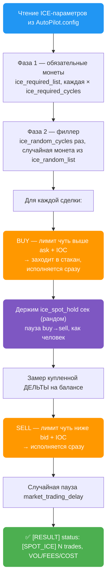
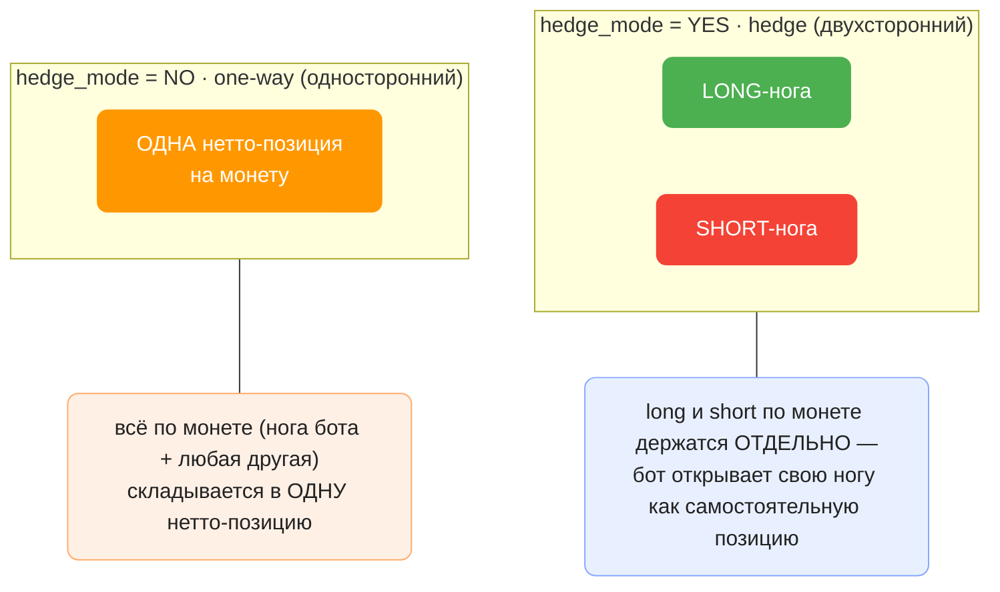
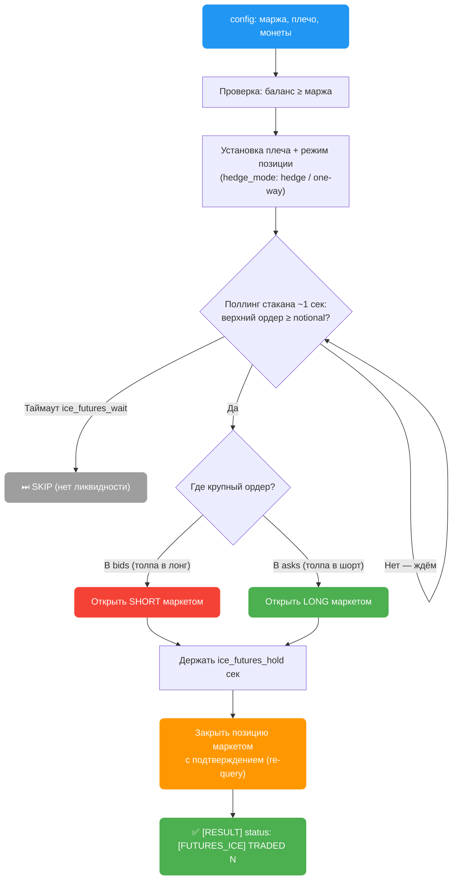
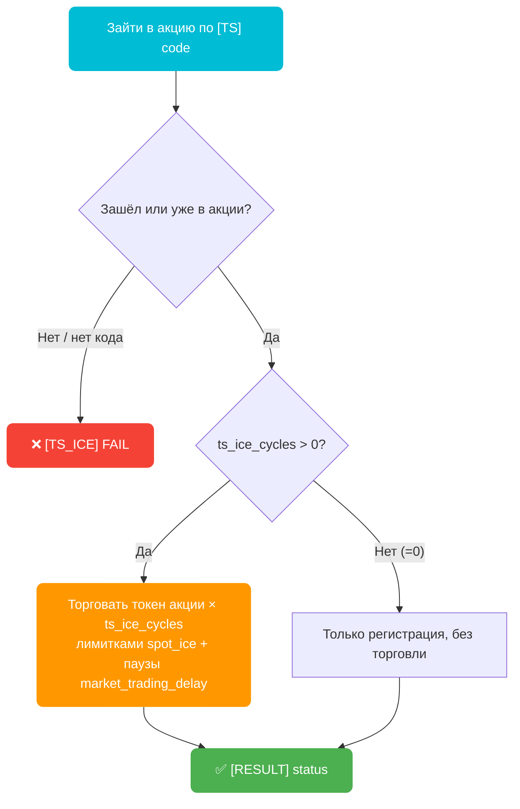

> 🚧 **Внутренняя страница (в разработке).** ICE-режимы ещё дорабатываются и тестируются. Страница скрыта из меню и поиска — доступна только по прямой ссылке. Пожалуйста, не распространяйте её широко.

Семейство из четырёх действий — `spot_ice`, `futures_ice`, `ts_ice`, `sell_ice` — для естественного набива торгового объёма под биржевые акции и промо-ивенты. Все ордера исполняются **мгновенно** (лимитки заходят прямо в стакан), а между действиями стоят **случайные задержки** — поведение выглядит человеческим.

> ⚠️ Как и `limit`, параметры ICE-режимов читаются **из `AutoPilot.config`**, а не из колонок `[TRADING]` Excel-таблицы. Из таблицы используются только базовые колонки для входа: `[PROFILE] profile_id`, `[PROFILE] mail`, `[PROFILE] bybit_password`, `[BYBIT] domain`, `[ACTION] action`. Дополнительно `ts_ice` требует колонку `[TS] code`.

## Общие параметры (действуют во всех четырёх режимах)

| Ключ | Описание | Пример |
|------|----------|--------|
| `market_trading_delay` | Случайная пауза в секундах **после каждого действия** (покупка, продажа, цикл). Работает во всех ICE-режимах, включая `ts_ice` и `sell_ice` | `30,60` |
| `ice_dryrun` | `YES` — бот всё рассчитывает по живому стакану, пишет в лог **и считает объём/комиссию/стоимость** (бэктест, см. ниже), но **ордера НЕ отправляет**. `NO` — реальная торговля | `NO` |
| `ice_spot_fee` | Ставка спот-комиссии (taker) в **%** для расчёта экономики. Меняйте только при нестандартном тарифе | `0.1` |
| `ice_futures_fee` | Ставка фьючерс-комиссии (taker) в **%** для расчёта экономики | `0.055` |
| `ice_order` | Размер одной **спот**-сделки в USDT, случайный из диапазона (для `spot_ice`, `ts_ice`, `sell_ice`) | `70,100` |
| `ice_spot_offset` | На сколько % заходить в стакан, чтобы лимитка исполнилась мгновенно (buy чуть выше ask / sell чуть ниже bid) | `0.1` |

> 💡 **Всегда начинайте с `ice_dryrun=YES`.** Прогоните действие на одном профиле, убедитесь по логам, что бот выбирает правильную сторону и размер, и только потом ставьте `ice_dryrun=NO`. Особенно важно для `futures_ice` (живые деньги + плечо).

### 📊 Бэктест: объём, комиссии и стоимость набива

`ice_dryrun=YES` — это не просто «сухой прогон», а полноценный **бэктест 1:1 с реальной торговлей**: цены берутся из **живого стакана** (как в бою), проходят те же проверки, но ордер не отправляется. Дополнительно бот считает **экономику** каждой сделки и выводит итог — сколько объёма набьётся и во сколько это обойдётся, ещё до того как потрачен хоть один доллар.

По каждому режиму в лог пишется строка `SUMMARY`, а в `[RESULT] status` — краткая сводка:

- **VOL** — суммарный биржевой **оборот** (объём), который набьётся. Это то, ради чего запускается ICE.
- **FEES** — **комиссия** биржи (taker), которую съест этот оборот.
- **COST** (spot / ts / sell) — **чистая стоимость** набива = спред+офсет + комиссия (сколько реально «сгорит» за оборот).

**Ставки комиссии** (taker; все ICE-ордера исполняются как IOC/маркет, значит всегда taker, maker-ноги нет):

| Ключ | Что | По умолчанию |
|------|-----|--------------|
| `ice_spot_fee` | Спот taker, **%** | `0.1` |
| `ice_futures_fee` | Фьючерс taker, **%** | `0.055` |

> 💡 Те же ставки применяются и в **live**-логах — строка `SUMMARY` считается одинаково в dry и в бою (один источник правды). Меняйте `ice_spot_fee`/`ice_futures_fee` **только** если у аккаунта нестандартный тариф (VIP / скидка за BNB-подобный токен).
>
> ⚠️ Для `futures_ice` PnL от движения цены в оценку **не входит** (это live-only, предсказать нельзя) — считается только гарантированная стоимость (комиссия за открытие+закрытие).
>
> ⏱️ **Тайминги в dry настоящие.** Прогон соблюдает реальные задержки — удержание между покупкой и продажей (`ice_spot_hold` / `ice_futures_hold`) и паузы между сделками (`market_trading_delay`), — чтобы бэктест шёл в том же темпе, что и бой.

---

## `spot_ice` — набив спот-объёма лимитками (мгновенно)

Покупает и тут же продаёт монету лимитными ордерами, которые заходят в стакан и исполняются сразу — как маркет, но ордером типа «лимит». **Наценки нет** (цель — оборот, не прибыль). Продаёт **только то, что купил в этой сделке** (существующие остатки монеты на балансе не трогает).

**Параметры из `AutoPilot.config`:**

| Ключ | Описание | Пример |
|------|----------|--------|
| **Требует** `ice_required_list` | Обязательные монеты (нужные для акции). Торгуются ВСЕ, всегда. Пусто = фаза пропускается | `XRP` |
| Опционально `ice_required_cycles` | Циклов на каждую обязательную монету. Одно число всем, или per-coin `3,2` (1-я монета 3 раза, 2-я 2 раза) | `1` |
| **Требует** `ice_random_list` | Филлер-монеты. Бот берёт случайную из списка на каждую сделку. Пусто = фаза пропускается | `BTC,ETH,SOL` |
| Опционально `ice_random_cycles` | Сколько случайных сделок за прогон. Число или диапазон `1,3` | `2` |
| Опционально `ice_spot_hold` | Держать монету **между покупкой и продажей**, сек (диапазон, рандом) — как `ice_futures_hold` у фьючерсов. Делает паузу buy→sell человеческой, а не фиксированной. По умолчанию `3,8` | `3,8` |
| `ice_order`, `ice_spot_offset`, `market_trading_delay` | См. общие параметры выше | — |

**Из Excel:** только базовые колонки + `[ACTION] action=spot_ice`.
**Обновляет:** `[RESULT] status` — `[SPOT_ICE] <кол-во> trades, VOL ~<оборот>, FEES ~<комиссия>, COST ~<стоимость> USDT (монеты)`. В dry добавляется метка `[DRY]`.



**Пример конфигурации:**

```ini
ice_required_list=XRP
ice_required_cycles=1
ice_random_list=BTC,ETH,SOL
ice_random_cycles=2
ice_order=70,100
ice_spot_offset=0.1
ice_spot_hold=3,8
market_trading_delay=30,60
ice_dryrun=NO
```

Что произойдёт: сначала бот один раз отторгует XRP (обязательная монета акции), затем сделает 2 случайные сделки из [BTC, ETH, SOL]. Каждая сделка — покупка на 70–100 USDT, **удержание 3–8 сек** (`ice_spot_hold`), затем продажа; между сделками пауза 30–60 сек (`market_trading_delay`).

---

## `futures_ice` — фьючерсы: «фейд» крупного ордера в стакане

### 🧭 Что такое «фейд» простыми словами

**Фейд (fade)** — это торговля **против** видимого движения рынка. Не «вместе с толпой», а **навстречу** ей.

Стакан заявок (orderbook) — очередь из тех, кто хочет купить (**bids**) и продать (**asks**). Когда на **вершине** стакана всплывает **один очень крупный ордер**, кто-то большой давит в одну сторону — и бот ставит наоборот:

- Гигантский ордер на **покупку** (в bids) → толпа тарит вверх → бот открывает **ШОРТ**.
- Гигантский ордер на **продажу** (в asks) → толпа льёт вниз → бот открывает **ЛОНГ**.

**Зачем против?** Крупные заявки часто «съедаются», после чего цена откатывает — фейд ловит этот короткий откат. Плюс так набивается **естественный двухсторонний объём** (иногда лонг, иногда шорт, а не однобоко) — выглядит человечнее.

> 🎣 **Аналогия:** толпа ломится в одну дверь. Ты не толкаешься с ней, а заходишь сбоку в момент, когда напор выдохся. Держишь пару секунд — выходишь.

### ⚙️ Как это делает бот

Опрашивает **вершину стакана** примерно раз в секунду. Как только **один** верхний ордер по размеру (цена × объём) ≥ размера твоей позиции — бот фейдит его: открывает **маркетом** с плечом противоположную сторону, держит несколько секунд и **закрывает маркетом** (с перепроверкой, что позиция реально закрылась). Только **ликвидные** монеты (BTC, ETH). Если за `ice_futures_wait` секунд крупный ордер не появился — монета пропускается.

> ⚠️ **Живые деньги + кредитное плечо.** Сначала обязательно `ice_dryrun=YES` и мелкий `ice_futures_order` (напр. `10,20`), только потом в бой.

**Параметры из `AutoPilot.config`:**

| Ключ | Описание | Пример |
|------|----------|--------|
| **Требует** `ice_futures_list` | Монеты (только ликвидные). Пусто = берётся `ice_random_list` | `BTC,ETH` |
| **Требует** `ice_futures_order` | **МАРЖА** в USDT (диапазон, рандом). Позиция (notional) = маржа × `leverage` | `10000,15000` |
| **Требует** `leverage` | Кредитное плечо (2–100) | `10` |
| Опционально `ice_futures_cycles` | Циклов на монету (открыть+закрыть). Число или per-coin | `1` |
| Опционально `ice_futures_wait` | Сколько ждать появления крупного ордера (сек), потом пропуск монеты | `300` |
| Опционально `ice_futures_hold` | Держать позицию перед закрытием, сек (диапазон) | `5,20` |
| Опционально `hedge_mode` | `YES` = hedge (двухсторонний), `NO` = one-way. **По умолчанию `NO`** | `NO` |
| `market_trading_delay`, `ice_dryrun` | См. общие параметры | — |

**Из Excel:** только базовые колонки + `[ACTION] action=futures_ice`.
**Обновляет:** `[RESULT] status` — `[FUTURES_ICE] TRADED <кол-во> (монеты:сторона), VOL ~<оборот>, FEES ~<комиссия> USDT`. В dry — метка `[DRY]`. При проблеме с закрытием добавляется `WARN N CLOSE-FAILED (open positions!)`.

### 🛡️ `hedge_mode` — режим позиции на фьючерсах

Управляет тем, **как биржа держит твою позицию** по монете. **По умолчанию `NO` (one-way)** — проще и на один запрос меньше.

| | `hedge_mode=YES` — hedge | `hedge_mode=NO` — one-way |
|---|---|---|
| Позиции по монете | long и short **раздельно** (две ноги) | **одна** нетто-позиция на монету |
| Нога бота | открывается как **отдельная** позиция (long → idx 1, short → idx 2) | общая нетто-позиция (idx 0) |
| Переключение режима | да — бот ставит hedge перед входом (если уже стоит — тихо пропускает) | нет, режим не трогает |
| В двух словах | две стороны живут независимо | всё по монете = один нетто |



В обоих режимах бот **сам закрывает** свою позицию после удержания и перепроверяет запросом, что она реально закрылась.



**Пример конфигурации:**

```ini
ice_futures_list=BTC,ETH
ice_futures_order=10000,15000
leverage=10
ice_futures_cycles=1
ice_futures_wait=300
ice_futures_hold=5,20
hedge_mode=NO
market_trading_delay=30,60
ice_dryrun=YES
```

Здесь маржа 10 000–15 000 USDT × плечо 10 = позиция 100k–150k. Бот ждёт в стакане BTC/ETH одиночный ордер такого размера и входит против него. **Для теста** ставьте `ice_futures_order=10,20` (позиция всего 100–200 USDT) и `ice_dryrun=YES`.

---

## `ts_ice` — TokenSplash: вход в акцию + торговля токена

Заходит в акцию **TokenSplash** по коду из колонки `[TS] code`, затем торгует токен акции спот-лимитками (та же мгновенная логика, что у `spot_ice`) с паузами между сделками.

**Параметры:**

| Параметр | Где | Описание | Пример |
|----------|-----|----------|--------|
| **Требует** `[TS] code` | Excel-колонка | Код акции TokenSplash | `20241217064550` |
| Опционально `ts_ice_cycles` | `AutoPilot.config` | Сколько раз торговать токен. **`0` = только зайти в акцию, без торговли** | `2` |
| `ice_order`, `ice_spot_offset`, `ice_spot_hold`, `market_trading_delay` | `AutoPilot.config` | Размер, заход в стакан, удержание buy→sell, паузы (всё как у `spot_ice`) | — |

**Из Excel:** базовые колонки + `[TS] code` + `[ACTION] action=ts_ice`.
**Обновляет:** `[RESULT] status` — `[TS_ICE] <токен> - REGISTERED/ALREADY JOINED, traded Nx, VOL ~<оборот>, FEES ~<комиссия>, COST ~<стоимость> USDT`. В dry — метка `[DRY]`.



> ✅ **Да, `ts_ice` с задержками** — после каждой сделки токеном бот ждёт случайное время из `market_trading_delay`.

---

## `sell_ice` — распродажа остатков с паузами

Сливает все не-USDT монеты с баланса по очереди, marketable-лимитками (исполняются мгновенно), **с паузой между каждой продажей**. Удобно дочистить остатки после набива объёма.

> 👀 **Видит ВСЕ монеты, включая Funding.** Перед распродажей бот сначала переводит все монеты из **Funding-аккаунта в Trading** (как action `sell`), поэтому остатки, лежащие вне торгового кошелька, тоже продаются. В dry-режиме перевод не делается — Funding показывается только для предпросмотра (что было бы продано). В конце «пыль» (суб-тиковые остатки) конвертируется в USDT, чтобы аккаунт ушёл в ~0.

**Параметры из `AutoPilot.config`:** своих ключей нет — использует `ice_spot_offset` (заход в стакан), `market_trading_delay` (паузы), `ice_dryrun`.

**Из Excel:** только базовые колонки + `[ACTION] action=sell_ice`.
**Обновляет:** `[RESULT] status` — `[SELL_ICE] SOLD <продано>/<всего> coins, VOL ~<оборот>, FEES ~<комиссия> USDT (монеты)`. В dry — метка `[DRY]`. Если сконвертирована «пыль» — добавляется примечание.

> ✅ **Задержки работают** — пауза после каждой проданной монеты.

---

## Порядок безопасного запуска (для всех ICE-режимов)


## Полный блок для `AutoPilot.config`

Скопируйте ICE-блок в свой `AutoPilot.config`. Каждый параметр с комментарием — в стиле оригинального конфига.

> ℹ️ **`market_trading_delay` и `leverage` уже есть** в вашем `AutoPilot.config` (общие для других действий) — **не добавляйте второй раз**. Второй `leverage=` перетрёт первый (readConfig берёт последнее значение).
>
> ⚠️ **Не удаляйте `ice_futures_order`** — без него маржа фьючерса тихо падает на `ice_order` (позиция ~700–1000 вместо 100k–150k при 10x).

```ini
# ============ SPOT_ICE — набив объёма лимитками по цене маркета (мгновенно, IOC) ============
# Обязательные монеты (для акции) — торгуются ВСЕ, всегда. Пусто = фаза скипается.
ice_required_list=XRP
# Циклов на каждую обязательную монету. Одно число всем; per-coin "3,2" = позиционно по списку.
ice_required_cycles=1
# Филлер-объём — рандом-выбор монеты из списка каждую сделку. Пусто = фаза скипается.
ice_random_list=BTC,ETH,SOL
# Сколько рандом-сделок за прогон. Одно число или диапазон "1,3".
ice_random_cycles=2
# Размер одной сделки в USDT, рандом из диапазона.
ice_order=70,100
# % захода в стакан для мгновенного исполнения (buy чуть выше ask / sell чуть ниже bid).
ice_spot_offset=0.1
# Держать монету между покупкой и продажей, сек (диапазон, рандом). Действует и на ts_ice. По умолчанию 3,8.
ice_spot_hold=3,8

# ============ FUTURES_ICE — фейд топ-ордера стакана, маркет + плечо ============
# ВНИМАНИЕ: живые деньги + плечо. Сначала ice_dryrun=YES и мелкий ice_futures_order.
# Монеты (ТОЛЬКО ликвидные — BTC/ETH). Пусто = берётся ice_random_list.
ice_futures_list=BTC,ETH
# Циклов на монету (открыть+закрыть). Одно число или per-coin "1,1".
ice_futures_cycles=1
# МАРЖА в USDT (диапазон, рандом). Позиция (notional) = маржа × leverage. Для ТЕСТА ставь 10,20.
ice_futures_order=10000,15000
# Плечо — из общего параметра leverage (2-100x), тот же что у futures_smart. Своего ice-ключа НЕТ.
# Сколько ждать топ-ордер в стакане, сек. Не дождался → skip монеты.
ice_futures_wait=300
# Держать позицию перед закрытием, сек (диапазон, рандом).
ice_futures_hold=5,20
# Режим позиции на фьючерсах: NO = one-way (одна нетто-позиция, проще, без переключения режима — по умолчанию). YES = hedge (long и short по монете раздельно).
hedge_mode=NO

# ============ ICE DRY-RUN / BACKTEST (безопасный тест + расчёт экономики, на ВСЕ ICE-режимы) ============
# YES = всё считается по живому стакану + логируется ОБЪЁМ/КОМИССИЯ/СТОИМОСТЬ, ОРДЕР НЕ ШЛЁТСЯ. NO = реальная торговля.
ice_dryrun=NO
# Ставки комиссии (taker, в %) для расчёта. Меняй ТОЛЬКО при нестандартном тарифе (VIP/скидка).
ice_spot_fee=0.1
ice_futures_fee=0.055

# ============ TS_ICE — TokenSplash по коду + торговля токена ============
# Заходит в акцию по колонке [TS] code, торгует токен. 0 = только зайти. Размер = ice_order выше.
ts_ice_cycles=2

# ============ SELL_ICE — распродажа всех не-USDT остатков ============
# СВОИХ ключей НЕТ — использует ice_spot_offset + market_trading_delay + ice_dryrun.

# ---- УЖЕ ЕСТЬ в вашем конфиге, НЕ дублировать (показаны для справки) ----
# market_trading_delay=30,60   # пауза после каждого действия (общая для всех режимов)
# leverage=10                  # плечо для futures_ice (тот же ключ, что у futures_smart)
```

## Что вписывать в Excel-таблицу

| Действие | Колонка `[ACTION] action` | Дополнительные колонки |
|----------|---------------------------|------------------------|
| `spot_ice` | `spot_ice` | — (всё из config) |
| `futures_ice` | `futures_ice` | — (всё из config) |
| `ts_ice` | `ts_ice` | `[TS] code` = код акции |
| `sell_ice` | `sell_ice` | — |

Плюс всегда базовые колонки профиля: `[PROFILE] profile_id`, `[PROFILE] mail`, `[PROFILE] bybit_password`, при необходимости `[BYBIT] domain`.
