# AutoPilot Seller Guide

Earn money by completing KYC verifications for Bybit and MEXC accounts through the [@AutoPilotSELLER_bot](https://t.me/AutoPilotSELLER_bot).

  <iframe src="https://www.youtube.com/embed/JhSqo2XJeCo" style="position:absolute;top:0;left:0;width:100%;height:100%;border:0;" allowfullscreen loading="lazy"></iframe>

> **Full guide on Teletype:** [teletype.in/@buykyc_bot/AutoPilotSellers_GUIDE](https://teletype.in/@buykyc_bot/AutoPilotSellers_GUIDE)

---

## What is AutoPilot Seller?

AutoPilot Seller is a Telegram bot that connects you with orders for KYC verification. You receive a task link, complete the identity verification on the exchange, and get paid automatically.

**Bot:** [@AutoPilotSELLER_bot](https://t.me/AutoPilotSELLER_bot)

---

## Step-by-Step Workflow

### Step 1 — Click Your Order Link

When a new order is available, you receive a unique task link in the bot. Click it to open the KYC verification session directly — no account login required.

### Step 2 — Share Your Phone Number and Location

The bot will ask you to share your phone number and geolocation for identity.

- **Phone** — shared via Telegram, must be a real number you control
- **Location** — geolocation is matched against the country of your phone number
- **GEO ↔ country check** — if the phone country and your geolocation don't match, registration is rejected

This anti-sybil step is required to assign tasks and process payments. Additional risk-system checks run continuously:

- Wallets you withdraw to are tracked
- Linkage between sellers via shared wallets is detected
- Geolocation proximity is compared between sellers (down to 50 m)

Accounts flagged for multi-accounting or abuse are sent for review and blocked.

### Step 3 — View Order Details

After accepting a task, you'll see the exchange (Bybit or MEXC), country, payment amount, and deadline.

### Step 4 — Take a Task

Press **Take Task** in the bot to claim the order. Once claimed, the task is reserved for you.

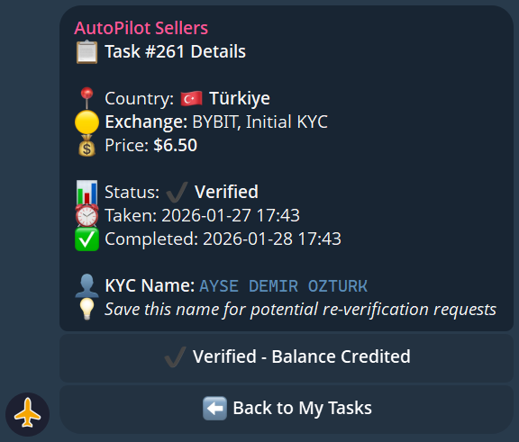

### Step 5 — Complete the KYC

Follow the verification flow on the exchange. The bot provides everything needed — no account credentials are shared with you. You only complete the identity verification step.

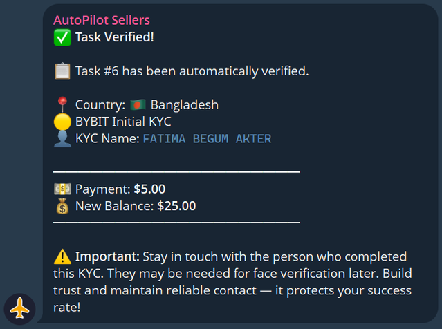

### Step 6 — Get Paid

After successful verification is confirmed, payment is credited to your bot balance automatically.

---

## Task Statuses

| Status | Meaning |
|--------|---------|
| `Available` | Task is open and can be claimed |
| `In Progress` | You have taken the task — complete it |
| `Completed` | Verification confirmed, payment sent |
| `Failed` | Verification was not accepted — no payment |
| `ReKYC` | Re-verification requested (see below) |
| `Reset` | Pilot manually reset the task (see below) |

### Tasks Reset by Pilots

Pilots can hand a task to another worker if they decide your progress isn't acceptable. When that happens, you'll see the task disappear from your active list — no payment is sent. Stay responsive and complete tasks within the deadline (24h–72h, set by the pilot) to avoid resets.

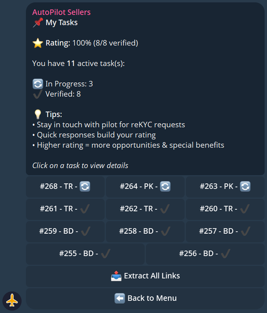

---

## Your Dashboard

Access your dashboard anytime via the **My Dashboard** button in the bot. It shows your current balance, active tasks, completed task count, and your rating.

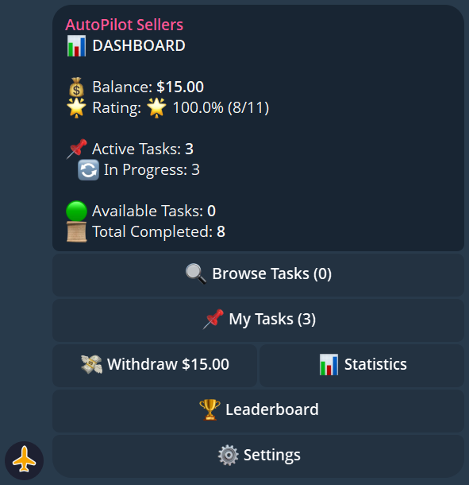

---

## Requesting a Withdrawal

Once your balance reaches the minimum threshold:

1. Press **Withdraw** in the bot
2. Enter your wallet address and network
3. Confirm the withdrawal
4. Funds are sent automatically

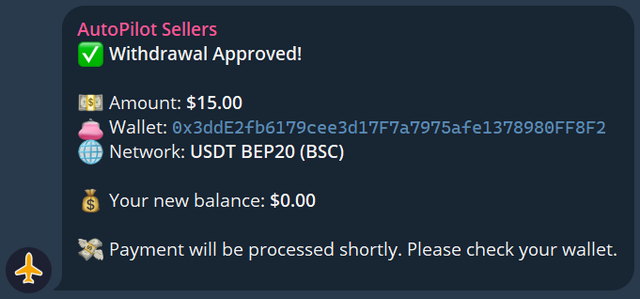

---

## ReKYC Requests

Sometimes an exchange requires re-verification of an account. You will receive a **ReKYC notification** in the bot with a new task link. Complete it the same way as a regular task — payment is provided for successful ReKYC as well.

### MEXC — Free Face Verification in the First 30 Minutes

On MEXC, the exchange often requests an extra Face Verification right after KYC — especially for trading or withdrawal access. If that request arrives **within the first 30 minutes** after you completed the KYC, you must complete it as part of the same task — **no extra payment**.

- After your KYC submission, the bot keeps polling the account for 30 minutes
- If MEXC asks for Face Verification — you'll get a notification with the new Face Scan link
- Payment for the base KYC is only released **after** the Face Scan is successful
- If you skip the Face Scan or fail it — you receive **no payment** for the task

If the Face Verification request arrives **later** (hours or days after KYC), it's a separate paid ReKYC task.

### Priority Sellers and Blacklist

Pilots can mark sellers as **preferred** — preferred sellers get a private 15-minute window on new orders before anyone else sees them. Conversely, pilots can **blacklist** sellers they don't want to work with again.

- Build a strong rating to be added to favorites by repeat customers
- Failing tasks, missing deadlines, or getting flagged by the risk system can land you on a pilot's blacklist

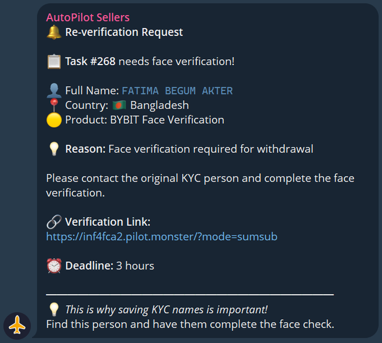

---

## Leaderboard & Badges

Top performers appear on the leaderboard. Complete more tasks to climb the ranks.

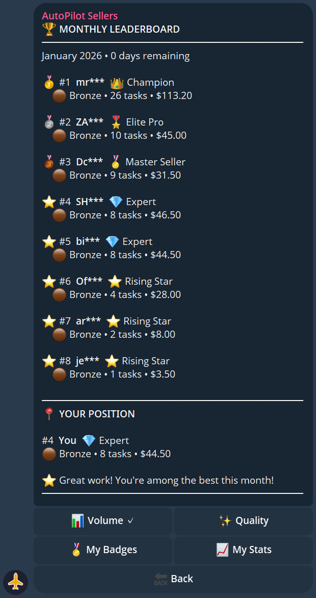

| Tier | Description |
|------|-------------|
| 🏆 Champion | Top seller overall |
| ⭐ Elite Pro | High volume, high accuracy |
| 🎯 Master Seller | Consistent performer |
| 🔥 Expert | Growing seller |
| 🌱 Rising Star | New but active |

**Badges you can earn:**

| Badge | How to Earn |
|-------|-------------|
| First Steps | Complete your first task |
| Tenacious | Complete tasks across multiple days |
| Speed Demon | Complete a task in record time |
| Perfectionist | 100% success rate milestone |
| On Fire | Complete several tasks in a row |
| Marathon | High total task count |
| Globe Trotter | Complete tasks for many different countries |

---

## Statistics & Analytics

The bot provides detailed stats on your performance: total tasks completed, success rate, total earned, average completion time, and country breakdown.

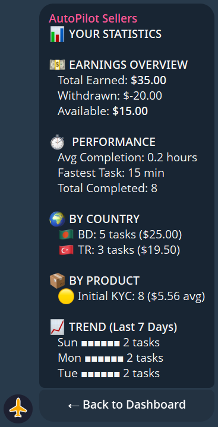

---

## Managing Your Countries

You can set which countries you want to work with in the bot settings. This filters the tasks you receive — only orders from your selected countries will be shown to you.

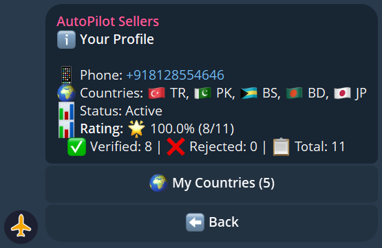

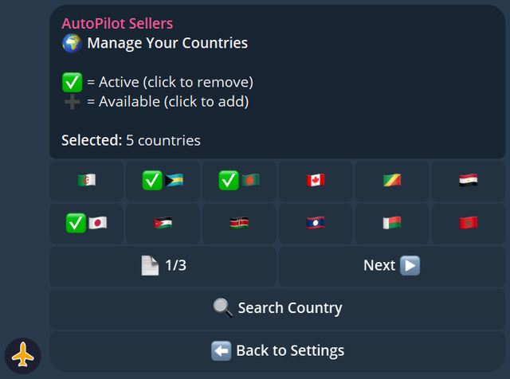

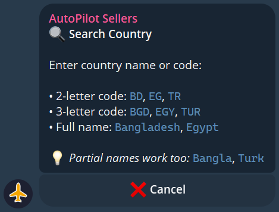

---

## Quick Reference

| Action | How |
|--------|-----|
| Start | [@AutoPilotSELLER_bot](https://t.me/AutoPilotSELLER_bot) |
| Take a task | Press **Take Task** when notified |
| Check balance | **My Dashboard** in the bot |
| Withdraw | **Withdraw** button in the bot |
| Set countries | **Settings → Countries** |
| View history | **Task History** in the bot |

---

## Support

Having issues? Contact support:

**Telegram:** [@poyof](https://t.me/poyof)
**Telegram ID:** `7694252250`
