# AutoPilot Software — Максимальна Автоматизацiя на Bybit

**Пiдтримка AdsPower & Dolphin & Vision**
**Windows / MacOS / Linux**

---

## Забудьте про ручну роботу: рiшення знайдено

Bybit — одна з провiдних криптовалютних бiрж свiту з можливостями для заробiтку через Airdrop, TokenSplash подiї та спецiальнi iвенти.

Ручне управлiння акаунтами потребує багато часу, зусиль i пов'язане з ризиком помилок. AutoPilot Software перетворює рутину в автоматичний процес. Iнтеграцiя з AdsPower, Dolphin та Vision забезпечує захист цифрових вiдбиткiв та безпечну роботу з багатьма акаунтами.

---

## Як працює AutoPilot

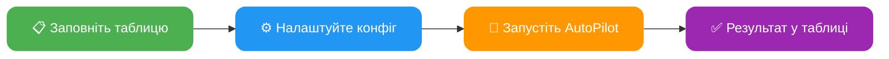

---

## Основнi переваги

**Економiя часу:**
Автоматизацiя дозволяє одночасно керувати сотнями акаунтiв

**Зручнiсть у використаннi:**
Займайтеся своїми справами поки AutoPilot автоматизує дiї у фоновому режимi

**Iнтеграцiя з AdsPower / Dolphin / Vision:**
Безпечне та анонiмне використання акаунтiв. AutoPilot автоматично запускає та iнтегрується у створену антидетект сесiю браузера з унiкальними вiдбитками

**Паралельна автоматизацiя:**
Автоматизуйте безлiч акаунтiв одночасно

**Зручна таблиця облiку акаунтiв:**
Ведiть облiк усiх акаунтiв в однiй Excel таблицi. Можна додавати новi стовпцi, змiнювати порядок для себе — головне не змiнювати назву стовпцiв iз шаблону

**Режими швидкостi:**
- **FAST** — максимально швидка робота з мiнiмальними затримками
- **MEDIUM** — середня швидкiсть, iмiтацiя людської поведiнки, Smart Cursor, Human Typing
- **SLOW** — повiльна швидкiсть, повна iмiтацiя людської поведiнки

**Мультифункцiональнiсть:**
Налаштуйте будь-якi дiї для кожного акаунта. Наприклад, AutoPilot буде отримувати адресу депозиту для одних акаунтiв, а на iнших — виводити кошти

**Автоматичнi ланцюжки дiй:**
Обирайте будь-яку дiю — AutoPilot автоматично увiйде в акаунт, якщо потрiбен вхiд. Також сам увiмкне 2FA захист, якщо вона ще не пiдключена

**Автогенерацiя паролiв:**
При реєстрацiї AutoPilot згенерує надiйний пароль, якщо вiн не вказаний

**Повний продаж активiв:**
Повне виведення з автоматичною конвертацiєю всiх активiв у USDT

**Логування:**
Повне логування результатiв у `logs/` та автоматичнi бекапи таблицi у `backup/`

---

## Функцiонал Bybit AutoPilot

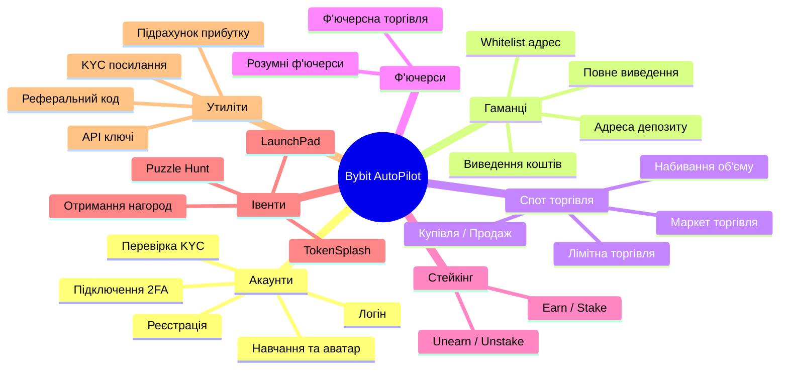

AutoPilot пiдтримує безлiч автоматизованих дiй для Bybit:

- **Реєстрацiя** акаунтiв на Bybit: звичайним методом, за реферальним посиланням
- **Логiн**: вхiд в акаунт, перевiрка верифiкацiї та балансу
- **Перевiрка KYC**: перевiрка рiвня верифiкацiї з вiдображенням країни, iменi, документа
- **Керування 2FA**: пiдключення двофакторної автентифiкацiї
- **Навчання та аватар**: проходження навчальних модулiв та встановлення аватара профiлю
- **Отримання адреси депозиту** для кожного акаунта
- **Додавання адрес у whitelist** з пiдтримкою рiзних мереж
- **Виведення коштiв** з акаунта, включаючи повне виведення з конвертацiєю всiх активiв
- **Отримання API-ключiв** для торгiвлi
- **Автоматичний трейдинг**: маркет та лiмiтна торгiвля, набивання об'єму у вказаних парах
- **Купiвля / Продаж**: купiвля активiв та продаж усiх монет за USDT
- **Ф'ючерсна торгiвля**: стандартна та розумна з post-only ордерами (економiя 32% комiсiї)
- **Стейкiнг**: USDT Flexible Savings (earn / unearn)
- **TokenSplash**: автоматична участь у iвентах з виконанням завдань на депозит
- **LaunchPad**: автоматична реєстрацiя в активних LaunchPad iвентах
- **Puzzle Hunt**: автоматичне проходження puzzle-завдань
- **Отримання нагород**: купони, пакетне отримання, нагороди за активнiсть
- **Реферальнi коди**: автоматичне витягування реферальних кодiв акаунтiв
- **KYC посилання**: отримання SUMSUB посилання для верифiкацiї
- **Пiдрахунок прибутку**: автоматичний аналiз ВИВЕДЕННЯ - ДЕПОЗИТ
- Автоматичне розв'язання капчi, отримання кодiв верифiкацiї та багато iншого

---

## Повний перелiк дiй (ACTION)

### Загальна схема роботи дiй

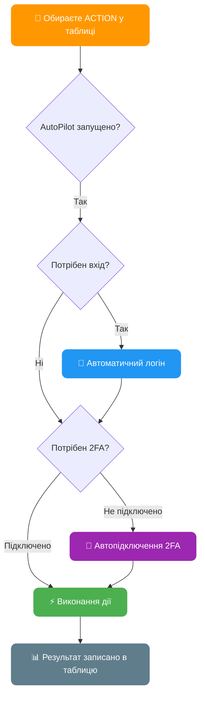

> Усi дiї, крiм реєстрацiї, автоматично увiйдуть в акаунт, якщо потрiбно. Дiї whitelist та withdraw автоматично пiдключать 2FA, якщо не встановлено.

---

### `register` — Реєстрацiя акаунта на Bybit

Реєстрацiя акаунта з автоматичним розв'язанням капчi та пiдтвердженням email

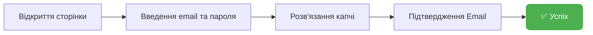

| Параметр | Стовпець | Опис |
|----------|----------|------|
| **Потребує** | `[EMAIL] mail_provider` | Поштовий сервiс (yahoo, rambler, icloud, outlook, gmail...) |
| **Потребує** | `[PROFILE] mail` | Адреса поштової скриньки |
| **Потребує** | `[EMAIL] mail_password` | Пароль пошти / IMAP пароль |
| Опцiонально | `[PROFILE] bybit_password` | Пароль вiд акаунта (AutoPilot генерує, якщо порожнiй) |
| Опцiонально | `[REG] referral_code` | Реферальний код |
| **Оновлює** | `[REG] is_registered` | Статус реєстрацiї (1 — зареєстрований) |
| **Оновлює** | `[RESULT] status` | `[REGISTER] SUCCESS` або опис помилки |

> Для старту реєстрацiї достатньо заповнити 4 стовпцi: profile_id, mail_provider, mail, mail_password

---

### `login` — Логiн в акаунт

Вхiд в акаунт, перевiрка верифiкацiї та балансу

| Параметр | Стовпець | Опис |
|----------|----------|------|
| **Потребує** | `[REG] is_registered` | 1 (зареєстрований) |
| **Потребує** | `[PROFILE] mail` | Адреса пошти |
| **Потребує** | `[PROFILE] bybit_password` | Пароль вiд акаунта |
| Опцiонально | `[2FA] totp_secret_code` | Секретний код 2FA |
| **Оновлює** | `[KYC] kyc_status` | Рiвень верифiкацiї |
| **Оновлює** | `[BALANCE] account_balance` | Баланс акаунта в USDT |
| **Оновлює** | `[RESULT] status` | `[LOGIN] SUCCESS` |

---

### `2fa` — Пiдключення 2FA

Автоматичне встановлення Google Authenticator на акаунтi

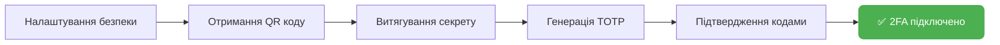

| Параметр | Стовпець | Опис |
|----------|----------|------|
| **Оновлює** | `[2FA] totp_secret_code` | Секретний код 2FA (зберiгається автоматично) |
| **Оновлює** | `[RESULT] status` | `[2FA] SUCCESS` |

---

### `deposit` — Отримання адреси депозиту

Отримати адресу депозиту для поповнення акаунта

| Параметр | Стовпець | Опис |
|----------|----------|------|
| **Потребує** | `[DEPOSIT] deposit_coin` | Монета для депозиту (наприклад: `USDT`) |
| **Потребує** | `[DEPOSIT] deposit_chain` | Мережа (наприклад: `TRC20`, `Aptos`, `Mantle`) |
| **Оновлює** | `[DEPOSIT] deposit_address` | Адреса депозиту |
| **Оновлює** | `[RESULT] status` | `[DEPOSIT] SUCCESS` |

---

### `whitelist` — Додавання адреси в Whitelist

Увiмкнення whitelist режиму та додавання адреси для виведення

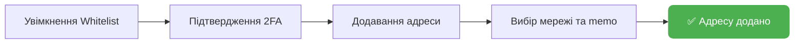

| Параметр | Стовпець | Опис |
|----------|----------|------|
| **Потребує** | `[WHITELIST] whitelist_address` | Адреса гаманця |
| **Потребує** | `[WHITELIST] whitelist_chain` | Мережа (наприклад: `TRC20`, `Aptos`, `Mantle`) |
| Опцiонально | `[WHITELIST] whitelist_memo` | Memo/Tag (якщо потрiбно мережею) |
| **Оновлює** | `[WHITELIST] whitelist_status` | 1 — успiшно додано |
| **Оновлює** | `[RESULT] status` | `[WHITELIST] SUCCESS` |

> Якщо 2FA не пiдключено — AutoPilot автоматично пiдключить його перед додаванням у whitelist

---

### `withdraw` — Виведення коштiв

Виведення коштiв з акаунта з автоматичним пiдтвердженням

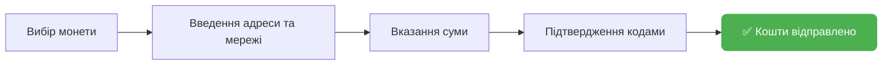

| Параметр | Стовпець | Опис |
|----------|----------|------|
| **Потребує** | `[WITHDRAW] withdraw_coin` | Монета для виведення (наприклад: `USDT`) |
| **Потребує** | `[WITHDRAW] withdraw_chain` | Мережа виведення (наприклад: `TRC20`, `Aptos`) |
| **Потребує** | `[WITHDRAW] withdraw_address` | Адреса гаманця отримувача |
| Опцiонально | `[WITHDRAW] withdraw_memo` | Memo/Tag |
| Опцiонально | `[WITHDRAW] withdraw_amount` | Сума у % (100 = все, 50 = половина) |
| **Оновлює** | `[RESULT] status` | `[WITHDRAW] SUCCESS` |

> Якщо 2FA не пiдключено — AutoPilot автоматично пiдключить його перед виведенням

---

### Алгоритм повного виведення (`full_withdraw=YES`)

Якщо в конфiгу увiмкнено `full_withdraw=YES`, AutoPilot виконає повний продаж усiх активiв перед виведенням:

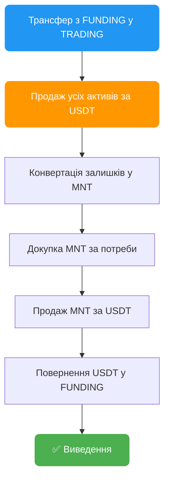

---

### Мастер-гаманець — Авто-whitelist, $0 комiсiй, невiдстежуваний вивiд

Виводьте з сотень акаунтiв **не вводячи жодної адреси вручну**. AutoPilot створює унiкальний гаманець для кожного акаунта, сам додає його в whitelist, виводить з **нульовою комiсiєю** i збирає все на ваш мастер-гаманець. Кожен акаунт виводить на **свою адресу** — зв'язати їх мiж собою неможливо.

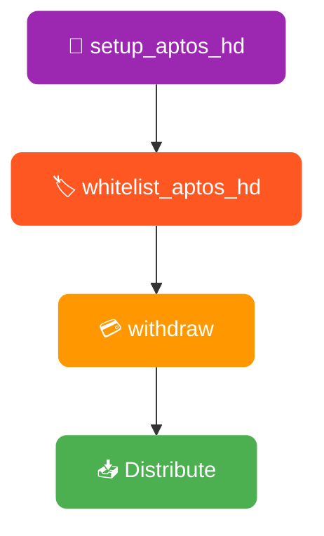

#### `setup_aptos_hd` — Створення мастер-гаманця

Запускається один раз. Створює ваш мастер-гаманець та показує секретну фразу (12 слiв). Збережiть її — вона контролює всi ваші адреси.

| Параметр | Стовпець | Опис |
|-----------|--------|-------------|
| **Потрiбно** | Конфiг: `activation_key` | Пароль шифрування |
| **Результат** | Файл: `aptos_master_seed.enc` | Зашифрована секретна фраза |
| **Результат** | Файл: `aptos_hd_wallet_data.csv` | Усi адреси та приватнi ключi |

> ⚠️ **Збережiть секретну фразу!** Показується один раз. Втратили фразу = втратили доступ до всiх адрес та коштiв.

#### `whitelist_aptos_hd` — Автоматичний whitelist

Запускається на всiх профiлях. Для кожного акаунта AutoPilot:
1. Створює унiкальну Aptos-адресу (рiзну для кожного акаунта)
2. Заходить на Bybit, додає її в whitelist
3. Пiдтверджує email/2FA — повнiстю автоматично
4. Зберiгає все в таблицю

Нiякої ручної роботи. Не потрiбно створювати гаманцi, копiювати адреси чи заповнювати таблицю.

| Параметр | Стовпець | Опис |
|-----------|--------|-------------|
| Автостворення | `[WHITELIST] whitelist_address` | Унiкальна Aptos-адреса |
| Автовстановлення | `[WHITELIST] whitelist_network` | `APTOS` |
| **Оновлює** | `[RESULT] status` | `[WHITELIST_HD] SUCCESS` |

> 🔁 **Можна перезапускати:** вже є адреса? AutoPilot використає її — дублiкатiв не буде.

#### Збiр коштiв: вкладка Distribute

Пiсля виведення USDT лежать на iндивiдуальних адресах. Вiдкрийте вкладку **Distribute** в десктоп-додатку:
- Обрати профiлi → Переглянути → Один клiк → Все зiбрано на мастер-гаманець
- Газ: ~0.002 APT на профiль (долi цента)
- Працює в обидва боки: збiр з акаунтiв або роздача на них

**Чому Aptos?**

| Мережа | Комiсiя Bybit | Швидкiсть |
|---------|-----------|-------|
| **Aptos** | **$0** | ~1 сек |
| Arbitrum | $0.1 | ~1 сек |
| TRC20 | $1 | ~3 хв |
| ERC20 | $1-5 | ~5 хв |

> 💰 **Чим бiльше акаунтiв — тим бiльше економите. Кожне виведення через TRC20/ERC20 коштує $1-5. Через Aptos = $0.**

> 🕵️ **Приватнiсть:** кожен акаунт → своя адреса → спiльних адрес немає → зв'язати акаунти мiж собою неможливо.

---

### `sell` — Продаж усiх активiв

Конвертацiя всiх монет на акаунтi в USDT маркет-ордерами

| Параметр | Стовпець | Опис |
|----------|----------|------|
| **Оновлює** | `[BALANCE] account_balance` | Баланс пiсля продажу |
| **Оновлює** | `[RESULT] status` | `[SELL] SUCCESS` |

---

### `api` — Отримання API ключiв

Створення API ключа з правами для SPOT та Futures торгiвлi

| Параметр | Стовпець | Опис |
|----------|----------|------|
| Опцiонально | `[API] api_whitelist_ip` | IP для whitelist (опцiонально) |
| **Оновлює** | `[API] api_key` | Отриманий API ключ |
| **Оновлює** | `[API] api_secret` | Секретний ключ API |
| **Оновлює** | `[RESULT] status` | `[API] SUCCESS` |

---

### `trading` — Автоматичний трейдинг

Торгiвля та набивання об'єму маркет ордерами з пiдтримкою кiлькох монет

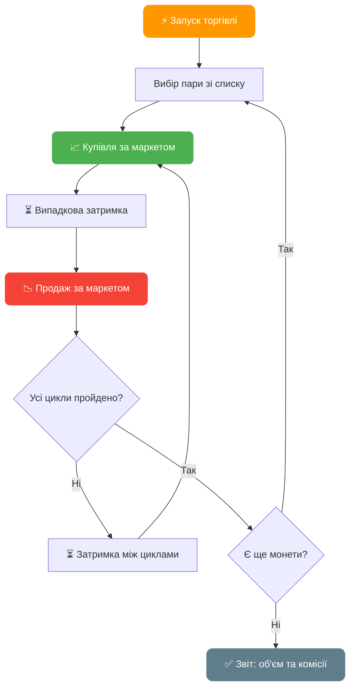

| Параметр | Стовпець | Опис |
|----------|----------|------|
| **Потребує** | `[TRADING] trading_coin` | Актив для торгiвлi (наприклад: `BTC` або `BTC,ETH,SOL`) |
| **Потребує** | `[TRADING] trading_amount` | Розмiр ордера в USDT (наприклад: `10` або `10,20,5`) |
| **Потребує** | `[TRADING] trading_cycles` | К-сть циклiв купiвлi-продажу (наприклад: `3` або `3,5,2`) |
| **Оновлює** | `[RESULT] status` | `[TRADING] VOLUME: об'єм, FEES: комiсiї` |

> **Мульти-монети**: вкажiть через кому кiлька монет, розмiрiв та циклiв — AutoPilot буде торгувати ними послiдовно.
> Приклад: `BTC,ETH` + `10,20` + `3,5` = 3 цикли BTC по 10 USDT, потiм 5 циклiв ETH по 20 USDT

> **Формула об'єму**: цикли x розмiр ордера x 2 (купiвля + продаж)
> Приклад: 3 цикли по 10 USDT = 3 x 10 x 2 = **60 USDT** об'єму

---

### `ts` — TokenSplash

Автоматична участь у TokenSplash iвентах на Bybit

| Параметр | Стовпець | Опис |
|----------|----------|------|
| **Потребує** | `[TS] code` | Код iвента TokenSplash |
| **Оновлює** | `[RESULT] status` | `[TS] SUCCESS` |

> Якщо баланс акаунта > 100 USDT — AutoPilot автоматично виконає завдання на депозит

---

### `puzzle_hunt` — Пазл-хант

Автоматичне проходження Puzzle Hunt завдань на Bybit: реєстрацiя, соцiальнi завдання, торгiвля, щоденнi чекiни

| Параметр | Стовпець | Опис |
|----------|----------|------|
| **Потребує** | `[PUZZLE] event_code` | Код пазлу (через кому для кiлькох) |
| **Оновлює** | `[RESULT] status` | `DONE`, `5/10` (прогрес), `ENDED` або `FAIL` |

> Вкажiть кiлька пазлiв одразу: `code1,code2,code3`. Зробiть стовпець типом **text**, щоб Excel не обрiзав довгi коди.

> Дивiться [FAQ → Puzzle Hunt](/docs/faq/#62--puzzle-hunt-puzzle_hunt) для детального опису, статусiв та порад.

---

### `link` — Отримати посилання KYC верифiкацiї

Витягування SUMSUB посилання для верифiкацiї акаунта

| Параметр | Стовпець | Опис |
|----------|----------|------|
| **Оновлює** | `[RESULT] status` | `[LINK] SUCCESS` з URL верифiкацiї |

---

### `learn` — Проходження навчання та встановлення аватара

Автоматичне проходження навчальних модулiв Bybit та встановлення аватара профiлю

| Параметр | Стовпець | Опис |
|----------|----------|------|
| **Оновлює** | `[RESULT] status` | `[LEARN] SUCCESS` |

---

### `profit` — Розрахунок прибутку

Розрахунок прибутку по акаунту: загальнi виведення - загальнi депозити + поточний баланс

| Параметр | Стовпець | Опис |
|----------|----------|------|
| **Оновлює** | `[RESULT] status` | `[PROFIT] значення_прибутку` |

---

### `buy` — Купiвля активу

Купiвля конкретного активу за USDT

| Параметр | Стовпець | Опис |
|----------|----------|------|
| **Потребує** | `[TRADING] trading_coin` | Актив для купiвлi (наприклад: `BTC`) |
| **Потребує** | `[TRADING] trading_amount` | Сума в USDT |
| **Оновлює** | `[RESULT] status` | `[BUY] SUCCESS` |

---

### `limit_buy` — Купiвля лiмiтним ордером

Розмiщення лiмiтного ордера на купiвлю активу

| Параметр | Стовпець | Опис |
|----------|----------|------|
| **Потребує** | `[TRADING] trading_coin` | Актив для купiвлi (наприклад: `ETH`) |
| **Потребує** | `[TRADING] trading_amount` | Сума в USDT |
| **Оновлює** | `[RESULT] status` | `[LIMIT_BUY] SUCCESS` |

---

### `limit` — Випадкова лiмiтна торгiвля

Автоматична лiмiтна торгiвля з рандомiзованими ордерами для природного набивання об'єму

| Параметр | Стовпець | Опис |
|----------|----------|------|
| **Потребує** | `[TRADING] trading_coin` | Актив для торгiвлi (наприклад: `BTC`) |
| Опцiонально | `[TRADING] trading_amount` | Розмiр ордера в USDT |
| Опцiонально | `[TRADING] trading_cycles` | Кiлькiсть циклiв |
| **Оновлює** | `[RESULT] status` | Звiт про об'єм та комiсiї |

---

### `trading_limit` — Торговий об'єм лiмiтними ордерами

Набивання об'єму лiмiтними ордерами замiсть маркет ордерiв

| Параметр | Стовпець | Опис |
|----------|----------|------|
| **Потребує** | `[TRADING] trading_coin` | Актив для торгiвлi (наприклад: `BTC` або `BTC,ETH`) |
| **Потребує** | `[TRADING] trading_amount` | Розмiр ордера в USDT (наприклад: `10` або `10,20`) |
| Опцiонально | `[TRADING] trading_cycles` | Кiлькiсть циклiв (наприклад: `3` або `3,5`) |
| **Оновлює** | `[RESULT] status` | `[TRADING] VOLUME: об'єм, FEES: комiсiї` |

> Такий самий мульти-монетний синтаксис як у `trading`, але використовує лiмiтнi ордери для кращих цiн виконання.

---

### `limit_sell` — Продаж лiмiтним ордером на Funding

Продаж активiв на Funding акаунтi за USDT лiмiтними ордерами

| Параметр | Стовпець | Опис |
|----------|----------|------|
| **Потребує** | `[TRADING] trading_coin` | Актив для продажу (наприклад: `ETH`) |
| **Оновлює** | `[RESULT] status` | `[LIMIT_SELL] SUCCESS` |

---

### `futures` — Ф'ючерсна торгiвля

Торгiвля ф'ючерсами з плечем маркет ордерами

| Параметр | Стовпець | Опис |
|----------|----------|------|
| **Потребує** | `[TRADING] trading_coin` | Монета для ф'ючерсiв (наприклад: `BTC`) |
| **Потребує** | `[TRADING] trading_amount` | Розмiр позицiї з плечем в USDT |
| **Потребує** | `[TRADING] trading_cycles` | Кiлькiсть торгових циклiв |
| **Оновлює** | `[RESULT] status` | Звiт про об'єм та комiсiї |

> Налаштуйте плече параметром `leverage` у конфiгу (за замовчуванням: `10`).

---

### `futures_smart` — Розумна ф'ючерсна торгiвля

Автоматична ф'ючерсна торгiвля з аналiзом ринку, post-only лiмiтними ордерами та управлiнням позицiями. **На 32% дешевше** нiж маркет ордери.

| Параметр | Стовпець | Опис |
|----------|----------|------|
| **Потребує** | `[TRADING] trading_coin` | Монета для ф'ючерсiв (наприклад: `BTC`) |
| **Потребує** | `[TRADING] trading_amount` | Розмiр позицiї з плечем в USDT |
| **Потребує** | `[TRADING] trading_cycles` | Кiлькiсть торгових циклiв |
| **Оновлює** | `[RESULT] status` | Звiт про об'єм та комiсiї |

> `trading_amount` — це розмiр позицiї **з урахуванням плеча**. Реальний баланс на угоду = `trading_amount / leverage`.

> Дивiться [FAQ → Smart Futures](/docs/faq/#61--smart-futures-trading-futures_smart) для алгоритмiв, формул та параметрiв конфiгу.

---

### `stake` / `earn` — Стейкiнг USDT (Flexible Savings)

Вiдправка USDT до пулу Bybit Flexible Savings. `stake` та `earn` — алiаси, однакова дiя.

| Параметр | Стовпець | Опис |
|----------|----------|------|
| Опцiонально | `[WITHDRAW] withdraw_amount` | Фiксована сума USDT (за замовчуванням: весь доступний) |
| **Оновлює** | `[RESULT] status` | `[STAKE] SUCCESS - stake 150.25` |

> Автоматично переказує USDT з Trading → Funding перед стейкiнгом.

---

### `unstake` / `unearn` — Виведення зi стейкiнгу

Виведення USDT з пулу Flexible Savings назад на Funding. `unstake` та `unearn` — алiаси.

| Параметр | Стовпець | Опис |
|----------|----------|------|
| **Оновлює** | `[RESULT] status` | `[STAKE] SUCCESS - unstake 150.25` |

> Дивiться [FAQ → Bybit Earn](/docs/faq/#63--bybit-earn--usdt-staking-earn--unearn) для детального опису.

---

### `lp` — Реєстрацiя в LaunchPad iвентi

Автоматична реєстрацiя в поточному активному LaunchPad iвентi на Bybit. Повнiстю автоматично — стовпцi не потрiбнi.

| Параметр | Стовпець | Опис |
|----------|----------|------|
| **Оновлює** | `[RESULT] status` | `[LP] SUCCESS` |

---

### `claim` — Отримати купони

Автоматичне отримання доступних купонiв на акаунтi

| Параметр | Стовпець | Опис |
|----------|----------|------|
| **Оновлює** | `[RESULT] status` | `[CLAIM] SUCCESS` |

---

### `claim_batch` — Отримати купони пакетно

Отримання всiх доступних купонiв у пакетному режимi

| Параметр | Стовпець | Опис |
|----------|----------|------|
| **Оновлює** | `[RESULT] status` | `[CLAIM] SUCCESS` |

---

### `claim_activity` — Забрати нагороди

Отримання нагород з iвентiв активностi, обхiд верифiкацiї обличчя

| Параметр | Стовпець | Опис |
|----------|----------|------|
| **Оновлює** | `[RESULT] status` | `[CLAIM_ACTIVITY] SUCCESS` |

---

### `ref_code` — Витягти реферальний код

Автоматичне витягування реферального коду акаунта

| Параметр | Стовпець | Опис |
|----------|----------|------|
| **Оновлює** | `[RESULT] status` | `[REF_CODE] значення_коду` |

---

## Зведена таблиця дiй

```mermaid
flowchart TD
    subgraph REG ["🟢 Початок роботи"]
        R["register — Реєстрацiя"]
        L["login — Логiн"]
    end

    subgraph SEC ["🔐 Безпека"]
        FA["2fa — 2FA захист"]
        API["api — API ключi"]
    end

    subgraph WALLET ["💰 Гаманцi"]
        D["deposit — Адреса депозиту"]
        W["whitelist — Whitelist"]
        HD["whitelist_aptos_hd — Мастер-гаманець"]
        WD["withdraw — Виведення"]
        S["sell — Продаж активiв"]
    end

    subgraph TRADE ["📊 Трейдинг"]
        T["trading — Маркет торгiвля"]
        TL["trading_limit — Лiмiтна торгiвля"]
        B["buy — Купiвля активу"]
        FU["futures_smart — Розумнi ф'ючерси"]
    end

    subgraph EVENTS ["🎯 Iвенти та нагороди"]
        TS["ts — TokenSplash"]
        LP["lp — LaunchPad"]
        PZ["puzzle_hunt — Puzzle Hunt"]
        CL["claim — Отримання нагород"]
    end

    subgraph STAKE ["🏦 Стейкiнг"]
        ST["stake — Earn"]
        UST["unstake — Unearn"]
    end

    R --> L
    L --> FA
    FA --> W
    FA --> HD
    FA --> API
    W --> WD
    HD --> WD
    S --> WD
    L --> D
    L --> T
    L --> TL
    L --> B
    L --> FU
    L --> TS
    L --> LP
    L --> PZ
    L --> CL
    L --> ST
    ST --> UST

    style R fill:#4CAF50,color:#fff,stroke:none,rx:8
    style L fill:#2196F3,color:#fff,stroke:none,rx:8
    style FA fill:#9C27B0,color:#fff,stroke:none,rx:8
    style API fill:#673AB7,color:#fff,stroke:none,rx:8
    style D fill:#FF9800,color:#fff,stroke:none,rx:8
    style W fill:#FF5722,color:#fff,stroke:none,rx:8
    style HD fill:#E040FB,color:#fff,stroke:none,rx:8
    style WD fill:#f44336,color:#fff,stroke:none,rx:8
    style S fill:#E91E63,color:#fff,stroke:none,rx:8
    style T fill:#009688,color:#fff,stroke:none,rx:8
    style TL fill:#00897B,color:#fff,stroke:none,rx:8
    style B fill:#43A047,color:#fff,stroke:none,rx:8
    style FU fill:#E65100,color:#fff,stroke:none,rx:8
    style TS fill:#00BCD4,color:#fff,stroke:none,rx:8
    style LP fill:#0097A7,color:#fff,stroke:none,rx:8
    style PZ fill:#795548,color:#fff,stroke:none,rx:8
    style CL fill:#AB47BC,color:#fff,stroke:none,rx:8
    style ST fill:#66BB6A,color:#fff,stroke:none,rx:8
    style UST fill:#81C784,color:#fff,stroke:none,rx:8
```

| Дiя | Опис | Авто-логiн | Авто-2FA |
|-----|------|:----------:|:--------:|
| `register` | Реєстрацiя акаунта | — | — |
| `login` | Вхiд в акаунт | — | — |
| `2fa` | Пiдключення 2FA | ✅ | — |
| `link` | Отримати посилання KYC верифiкацiї | ✅ | — |
| `learn` | Навчання та встановлення аватара | ✅ | — |
| `deposit` | Адреса для депозиту | ✅ | — |
| `whitelist` | Додавання в whitelist | ✅ | ✅ |
| `withdraw` | Виведення коштiв | ✅ | ✅ |
| `sell` | Продаж усiх активiв | ✅ | — |
| `api` | Створення API ключiв | ✅ | — |
| `trading` | Маркет торгiвля | ✅ | — |
| `trading_limit` | Лiмiтна торгiвля | ✅ | — |
| `buy` | Купiвля активу | ✅ | — |
| `limit_buy` | Купiвля лiмiтним ордером | ✅ | — |
| `limit` | Випадкова лiмiтна торгiвля | ✅ | — |
| `limit_sell` | Продаж лiмiтним ордером на Funding | ✅ | — |
| `futures` | Ф'ючерсна торгiвля | ✅ | — |
| `futures_smart` | Розумнi ф'ючерси (на 32% дешевше) | ✅ | — |
| `stake` / `earn` | Стейкiнг USDT | ✅ | — |
| `unstake` / `unearn` | Виведення зi стейкiнгу | ✅ | — |
| `ts` | TokenSplash iвенти | ✅ | — |
| `lp` | LaunchPad iвенти | ✅ | — |
| `puzzle_hunt` | Puzzle Hunt | ✅ | — |
| `claim` | Отримання купонiв | ✅ | — |
| `claim_batch` | Пакетне отримання купонiв | ✅ | — |
| `claim_activity` | Нагороди за активнiсть | ✅ | — |
| `profit` | Розрахунок прибутку | ✅ | — |
| `ref_code` | Витягування реферального коду | ✅ | — |

---

## Налаштування конфiгурацiї

Файл `BybitAutoPilot.config` мiстить основнi параметри:

| Параметр | Опис | Приклад |
|----------|------|---------|
| `activation_key` | Ключ активацiї | `XXXX-XXXX-XXXX` |
| `speed_mode` | Режим швидкостi | `FAST`, `MEDIUM`, `SLOW` |
| `captcha_key` | API ключ сервiсу капчi | `abc123...` |
| `captcha_provider` | Провайдер капчi | `2captcha`, `capmonster` |
| `parallel_limit` | Лiмiт паралельних акаунтiв | `3` |
| `shuffle_order` | Перемiшати порядок акаунтiв | `YES` / `NO` |
| `window_size` | Розмiр вiкна браузера | `1280x720` |
| `close_tabs` | Закривати вкладки пiсля роботи | `YES` / `NO` |
| `close_after` | Закривати профiль пiсля роботи | `YES` / `NO` |
| `email_delay_check` | Затримка перевiрки пошти (сек) | `5` |
| `language` | Мова iнтерфейсу | `EN`, `RU` |
| `full_withdraw` | Повний продаж перед виведенням | `YES` / `NO` |
| `show_credentials` | Показувати KYC данi | `YES` / `NO` |
| `bot_mode` | Iнтеграцiя з Telegram ботом | `YES` / `NO` |

---

## KYC статуси

При логiнi AutoPilot перевiряє статус верифiкацiї:

| Статус | Опис |
|--------|------|
| `UNSUBMITTED` | Верифiкацiю не подано |
| `REJECT` | Вiдхилено (причина вказується) |
| `1 [КРАЇНА]` | Верифiковано (наприклад: `1 RU`) |

Якщо `show_credentials=YES`, також записуються: iм'я, прiзвище, тип документа, номер документа.

---

## Налаштування пошти (IMAP)

AutoPilot використовує протокол IMAP для отримання кодiв верифiкацiї з пошти.

**Пiдтримуванi провайдери:** Yahoo, Rambler, iCloud, Outlook, Gmail, Mail.ru, First Mail та iншi

> Для Gmail, Outlook, Yahoo, iCloud потрiбне створення **пароля застосунку** (App Password) — звичайний пароль не пiдiйде для IMAP. Або налаштуйте переадресацiю листiв на пошту з прямим IMAP доступом.

---

## Швидкий старт пiсля покупки

1. **Завантажте** `AutoPilot.zip` iз закрiпленого повiдомлення у чатi [@buykyc_bot](https://t.me/buykyc_bot)
2. **Розпакуйте** архiв у нову папку
3. **Налаштуйте** `BybitAutoPilot.config`:
   - Вкажiть `activation_key` (отримано при покупцi)
   - Вкажiть `captcha_key` (вiд [2captcha](https://2captcha.com/auth/register), [ruCaptcha](https://rucaptcha.com/auth/register) або [Capmonster](https://capmonster.cloud/Account/Signup))
4. **Заповнiть** `AutoPilot_table.xlsx` даними акаунтiв
5. **Запустiть** застосунок

> Керування також доступне через бот [@AutoPilotManager_bot](https://t.me/AutoPilotManager_bot) (потрiбен `bot_mode=YES` у конфiгу)

---

## Покупка

Одразу пiсля покупки ви отримуєте готову збiрку для роботи.

Придбати ключ активацiї для Bybit AutoPilot: [https://t.me/buykyc_bot](https://t.me/buykyc_bot)

Разом iз ключем ви отримуєте доступ до тематичного чату AutoPilot, де можна ставити запитання, спiлкуватися та отримувати поради.

Час життя ключа вiдраховується вiд першого запуску.

---

**Менеджер:** [@OxViktor](https://t.me/OxViktor)
**Розробник:** [@axelenvy](https://t.me/axelenvy)
