# AutoPilot Software — Максимальна Автоматизація на Bybit

**Підтримка AdsPower & Dolphin & Vision & Afina**
**Windows / MacOS / Linux**

---

## Забудьте про ручну роботу: рішення знайдено

Bybit — одна з провідних криптовалютних бірж світу з можливостями для заробітку через Airdrop, TokenSplash події та спеціальні івенти.

Ручне управління акаунтами потребує багато часу, зусиль і пов'язане з ризиком помилок. AutoPilot Software перетворює рутину в автоматичний процес. Інтеграція з AdsPower, Dolphin, Vision та Afina забезпечує захист цифрових відбитків та безпечну роботу з багатьма акаунтами.

---

## Як працює AutoPilot

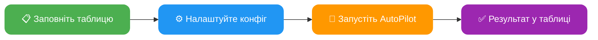

---

## Основні переваги

**Економія часу:**
Автоматизація дозволяє одночасно керувати сотнями акаунтів

**Зручність у використанні:**
Займайтеся своїми справами поки AutoPilot автоматизує дії у фоновому режимі

**Інтеграція з AdsPower / Dolphin / Vision / Afina:**
Безпечне та анонімне використання акаунтів. AutoPilot автоматично запускає та інтегрується у створену антидетект сесію браузера з унікальними відбитками

**Паралельна автоматизація:**
Автоматизуйте безліч акаунтів одночасно

**Зручна таблиця обліку акаунтів:**
Ведіть облік усіх акаунтів в одній Excel таблиці. Можна додавати нові стовпці, змінювати порядок для себе — головне не змінювати назву стовпців із шаблону

**Режими швидкості:**
- **FAST** — максимально швидка робота з мінімальними затримками
- **MEDIUM** — середня швидкість, імітація людської поведінки, Smart Cursor, Human Typing
- **SLOW** — повільна швидкість, повна імітація людської поведінки

**Мультифункціональність:**
Налаштуйте будь-які дії для кожного акаунта. Наприклад, AutoPilot буде отримувати адресу депозиту для одних акаунтів, а на інших — виводити кошти

**Автоматичні ланцюжки дій:**
Обирайте будь-яку дію — AutoPilot автоматично увійде в акаунт, якщо потрібен вхід. Також сам увімкне 2FA захист, якщо вона ще не підключена

**Автогенерація паролів:**
При реєстрації AutoPilot згенерує надійний пароль, якщо він не вказаний

**Повний продаж активів:**
Повне виведення з автоматичною конвертацією всіх активів у USDT

**Логування:**
Повне логування результатів у `logs/` та автоматичні бекапи таблиці у `backup/`

---

## Функціонал Bybit AutoPilot

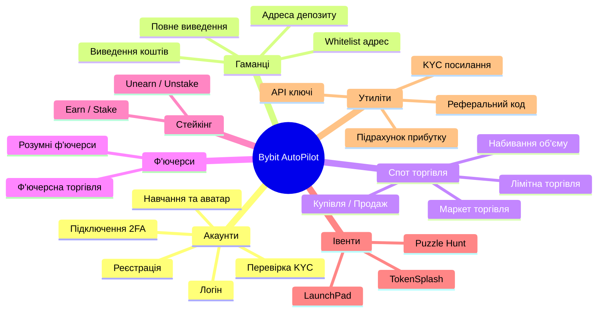

AutoPilot підтримує безліч автоматизованих дій для Bybit:

- **Реєстрація** акаунтів на Bybit: звичайним методом, за реферальним посиланням
- **Логін**: вхід в акаунт, перевірка верифікації та балансу
- **Перевірка KYC**: перевірка рівня верифікації з відображенням країни, імені, документа
- **Керування 2FA**: підключення двофакторної автентифікації
- **Навчання та аватар**: проходження навчальних модулів та встановлення аватара профілю
- **Отримання адреси депозиту** для кожного акаунта
- **Додавання адрес у whitelist** з підтримкою різних мереж
- **Виведення коштів** з акаунта, включаючи повне виведення з конвертацією всіх активів
- **Отримання API-ключів** для торгівлі
- **Автоматичний трейдинг**: маркет та лімітна торгівля, набивання об'єму у вказаних парах
- **Купівля / Продаж**: купівля активів та продаж усіх монет за USDT
- **Ф'ючерсна торгівля**: стандартна та розумна з post-only ордерами (економія 32% комісії)
- **Стейкінг**: USDT Flexible Savings (earn / unearn)
- **TokenSplash**: автоматична участь у івентах з виконанням завдань на депозит
- **LaunchPad**: автоматична реєстрація в активних LaunchPad івентах
- **Puzzle Hunt**: автоматичне проходження puzzle-завдань
- **Реферальні коди**: автоматичне витягування реферальних кодів акаунтів
- **KYC посилання**: отримання SUMSUB посилання для верифікації
- **Підрахунок прибутку**: автоматичний аналіз ВИВЕДЕННЯ - ДЕПОЗИТ
- Автоматичне розв'язання капчі, отримання кодів верифікації та багато іншого

---

## Повний перелік дій (ACTION)

> ➕ **Кілька дій за один прохід.** У комірку `ACTION` можна записати ланцюжок через `+` — наприклад `register+learn+whitelist`. Кроки виконуються по черзі на кожному акаунті, браузер профілю між ними не перезапускається. Докладніше — [FAQ → Ланцюжки дій](/docs/ua/faq/#action-chains).


### Загальна схема роботи дій

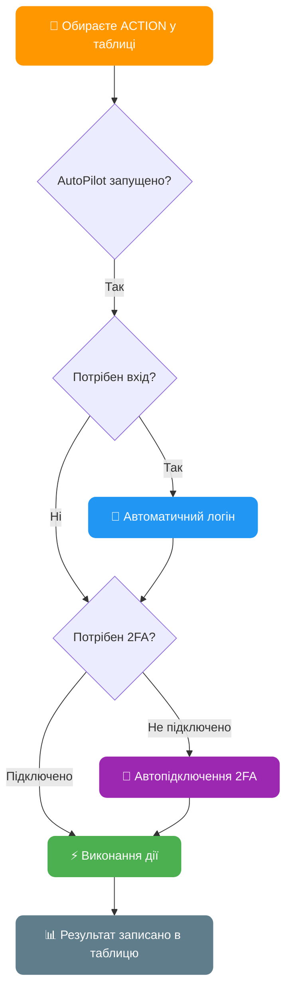

> Усі дії, крім реєстрації, автоматично увійдуть в акаунт, якщо потрібно. Дії whitelist та withdraw автоматично підключать 2FA, якщо не встановлено.

---

### `register` — Реєстрація акаунта на Bybit

Реєстрація акаунта з автоматичним розв'язанням капчі та підтвердженням email

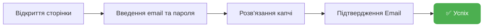

| Параметр | Стовпець | Опис |
|----------|----------|------|
| **Потребує** | `[EMAIL] mail_provider` | Поштовий сервіс (yahoo, rambler, icloud, outlook, gmail...) |
| **Потребує** | `[PROFILE] mail` | Адреса поштової скриньки |
| **Потребує** | `[EMAIL] mail_password` | Пароль пошти / IMAP пароль |
| Опціонально | `[PROFILE] bybit_password` | Пароль від акаунта (AutoPilot генерує, якщо порожній) |
| Опціонально | `[REG] referral_code` | Реферальний код |
| **Оновлює** | `[REG] is_registered` | Статус реєстрації (1 — зареєстрований) |
| **Оновлює** | `[RESULT] status` | `[REGISTER] SUCCESS` або опис помилки |

> Для старту реєстрації достатньо заповнити 4 стовпці: profile_id, mail_provider, mail, mail_password

---

### `login` — Логін в акаунт

Вхід в акаунт, перевірка верифікації та балансу

| Параметр | Стовпець | Опис |
|----------|----------|------|
| **Потребує** | `[REG] is_registered` | 1 (зареєстрований) |
| **Потребує** | `[PROFILE] mail` | Адреса пошти |
| **Потребує** | `[PROFILE] bybit_password` | Пароль від акаунта |
| Опціонально | `[2FA] totp_secret_code` | Секретний код 2FA |
| **Оновлює** | `[KYC] kyc_status` | Рівень верифікації |
| **Оновлює** | `[BALANCE] account_balance` | Баланс акаунта в USDT |
| **Оновлює** | `[RESULT] status` | `[LOGIN] SUCCESS` |

---

### `2fa` — Підключення 2FA

Автоматичне встановлення Google Authenticator на акаунті

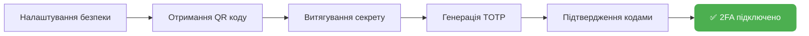

| Параметр | Стовпець | Опис |
|----------|----------|------|
| **Оновлює** | `[2FA] totp_secret_code` | Секретний код 2FA (зберігається автоматично) |
| **Оновлює** | `[RESULT] status` | `[2FA] SUCCESS` |

---

### `deposit` — Отримання адреси депозиту

Отримати адресу депозиту для поповнення акаунта

| Параметр | Стовпець | Опис |
|----------|----------|------|
| **Потребує** | `[DEPOSIT] deposit_coin` | Монета для депозиту (наприклад: `USDT`) |
| **Потребує** | `[DEPOSIT] deposit_chain` | Мережа — **канонічний код Bybit** (наприклад: `TRX` для TRC20, `BSC` для BEP20, `ETH` для ERC20). Повний список кодів — нижче 👇 |
| **Оновлює** | `[DEPOSIT] deposit_address` | Адреса депозиту |
| **Оновлює** | `[RESULT] status` | `[DEPOSIT] SUCCESS` |

> ⚠️ **Пишіть код мережі — не «TRC20» / «Aptos» / «ERC20», i без пробілів.** Значення йде в Bybit як є. Невірний код **або зайвий пробіл** (`BSC ` замість `BSC`) → Bybit поверне `ret_code 10016 svc error`, i адреса не прийде.

**Коди мереж USDT** (список Bybit може змінюватися):

| Введіть у `deposit_chain` | Мережа на Bybit | Memo |
|---|---|---|
| `TRX` | TRON (TRC20) | — |
| `BSC` | BSC (BEP20) | — |
| `ETH` | Ethereum (ERC20) | — |
| `SOL` | Solana | — |
| `TON` | TON | ✅ потрібен |
| `APTOS` | Aptos | — |
| `ARBI` | Arbitrum One | — |
| `OP` | OP Mainnet | — |
| `MATIC` | Polygon PoS | — |
| `CAVAX` | Avalanche C-Chain | — |
| `MANTLE` | Mantle | — |
| `PLASMA` | Plasma | — |
| `HYPEREVM` | HyperEVM | — |
| `BERA` | Berachain | — |
| `CORN` | Corn | — |
| `MONAD` | Monad | — |
| `KLAY` | Kaia | — |
| `CELO` | Celo | — |
| `KAVAEVM` | Kava EVM | — |

> 💡 Ті самі коди працюють у `whitelist_chain` та `withdraw_chain`. Якщо помилитесь — AutoPilot виведе актуальний список мереж прямо в лог.

---

### `whitelist` — Додавання адреси в Whitelist

Увімкнення whitelist режиму та додавання адреси для виведення

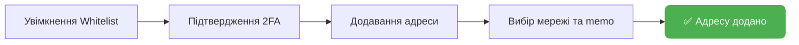

| Параметр | Стовпець | Опис |
|----------|----------|------|
| **Потребує** | `[WHITELIST] whitelist_address` | Адреса гаманця |
| **Потребує** | `[WHITELIST] whitelist_chain` | Мережа — **канонічний код Bybit** (`TRX`, `BSC`, `ETH`, `APTOS`…). Коди — у таблиці вище, у розділі `deposit` |
| Опціонально | `[WHITELIST] whitelist_memo` | Memo/Tag (якщо потрібно мережею) |
| **Оновлює** | `[WHITELIST] whitelist_status` | 1 — успішно додано |
| **Оновлює** | `[RESULT] status` | `[WHITELIST] SUCCESS` |

> Якщо 2FA не підключено — AutoPilot автоматично підключить його перед додаванням у whitelist

---

### `withdraw` — Виведення коштів

Швидке та стабільне виведення коштів — переведено на запити, без взаємодії з елементами інтерфейсу, з автоматичним підтвердженням (email + 2FA).

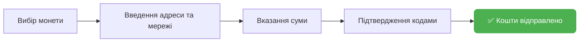

| Параметр | Стовпець | Опис |
|----------|----------|------|
| **Потребує** | `[WITHDRAW] withdraw_coin` | Монета для виведення (наприклад: `USDT`) |
| **Потребує** | `[WITHDRAW] withdraw_chain` | Мережа виведення — канонічна назва Bybit (наприклад: `TRX` для TRC20, `APTOS`, `BSC` для BEP20, `ETH` для ERC20). При помилці AutoPilot виведе в лог повний список підтримуваних мереж для обраної монети |
| **Потребує** | `[WITHDRAW] withdraw_address` | Адреса гаманця отримувача |
| Опціонально | `[WITHDRAW] withdraw_memo` | Memo/Tag (потрібно для TON, XRP та інших мереж з memo) |
| Опціонально | `[WITHDRAW] withdraw_amount` | Сума виведення: фіксоване число USDT (`50` = 50 USDT), відсоток від балансу (`50%` = половина) або `max` / `all` / порожньо = весь баланс |
| **Оновлює** | `[RESULT] status` | `[WITHDRAW] SUCCESS` |

> Якщо 2FA не підключено — AutoPilot автоматично підключить його перед виведенням.
>
> 💡 **Мережа пишеться ім'ям Bybit**: TRC20 → `TRX`, BEP20 → `BSC`, ERC20 → `ETH`, Polygon → `MATIC`. Помилитесь — дія зупиниться, у логу з'явиться список робочих мереж.

#### Підказка: яку мережу обрати для USDT

| Мережа | Комісія | Мін. вивід |
|--------|---------|------------|
| `APTOS` | 0 USDT | 0 |
| `TRX` | 1 USDT | 2.6 |
| `BSC` | 0.2 USDT | 10 |
| `MATIC` | 0.1 USDT | 1 |
| `ARBI` | 0.1 USDT | 1 |
| `OP` | 1 USDT | 1 |
| `SOL` | 0.5 USDT | 10 |
| `ETH` | 0.8 USDT | 6 |
| `TON` | 0.15 USDT | 1 |

> Це не повний список — у Bybit ~20 мереж для USDT. Повний актуальний список з'явиться в логі, якщо вписати неіснуючу мережу. Комісії та мінімуми Bybit може змінювати — перевіряйте в інтерфейсі біржі перед масовим виведенням.

---

### Алгоритм повного виведення (`full_withdraw=YES`)

Якщо в конфігу увімкнено `full_withdraw=YES`, AutoPilot виконає повний продаж усіх активів перед виведенням:

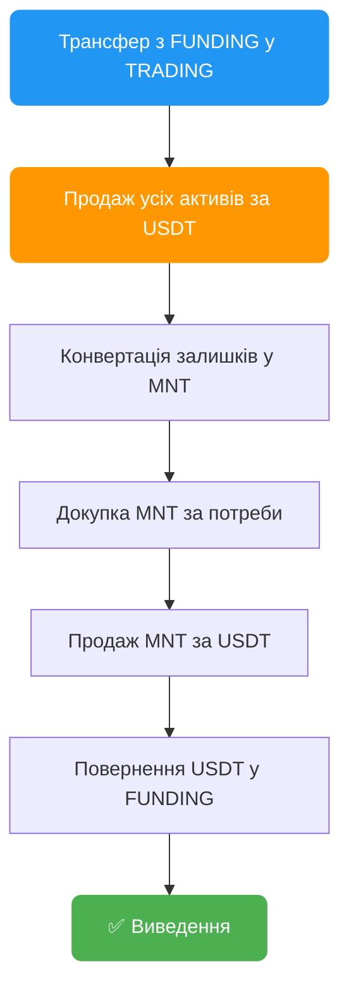

---

### Мастер-гаманець — Авто-whitelist, $0 комісій, невідстежуваний вивід

Виводьте з сотень акаунтів **не вводячи жодної адреси вручну**. AutoPilot створює унікальний гаманець для кожного акаунта, сам додає його в whitelist, виводить з **нульовою комісією** i збирає все на ваш мастер-гаманець. Кожен акаунт виводить на **свою адресу** — зв'язати їх між собою неможливо.

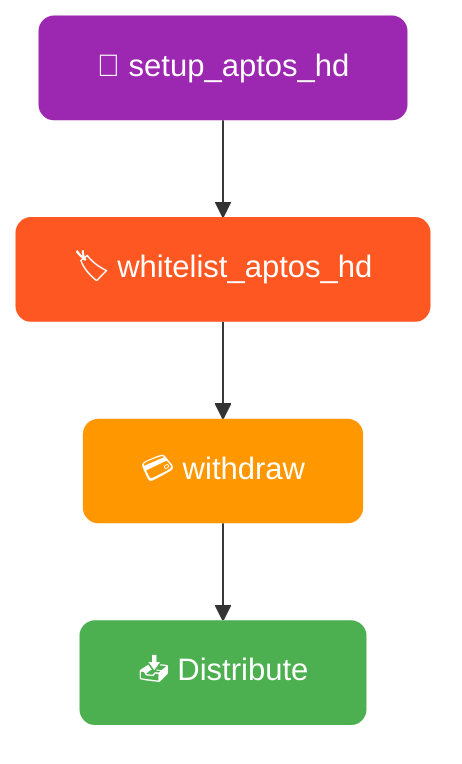

#### `setup_aptos_hd` — Створення мастер-гаманця

Запускається один раз. Створює ваш мастер-гаманець та показує секретну фразу (12 слів). Збережіть її — вона контролює всі ваші адреси.

| Параметр | Стовпець | Опис |
|-----------|--------|-------------|
| **Потрібно** | Конфіг: `activation_key` | Пароль шифрування |
| **Результат** | Файл: `aptos_master_seed.enc` | Зашифрована секретна фраза |
| **Результат** | Файл: `aptos_hd_wallet_data.csv` | Усі адреси та приватні ключі |

> ⚠️ **Збережіть секретну фразу!** Показується один раз. Втратили фразу = втратили доступ до всіх адрес та коштів.

#### `whitelist_aptos_hd` — Автоматичний whitelist

Запускається на всіх профілях. Для кожного акаунта AutoPilot:
1. Створює унікальну Aptos-адресу (різну для кожного акаунта)
2. Заходить на Bybit, додає її в whitelist
3. Підтверджує email/2FA — повністю автоматично
4. Зберігає все в таблицю

Ніякої ручної роботи. Не потрібно створювати гаманці, копіювати адреси чи заповнювати таблицю.

| Параметр | Стовпець | Опис |
|-----------|--------|-------------|
| Автостворення | `[WHITELIST] whitelist_address` | Унікальна Aptos-адреса |
| Автовстановлення | `[WHITELIST] whitelist_network` | `APTOS` |
| **Оновлює** | `[RESULT] status` | `[WHITELIST_HD] SUCCESS` |

> 🔁 **Можна перезапускати:** вже є адреса? AutoPilot використає її — дублікатів не буде.

#### Збір коштів: вкладка Distribute

Після виведення USDT лежать на індивідуальних адресах. Відкрийте вкладку **Distribute** в десктоп-додатку:
- Обрати профілі → Переглянути → Один клік → Все зібрано на мастер-гаманець
- Газ: ~0.002 APT на профіль (долі цента)
- Працює в обидва боки: збір з акаунтів або роздача на них

**Чому Aptos?**

| Мережа | Комісія Bybit | Швидкість |
|---------|-----------|-------|
| **Aptos** | **$0** | ~1 сек |
| Arbitrum | $0.1 | ~1 сек |
| TRC20 | $1 | ~3 хв |
| ERC20 | $1-5 | ~5 хв |

> 💰 **Чим більше акаунтів — тим більше економите. Кожне виведення через TRC20/ERC20 коштує $1-5. Через Aptos = $0.**

> 🕵️ **Приватність:** кожен акаунт → своя адреса → спільних адрес немає → зв'язати акаунти між собою неможливо.

---

### `sell` — Продаж усіх активів

Конвертація всіх монет на акаунті в USDT маркет-ордерами

| Параметр | Стовпець | Опис |
|----------|----------|------|
| **Оновлює** | `[BALANCE] account_balance` | Баланс після продажу |
| **Оновлює** | `[RESULT] status` | `[SELL] SUCCESS` |

---

### `api` — Отримання API ключів

Створення API ключа з правами для SPOT та Futures торгівлі

| Параметр | Стовпець | Опис |
|----------|----------|------|
| Опціонально | `[API] api_whitelist_ip` | IP для whitelist (опціонально) |
| **Оновлює** | `[API] api_key` | Отриманий API ключ |
| **Оновлює** | `[API] api_secret` | Секретний ключ API |
| **Оновлює** | `[RESULT] status` | `[API] SUCCESS` |

---

### `trading` — Автоматичний трейдинг

Торгівля та набивання об'єму маркет ордерами з підтримкою кількох монет

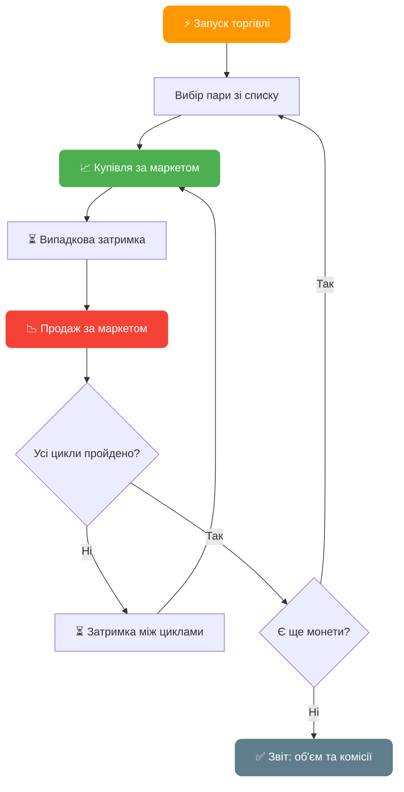

| Параметр | Стовпець | Опис |
|----------|----------|------|
| **Потребує** | `[TRADING] trading_coin` | Актив для торгівлі (наприклад: `BTC` або `BTC,ETH,SOL`) |
| **Потребує** | `[TRADING] trading_amount` | Розмір ордера в USDT (наприклад: `10` або `10,20,5`) |
| **Потребує** | `[TRADING] trading_cycles` | К-сть циклів купівлі-продажу (наприклад: `3` або `3,5,2`) |
| **Оновлює** | `[RESULT] status` | `[TRADING] VOLUME: об'єм, FEES: комісії` |

> **Мульти-монети**: вкажіть через кому кілька монет, розмірів та циклів — AutoPilot буде торгувати ними послідовно.
> Приклад: `BTC,ETH` + `10,20` + `3,5` = 3 цикли BTC по 10 USDT, потім 5 циклів ETH по 20 USDT

> **Формула об'єму**: цикли x розмір ордера x 2 (купівля + продаж)
> Приклад: 3 цикли по 10 USDT = 3 x 10 x 2 = **60 USDT** об'єму

---

### `ts` — TokenSplash

Автоматична участь у TokenSplash івентах на Bybit. Дія виконується у два кроки: **реєстрація в івенті** та (опційно) **виконання завдання на торгівлю**.

| Параметр | Стовпець | Опис |
|----------|----------|------|
| **Потребує** | `[TS] code` | Код івента (з посилання `…/token-splash/detail?code=`) |
| **Оновлює** | `[RESULT] status` | Статус реєстрації/завдання (див. нижче) |

#### Як це працює

1. **Реєстрація (участь).** Пілот за потреби сам логіниться, перевіряє KYC i натискає «Участвовать» через API біржі. **Баланс для цього не потрібен** — навіть акаунт з 0 USDT буде зареєстрований в івенті.
2. **Завдання на торгівлю** (керується конфігом `ts_order`). Якщо на акаунті є USDT, пілот купує токен івента та одразу продає його (1 купівля + 1 продаж маркет-ордерами) — це закриває «завдання на депозит» івента. Розмір кожного ордера — випадкове число між двома значеннями `ts_order`.

#### Залежність від балансу

- **Немає / 0 USDT** → пілот лише реєструється в івенті. Якщо зареєструватися не вдалося — пише причину в таблицю.
- **Є баланс** (вистачає на розмір ордера; ~60 USDT із запасом) → після реєстрації ще й торгує купити/продати, щоб закрити завдання.

> Щоб акаунти **лише реєструвалися** (без торгівлі), поставте `ts_order=0,0`.

#### Налаштування `ts_order` (у `AutoPilot.config`)

```ini
# Розмір ордера завдання в USDT — випадково між MIN та MAX
ts_order=50,55
```

- `ts_order=50,55` → кожен ордер випадковий **50–55 USDT** (купити на ~50–55 i продати — завдання на торгівлю виконано).
- `ts_order=0,0` → завдання на торгівлю **пропустити**, лише зареєструватися.
- Коментар `(random 55-100)` у дефолтному конфігу — просто приклад; реальний розмір береться з ваших `MIN,MAX`.

#### Статуси в `[RESULT] status`

| Статус | Значення |
|--------|----------|
| `[TS] {токен} - SUCCESS REGISTERED` | Зареєстрований в івенті |
| `[TS] {токен} - ALREADY JOINED` | Уже був зареєстрований раніше |
| `[TS] FAIL - NO KYC` | Акаунт без верифікації |
| `[TS] FAIL - NO CODE - fill column "[TS] code"` | Не заповнено `[TS] code` |
| `[TS] FAIL - Cannot get TokenSplash details` | Біржа не повернула дані івента (невірний/прострочений код) |
| `[TS] FAIL {токен} - {причина}` | Не вдалося зареєструватися |

> Якщо реєстрація не пройшла, біржа повертає причину відмови — **мітку**. AutoPilot записує її в `[RESULT] status` у поле `{причина}`.

---

### `puzzle_hunt` — Пазл-хант

Автоматичне проходження Puzzle Hunt завдань на Bybit: реєстрація, соціальні завдання, торгівля, щоденні чекіни

| Параметр | Стовпець | Опис |
|----------|----------|------|
| **Потребує** | `[PUZZLE] event_code` | Код пазлу (через кому для кількох) |
| **Оновлює** | `[RESULT] status` | `DONE`, `5/10` (прогрес), `ENDED` або `FAIL` |

> Вкажіть кілька пазлів одразу: `code1,code2,code3`. Зробіть стовпець типом **text**, щоб Excel не обрізав довгі коди.

> Дивіться [FAQ → Puzzle Hunt](/docs/faq/#62--puzzle-hunt-puzzle_hunt) для детального опису, статусів та порад.

---

### `link` — Отримати посилання KYC верифікації

> ⚠️ **Дія застаріла.** Вручну отримувати посилання через `link` більше не потрібно — для верифікацій використовуйте бота та розширення нижче.

**Рекомендований спосіб:**

- 🤖 **Telegram-бот + Miniapp [@AutoPilotKYC_bot](https://t.me/AutoPilotKYC_bot)** — автоматичні KYC-верифікації на платформі AutoPilot KYC. Детальніше: [KYC Платформа](/docs/ua/kyc/autopilot-kyc-subscription/).
- 🧩 **Безкоштовне розширення [AutoPilot Link Generator](https://chromewebstore.google.com/detail/autopilot-link-generator/maogfegbjecdgkfnkemoalpbgodknmaa)** — генерує посилання верифікації для Bybit, MEXC, Bitget та довільних Sumsub/Onfido токенів прямо в браузері.

Legacy-режим самої дії (витягує SUMSUB посилання для акаунта):

| Параметр | Стовпець | Опис |
|----------|----------|------|
| **Оновлює** | `[RESULT] status` | `[LINK] SUCCESS` з URL верифікації |

---

### `learn` — Проходження навчання та встановлення аватара

Автоматичний «прогрів» акаунта через розділ **Bybit Learn**: дія ставить випадковий аватар профілю та проходить навчальні статті, виконуючи на кожній повний набір дій залученості (лайк, перегляд, коментар, додавання в обране, репост). Це робить акаунт «живішим» i зараховує прогрес у кампанії Bybit Learn — завдання за коментарі та репости статей приносять бали й нагороди.

| Параметр | Стовпець | Опис |
|----------|----------|------|
| **Потребує** | вхід в акаунт | Якщо профіль не залогінений — дія **сама виконає вхід** (логін + 2FA за потреби); `[LEARN] FAIL - CAN'T LOGIN` лише якщо автологін не вдався |
| **Оновлює** | `[RESULT] status` | `[LEARN] SUCCESS` / `[LEARN] PARTIAL` / `[LEARN] FAIL` (див. нижче) |

**Що робить дія:**

- **Аватар** — бере випадковий аватар з галереї Bybit i ставить його профілю. Якщо аватар уже було встановлено раніше (запам'ятовується на сервері), крок пропускається — повторний запуск не змінює аватар.
- **5 випадкових статей** — з файлу `bybit_learn_links.txt` (91 посилання) випадково обираються 5 статей за запуск. Домен посилань автоматично підмінюється на домен профілю (`learn.bybit.com` → `learn.bybitglobal.com` тощо).
- **На кожній статті** послідовно виконуються: **лайк** → **перегляд** → **коментар** (випадкова фраза з 15) → **в обране** (зірка) → **репост**. Коментар і репост додатково зараховуються як завдання кампанії Learn для нарахування нагород.

#### Алгоритм роботи

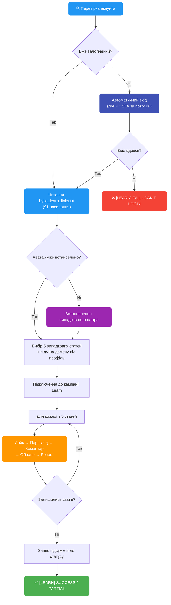

**Статуси в `[RESULT] status`:**

- `[LEARN] SUCCESS - Avatar set, 5/5 articles` — аватар встановлено і пройдено всі 5 статей.
- `[LEARN] PARTIAL - Avatar: YES/NO, N/5 articles` — виконано не все: аватар не встановився, або одна зі статей завершилася помилкою (лічильник пройдених статей падає до `N < 5`).
- `[LEARN] FAIL - ...` — не вдалося увійти (`CAN'T LOGIN`), немає посилань (`NO LINKS IN FILE`) або помилка читання файлу (`LINKS FILE ERROR`).

> Якщо на конкретній статті дії залученості недоступні, лайк/коментар/обране/репост на ній пропускаються (зараховується лише перегляд), але стаття все одно вважається пройденою — на статус `SUCCESS` це не впливає.

#### Файл `bybit_learn_links.txt`

Тримайте файл `bybit_learn_links.txt` у папці з пілотом — **поруч із `AutoPilot.exe`**. Дія читає його при кожному запуску і бере **5 випадкових** посилань. Файл можна редагувати: додавайте або прибирайте посилання `learn.bybit.com`; порожні рядки та рядки без `http` ігноруються.

> Домен у посиланнях підмінюється автоматично під `[BYBIT] domain` профілю, тому у файлі можна тримати посилання у форматі `learn.bybit.com` — вони самі перенаправляться на потрібний регіональний домен.

📥 <a href="/docs/bybit_learn_links.txt" download>Завантажити готовий <code>bybit_learn_links.txt</code></a> — повний список зі 91 статті. Покладіть файл поруч із `AutoPilot.exe` та за бажанням відредагуйте під себе.

---

### `profit` — Розрахунок прибутку

Розрахунок прибутку по акаунту: загальні виведення − загальні депозити − вартість USDT, купленого через P2P + поточний баланс. Враховує P2P-закупівлю як витрати, щоб прибуток відображав реальний результат, а не USDT, куплений за фіат.

| Параметр | Стовпець | Опис |
|----------|----------|------|
| **Оновлює** | `[RESULT] status` | `[PROFIT] значення_прибутку` |

---

### `buy` — Купівля активу

Купівля конкретного активу за USDT

| Параметр | Стовпець | Опис |
|----------|----------|------|
| **Потребує** | `[TRADING] trading_coin` | Актив для купівлі (наприклад: `BTC`) |
| **Потребує** | `[TRADING] trading_amount` | Сума в USDT |
| **Оновлює** | `[RESULT] status` | `[BUY] SUCCESS` |

---

### `limit_buy` — Купівля лімітним ордером

Розміщення лімітного ордера на купівлю активу

| Параметр | Стовпець | Опис |
|----------|----------|------|
| **Потребує** | `[TRADING] trading_coin` | Актив для купівлі (наприклад: `ETH`) |
| **Потребує** | `[TRADING] trading_amount` | Сума в USDT |
| **Оновлює** | `[RESULT] status` | `[LIMIT_BUY] SUCCESS` |

---

### `limit` — Випадкова лімітна торгівля

Автоматична лімітна торгівля з рандомізованими ордерами для природного набивання об'єму

| Параметр | Стовпець | Опис |
|----------|----------|------|
| **Потребує** | `[TRADING] trading_coin` | Актив для торгівлі (наприклад: `BTC`) |
| Опціонально | `[TRADING] trading_amount` | Розмір ордера в USDT |
| Опціонально | `[TRADING] trading_cycles` | Кількість циклів |
| **Оновлює** | `[RESULT] status` | Звіт про об'єм та комісії |

---

### `trading_limit` — Торговий об'єм лімітними ордерами

Набивання об'єму лімітними ордерами замість маркет ордерів

| Параметр | Стовпець | Опис |
|----------|----------|------|
| **Потребує** | `[TRADING] trading_coin` | Актив для торгівлі (наприклад: `BTC` або `BTC,ETH`) |
| **Потребує** | `[TRADING] trading_amount` | Розмір ордера в USDT (наприклад: `10` або `10,20`) |
| Опціонально | `[TRADING] trading_cycles` | Кількість циклів (наприклад: `3` або `3,5`) |
| **Оновлює** | `[RESULT] status` | `[TRADING] VOLUME: об'єм, FEES: комісії` |

> Такий самий мульти-монетний синтаксис як у `trading`, але використовує лімітні ордери для кращих цін виконання.

---

### `limit_sell` — Продаж лімітним ордером на Funding

Продаж активів на Funding акаунті за USDT лімітними ордерами

| Параметр | Стовпець | Опис |
|----------|----------|------|
| **Потребує** | `[TRADING] trading_coin` | Актив для продажу (наприклад: `ETH`) |
| **Оновлює** | `[RESULT] status` | `[LIMIT_SELL] SUCCESS` |

---

### `futures` — Ф'ючерсна торгівля

Торгівля ф'ючерсами з плечем маркет ордерами

| Параметр | Стовпець | Опис |
|----------|----------|------|
| **Потребує** | `[TRADING] trading_coin` | Монета для ф'ючерсів (наприклад: `BTC`) |
| **Потребує** | `[TRADING] trading_amount` | Розмір позиції з плечем в USDT |
| **Потребує** | `[TRADING] trading_cycles` | Кількість торгових циклів |
| **Оновлює** | `[RESULT] status` | Звіт про об'єм та комісії |

> Налаштуйте плече параметром `leverage` у конфігу (за замовчуванням: `10`).

---

### `futures_smart` — Розумна ф'ючерсна торгівля

Автоматична ф'ючерсна торгівля з аналізом ринку, post-only лімітними ордерами та управлінням позиціями. **На 32% дешевше** ніж маркет ордери.

| Параметр | Стовпець | Опис |
|----------|----------|------|
| **Потребує** | `[TRADING] trading_coin` | Монета для ф'ючерсів (наприклад: `BTC`) |
| **Потребує** | `[TRADING] trading_amount` | Розмір позиції з плечем в USDT |
| **Потребує** | `[TRADING] trading_cycles` | Кількість торгових циклів |
| **Оновлює** | `[RESULT] status` | Звіт про об'єм та комісії |

> `trading_amount` — це розмір позиції **з урахуванням плеча**. Реальний баланс на угоду = `trading_amount / leverage`.

> Дивіться [FAQ → Smart Futures](/docs/faq/#61--smart-futures-trading-futures_smart) для алгоритмів, формул та параметрів конфігу.

---

### `stake` / `earn` — Стейкінг USDT (Flexible Savings)

Відправка USDT до пулу Bybit Flexible Savings. `stake` та `earn` — аліаси, однакова дія.

| Параметр | Стовпець | Опис |
|----------|----------|------|
| Опціонально | `[WITHDRAW] withdraw_amount` | Фіксована сума USDT (за замовчуванням: весь доступний) |
| **Оновлює** | `[RESULT] status` | `[STAKE] SUCCESS - stake 150.25` |

> Автоматично переказує USDT з Trading → Funding перед стейкінгом.

---

### `unstake` / `unearn` — Виведення зі стейкінгу

Виведення USDT з пулу Flexible Savings назад на Funding. `unstake` та `unearn` — аліаси.

| Параметр | Стовпець | Опис |
|----------|----------|------|
| **Оновлює** | `[RESULT] status` | `[STAKE] SUCCESS - unstake 150.25` |

> Дивіться [FAQ → Bybit Earn](/docs/faq/#63--bybit-earn--usdt-staking-earn--unearn) для детального опису.

---

### `lp` — Реєстрація в LaunchPad івенті

Автоматична реєстрація в поточному активному LaunchPad івенті на Bybit. Повністю автоматично — стовпці не потрібні.

| Параметр | Стовпець | Опис |
|----------|----------|------|
| **Оновлює** | `[RESULT] status` | `[LP] SUCCESS` |

---

### `ref_code` — Витягти реферальний код

Автоматичне витягування реферального коду акаунта

| Параметр | Стовпець | Опис |
|----------|----------|------|
| **Оновлює** | `[RESULT] status` | `[REF_CODE] значення_коду` |

---

## Зведена таблиця дій

```mermaid
flowchart TD
    subgraph REG ["🟢 Початок роботи"]
        R["register — Реєстрація"]
        L["login — Логін"]
    end

    subgraph SEC ["🔐 Безпека"]
        FA["2fa — 2FA захист"]
        API["api — API ключі"]
    end

    subgraph WALLET ["💰 Гаманці"]
        D["deposit — Адреса депозиту"]
        W["whitelist — Whitelist"]
        HD["whitelist_aptos_hd — Мастер-гаманець"]
        WD["withdraw — Виведення"]
        S["sell — Продаж активів"]
    end

    subgraph TRADE ["📊 Трейдинг"]
        T["trading — Маркет торгівля"]
        TL["trading_limit — Лімітна торгівля"]
        B["buy — Купівля активу"]
        FU["futures_smart — Розумні ф'ючерси"]
    end

    subgraph EVENTS ["🎯 Івенти та нагороди"]
        TS["ts — TokenSplash"]
        LP["lp — LaunchPad"]
        PZ["puzzle_hunt — Puzzle Hunt"]
    end

    subgraph STAKE ["🏦 Стейкінг"]
        ST["stake — Earn"]
        UST["unstake — Unearn"]
    end

    R --> L
    L --> FA
    FA --> W
    FA --> HD
    FA --> API
    W --> WD
    HD --> WD
    S --> WD
    L --> D
    L --> T
    L --> TL
    L --> B
    L --> FU
    L --> TS
    L --> LP
    L --> PZ
    L --> ST
    ST --> UST

    style R fill:#4CAF50,color:#fff,stroke:none,rx:8
    style L fill:#2196F3,color:#fff,stroke:none,rx:8
    style FA fill:#9C27B0,color:#fff,stroke:none,rx:8
    style API fill:#673AB7,color:#fff,stroke:none,rx:8
    style D fill:#FF9800,color:#fff,stroke:none,rx:8
    style W fill:#FF5722,color:#fff,stroke:none,rx:8
    style HD fill:#E040FB,color:#fff,stroke:none,rx:8
    style WD fill:#f44336,color:#fff,stroke:none,rx:8
    style S fill:#E91E63,color:#fff,stroke:none,rx:8
    style T fill:#009688,color:#fff,stroke:none,rx:8
    style TL fill:#00897B,color:#fff,stroke:none,rx:8
    style B fill:#43A047,color:#fff,stroke:none,rx:8
    style FU fill:#E65100,color:#fff,stroke:none,rx:8
    style TS fill:#00BCD4,color:#fff,stroke:none,rx:8
    style LP fill:#0097A7,color:#fff,stroke:none,rx:8
    style PZ fill:#795548,color:#fff,stroke:none,rx:8
    style CL fill:#AB47BC,color:#fff,stroke:none,rx:8
    style ST fill:#66BB6A,color:#fff,stroke:none,rx:8
    style UST fill:#81C784,color:#fff,stroke:none,rx:8
```

| Дія | Опис | Авто-логін | Авто-2FA |
|-----|------|:----------:|:--------:|
| `register` | Реєстрація акаунта | — | — |
| `login` | Вхід в акаунт | — | — |
| `2fa` | Підключення 2FA | ✅ | — |
| `link` | Отримати посилання KYC верифікації | ✅ | — |
| `learn` | Навчання та встановлення аватара | ✅ | — |
| `deposit` | Адреса для депозиту | ✅ | — |
| `whitelist` | Додавання в whitelist | ✅ | ✅ |
| `withdraw` | Виведення коштів | ✅ | ✅ |
| `sell` | Продаж усіх активів | ✅ | — |
| `api` | Створення API ключів | ✅ | — |
| `trading` | Маркет торгівля | ✅ | — |
| `trading_limit` | Лімітна торгівля | ✅ | — |
| `buy` | Купівля активу | ✅ | — |
| `limit_buy` | Купівля лімітним ордером | ✅ | — |
| `limit` | Випадкова лімітна торгівля | ✅ | — |
| `limit_sell` | Продаж лімітним ордером на Funding | ✅ | — |
| `futures` | Ф'ючерсна торгівля | ✅ | — |
| `futures_smart` | Розумні ф'ючерси (на 32% дешевше) | ✅ | — |
| `stake` / `earn` | Стейкінг USDT | ✅ | — |
| `unstake` / `unearn` | Виведення зі стейкінгу | ✅ | — |
| `ts` | TokenSplash івенти | ✅ | — |
| `lp` | LaunchPad івенти | ✅ | — |
| `puzzle_hunt` | Puzzle Hunt | ✅ | — |
| `profit` | Розрахунок прибутку | ✅ | — |
| `ref_code` | Витягування реферального коду | ✅ | — |

---

## Налаштування конфігурації

Файл `AutoPilot.config` містить основні параметри:

| Параметр | Опис | Приклад |
|----------|------|---------|
| `activation_key` | Ключ активації | `XXXX-XXXX-XXXX` |
| `speed_mode` | Режим швидкості | `FAST`, `MEDIUM`, `SLOW` |
| `captcha_key` | API ключ платного провайдера — **опційно**, лише як підстраховка | `abc123...` |
| `captcha_provider` | Провайдер капчі (⭐ `capsolver`, `capmonster`, `2captcha`) — можна не вказувати, визначається за форматом ключа | `capsolver` |
| `parallel_limit` | Ліміт паралельних акаунтів | `3` |
| `shuffle_order` | Перемішати порядок акаунтів | `YES` / `NO` |
| `window_size` | Розмір вікна браузера | `1280x720` |
| `close_tabs` | Закривати вкладки після роботи | `YES` / `NO` |
| `close_after` | Закривати профіль після роботи | `YES` / `NO` |
| `email_delay_check` | Затримка перевірки пошти (сек) | `5` |
| `language` | Мова інтерфейсу | `EN`, `RU` |
| `full_withdraw` | Повний продаж перед виведенням | `YES` / `NO` |
| `show_credentials` | Показувати KYC дані | `YES` / `NO` |
| `bot_mode` | Інтеграція з Telegram ботом | `YES` / `NO` |

---

## 🌐 Bybit Global домени

Bybit використовує декілька регіональних доменів для різних юрисдикцій. AutoPilot підтримує вибір домену через стовпець **`[BYBIT] domain`** у `AutoPilot_table.xlsx`.

**Доступні значення:**

| Значення стовпця | Підсумковий домен | Коли використовувати |
|:---:|:---:|---|
| (порожньо) | `bybit.com` | За замовчуванням |
| `bybitglobal` | `bybitglobal.com` | Якщо є проблеми з реєстрацією, 2FA або капчею |

**Як підключити:**

1. Додайте стовпець **`[BYBIT] domain`** у `AutoPilot_table.xlsx`
2. Вкажіть `bybitglobal` для потрібних профілів (або залиште порожнім для `bybit.com`)
3. Запустіть будь-яку дію — AutoPilot автоматично перейде на обраний домен

> 💡 **Коли перемикатися на `bybitglobal`:**
> - **Реєстрація** на `bybit.com` не проходить, а на `bybitglobal.com` працює
> - При підключенні **2FA** код на пошту не приходить (актуально для Google Authenticator у деяких регіонах)
> - **Капча** вирішується нестабільно на `bybit.com`
> - У деяких регіонах `bybitglobal.com` працює стабільніше загалом

> ⚠️ **До уваги:** `bybit.com` та `bybitglobal.com` — це окремі регіональні версії з незалежними акаунтами. Профіль, зареєстрований на одному домені, повинен продовжувати працювати з тим самим `[BYBIT] domain` — не переключайте домени для вже створених акаунтів.

---

## KYC статуси

При логіні AutoPilot перевіряє статус верифікації:

| Статус | Опис |
|--------|------|
| `UNSUBMITTED` | Верифікацію не подано |
| `REJECT` | Відхилено (причина вказується) |
| `1 [КРАЇНА]` | Верифіковано (наприклад: `1 RU`) |

Якщо `show_credentials=YES`, також записуються: ім'я, прізвище, тип документа, номер документа.

---

## Налаштування пошти (IMAP)

AutoPilot використовує протокол IMAP для отримання кодів верифікації з пошти.

**Підтримувані провайдери:** Yahoo, Rambler, iCloud, Outlook, Gmail, Mail.ru, First Mail та інші

> Для Gmail, Outlook, Yahoo, iCloud потрібне створення **пароля застосунку** (App Password) — звичайний пароль не підійде для IMAP. Або налаштуйте переадресацію листів на пошту з прямим IMAP доступом.

---

## Швидкий старт після покупки

1. **Завантажте** `AutoPilot.zip` із закріпленого повідомлення у чаті [@buykyc_bot](https://t.me/buykyc_bot)
2. **Розпакуйте** архів у нову папку
3. **Налаштуйте** `AutoPilot.config`:
   - Вкажіть `activation_key` (отримано при покупці)
   - `captcha_key` вказувати **не обов'язково** — капчу AutoPilot вирішує сам, безкоштовно. Ключ потрібен лише як підстраховка на рідкісні типи: ⭐ [CapSolver](https://www.capsolver.com/) (рекомендовано), [CapMonster](https://capmonster.cloud/), [2Captcha](https://2captcha.com/). Детальніше — [FAQ → секція 4](/docs/ua/faq/#4--проксі-та-капча)
4. **Заповніть** `AutoPilot_table.xlsx` даними акаунтів
5. **Запустіть** застосунок

> Керування також доступне через бот [@AutoPilotManager_bot](https://t.me/AutoPilotManager_bot) (потрібен `bot_mode=YES` у конфігу)

---

## Покупка

Одразу після покупки ви отримуєте готову збірку для роботи.

Придбати ключ активації для Bybit AutoPilot: [https://t.me/buykyc_bot](https://t.me/buykyc_bot)

Разом із ключем ви отримуєте доступ до тематичного чату AutoPilot, де можна ставити запитання, спілкуватися та отримувати поради.

Час життя ключа відраховується від першого запуску.

---

**Менеджер:** [@OxViktor](https://t.me/OxViktor)
**Розробник:** [@axelenvy](https://t.me/axelenvy)
