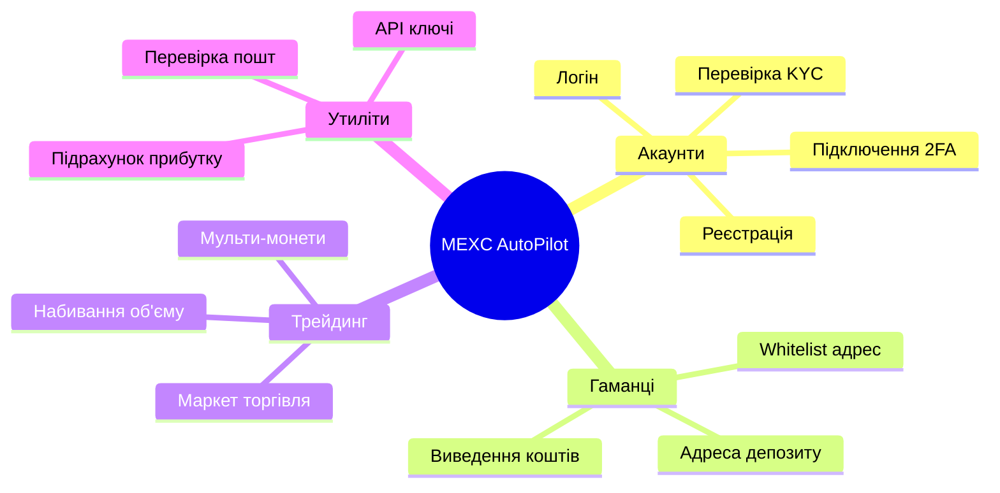
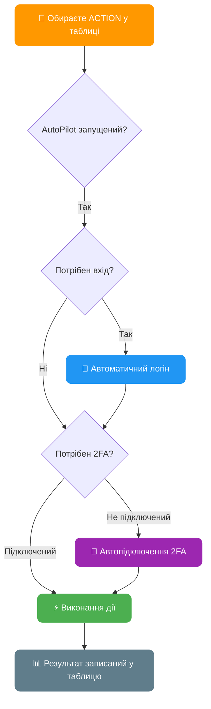
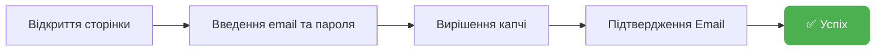
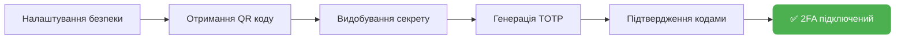
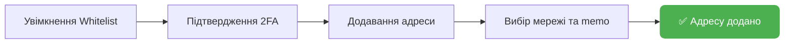
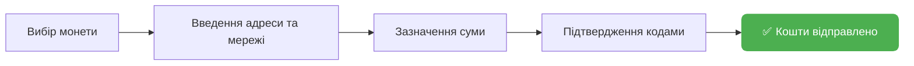
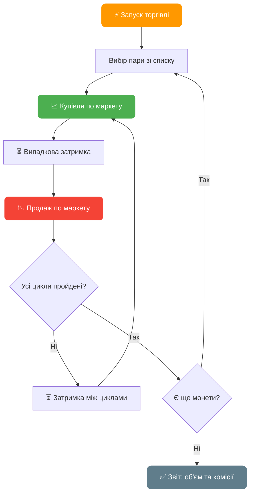
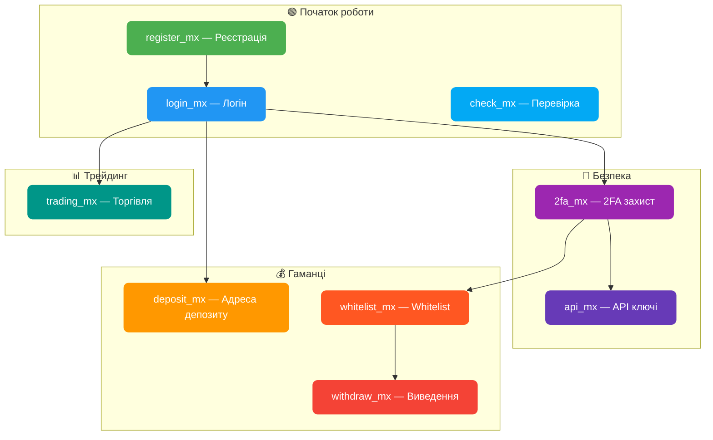

# AutoPilot Software — Максимальна Автоматизацiя на MEXC

**Пiдтримка AdsPower & Dolphin & Vision & Afina**
**Windows / MacOS / Linux**

---

## Забудьте про ручну роботу: рiшення знайдено

Ручне керування акаунтами потребує багато часу, зусиль i пов'язане з ризиком помилок. Для масштабування своїх операцiй вам необхiдно:
- Регулярно виконувати однотипнi дiї
- Оптимiзувати час

AutoPilot Software вирiшує цi проблеми, перетворюючи рутину на автоматичний процес. Iнтеграцiя з AdsPower & Dolphin забезпечує захист цифрових вiдбиткiв та безпечну роботу з багатьма акаунтами.

---

## Як працює AutoPilot


---

## Основнi переваги

**Економiя часу:**
Автоматизацiя дозволяє одночасно керувати сотнями акаунтiв

**Зручнiсть у використаннi:**
Займайтесь своїми справами поки AutoPilot автоматизує дiї у фоновому режимi. Ви можете користуватися своїми додатками поки AutoPilot працює у вiкнах браузера на задньому фонi

**Iнтеграцiя з AdsPower / Dolphin / Vision / Afina:**
Безпечне та анонiмне використання акаунтiв. AutoPilot автоматично запускає та iнтегрується у створену антидетект сесiю браузера з унiкальними вiдбитками. AutoPilot не важливо вiдкритi профiлi вже чи вони закритi — вiн почне автоматизувати процес у будь-якому випадку

**Паралельна автоматизацiя:**
Автоматизуйте безлiч акаунтiв одночасно

**Зручна таблиця облiку акаунтiв:**
Ведiть облiк усiх акаунтiв в однiй Excel таблицi. Можна додавати новi стовпцi, змiнювати порядок стовпцiв на свiй розсуд, головне не змiнювати назви стовпцiв з шаблону

**Налаштування режиму автоматизацiї — унiкальнi режими швидкостi:**
- **FAST** — максимально швидка робота з мiнiмальними затримками
- **MEDIUM** — середня швидкiсть, iмiтацiя людської поведiнки, Smart Cursor, Human Typing
- **SLOW** — повiльна швидкiсть, повна iмiтацiя людської поведiнки

**Мультифункцiональнiсть:**
Налаштуйте будь-якi дiї для кожного акаунта. Наприклад, AutoPilot буде отримувати адресу депозиту для одних акаунтiв, а на iнших буде виводити кошти

**Автоматичнi ланцюжки дiй:**
Обирайте будь-яку дiю — AutoPilot автоматично увiйде в акаунт, якщо потрiбен вхiд. Також сам увiмкне 2FA захист, якщо вiн ще не пiдключений

---

## Функцiонал MEXC AutoPilot



AutoPilot пiдтримує безлiч автоматизованих дiй для MEXC:

- **Реєстрацiя** акаунтiв на MEXC: звичайним методом, за реферальним посиланням
- **Логiн**: вхiд в акаунт, перевiрка верифiкацiї та балансу
- **Перевiрка KYC**: перевiрка рiвня верифiкацiї
- **Керування 2FA**: пiдключення двофакторної автентифiкацiї та введення кодiв
- **Отримання адреси депозиту** для кожного акаунта
- **Виведення коштiв** з акаунта
- **Додавання адрес у whitelist** з пiдтримкою рiзних мереж
- **Отримання API-ключiв** для торгiвлi з налаштуванням дозволiв
- **Автоматичний трейдинг**: торгiвля та набивання об'єму у вказаних парах
- **Послiдовна торгiвля**: пiдтримка кiлькох монет через кому
- Автоматичне вирiшення капчi, отримання кодiв верифiкацiї та багато iншого

---

## 🧩 Налаштування капчi

AutoPilot використовує провайдерiв вирiшення капчi для реєстрацiї та логiну. Пiдтримуються **4 провайдери**:

- ⭐ **CapSolver** — [capsolver.com](https://www.capsolver.com/) — **рекомендовано**
- **CapMonster** — [capmonster.cloud](https://capmonster.cloud/)
- **2Captcha** — [2captcha.com](https://2captcha.com/)
- **CapGuru** — [cap.guru](https://cap.guru/) — тiльки вiзуальна капча

Налаштовується в `AutoPilot.config`:

```
captcha_provider=capsolver
captcha_key=CAP-ВАШ_КЛЮЧ_ТУТ
```

> ⭐ **CapSolver** рекомендовано — найстабiльнiший та найшвидший на MEXC (token-based GeeTest v4). Детальнiше про провайдерiв капчi та їх вiдмiнностi — [FAQ → секцiя 4: Проксi та капча](/docs/ua/faq/#4--проксі-та-капча).

---

## Повний перелiк дiй (ACTION)

### Загальна схема роботи дiй



> Усi дiї окрiм реєстрацiї автоматично увiйдуть в акаунт, якщо потрiбно. Дiї whitelist та withdraw автоматично пiдключать 2FA, якщо не встановлений.

---

### `register_mx` — Реєстрацiя акаунта на MEXC

Реєстрацiя акаунта з автоматичним вирiшенням капчi та пiдтвердженням email



| Параметр | Стовпець | Опис |
|----------|----------|------|
| **Потребує** | `[EMAIL] mail_provider` | Поштовий сервiс (yahoo, rambler, icloud, outlook, gmail...) |
| **Потребує** | `[PROFILE] mail` | Адреса поштової скриньки |
| **Потребує** | `[EMAIL] mail_password` | Пароль пошти / IMAP пароль |
| Опцiонально | `[PROFILE] mexc_password` | Пароль вiд акаунта (AutoPilot генерує, якщо порожнiй) |
| Опцiонально | `[REG] referral_code` | Реферальний код |
| **Оновлює** | `[REG] is_registered` | Статус реєстрацiї (1 — зареєстрований) |
| **Оновлює** | `[RESULT] status` | `[REGISTER_MX] SUCCESS` або опис помилки |

---

### `login_mx` — Логiн в акаунт

Вхiд в акаунт, перевiрка верифiкацiї та балансу

| Параметр | Стовпець | Опис |
|----------|----------|------|
| **Потребує** | `[REG] is_registered` | 1 (зареєстрований) |
| **Потребує** | `[PROFILE] mail` | Адреса пошти |
| **Потребує** | `[PROFILE] mexc_password` | Пароль вiд акаунта |
| Опцiонально | `[2FA] totp_secret_code` | Секретний код 2FA |
| **Оновлює** | `[KYC] kyc_status` | Рiвень верифiкацiї |
| **Оновлює** | `[BALANCE] account_balance` | Баланс акаунта в USDT |
| **Оновлює** | `[RESULT] status` | `[LOGIN_MX] SUCCESS` |

---

### `check_mx` — Перевiрка верифiкацiї

Перевiрка рiвня KYC та балансу акаунта без виконання додаткових дiй

| Параметр | Стовпець | Опис |
|----------|----------|------|
| **Оновлює** | `[KYC] kyc_status` | Рiвень верифiкацiї |
| **Оновлює** | `[BALANCE] account_balance` | Баланс в USDT |
| **Оновлює** | `[RESULT] status` | `[CHECK_MX] SUCCESS` |

---

### `2fa_mx` — Пiдключення 2FA

Автоматичне встановлення Google Authenticator на акаунтi



| Параметр | Стовпець | Опис |
|----------|----------|------|
| **Оновлює** | `[2FA] totp_secret_code` | Секретний код 2FA (зберiгається автоматично) |
| **Оновлює** | `[RESULT] status` | `[2FA_MX] SUCCESS` |

---

### `whitelist_mx` — Додавання адреси у Whitelist

Увiмкнення whitelist режиму та додавання адреси для виведення



| Параметр | Стовпець | Опис |
|----------|----------|------|
| **Потребує** | `[WHITELIST_MEXC] whitelist_address` | Адреса гаманця |
| **Потребує** | `[WHITELIST_MEXC] whitelist_chain` | Мережа (як на MEXC, наприклад: `ERC20`, `TRC20`, `Aptos`) |
| Опцiонально | `[WHITELIST_MEXC] whitelist_memo` | Memo/Tag (якщо потрiбно мережею) |
| **Оновлює** | `[WHITELIST_MEXC] whitelist_status` | 1 — успiшно додано |
| **Оновлює** | `[RESULT] status` | `[WHITELIST_MX] SUCCESS` |

> Якщо 2FA не пiдключений — AutoPilot автоматично пiдключить його перед додаванням у whitelist

---

### `withdraw_mx` — Виведення коштiв

Повне виведення коштiв з акаунта з автоматичним пiдтвердженням



| Параметр | Стовпець | Опис |
|----------|----------|------|
| **Потребує** | `[WITHDRAW_MEXC] withdraw_coin` | Монета для виведення (наприклад: `USDT`) |
| **Потребує** | `[WITHDRAW_MEXC] withdraw_chain` | Мережа виведення (як на MEXC, наприклад: `TRC20`) |
| **Потребує** | `[WITHDRAW_MEXC] withdraw_address` | Адреса гаманця отримувача |
| Опцiонально | `[WITHDRAW_MEXC] withdraw_memo` | Memo/Tag |
| Опцiонально | `[WITHDRAW_MEXC] withdraw_amount` | Сума у % (100 = все, 50 = половина) |
| **Оновлює** | `[RESULT] status` | `[WITHDRAW_MEXC] SUCCESS` |

> Якщо 2FA не пiдключений — AutoPilot автоматично пiдключить його перед виведенням

---

### `api_mx` — Отримання API ключiв

Створення API ключа з повними правами для SPOT та Futures торгiвлi

| Параметр | Стовпець | Опис |
|----------|----------|------|
| Опцiонально | `[API] api_whitelist_ip` | IP для whitelist (опцiонально) |
| **Оновлює** | `[API] api_key` | Отриманий API ключ |
| **Оновлює** | `[API] api_secret` | Секретний ключ API |
| **Оновлює** | `[RESULT] status` | `[API_MX] SUCCESS` |

---

### `trading_mx` — Автоматичний трейдинг

Торгiвля та набивання об'єму маркет ордерами з пiдтримкою кiлькох монет



| Параметр | Стовпець | Опис |
|----------|----------|------|
| **Потребує** | `[TRADING] trading_coin` | Актив для торгiвлi (наприклад: `BTC` або `BTC,ETH,SOL`) |
| **Потребує** | `[TRADING] trading_amount` | Розмiр ордера в USDT (наприклад: `10` або `10,20,5`) |
| **Потребує** | `[TRADING] trading_cycles` | К-сть циклiв купiвлi-продажу (наприклад: `3` або `3,5,2`) |
| **Оновлює** | `[RESULT] status` | `[TRADING_MX] VOLUME: об'єм, FEES: комiсiї` |

> **Мульти-монети**: вкажiть через кому кiлька монет, розмiрiв та циклiв — AutoPilot буде торгувати ними послiдовно.
> Приклад: `BTC,ETH` + `10,20` + `3,5` = 3 цикли BTC по 10 USDT, потiм 5 циклiв ETH по 20 USDT

> **Формула об'єму**: цикли × розмiр ордера × 2 (купiвля + продаж)
> Приклад: 3 цикли по 10 USDT = 3 × 10 × 2 = **60 USDT** об'єму

---

### `deposit_mx` — Отримання адреси депозиту

Отримати адресу депозиту для поповнення акаунта

| Параметр | Стовпець | Опис |
|----------|----------|------|
| **Потребує** | `[DEPOSIT] deposit_coin` | Монета для депозиту (наприклад: `USDT`) |
| **Потребує** | `[DEPOSIT] deposit_chain` | Мережа (як на MEXC, наприклад: `TRC20`) |
| **Оновлює** | `[DEPOSIT] deposit_address` | Адреса депозиту (формат: `адреса:memo`) |

---

## Зведена таблиця дiй



| Дiя | Опис | Авто-логiн | Авто-2FA |
|-----|------|:----------:|:--------:|
| `register_mx` | Реєстрацiя акаунта | — | — |
| `login_mx` | Вхiд в акаунт | — | — |
| `check_mx` | Перевiрка KYC та балансу | ✅ | — |
| `2fa_mx` | Пiдключення 2FA | ✅ | — |
| `deposit_mx` | Адреса для депозиту | ✅ | — |
| `whitelist_mx` | Додавання у whitelist | ✅ | ✅ |
| `withdraw_mx` | Виведення коштiв | ✅ | ✅ |
| `api_mx` | Створення API ключiв | ✅ | — |
| `trading_mx` | Маркет торгiвля | ✅ | — |

---

## Придбання

Одразу пiсля придбання ви отримуєте готову збiрку для роботи.

Купити ключ активацiї для MEXC AutoPilot: [https://t.me/buykyc_bot](https://t.me/buykyc_bot)

Разом з ключем ви отримуєте доступ до тематичного чату AutoPilot, де можна ставити запитання, спiлкуватися та отримувати поради.

Час життя ключа вiдлiчується вiд першого запуску.
