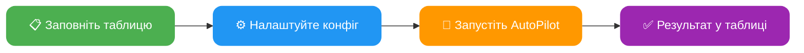
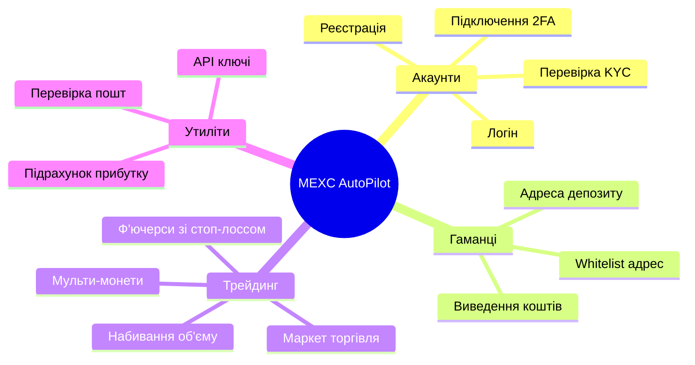
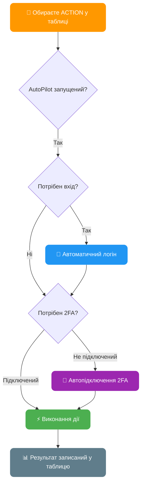
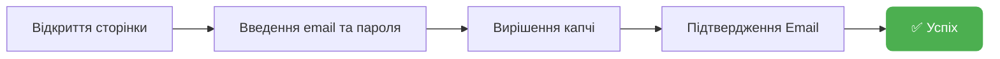
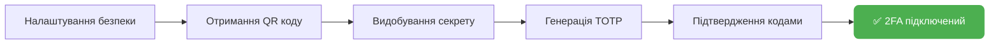
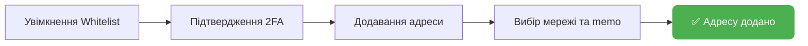
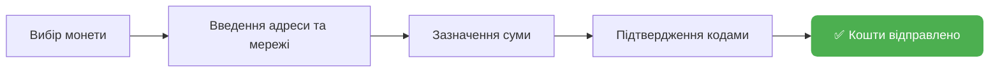
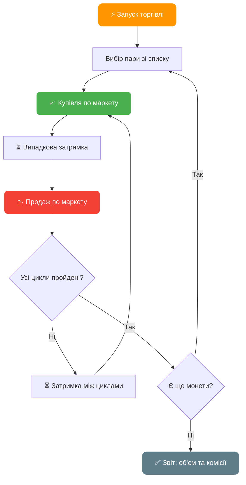
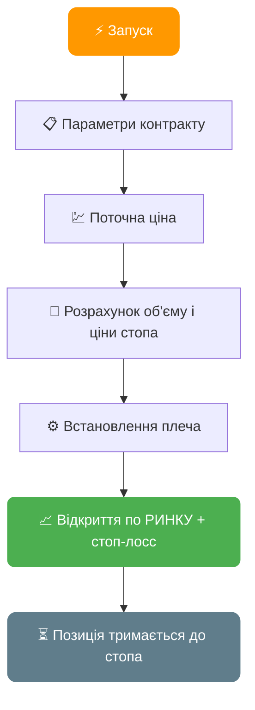
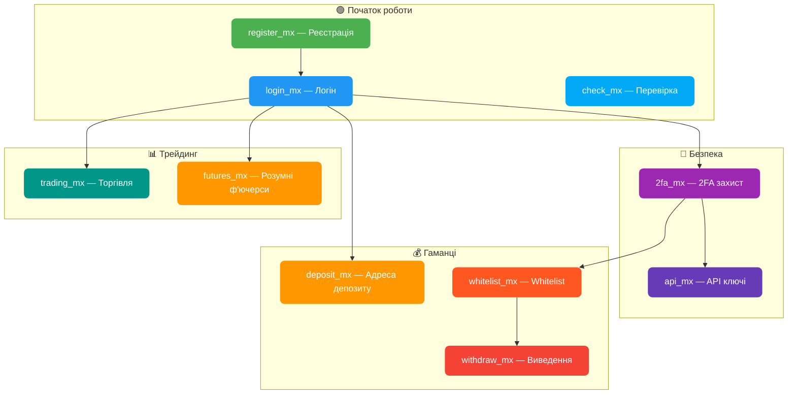

# AutoPilot Software — Максимальна Автоматизація на MEXC

**Підтримка AdsPower & Dolphin & Vision & Afina**
**Windows / MacOS / Linux**

---

## Забудьте про ручну роботу: рішення знайдено

Ручне керування акаунтами потребує багато часу, зусиль і пов'язане з ризиком помилок. Для масштабування своїх операцій вам необхідно:
- Регулярно виконувати однотипні дії
- Оптимізувати час

AutoPilot Software вирішує ці проблеми, перетворюючи рутину на автоматичний процес. Інтеграція з AdsPower & Dolphin забезпечує захист цифрових відбитків та безпечну роботу з багатьма акаунтами.

---

## Як працює AutoPilot


```mermaid
flowchart LR
    A["📋 Заповніть таблицю"] --> B["⚙️ Налаштуйте конфіг"]
    B --> C["🚀 Запустіть AutoPilot"]
    C --> D["✅ Результат у таблиці"]

    style A fill:#4CAF50,color:#fff,stroke:none,rx:12
    style B fill:#2196F3,color:#fff,stroke:none,rx:12
    style C fill:#FF9800,color:#fff,stroke:none,rx:12
    style D fill:#9C27B0,color:#fff,stroke:none,rx:12
```

---

## Основні переваги

**Економія часу:**
Автоматизація дозволяє одночасно керувати сотнями акаунтів

**Зручність у використанні:**
Займайтесь своїми справами поки AutoPilot автоматизує дії у фоновому режимі. Ви можете користуватися своїми додатками поки AutoPilot працює у вікнах браузера на задньому фоні

**Інтеграція з AdsPower / Dolphin / Vision / Afina:**
Безпечне та анонімне використання акаунтів. AutoPilot автоматично запускає та інтегрується у створену антидетект сесію браузера з унікальними відбитками. AutoPilot не важливо відкриті профілі вже чи вони закриті — він почне автоматизувати процес у будь-якому випадку

**Паралельна автоматизація:**
Автоматизуйте безліч акаунтів одночасно

**Зручна таблиця обліку акаунтів:**
Ведіть облік усіх акаунтів в одній Excel таблиці. Можна додавати нові стовпці, змінювати порядок стовпців на свій розсуд, головне не змінювати назви стовпців з шаблону

**Налаштування режиму автоматизації — унікальні режими швидкості:**
- **FAST** — максимально швидка робота з мінімальними затримками
- **MEDIUM** — середня швидкість, імітація людської поведінки, Smart Cursor, Human Typing
- **SLOW** — повільна швидкість, повна імітація людської поведінки

**Мультифункціональність:**
Налаштуйте будь-які дії для кожного акаунта. Наприклад, AutoPilot буде отримувати адресу депозиту для одних акаунтів, а на інших буде виводити кошти

**Автоматичні ланцюжки дій:**
Обирайте будь-яку дію — AutoPilot автоматично увійде в акаунт, якщо потрібен вхід. Також сам увімкне 2FA захист, якщо він ще не підключений

---

## Функціонал MEXC AutoPilot


```mermaid
mindmap
  root((MEXC AutoPilot))
    Акаунти
      Реєстрація
      Логін
      Перевірка KYC
      Підключення 2FA
    Гаманці
      Адреса депозиту
      Whitelist адрес
      Виведення коштів
    Трейдинг
      Маркет торгівля
      Набивання об'єму
      Мульти-монети
      Ф'ючерси зі стоп-лоссом
    Утиліти
      API ключі
      Підрахунок прибутку
      Перевірка пошт
```

AutoPilot підтримує безліч автоматизованих дій для MEXC:

- **Реєстрація** акаунтів на MEXC: звичайним методом, за реферальним посиланням
- **Логін**: вхід в акаунт, перевірка верифікації та балансу
- **Перевірка KYC**: перевірка рівня верифікації
- **Керування 2FA**: підключення двофакторної автентифікації та введення кодів
- **Отримання адреси депозиту** для кожного акаунта
- **Виведення коштів** з акаунта
- **Додавання адрес у whitelist** з підтримкою різних мереж
- **Отримання API-ключів** для торгівлі з налаштуванням дозволів
- **Автоматичний трейдинг**: торгівля та набивання об'єму у вказаних парах
- **Послідовна торгівля**: підтримка кількох монет через кому
- **Розумні ф'ючерси**: відкриття по ринку з автоматичним стоп-лоссом і утриманням позиції
- Автоматичне вирішення капчі, отримання кодів верифікації та багато іншого

---

## 🧩 Налаштування капчі

Капчу AutoPilot вирішує **сам, всередині exe** — безкоштовно, без сторонніх сервісів і без браузера. Для більшості капч на MEXC платний ключ не потрібен: софт стартує і працює без нього.

Платний провайдер підключається лише як підстраховка на рідкісні типи капчі. Якщо вирішите завести ключ — підходять три сервіси:

- ⭐ **CapSolver** — [capsolver.com](https://www.capsolver.com/) — **рекомендовано**
- **CapMonster** — [capmonster.cloud](https://capmonster.cloud/)
- **2Captcha** — [2captcha.com](https://2captcha.com/)

Налаштовується в `AutoPilot.config`:

```
captcha_key=CAP-ВАШ_КЛЮЧ_ТУТ
```

> 🏠 **Проксі профілю обов'язково має бути резидентським** — вбудований вирішувач надсилає перевірку капчі з IP профілю, а датацентрові IP не проходять. Детальніше — [FAQ → секція 4: Проксі та капча](/docs/ua/faq/#4--проксі-та-капча).

---

## Повний перелік дій (ACTION)

### Загальна схема роботи дій


```mermaid
flowchart TD
    START["🎯 Обираєте ACTION у таблиці"] --> AUTO{"AutoPilot запущений?"}
    AUTO -->|Так| LOGIN{"Потрібен вхід?"}
    LOGIN -->|Так| DO_LOGIN["🔑 Автоматичний логін"]
    LOGIN -->|Ні| TFA{"Потрібен 2FA?"}
    DO_LOGIN --> TFA
    TFA -->|Не підключений| DO_2FA["🔐 Автопідключення 2FA"]
    TFA -->|Підключений| ACTION["⚡ Виконання дії"]
    DO_2FA --> ACTION
    ACTION --> RESULT["📊 Результат записаний у таблицю"]

    style START fill:#FF9800,color:#fff,stroke:none,rx:10
    style DO_LOGIN fill:#2196F3,color:#fff,stroke:none,rx:10
    style DO_2FA fill:#9C27B0,color:#fff,stroke:none,rx:10
    style ACTION fill:#4CAF50,color:#fff,stroke:none,rx:10
    style RESULT fill:#607D8B,color:#fff,stroke:none,rx:10
```

> Усі дії окрім реєстрації автоматично увійдуть в акаунт, якщо потрібно. Дії whitelist та withdraw автоматично підключать 2FA, якщо не встановлений.

---

### `register_mx` — Реєстрація акаунта на MEXC

Реєстрація акаунта з автоматичним вирішенням капчі та підтвердженням email


```mermaid
flowchart LR
    A["Відкриття сторінки"] --> B["Введення email та пароля"]
    B --> C["Вирішення капчі"]
    C --> D["Підтвердження Email"]
    D --> E["✅ Успіх"]

    style E fill:#4CAF50,color:#fff,stroke:none,rx:8
```

| Параметр | Стовпець | Опис |
|----------|----------|------|
| **Потребує** | `[EMAIL] mail_provider` | Поштовий сервіс (yahoo, rambler, icloud, outlook, gmail...) |
| **Потребує** | `[PROFILE] mail` | Адреса поштової скриньки |
| **Потребує** | `[EMAIL] mail_password` | Пароль пошти / IMAP пароль |
| Опціонально | `[PROFILE] mexc_password` | Пароль від акаунта (AutoPilot генерує, якщо порожній) |
| Опціонально | `[REG] referral_code` | Реферальний код |
| **Оновлює** | `[REG] is_registered` | Статус реєстрації (1 — зареєстрований) |
| **Оновлює** | `[RESULT] status` | `[REGISTER_MX] SUCCESS` або опис помилки |

---

### `login_mx` — Логін в акаунт

Вхід в акаунт, перевірка верифікації та балансу

| Параметр | Стовпець | Опис |
|----------|----------|------|
| **Потребує** | `[REG] is_registered` | 1 (зареєстрований) |
| **Потребує** | `[PROFILE] mail` | Адреса пошти |
| **Потребує** | `[PROFILE] mexc_password` | Пароль від акаунта |
| Опціонально | `[2FA] totp_secret_code` | Секретний код 2FA |
| **Оновлює** | `[KYC] kyc_status` | Рівень верифікації |
| **Оновлює** | `[BALANCE] account_balance` | Баланс акаунта в USDT |
| **Оновлює** | `[RESULT] status` | `[LOGIN_MX] SUCCESS` |

---

### `check_mx` — Перевірка верифікації

Перевірка рівня KYC та балансу акаунта без виконання додаткових дій

| Параметр | Стовпець | Опис |
|----------|----------|------|
| **Оновлює** | `[KYC] kyc_status` | Рівень верифікації |
| **Оновлює** | `[BALANCE] account_balance` | Баланс в USDT |
| **Оновлює** | `[RESULT] status` | `[CHECK_MX] SUCCESS` |

---

### `2fa_mx` — Підключення 2FA

Автоматичне встановлення Google Authenticator на акаунті


```mermaid
flowchart LR
    A["Налаштування безпеки"] --> B["Отримання QR коду"]
    B --> C["Видобування секрету"]
    C --> D["Генерація TOTP"]
    D --> E["Підтвердження кодами"]
    E --> F["✅ 2FA підключений"]

    style F fill:#4CAF50,color:#fff,stroke:none,rx:8
```

| Параметр | Стовпець | Опис |
|----------|----------|------|
| **Оновлює** | `[2FA] totp_secret_code` | Секретний код 2FA (зберігається автоматично) |
| **Оновлює** | `[RESULT] status` | `[2FA_MX] SUCCESS` |

---

### `whitelist_mx` — Додавання адреси у Whitelist

Увімкнення whitelist режиму та додавання адреси для виведення


```mermaid
flowchart LR
    A["Увімкнення Whitelist"] --> B["Підтвердження 2FA"]
    B --> C["Додавання адреси"]
    C --> D["Вибір мережі та memo"]
    D --> E["✅ Адресу додано"]

    style E fill:#4CAF50,color:#fff,stroke:none,rx:8
```

| Параметр | Стовпець | Опис |
|----------|----------|------|
| **Потребує** | `[WHITELIST_MEXC] whitelist_address` | Адреса гаманця |
| **Потребує** | `[WHITELIST_MEXC] whitelist_chain` | Мережа (як на MEXC, наприклад: `ERC20`, `TRC20`, `Aptos`) |
| Опціонально | `[WHITELIST_MEXC] whitelist_memo` | Memo/Tag (якщо потрібно мережею) |
| **Оновлює** | `[WHITELIST_MEXC] whitelist_status` | 1 — успішно додано |
| **Оновлює** | `[RESULT] status` | `[WHITELIST_MX] SUCCESS` |

> Якщо 2FA не підключений — AutoPilot автоматично підключить його перед додаванням у whitelist

---

### `withdraw_mx` — Виведення коштів

Повне виведення коштів з акаунта з автоматичним підтвердженням


```mermaid
flowchart LR
    A["Вибір монети"] --> B["Введення адреси та мережі"]
    B --> C["Зазначення суми"]
    C --> D["Підтвердження кодами"]
    D --> E["✅ Кошти відправлено"]

    style E fill:#4CAF50,color:#fff,stroke:none,rx:8
```

| Параметр | Стовпець | Опис |
|----------|----------|------|
| **Потребує** | `[WITHDRAW_MEXC] withdraw_coin` | Монета для виведення (наприклад: `USDT`) |
| **Потребує** | `[WITHDRAW_MEXC] withdraw_chain` | Мережа виведення (як на MEXC, наприклад: `TRC20`) |
| **Потребує** | `[WITHDRAW_MEXC] withdraw_address` | Адреса гаманця отримувача |
| Опціонально | `[WITHDRAW_MEXC] withdraw_memo` | Memo/Tag |
| Опціонально | `[WITHDRAW_MEXC] withdraw_amount` | Сума у % (100 = все, 50 = половина) |
| **Оновлює** | `[RESULT] status` | `[WITHDRAW_MEXC] SUCCESS` |

> Якщо 2FA не підключений — AutoPilot автоматично підключить його перед виведенням

---

### `api_mx` — Отримання API ключів

Створення API ключа з повними правами для SPOT та Futures торгівлі

| Параметр | Стовпець | Опис |
|----------|----------|------|
| Опціонально | `[API] api_whitelist_ip` | IP для whitelist (опціонально) |
| **Оновлює** | `[API] api_key` | Отриманий API ключ |
| **Оновлює** | `[API] api_secret` | Секретний ключ API |
| **Оновлює** | `[RESULT] status` | `[API_MX] SUCCESS` |

---

### `trading_mx` — Автоматичний трейдинг

Торгівля та набивання об'єму маркет ордерами з підтримкою кількох монет


```mermaid
flowchart TD
    START["⚡ Запуск торгівлі"] --> COIN["Вибір пари зі списку"]
    COIN --> BUY["📈 Купівля по маркету"]
    BUY --> WAIT1["⏳ Випадкова затримка"]
    WAIT1 --> SELL["📉 Продаж по маркету"]
    SELL --> CHECK{"Усі цикли пройдені?"}
    CHECK -->|Ні| WAIT2["⏳ Затримка між циклами"]
    WAIT2 --> BUY
    CHECK -->|Так| NEXT{"Є ще монети?"}
    NEXT -->|Так| COIN
    NEXT -->|Ні| DONE["✅ Звіт: об'єм та комісії"]

    style START fill:#FF9800,color:#fff,stroke:none,rx:10
    style BUY fill:#4CAF50,color:#fff,stroke:none,rx:8
    style SELL fill:#f44336,color:#fff,stroke:none,rx:8
    style DONE fill:#607D8B,color:#fff,stroke:none,rx:10
```

| Параметр | Стовпець | Опис |
|----------|----------|------|
| **Потребує** | `[TRADING] trading_coin` | Актив для торгівлі (наприклад: `BTC` або `BTC,ETH,SOL`) |
| **Потребує** | `[TRADING] trading_amount` | Розмір ордера в USDT (наприклад: `10` або `10,20,5`) |
| **Потребує** | `[TRADING] trading_cycles` | К-сть циклів купівлі-продажу (наприклад: `3` або `3,5,2`) |
| **Оновлює** | `[RESULT] status` | `[TRADING_MX] VOLUME: об'єм, FEES: комісії` |

> **Мульти-монети**: вкажіть через кому кілька монет, розмірів та циклів — AutoPilot буде торгувати ними послідовно.
> Приклад: `BTC,ETH` + `10,20` + `3,5` = 3 цикли BTC по 10 USDT, потім 5 циклів ETH по 20 USDT

> **Формула об'єму**: цикли × розмір ордера × 2 (купівля + продаж)
> Приклад: 3 цикли по 10 USDT = 3 × 10 × 2 = **60 USDT** об'єму

---

### `deposit_mx` — Отримання адреси депозиту

Отримати адресу депозиту для поповнення акаунта

| Параметр | Стовпець | Опис |
|----------|----------|------|
| **Потребує** | `[DEPOSIT] deposit_coin` | Монета для депозиту (наприклад: `USDT`) |
| **Потребує** | `[DEPOSIT] deposit_chain` | Мережа (як на MEXC, наприклад: `TRC20`) |
| **Оновлює** | `[DEPOSIT] deposit_address` | Адреса депозиту (формат: `адреса:memo`) |

---

### `futures_mx` — Розумні ф'ючерси (ринок + стоп-лосс)

Відкриття ф'ючерсної позиції **по ринку** з автоматичним **стоп-лоссом** за один виклик. Позиція тримається до спрацювання стопа — без тейк-профіту і без зворотного закриття.


```mermaid
flowchart TD
    START["⚡ Запуск"] --> SPEC["📋 Параметри контракту"]
    SPEC --> PRICE["💹 Поточна ціна"]
    PRICE --> CALC["🧮 Розрахунок об'єму і ціни стопа"]
    CALC --> LEV["⚙️ Встановлення плеча"]
    LEV --> OPEN["📈 Відкриття по РИНКУ + стоп-лосс"]
    OPEN --> HOLD["⏳ Позиція тримається до стопа"]

    style START fill:#FF9800,color:#fff,stroke:none,rx:10
    style OPEN fill:#4CAF50,color:#fff,stroke:none,rx:8
    style HOLD fill:#607D8B,color:#fff,stroke:none,rx:10
```

| Параметр | Де задається | Опис |
|----------|--------------|------|
| **Потребує** | `[TRADING] trading_coin` (Excel) | Пара (наприклад: `SOL_USDT` або `SOL`) — єдиний параметр на профіль |
| **Потребує** | `leverage` (конфіг) | Кредитне плече (наприклад: `15`) |
| **Потребує** | `futures_position_size` (конфіг) | Розмір у % від ф'ючерсного балансу USDT (як маржа). Наприклад: `25` |
| **Потребує** | `tp_sl_percentages` (конфіг) | `TP,SL` у % — дія бере **SL** (2-ге число). 💡 Для хеджу рекомендуємо `5,5` (SL 5%) — дає позиції ~95% запасу ходу, щоб хедж дожив до кінця і його не вибило завчасно |
| Опціонально | `futures_side` (конфіг) | Напрямок: `long` (за замовч.) / `short` |
| Опціонально | `futures_margin_mode` (конфіг) | Режим маржі: `cross` (за замовч.) / `isolated` |
| **Оновлює** | `[MEXC_FUTURES] order_id` | ID відкритого ордера |
| **Оновлює** | `[RESULT] status` | Записує **яка угода відкрита** — наприклад `[MEXC_FUTURES] SUCCESS - LONG SOL_USDT 5cont 10x SL@142.30 ~75.00USDT id=...` (напрямок / монета / контракти / плече / стоп / об'єм), або причина помилки. Видно прямо в стовпці статусу — не заплутаєшся. |

> **Єдиний конфіг — жодних нових стовпців.** Усі параметри, крім монети, беруться зі спільного файлу конфігурації (ті самі ключі, що й у ф'ючерсних дій Bybit). На профіль в Excel задається лише монета.

> **Відкриття по ринку, а не ліміткою.** На MEXC комісія ф'ючерсів = 0, маркет-ордер зараховує торговий об'єм і входить миттєво.

> 🛡️ **Ідеально для хеджу.** Хедж відкривається **проти позиції на іншій біржі** (основна позиція там — тут, на MEXC, ти відкриваєш протилежну сторону: `futures_side=short` проти лонга, `long` проти шорта), i ціновий ризик перекрито. Чому заходить: вхід по ринку миттєвий, комісія = 0, авто-стоп сам обмежує збиток, позиція тримається без нагляду до стопа, а розмір у % від балансу дає **однаковий хедж одразу на всіх профілях**. **Чому SL 5%:** дає хеджу ~95% запасу ходу — позиція доживає до кінця, її не вибиває завчасно. **Рекомендований старт:** `leverage=10`, `futures_position_size=20`, `tp_sl_percentages=5,5`.

> **Розмір позиції (`futures_position_size`)** — це **% від доступного ф'ючерсного балансу USDT**, використовується як **маржа**. Розмір позиції = `маржа × плече`. Приклад: баланс 100 USDT, `futures_position_size=25`, `leverage=15` → маржа 25 USDT, позиція ~375 USDT.

> **Стоп-лосс** береться з `tp_sl_percentages` (2-ге число = SL) i рахується від **руху ціни**: для `long` стоп = `вхід × (1 − SL/100)`, для `short` = `вхід × (1 + SL/100)`. Без SL позиція відкривається без стопа.

> **Утримання.** Зворотного закриття немає — позиція тримається скільки завгодно, доки не спрацює стоп.

> ⚠️ Акаунти під ризик-контролем MEXC (повідомлення «Position opening is unavailable…», код `6026`) не можуть відкривати позиції до проходження верифікації — дія повідомить про це в статусі.

---

### `link_mx` — Отримати посилання KYC верифікації

> ⚠️ **Окрема дія не потрібна.** Отримання KYC-посилання для MEXC переїхало в нашу екосистему — використовуйте бота та розширення нижче.

- 🤖 **Telegram-бот + Miniapp [@AutoPilotKYC_bot](https://t.me/AutoPilotKYC_bot)** — автоматичні KYC-верифікації на платформі AutoPilot KYC. Детальніше: [KYC Платформа](/docs/ua/kyc/autopilot-kyc-subscription/).
- 🧩 **Безкоштовне розширення [AutoPilot Link Generator](https://chromewebstore.google.com/detail/autopilot-link-generator/maogfegbjecdgkfnkemoalpbgodknmaa)** — генерує посилання верифікації для Bybit, MEXC, Bitget та довільних Sumsub/Onfido токенів прямо в браузері.

---

## Зведена таблиця дій


```mermaid
flowchart TD
    subgraph REG ["🟢 Початок роботи"]
        R["register_mx — Реєстрація"]
        L["login_mx — Логін"]
        C["check_mx — Перевірка"]
    end

    subgraph SEC ["🔐 Безпека"]
        FA["2fa_mx — 2FA захист"]
        API["api_mx — API ключі"]
    end

    subgraph WALLET ["💰 Гаманці"]
        D["deposit_mx — Адреса депозиту"]
        W["whitelist_mx — Whitelist"]
        WD["withdraw_mx — Виведення"]
    end

    subgraph TRADE ["📊 Трейдинг"]
        T["trading_mx — Торгівля"]
        FU["futures_mx — Розумні ф'ючерси"]
    end

    R --> L
    L --> FA
    FA --> W
    FA --> API
    W --> WD
    L --> D
    L --> T
    L --> FU

    style R fill:#4CAF50,color:#fff,stroke:none,rx:8
    style L fill:#2196F3,color:#fff,stroke:none,rx:8
    style C fill:#03A9F4,color:#fff,stroke:none,rx:8
    style FA fill:#9C27B0,color:#fff,stroke:none,rx:8
    style API fill:#673AB7,color:#fff,stroke:none,rx:8
    style D fill:#FF9800,color:#fff,stroke:none,rx:8
    style W fill:#FF5722,color:#fff,stroke:none,rx:8
    style WD fill:#f44336,color:#fff,stroke:none,rx:8
    style T fill:#009688,color:#fff,stroke:none,rx:8
    style FU fill:#FF9800,color:#fff,stroke:none,rx:8
```

| Дія | Опис | Авто-логін | Авто-2FA |
|-----|------|:----------:|:--------:|
| `register_mx` | Реєстрація акаунта | — | — |
| `login_mx` | Вхід в акаунт | — | — |
| `check_mx` | Перевірка KYC та балансу | ✅ | — |
| `2fa_mx` | Підключення 2FA | ✅ | — |
| `deposit_mx` | Адреса для депозиту | ✅ | — |
| `whitelist_mx` | Додавання у whitelist | ✅ | ✅ |
| `withdraw_mx` | Виведення коштів | ✅ | ✅ |
| `api_mx` | Створення API ключів | ✅ | — |
| `trading_mx` | Маркет торгівля | ✅ | — |
| `futures_mx` | Розумні ф'ючерси (ринок + стоп-лосс) | ✅ | — |

---

## Придбання

Одразу після придбання ви отримуєте готову збірку для роботи.

Купити ключ активації для MEXC AutoPilot: [https://t.me/buykyc_bot](https://t.me/buykyc_bot)

Разом з ключем ви отримуєте доступ до тематичного чату AutoPilot, де можна ставити запитання, спілкуватися та отримувати поради.

Час життя ключа відлічується від першого запуску.
