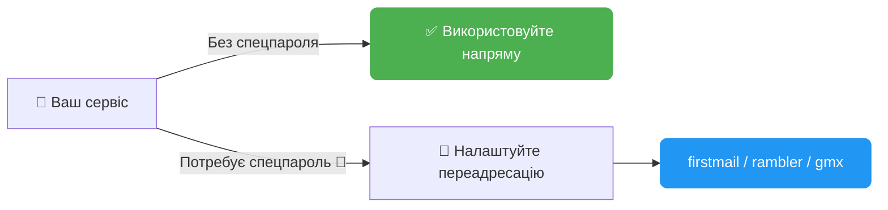
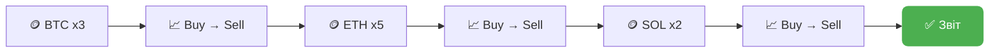
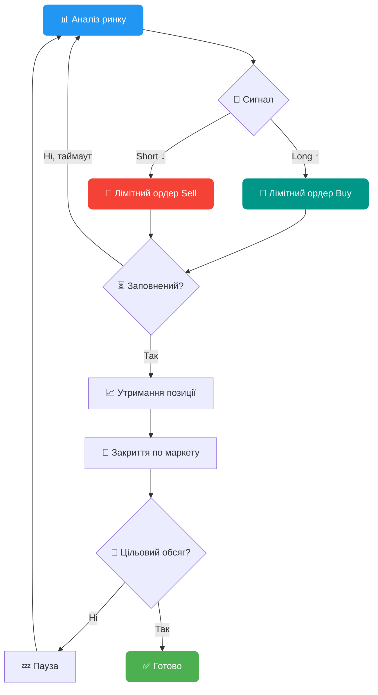
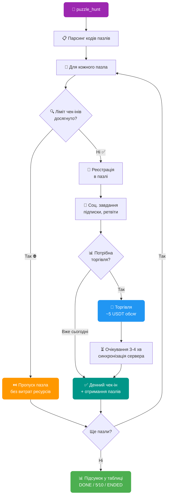
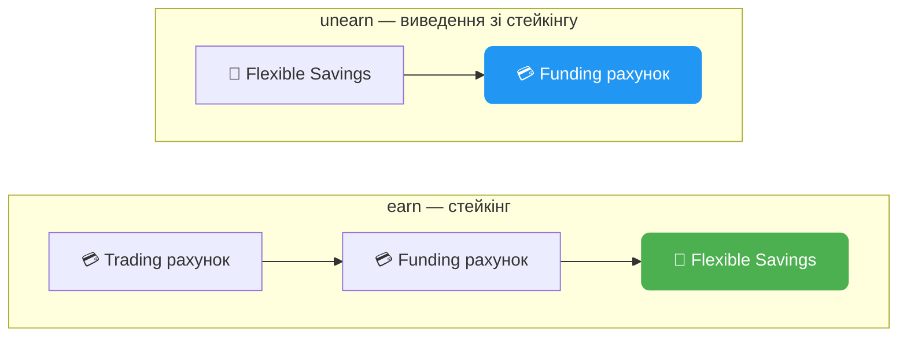
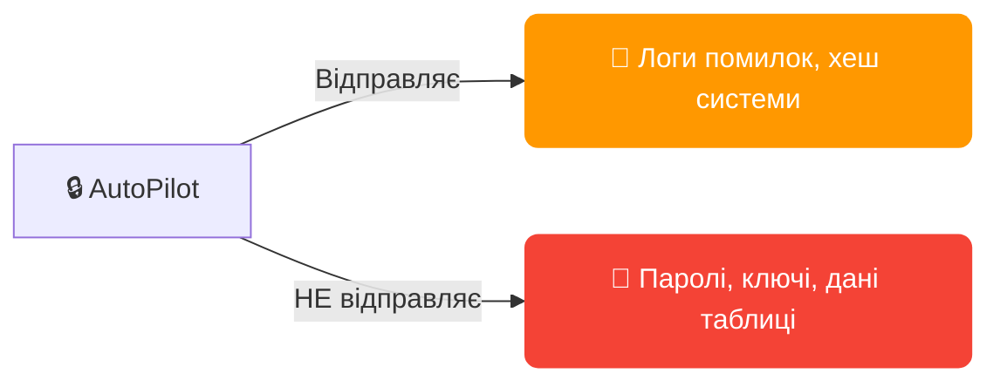

# 📋 FAQ — AutoPilot

**Зміст:**

1. [📧 Поштові сервіси](#1--поштові-сервіси)
2. [🔐 2FA: як це працює](#2--2fa-як-це-працює)
3. [🏎️ Режими швидкості (speed_mode)](#3-️-режими-швидкості-speed_mode)
4. [🧩 Проксі та капча](#4--проксі-та-капча)
5. [📊 Таблиця AutoPilot_table.xlsx](#5--таблиця-autopilot_tablexlsx)
6. [📈 Трейдинг: деталі](#6--трейдинг-деталі)
   - [6.1 🤖 Розумна ф'ючерсна торгівля (futures_smart)](#61--розумна-фючерсна-торгівля-futures_smart)
   - [6.2 🧩 Пазл-хант (puzzle_hunt)](#62--пазл-хант-puzzle_hunt)
   - [6.3 💰 Bybit Earn — стейкінг USDT (earn / unearn)](#63--bybit-earn--стейкінг-usdt-earn--unearn)
7. [💸 Виведення коштів (withdraw)](#7--виведення-коштів-withdraw)
8. [🌐 AdsPower / Dolphin / Vision](#8--adspower--dolphin--vision)
9. [🖥️ Розмір екрана](#9-️-розмір-екрана)
10. [⚙️ Конфігурація: ключові параметри](#10-️-конфігурація-ключові-параметри)
11. [🔒 Безпека та конфіденційність](#11--безпека-та-конфіденційність)
12. [🔄 Оновлення](#12--оновлення)
13. [⏰ Термін дії ключа](#13--термін-дії-ключа)
14. [🚨 Часті помилки та рішення](#14--часті-помилки-та-рішення)
15. [💬 Зв'язок із розробником](#15--звязок-із-розробником)

---

### 1. 📧 Поштові сервіси

**Доступні провайдери** (стовпець `[EMAIL] mail_provider` / `[EMAIL] forwarding_mail_provider`):

| Провайдер | Спецпароль IMAP | Примітка |
|-----------|:-:|----------|
| notletters | — | Рекомендовано ✅ |
| firstmail | — | Рекомендовано ✅ (також для переадресації) |
| rambler | — | Рекомендовано ✅ (також для переадресації) |
| gazeta | — | |
| onet | — | |
| gmx.com / gmx.net | — | |
| nic.ru | — | |
| yahoo | Потрібен 🔑 | App Password в налаштуваннях безпеки |
| gmail | Потрібен 🔑 | App Password (потрібна 2FA на Google акаунті) |
| outlook | Потрібен 🔑 | App Password в налаштуваннях Microsoft |
| mailru | Потрібен 🔑 | Пароль додатка в налаштуваннях безпеки |
| yandex | Потрібен 🔑 | Пароль додатка в налаштуваннях |
| icloud | Потрібен 🔑 | App-Specific Password на appleid.apple.com |
| inbox.eu | Потрібен 🔑 | |
| proton | Потрібен 🔑 | Proton Mail Bridge (платна підписка) |



**🔀 Переадресація (forwarding)** — якщо ваш сервіс вимагає спецпароль, налаштуйте пересилку листів на firstmail/rambler/gmx і заповніть стовпці:
- `[EMAIL] mail_forwarding_provider` — провайдер переадресації
- `[EMAIL] forwarding_mail` — адреса пошти переадресації
- `[EMAIL] forwarding_mail_password` — пароль від пошти переадресації

> ⚠️ **Важливо:** після налаштування переадресації відправте тестовий лист, щоб переконатися, що листи доходять. Деякі сервіси активують переадресацію із затримкою до 24 годин.

> 🛡️ **Антивірус:** якщо виникають проблеми з підключенням до пошти — перевірте, чи не блокує антивірус IMAP-порти (993, 143).

> 💬 **Немає вашого сервісу?** Напишіть розробнику — його буде додано.

---

### 2. 🔐 2FA: як це працює


- При підключенні 2FA софт зберігає секретний ключ у стовпець `[2FA] totp_secret_code`
- Цей ключ можна імпортувати в будь-який додаток: Google Authenticator, Authy, 1Password та ін.
- AutoPilot автоматично генерує та вводить TOTP-коди за потреби
- Для ручної генерації коду із секретного ключа: [totp.danhersam.com](https://totp.danhersam.com/)

> 💾 **Бекап:** `totp_secret_code` додатково зберігається в логи профілю (папка `/logs`) — навіть якщо випадково очистите таблицю, секретний ключ завжди можна знайти в логах.

> ⚡ **Автопідключення:** дії `whitelist` та `withdraw` автоматично підключать 2FA, якщо він ще не встановлений. Окремо запускати `2fa` не потрібно.

---

### 3. 🏎️ Режими швидкості (speed_mode)

| Режим | Курсор | Введення тексту | Коли використовувати |
|-------|--------|-----------------|---------------------|
| **⚡ FAST** | Миттєві переміщення | Швидке введення без помилок | Масові операції, коли швидкість важливіша |
| **🚗 MEDIUM** | Плавні рухи, середня швидкість | Людське введення з мінімальними помилками | Баланс між швидкістю та природністю |
| **🐢 SLOW** | Повільні рухи з рандомною траєкторією | Введення з помилками та виправленнями | Максимальна імітація людини |

**🖱️ Smart Cursor** (MEDIUM/SLOW): імітує людські рухи миші з рандомною траєкторією, прискореннями та уповільненнями.

**⌨️ Human Typing** (MEDIUM/SLOW): випадкові затримки між символами, випадкові друкарські помилки з автовиправленням — як справжня людина.

> 💡 **Рекомендація:** для реєстрації та логіну достатньо FAST. Для трейдингу та дій на сторінках з антибот-захистом — MEDIUM.

---

### 4. 🧩 Проксі та капча

**Стовпець `[PROXY] proxy`** — проксі профілю у форматі `ip:port:user:password`

Навіщо: сервіс вирішення капчі (CapGuru/CapSolver) використовує проксі для вирішення капчі з IP профілю. Біржа бачить, що капча вирішена саме з IP профілю.

> ⚠️ **Якщо не заповнити:** капча буде вирішена з IP з пулу проксі вирішувача — це може викликати підозри на деяких біржах.

> 💰 **Баланс капчі:** поповніть баланс CapGuru/CapSolver перед запуском. Вартість ~1$ за 1000 рішень. Перевірити баланс можна на сайті сервісу.

> 🔧 **Помилки капчі:** якщо капча постійно не вирішується — перевірте валідність ключа `captcha_key` в конфігу та баланс акаунта вирішувача.

---

### 5. 📊 Таблиця AutoPilot_table.xlsx


**Основні правила:**
- 🚫 Не перейменовуйте заголовки стовпців із шаблону
- ↔️ Порядок стовпців можна змінювати
- ➕ Можна додавати свої стовпці (AutoPilot їх ігнорує)
- ⏳ Не видаляйте рядки під час роботи софту — дочекайтеся завершення

**🚀 Мінімальний набір для старту (реєстрація):**
1. `[PROFILE] profile_id` — ID профілю з AdsPower/Dolphin
2. `[EMAIL] mail_provider` — поштовий сервіс
3. `[PROFILE] mail` — адреса пошти
4. `[EMAIL] mail_password` — пароль пошти

> 💡 **Порада:** стовпець `ACTION` заповнюйте тільки для тих профілів, які хочете автоматизувати. Порожній ACTION = профіль буде пропущено.

> 🔑 **Паролі:** якщо `password` не заповнено — AutoPilot згенерує надійний пароль автоматично (8-30 символів, великі + малі + цифри + спецсимволи) і запише в таблицю.

> 📁 **Excel закритий?** Таблиця повинна бути закрита під час роботи AutoPilot. Якщо таблиця відкрита — софт попередить і зачекає закриття.

---

### 6. 📈 Трейдинг: деталі



**🪙 Мульти-монети:** вкажіть монети, суми та цикли через кому:
- `[TRADING] trading_coin` = `BTC,ETH,SOL`
- `[TRADING] trading_amount` = `10,20,5`
- `[TRADING] trading_cycles` = `3,5,2`
- Результат: 3 цикли BTC по 10$, потім 5 циклів ETH по 20$, потім 2 цикли SOL по 5$

**🧮 Формула обсягу:** `цикли x сума x 2` (купівля + продаж)

**📐 Динамічний розмір ордера:** якщо баланс менший за `trading_amount` — софт автоматично зменшить розмір ордера до доступного балансу.

**⏱️ Затримка між циклами:** налаштовується в конфігу `market_trading_delay=5,15` (випадкова затримка від 5 до 15 секунд).

> 💵 **Мінімальний ордер:** переконайтеся, що на балансі достатньо USDT для мінімального ордера на біржі (зазвичай ~5 USDT).

---

### 6.1 🤖 Розумна ф'ючерсна торгівля (futures_smart)

ACTION: `futures_smart` — автоматична торгівля ф'ючерсами з аналізом ринку, лімітними post-only ордерами та управлінням позиціями.



**💰 Комісії:** post-only лімітні ордери = 0.02% (maker), закриття по маркету = 0.055% (taker). Разом ~0.075% за цикл — **на 32% дешевше** ніж маркет ордери (0.11%).

**📊 Стовпці таблиці:**

| Стовпець | Опис | Приклад |
|----------|------|---------|
| `[TRADING] trading_coin` | Монета для ф'ючерсів | `BTC` |
| `[TRADING] trading_amount` | Розмір позиції за одну ітерацію (з урахуванням плеча) в USDT | `1000` |
| `[TRADING] trading_cycles` | Кількість торгових циклів | `15` |

> 🔑 **Важливо:** `trading_amount` — це розмір позиції **з урахуванням плеча**, а не сума реально використовуваного балансу. Реальний баланс на одну угоду = `trading_amount / leverage`.

**📐 Формула:**
- **Реальний баланс за угоду** = `trading_amount ÷ плече`
- **Обсяг за цикл** = `trading_amount × 2` (відкриття + закриття)
- **Цільовий обсяг** = `trading_amount × cycles × 2`

**Приклад:** `trading_amount=1000`, `leverage=10`, `cycles=15`
- Реальний баланс за угоду: 1000 ÷ 10 = **100 USDT**
- Обсяг за один цикл: 1000 × 2 = **2000 USDT**
- Цільовий обсяг: 1000 × 15 × 2 = **30 000 USDT**

**⚙️ Параметри конфігу:**

| Параметр | Опис | За замовчуванням |
|----------|------|:----------------:|
| `leverage` | 📊 Кредитне плече | `10` |
| `limit_futures_position_hold_interval` | ⏳ Час утримання позиції, сек (мін,макс) | `50,240` |
| `limit_futures_iteration_wait_interval` | 💤 Пауза між циклами, сек (мін,макс) | `60,180` |
| `limit_futures_order_timeout` | ⏱️ Макс. очікування заповнення лімітного ордера, сек | `30` |
| `limit_futures_order_check_interval` | 🔍 Інтервал перевірки виконання ордера, сек | `5` |
| `limit_futures_price_offset_ticks` | 📐 Відступ у тіках від найкращої bid/ask ціни | `2` |
| `limit_futures_direction_algorithm` | 🧠 Алгоритм визначення напрямку | `inverse_simple` |
| `limit_futures_order_deviation` | 🎲 Випадкове відхилення розміру позиції, % (0 = вимк) | `0` |

**🧠 Алгоритми визначення напрямку:**
- `simple` — слідує за трендом: аналіз останніх 5 свічок + ціна vs MA5 (зростання → Long, падіння → Short)
- `inverse_simple` — контр-тренд: інвертує сигнал simple (зростання → Short, падіння → Long)
- `advanced` — комплексний аналіз: EMA 8/21 кросовер + RSI 14 + Volume Spike (1.7x від середнього) + Funding Rate

> ⚠️ **Ризики:** ф'ючерсна торгівля з плечем пов'язана з ризиком ліквідації. Використовуйте помірне плече та невеликі суми для набиття обсягу.

> 💡 **Порада:** якщо ордер не заповнюється протягом `limit_futures_order_timeout` — сигнал перераховується заново. Збільшіть `limit_futures_price_offset_ticks` для швидшого заповнення (але з менш вигідною ціною).

---

### 6.2 🧩 Пазл-хант (puzzle_hunt)

ACTION: `puzzle_hunt` — автоматична реєстрація, виконання всіх завдань та менеджмент пазлів Bybit.



**✨ Можливості:**
- 📱 Автоматична реєстрація в пазлі та його менеджмент
- 📱 Миттєве виконання та клейм соцзавдань напряму через запити
- 📱 Автоматичний прогін щоденних трейдинг-завдань та чек-інів
- 📱 Можна вказати декілька пазлів одразу — система сама все зробить
- 📱 Не буде витрачати спроби на торгівлю, якщо денний чек-ін вже закритий
- 📱 Ведеться таблиця з ключовими даними: скільки днів завершено / всього, плюс відмітка про успішне проходження пазла цілком

**📊 Стовпець таблиці:**

| Стовпець | Опис | Приклад |
|----------|------|---------|
| `[PUZZLE] event_code` | Код пазла (або декілька через кому) | `0768558741987` |

> 📌 **Тип стовпця:** зробіть стовпець `[PUZZLE] event_code` **текстовим** (не числовим), інакше Excel може обрізати довгі коди.

**🔗 Де взяти код пазла:**

Код знаходиться в посиланні пазла — параметр `activityCode`:
```
https://www.bybit.com/en/trade/spot/puzzle-hunt/detail?activityCode=0768558741987
                                                                      ^^^^^^^^^^^^^ — це код
```

**📋 Менеджмент декількох пазлів:**

Щоб виконати декілька пазлів за раз — вкажіть коди через кому:
```
8675373977840,0768558741987,1234567890123
```
Система обробить кожний пазл послідовно: соцзавдання → торгівля (батчем) → чек-іни.

**⚙️ Як працює всередині:**

1. **Перевірка ліміту** — перед будь-якою роботою перевіряється, чи доступний денний чек-ін. Якщо ліміт вичерпано — пазл пропускається цілком (торгівля не витрачається даремно)
2. **Реєстрація** — автоматична реєстрація учасника в пазлі
3. **Соцзавдання** — виконання всіх соціальних завдань (підписки, ретвіти) через прямі API-запити + клейм нагород (фрагменти пазла)
4. **Торгівля** — якщо сьогодні ще не торгували: купівля + продаж монети зі списку пазла (~5 USDT обсяг). Якщо вже торгували — пропускає
5. **Очікування** — пауза 3-4 хвилини, щоб сервер Bybit зафіксував обсяг торгівлі
6. **Чек-ін** — денна відмітка + отримання фрагментів пазла

**📈 Статуси в таблиці:**

| Статус | Значення |
|--------|----------|
| `DONE` | ✅ Пазл повністю завершено (всі дні пройдено) |
| `5/10` | 🔄 Прогрес: 5 днів з 10 завершено |
| `ENDED` | ⏰ Пазл закінчився (активність завершена на Bybit) |
| `FAIL` | ❌ Помилка (деталі в логах) |

При декількох пазлах статус комбінується: `[CODE1] DONE, [CODE2] 3/10`

> 💡 **Порада:** запускайте `puzzle_hunt` щодня — софт сам визначить, що вже зроблено, і виконає тільки відсутні кроки.

> ⚡ **puzzle_social:** якщо потрібно виконати тільки соцзавдання без торгівлі — використовуйте ACTION `puzzle_social`.

---

### 6.3 💰 Bybit Earn — стейкінг USDT (earn / unearn)

ACTION: `earn` — відправити USDT в Flexible Savings пул (автоматичний стейкінг).
ACTION: `unearn` (або `unstake`) — забрати USDT з пулу назад на Funding-рахунок.



**⚙️ Як працює:**

**`earn` (стейкінг):**
1. Перевірка KYC та авторизація на Bybit
2. Переведення всіх USDT з Trading-рахунку на Funding-рахунок (`transferAllToFunding`)
3. Отримання балансу доступних USDT на Funding-рахунку
4. Відправка в пул Flexible Savings: preview → pay-order → confirm-order
5. Статус у таблиці: `[STAKE] SUCCESS - stake 150.25`

**`unearn` (виведення зі стейкінгу):**
1. Перевірка KYC та авторизація на Bybit
2. Отримання поточного балансу в Flexible Savings
3. Виведення з пулу на Funding-рахунок: preview → pay-order → confirm-order
4. Статус у таблиці: `[STAKE] SUCCESS - unstake 150.25`

**📊 Стовпці таблиці:**

| Стовпець | Опис | Приклад |
|----------|------|---------|
| `[WITHDRAW] withdraw_amount` | Фіксована сума USDT (необов'язково) | `100` |

> 💡 **За замовчуванням:** якщо `withdraw_amount` не заповнено — `earn` відправить **весь** доступний баланс USDT в пул, а `unearn` забере **все** з пулу.

> 📌 **Фіксована сума:** вкажіть число в `withdraw_amount` для стейкінгу/виведення конкретної суми. Якщо запитана сума перевищує доступний баланс — буде використано весь доступний баланс.

> 🏦 **Flexible Savings:** це гнучкий стейкінг — кошти можна забрати в будь-який момент, відсотки нараховуються щодня. Виведення миттєве.

> ⚡ **Автоматичний трансфер:** при `earn` кошти автоматично переводяться з Trading-рахунку на Funding перед стейкінгом — не потрібно робити це вручну.

---

### 7. 💸 Виведення коштів (withdraw)


**Повне виведення** (`full_withdraw=YES` в конфігу):
- 🔄 Продаж всіх активів за USDT по маркету
- 🧹 Конвертація пилу та дрібних залишків
- 💳 Виведення всього балансу

**Часткове виведення:** вкажіть % у стовпці `withdraw_amount` (100 = все, 50 = половина)

**🌐 Назва мережі:** вводьте точно як на біржі. Приклади:
- Bybit: `APTOS`, `Arbitrum One`, `BSC (BEP20)`
- MEXC: `ERC20`, `TRC20`, `Aptos`
- Bitget: `BSC`, `Arbitrum One`

> ✅ **Whitelist + Withdraw:** якщо адреса виведення збігається з адресою в whitelist — верифікація кодами не потрібна (швидке виведення).

> 🏷️ **Memo/Tag:** якщо мережа вимагає memo (наприклад, TON, ATOM) — заповніть стовпець `withdraw_memo`. Якщо не вимагає — залиште порожнім.

---

### 8. 🌐 AdsPower / Dolphin / Vision

**AdsPower:**
- 📥 Встановіть свіжу версію SunBrowser: Налаштування → Локальні налаштування
- 💳 Потрібна **платна підписка** (мінімум Base)
- 📤 Експорт профілів: Виділіть → Експортувати → Номер, ID, Ім'я
- 🔌 Порт API за замовчуванням: `50325` (налаштовується в конфігу `adspower_port`)

**Dolphin:**
- Увімкніть Profile ID: Шестерня → Customize columns → Profile ID

**Vision:**
- В конфігу: `vision_config=ім'я_папки,API_ключ`

**🚨 Часті помилки:**

| Помилка | Рішення |
|---------|---------|
| AdsPower connection error | Перезапустіть AdsPower, перевірте порт |
| Proxy is bad | Замініть проксі в профілі |
| Cache problems | Почистіть кеш профілю в AdsPower |
| Browser not opening | Перевірте платну підписку AdsPower |
| Timeout loading page | Перевірте проксі, змініть відбиток |

> 🚀 **Оптимізація:** встановіть Ublock/AdBlock у профілі для блокування реклами — сторінки завантажуватимуться швидше.

---

### 9. 🖥️ Розмір екрана

Софт автоматично фіксує роздільну здатність **1920x1080** на сторінці, навіть якщо вікно браузера менше (налаштування `window_size` в конфігу).

Це гарантує, що всі елементи інтерфейсу відображаються коректно і софт не промахується повз кнопки.

> 📐 Параметр `window_size=1200,1000` в конфігу задає розмір вікна браузера, але внутрішня роздільна здатність сторінки завжди 1920x1080.

---

### 10. ⚙️ Конфігурація: ключові параметри

| Параметр | Опис | За замовчуванням |
|----------|------|:----------------:|
| `activation_key` | 🔑 Ключ активації | — |
| `captcha_key` | 🧩 Ключ CapGuru/CapSolver | — |
| `speed_mode` | 🏎️ Швидкість роботи | `FAST` |
| `parallel_limit` | 🔢 Ліміт паралельних акаунтів | `NO` |
| `sleep_between_accounts` | 💤 Пауза між акаунтами | `NO` |
| `delay_between_accounts` | ⏱️ Затримка в секундах (мін,макс) | `60,120` |
| `shuffle_order` | 🔀 Випадковий порядок | `YES` |
| `close_after` | 🚪 Закрити браузер після | `NO` |
| `close_tabs` | 🗂️ Закрити всі вкладки | `YES` |
| `check_mail` | 📧 Перевірити пошти перед стартом | `YES` |
| `full_withdraw` | 💸 Повне виведення всіх активів | `YES` |
| `email_delay_check` | ⏳ Інтервал перевірки пошти | `30,300` |
| `market_trading_delay` | 📈 Затримка між торговими циклами | `5,15` |
| `disable_kyc_protection` | 🛡️ Дозволити 2FA без KYC | `NO` |
| `color_logs` | 🎨 Кольорові логи в консолі | `YES` |

> 🕵️ **Антидетект:** увімкніть `shuffle_order=YES` та `sleep_between_accounts=YES` з `parallel_limit=3-5` для природної поведінки.

---

### 11. 🔒 Безпека та конфіденційність



**Що софт відправляє:**
- 📝 Логи помилок (тільки опис помилок, без персональних даних) — при перевищенні кількості невдалих спроб, для налагодження
- 🔗 Хеш системи при перевірці ключа — для відстеження абузерів

**Що софт НЕ відправляє:**
- 🚫 Паролі, email-адреси, секретні ключі 2FA
- 🚫 Дані з таблиці AutoPilot_table.xlsx
- 🚫 Зміст листів та коди верифікації
- 🚫 Дані проксі та cookies

**🤝 Гарантії:** репутація на ринку 2+ роки, депозити в Taverna OTC та Crypton OTC, 120+ партнерів.

---

### 12. 🔄 Оновлення

AutoPilot перевіряє оновлення при кожному запуску. Якщо доступна нова версія:
1. Дочекайтеся повідомлення: `"AutoPilot new version downloaded successfully!"`
2. Закрийте софт
3. Розпакуйте архів `AutoPilot.zip` у поточну папку із заміною
4. Запустіть оновлену версію

> ♾️ **Лайфтайм:** всі оновлення безкоштовні назавжди.

> ⛔ **Не переривайте завантаження:** якщо закрити софт під час завантаження — архів може бути пошкоджений. Дочекайтеся завершення.

---

### 13. ⏰ Термін дії ключа

Відлік починається **з моменту першого запуску** AutoPilot з цим ключем. Дата закінчення відображається в консолі при кожному запуску.

---

### 14. 🚨 Часті помилки та рішення

| Проблема | Причина | Рішення |
|----------|---------|---------|
| 📧 Код не приходить на пошту | IMAP блокується / спецпароль | Перевірте mail_password, налаштуйте переадресацію |
| 🧩 Капча не вирішується | Немає балансу / невірний ключ | Поповніть баланс CapGuru, перевірте captcha_key |
| 🌐 Профіль не відкривається | AdsPower не запущений / безкоштовний план | Запустіть AdsPower, перевірте підписку |
| 📊 Таблиця не читається | Excel відкритий | Закрийте Excel перед запуском |
| 🔐 2FA код не підходить | Розсинхронізація часу | Синхронізуйте час на комп'ютері (Settings → Time) |
| ⏱️ Timeout на сторінці | Повільний проксі | Замініть проксі або збільшіть таймаут |
| ⏳ Реєстрація зависає | Капча іншого типу | Оновіть софт — підтримка нових типів капч |

---

### 15. 💬 Зв'язок із розробником

**Перед зверненням:**
1. ✅ Переконайтеся, що всі поля таблиці заповнені коректно
2. 🔍 Перевірте чат — можливо, хтось вже вирішив цю проблему
3. 📖 Уважно прочитайте логи — в них основна інформація про помилки

**При зверненні додайте:**
- 📄 Лог-файл профілю з папки `/logs`
- 📸 Скріншот або відео роботи (якщо можливо)
